# Class diagram (V19)

MVC layout of the shipped `rsna-anonymizer` package. Classes are listed by layer and package; attributes, methods, and DTO fields are omitted.

```mermaid
flowchart TB
    subgraph VIEW["VIEW"]
        direction TB
        V_APP["anonymizer<br/>Anonymizer"]
        V_SHELL["view.shell<br/>WelcomeView<br/>Dashboard"]
        V_PROJECT["view.project<br/>DatasetView<br/>QueryView<br/>ExportView<br/>DeleteStudiesDialog<br/>ImportStudiesDialog<br/>ImportFilesDialog"]
        V_SERIES["view.series<br/>SeriesView<br/>SeriesViewStartupSpec<br/>SeriesLoadError<br/>ProjectionView<br/>ImageViewer<br/>Histogram"]
        V_SETTINGS["view.settings<br/>SettingsDialog<br/>DICOMNodeDialog<br/>SOPClassesDialog<br/>TransferSyntaxesDialog<br/>ModalitiesDialog<br/>NetworkTimeoutsDialog<br/>LookupTableDialog<br/>AWSCognitoDialog<br/>LoggingLevelsDialog"]
        V_AI["view.ai<br/>AiFeaturesSetupDialog<br/>AiBatchProcessDialog<br/>AiBatchProcessOptionsDialog<br/>AiBatchProcessOptionsResult<br/>HarmonizeStudiesDialog<br/>HarmonizeResultsView<br/>HarmonizeSeriesItem<br/>HarmonizeSeriesOutcome<br/>HarmonizeBatchOutcome<br/>FaceBlurReviewDialog<br/>FaceBlurReviewOutcome<br/>FaceBlurLoadError<br/>StudyDescriptionDialog<br/>StudyDescriptionDialogResult<br/>ModalityWhitelistPreviewDialog"]
        V_AI_FEAT["view.ai.features<br/>AiFeaturesPanel<br/>AiFeatureDownloadManager<br/>DownloadCompleteEvent<br/>AiFeatureId<br/>AiModelGroupId<br/>AiFeatureSpec<br/>AiModelGroupSpec"]
        V_COMMON["view.common<br/>AppToplevel<br/>AppCTkToplevel<br/>AppMenuHost<br/>AppFonts<br/>JobPoller<br/>HoverTooltipBinding<br/>MotionTooltipController"]
        V_APP --- V_SHELL
        V_APP --- V_PROJECT
        V_APP --- V_SERIES
        V_APP --- V_SETTINGS
        V_APP --- V_AI
        V_AI --- V_AI_FEAT
        V_APP --- V_COMMON
    end

    subgraph CONTROLLER["CONTROLLER"]
        direction TB
        C_PROJECT["controller.project<br/>ProjectController<br/>InstanceUIDHierarchy<br/>SeriesUIDHierarchy<br/>StudyUIDHierarchy<br/>EchoRequest<br/>EchoResponse<br/>FindStudyRequest<br/>FindStudyResponse<br/>MoveStudiesRequest<br/>ExportPatientsRequest<br/>ExportPatientsResponse"]
        C_ANON["controller.anonymizer<br/>AnonymizerController<br/>QuarantineDirectories<br/>LookupTableMissError"]
        C_WORK["controller.work_state<br/>WorkState"]
        C_RUN["controller.runner<br/>Runner<br/>RemovePixelPhiRunner<br/>HarmonizeRunner<br/>FaceBlurRunner<br/>Algorithm<br/>OcrEditContext<br/>RunOptions<br/>ModelHandle<br/>BatchSpec<br/>BatchSummary"]
        C_BATCH["controller.ai_batch_process / ai_batch_config<br/>AiBatchAlgorithm<br/>AiBatchProcessOptions<br/>AiBatchOutcome<br/>AiBatchAlgorithmTotals<br/>AiBatchSummary<br/>AiBatchConfig<br/>AiBatchStudyRef<br/>AiBatchConfigError"]
        C_IO["controller.series_io / create_projections / phi_io / series_overlay<br/>LoadedSeries<br/>SeriesProjections<br/>Projection<br/>ProjectionImageSize<br/>ProjectionImageSizeConfig<br/>PHI_IndexRecord<br/>PHI_SeriesIndexRecord<br/>OverlayData<br/>OCRText<br/>UserRectangle<br/>PolygonPoint<br/>Segmentation<br/>LayerType"]
        C_CTP["controller.process_ctp_lookup<br/>CtpLookupPreview<br/>LookupPatientRow<br/>ScriptTagChange<br/>ScriptPatchResult<br/>LookupPropertiesError"]
        C_HARM["controller.ai.harmonize<br/>HarmonizeProgress<br/>HarmonizedResult<br/>HarmonizeApplyOutcome<br/>HarmonizeStudiesSummary<br/>MetadataHarmonizeRoute<br/>PlaybookHarmonizeAttributes<br/>LoincStudyMatch<br/>StudyDescriptionAggregate<br/>StudyDescriptionOffer<br/>HarmonizeStageTimings<br/>HarmonizeTimingCollector"]
        C_TSEG["controller.ai.tseg<br/>AnalysisProgress<br/>RegionResult<br/>TS_result<br/>FaceSegResult<br/>TsSuitability<br/>ContrastResult<br/>TsegCacheSummary<br/>TsWeightKind<br/>StackMetrics<br/>SeriesGeometryResult<br/>TsegModalityProfile"]
        C_FACE["controller.ai.blur_face<br/>FaceBlurMode<br/>FaceBlurGateDecision<br/>FaceBlurGateReason<br/>MetadataSignal<br/>CachedRegionSignal<br/>FaceBlurEligibility<br/>FaceBlurResult<br/>FaceBlurPreviewResult<br/>FaceBlurProgress<br/>SeriesVolumeContext<br/>QaStats"]
        C_OCR["controller.ai.remove_pixel_phi<br/>PixelPhiRemovalMode<br/>OcrModelStatus<br/>OcrWhitelistMatchMode<br/>OcrWhitelistMatchSettings<br/>WhitelistMatchResult"]
        C_FALCON["controller.ai.falcon<br/>FalconPrediction<br/>ResNet9<br/>FalconModelDownloadError<br/>GroundTruth<br/>EvalRow<br/>SavedEvalArtifact<br/>ErrorSummaryEntry<br/>ClassifierMetrics<br/>EvalReport"]
        C_PROJECT --- C_ANON
        C_PROJECT --- C_WORK
        C_PROJECT --- C_RUN
        C_PROJECT --- C_BATCH
        C_PROJECT --- C_IO
        C_PROJECT --- C_CTP
        C_BATCH --- C_HARM
        C_BATCH --- C_FACE
        C_BATCH --- C_OCR
        C_HARM --- C_TSEG
        C_FACE --- C_TSEG
        C_HARM --- C_FALCON
    end

    subgraph MODEL["MODEL"]
        direction TB
        M_PROJECT["model.project<br/>ProjectModel<br/>DICOMNode<br/>NetworkTimeouts<br/>LoggingLevels<br/>AWSCognito<br/>DICOMRuntimeError<br/>AuthenticationError"]
        M_ANON["model.anonymizer<br/>AnonymizerModel<br/>Base<br/>PHI<br/>Study<br/>Series<br/>Instance<br/>UID<br/>LookupPatient<br/>StudyPhiHeader<br/>Totals<br/>SeriesProcessingStatus<br/>MissingSessionError"]
        M_PROJECT --- M_ANON
    end

    VIEW -->|"calls public APIs"| CONTROLLER
    CONTROLLER -->|"reads / writes"| MODEL
```

## Layer rules

| Layer | Owns | Must not import |
| --- | --- | --- |
| **View** | CustomTkinter UI (`Anonymizer` shell and `view.*`) | Controller internals; Model except Settings → `ProjectModel` |
| **Controller** | DICOM/network, anonymization, AI pipelines, I/O | View |
| **Model** | `ProjectModel`, PHI/Study/Series ORM (`AnonymizerModel`) | View, Controller |

`utils` (logging, memory, storage, translate) sits beside MVC and must not import Controller or View.

Modules that expose functions rather than types (for example `controller.ai.feature_availability`, `controller.ai.tseg.config`, `view.series.anatomy_overlay`) are omitted from the boxes above.

Experimental CLIs: [`src/prototyping/`](src/prototyping/README.md) (not part of the wheel).
