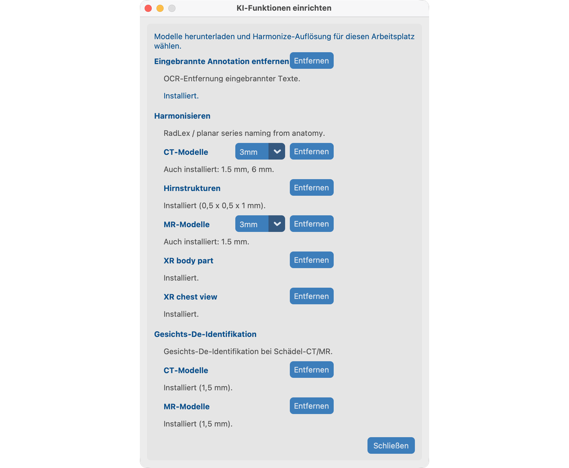

# KI-Funktionen einrichten

KI-Funktionen sind **optional**. Sie laufen nach einem einmaligen Download auf Ihrem Computer. Bilder werden nicht zur Verarbeitung hochgeladen.

Bearbeiten Sie dieses Kapitel **vor** den Werkzeug-Walkthroughs zu `davidson_cxr` und `CT_Head_With_Contrast`.

## Ziel

Laden Sie die benötigten Modelle herunter und wählen Sie die Harmonize-Auflösung für diesen Arbeitsplatz.

## Einrichtung öffnen

Nur vom **Willkommen**-Bildschirm: auf **KI-Funktionen** klicken.

Schließen Sie das Projekt (oder starten Sie die App), um zum Willkommen-Bildschirm zurückzukehren, wenn Sie später Modelle laden oder die Harmonize-Auflösung ändern möchten.

## Was Sie konfigurieren (V19)

| Eintrag | Für die Demo nötig |
| --- | --- |
| **Eingebrannten Text entfernen** (OCR) | Kapitel 8.1 — `davidson_cxr` |
| **Harmonisieren** CT-Paket + Auflösung (1.5 / 3 / 6 mm) | Kapitel 8.2 — `CT_Head_With_Contrast` |
| **Harmonisieren** XR body part (optional) | Pixel-Anatomie für CR/DX, wenn DICOM-Körperteil-Tags fehlen oder falsch sind |
| **Harmonisieren** XR chest view (optional) | Pixel AP/PA/Lat (+ Rotations-QC) für Thorax-CR/DX |
| **Gesichts-De-Identifikation** + akademische Lizenz `aca_…` | Kapitel 8.3 — `CT_Head_With_Contrast` |
| **Hirnstrukturen** (optionales lizenziertes Paket) | Kapitel 8.2 — Harmonize-Prompt zu Hirnstrukturen |

Es gibt **keine projektbezogenen Ein-/Ausschalter**. Wenn Modelle installiert und bereit sind, erscheinen die Werkzeuge in der Serienansicht und im Stapel.

XR-Harmonisieren funktioniert ohne die Pakete XR body part oder XR chest view (nur DICOM-Tags / Schlüsselwörter). Mit Installation können CR/DX-Serien nutzen:

- EfficientNet-B4-Körperteil-Klassifikator ([Xp-Bodypart-Mislabel-Checker](https://huggingface.co/spaces/MedicalAILabo/Xp-Bodypart-Mislabel-Checker); Mitsuyama et al., *European Radiology* 2025), fusioniert mit DICOM-Anatomie.
- Nur-Thorax-Projektions-/Rotations-Klassifikator ([CXp-Projection-Rotation-Mislabel-Checker](https://huggingface.co/spaces/MedicalAILabo/CXp-Projection-Rotation-Mislabel-Checker)) zur Verfeinerung von AP/PA/Lat; die Rotation erscheint in der Harmonize-Analysetabelle und wird nicht in SeriesDescription geschrieben.

Mammographie und Ultraschall nutzen diese Modelle nicht.

## Erste Schritte

1. **KI-Funktionen** öffnen.
2. **Eingebrannten Text entfernen**, **Harmonisieren** (CT) und **Gesichts-De-Identifikation** herunterladen.
3. Bei Aufforderung die akademische Lizenz eingeben oder prüfen (Gesicht / Hirnstrukturen).
4. Harmonize-CT-Auflösung wählen; fehlendes Paket herunterladen.
5. Optional **Hirnstrukturen** für die CT-Harmonize-Demo sowie **XR body part** / **XR chest view** für die CXR-Harmonize-Demo in Kapitel 8.2 herunterladen.
6. Dialog schließen. Die Einstellungen bleiben auf diesem Arbeitsplatz.

!!! tip "Internet nur für den Download"
    Nachdem Modelle und Lizenz bereitstehen, läuft die Verarbeitung lokal. Unter **macOS** vor Harmonisieren / verwandten KI-Funktionen die OpenMP-C++-Bibliothek installieren: `brew install libomp` (siehe [Installation](../02-install/#4-macos-only--openmp-for-ai-features)).

## Modelle entfernen

Mit **Entfernen** auf einer Werkzeugkarte die heruntergeladenen Dateien löschen. Bereits in anonymisierte Bilder geschriebene Änderungen werden dadurch nicht rückgängig gemacht.

## So sieht es aus, wenn es passt

- Status zeigt bereit für OCR, Harmonisieren CT und Gesicht.
- Sie können Werkzeuge der Serienansicht auf den Demo-Serien in den [Verarbeiten](../08-process/)-Kapiteln 8.1–8.3 öffnen.

## Wenn es fehlschlägt

- Download unvollständig → Netzwerk prüfen und erneut versuchen.
- TotalSegmentator / OpenMP unter macOS → `brew install libomp`.
- Lizenz ungültig → `aca_`-Format oder die Anbieter-URL im Dialog prüfen.

## Nächste Schritte

1. [Begriffe](../04-words-we-use/) und [Projekt anlegen](../05-create-project/), oder
2. Zu den [Verarbeiten](../08-process/)-Werkzeugen springen, sobald Studien importiert sind — beginnen Sie mit [8.1 Pixel-PHI entfernen](../08-process/02-remove-burned-in-text/)
