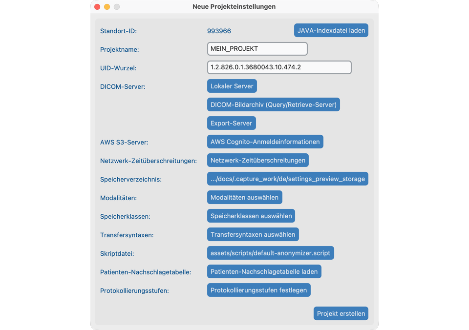
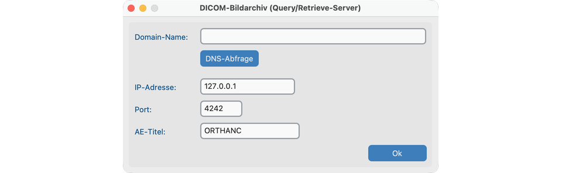
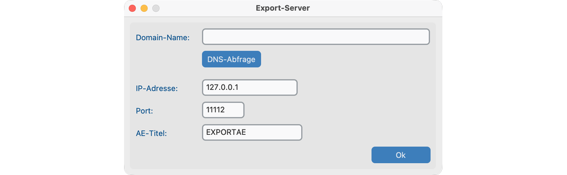
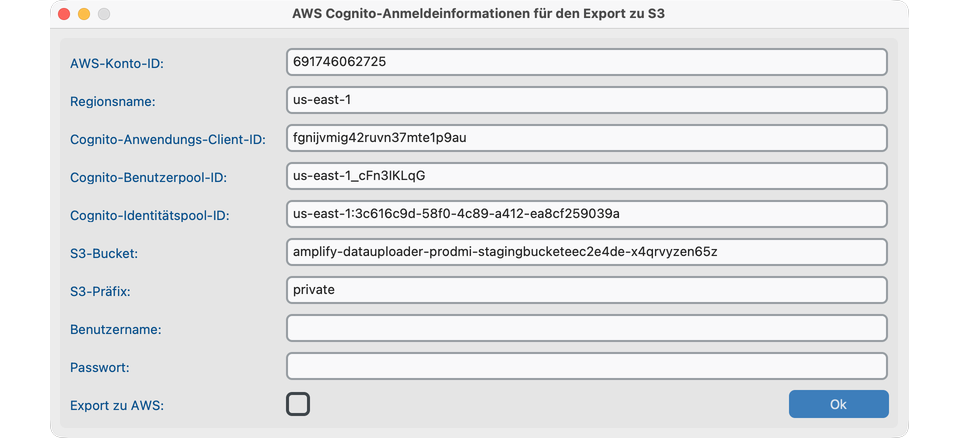
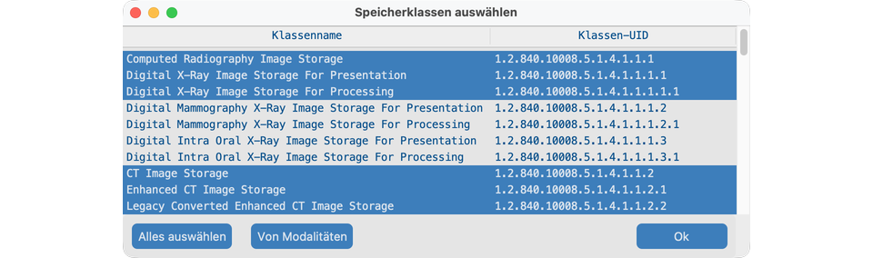
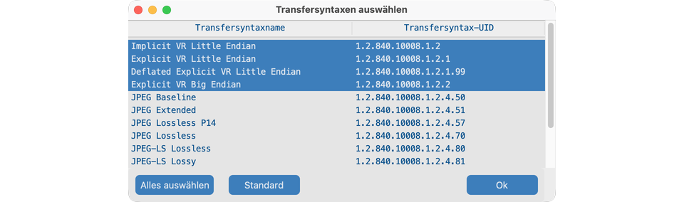
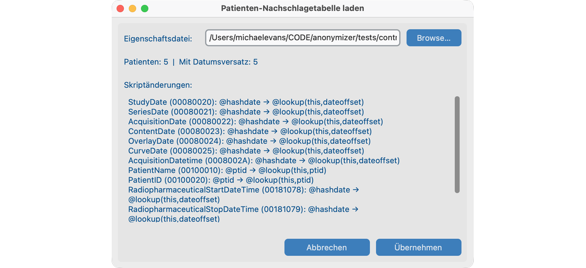
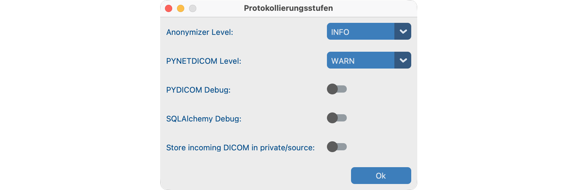
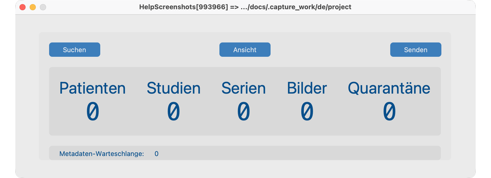

# Projekt anlegen

Ein **Projekt** hält Einstellungen und anonymisierten Speicher zusammen. Legen Sie es einmal im Desktop-Fenster an, auch wenn ein Server später [ohne Oberfläche](../10-headless/) laufen soll.

## Ziel

Ein sauberes Projekt mit Speicherordner und Standort-Identität öffnen, bereit für den Import.

## Neues Projekt anlegen

1. Über **Datei → Neues Projekt** die **Neuen Projekteinstellungen** öffnen.
2. Einen **Projektnamen** wählen (kurz, unter 16 Zeichen) und das **Speicherverzeichnis** bestätigen.
3. Standort-ID und UID-Wurzel prüfen (meist Standardwerte belassen, außer Sie setzen einen Java-Anonymizer-Standort fort).
4. Modalitäten und Netzwerkeinstellungen mit der IT abstimmen, wenn Sie ein PACS abfragen.
5. Projekt speichern / erstellen. Das **Dashboard** öffnet sich.

## Tägliche Projektaktionen

| Aktion | So |
| -------------- | ---------------------------------------------------------------------------------------------------- |
| Schließen | **Datei → Projekt schließen** oder Fenster schließen |
| Erneut öffnen | **Datei → Zuletzt geöffnet** |
| Einstellungen klonen | **Datei → Projekt klonen** in einen neuen Speicherordner (keine Bilder werden kopiert). Halten Sie die UID-Wurzel projektübergreifend eindeutig. |

## So sieht es aus, wenn es passt

- Das Dashboard zeigt Projektname und Standort-ID.
- Das Speicherverzeichnis existiert und ist beschreibbar.
- Sie können den aktuell kuratierten **Datensatz** öffnen (leer bis zum Import), indem Sie auf **Ansicht** klicken.

## Wenn Sie mit der IT sprechen

Teilen Sie diese Ideen (Details stehen in den Dialogfenstern der Projekteinstellungen):

- **Lokaler Server** — Adresse, Port und AE Title, mit denen dieser Computer Bilder **empfängt**.
- **DICOM-Bildarchiv (Query/Retrieve-Server)** — das Krankenhausarchiv, in dem Sie suchen und abrufen.
- **Export-Server** oder **AWS** — wohin anonymisierte Studien gesendet werden.
- **Modalitäten / Speicherklassen / Transfersyntaxen** — welche Bildtypen erlaubt sind.
- **Netzwerk-Zeitüberschreitungen** — wie lange auf langsame Archive gewartet wird.
- **Patienten-Nachschlagetabelle** — optionales CTP-`.properties`-Mapping für PatientID und Datumsverschiebung (siehe [Nachschlagetabelle](#patient-lookup-table)).

Wenn das Projekt auf einem Laborserver laufen soll, weiter mit [Ohne Oberfläche ausführen](../10-headless/).

## Projekteinstellungen (alle Steuerelemente)

Öffnen Sie **Datei → Projekteinstellungen** (oder Neue Projekteinstellungen beim Anlegen). Konfigurieren Sie diese vor Suchen / Senden:

### Lokaler Server

Adresse, Port und AE Title, mit denen dieser Computer Bilder **empfängt**.

### DICOM-Bildarchiv (Query/Retrieve-Server)

Krankenhausarchiv für Dashboard-**Suchen**.

### Export-Server

DICOM-Ziel beim **Senden** (die Einstellung kann weiterhin Export Server heißen).

### AWS Cognito (optional)

Anmeldedaten für S3-Senden, wenn aktiviert.

### Netzwerk-Zeitüberschreitungen

Wie lange auf langsame Archive gewartet wird.

### Modalitäten / Speicherklassen / Transfersyntaxen

Welche Bildtypen und Kodierungen erlaubt sind.

### Patienten-Nachschlagetabelle

Optionales CTP-`.properties`-Mapping von PHI-Patienten-IDs auf anonymisierte IDs und Datumsversätze. Durchsuchen → Vorschau → Übernehmen.

### Protokollierungsstufen

Anonymizer- / Netzwerkprotokollierung erhöhen, wenn Sie mit der IT Fehler beheben.

## Dashboard nach dem Anlegen

Das Dashboard zeigt die zentralen Workflow-Schaltflächen: **Suchen**, **Ansicht** und **Senden**.

## Wenn es fehlschlägt

- Speicherpfad nicht beschreibbar → anderen Ordner wählen.
- Name zu lang → Projektnamen kürzen.
- Warnung beim Klonen zur UID-Wurzel → pro Projekt eine eindeutige Wurzel verwenden, um ID-Kollisionen zu vermeiden.

## Nächste Schritte

Weiter mit [Suchen](../06-search/), um Studien in das Projekt zu importieren.
