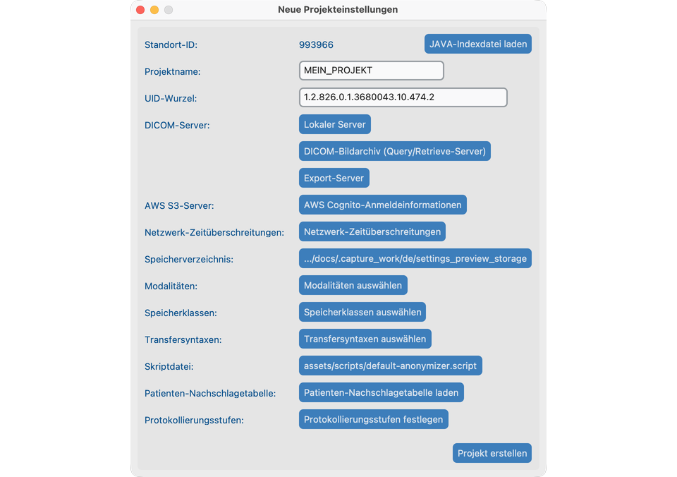
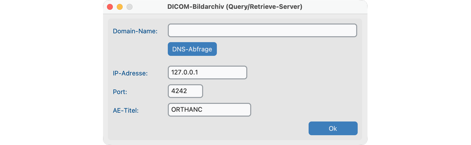
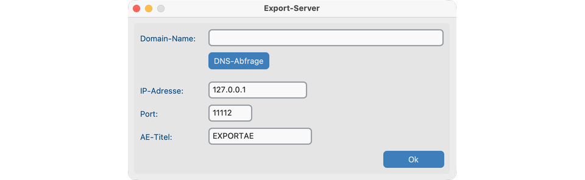
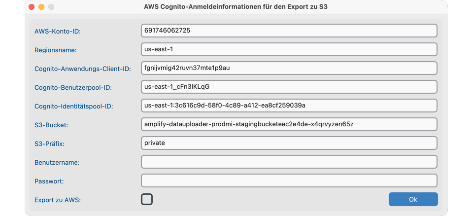
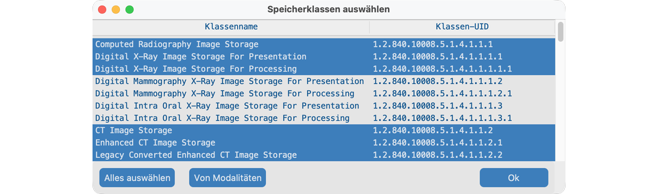
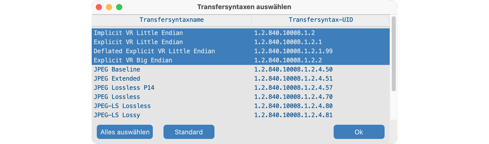
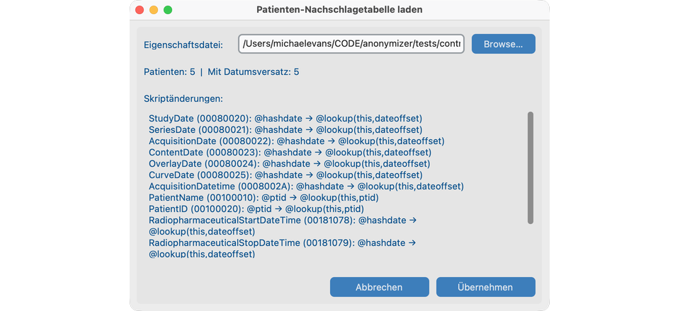
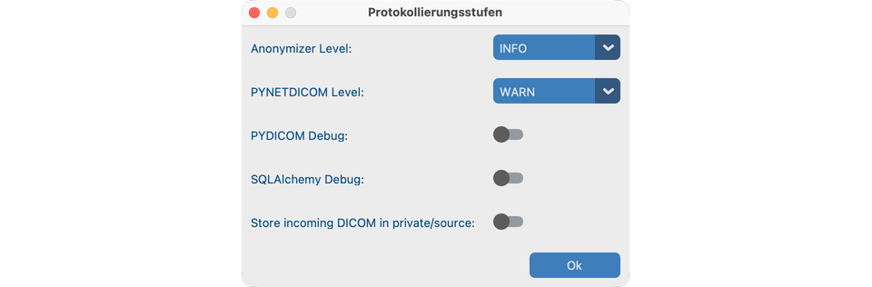
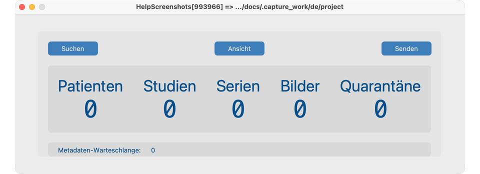

# Projekt anlegen

Ein **Projekt** hält Einstellungen und anonymisierten Speicher zusammen. Legen Sie es einmal im Desktop-Fenster an, auch wenn ein Server später [ohne Oberfläche](../10-headless/) laufen soll.

## Ziel

Ein sauberes Projekt mit Speicherordner und Standort-Identität öffnen, bereit für den Import.

## Neues Projekt anlegen

1. Über **Datei → Neues Projekt** die **Neuen Projekteinstellungen** öffnen.
2. Einen **Projektnamen** wählen (kurz, unter 16 Zeichen) und das **Speicherverzeichnis** bestätigen.
3. Standort-ID und UID-Wurzel prüfen (meist Standardwerte belassen, außer Sie setzen einen Java-Anonymizer-Standort fort).
4. Modalitäten und Netzwerkeinstellungen mit der IT abstimmen, wenn Sie ein PACS abfragen.
5. Projekt speichern / erstellen. Das **Dashboard** öffnet sich.

## Tägliche Projektaktionen

| Aktion | So |
| -------------- | ---------------------------------------------------------------------------------------------------- |
| Schließen | **Datei → Projekt schließen** oder Fenster schließen |
| Erneut öffnen | **Datei → Zuletzt geöffnet** |
| Einstellungen klonen | **Datei → Projekt klonen** in einen neuen Speicherordner (keine Bilder werden kopiert). Halten Sie die UID-Wurzel projektübergreifend eindeutig. |

## So sieht es aus, wenn es passt

- Das Dashboard zeigt Projektname und Standort-ID.
- Das Speicherverzeichnis existiert und ist beschreibbar.
- Sie können den aktuell kuratierten **Datensatz** öffnen (leer bis zum Import), indem Sie auf **Ansicht** klicken.

## Wenn Sie mit der IT sprechen

Teilen Sie diese Ideen (Details stehen in den Dialogfenstern der Projekteinstellungen):

- **Lokaler Server** — Adresse, Port und AE Title, mit denen dieser Computer Bilder **empfängt**.
- **DICOM-Bildarchiv (Query/Retrieve-Server)** — das Krankenhausarchiv, in dem Sie suchen und abrufen.
- **Export-Server** oder **AWS** — wohin anonymisierte Studien gesendet werden.
- **Modalitäten / Speicherklassen / Transfersyntaxen** — welche Bildtypen erlaubt sind.
- **Netzwerk-Zeitüberschreitungen** — wie lange auf langsame Archive gewartet wird.
- **Anonymizer-Skript** — welche DICOM-Tags behalten, entfernt oder umgewandelt werden (siehe [Anonymizer-Skript-Editor](#anonymizer-skript-editor)).
- **Patienten-Nachschlagetabelle** — optionales CTP-`.properties`-Mapping für PatientID und Datumsverschiebung (siehe [Nachschlagetabelle](#patienten-nachschlagetabelle)).

Wenn das Projekt auf einem Laborserver laufen soll, weiter mit [Ohne Oberfläche ausführen](../10-headless/).

## Projekteinstellungen (alle Steuerelemente)

Öffnen Sie **Datei → Projekteinstellungen** (oder Neue Projekteinstellungen beim Anlegen). Konfigurieren Sie diese vor Suchen / Senden:

### Lokaler Server

Adresse, Port und AE Title, mit denen dieser Computer Bilder **empfängt**.

### DICOM-Bildarchiv (Query/Retrieve-Server)

Krankenhausarchiv für Dashboard-**Suchen**.

### Export-Server

DICOM-Ziel beim **Senden** (die Einstellung kann weiterhin Export Server heißen).

### AWS Cognito (optional)

Anmeldedaten für S3-Senden, wenn aktiviert.

### Netzwerk-Zeitüberschreitungen

Wie lange auf langsame Archive gewartet wird.

### Modalitäten / Speicherklassen / Transfersyntaxen

Welche Bildtypen und Kodierungen erlaubt sind.

### Anonymizer-Skript-Editor

Das **Anonymizer-Skript** des Projekts ist eine CTP-kompatible XML-Datei mit jedem bekannten DICOM-Tag und der zugehörigen Aktion. Die mitgelieferte Standarddatei folgt dem DICOM Basic Application Confidentiality Profile, beschrieben unter [De-Identifikationsprotokoll](../deidentification-protocol.md).

Öffnen Sie **Datei → Projekteinstellungen** (oder Neue Projekteinstellungen) und klicken Sie auf **Anonymizer-Skript bearbeiten**. Bei einem neuen Projekt können Sie zuerst mit **Durchsuchen** eine andere `.script`-Vorlage laden.

#### Ansichten

| Ansicht | Inhalt |
| --- | --- |
| **Aktiv** (Standard) | Tags, die **behalten** oder **umgewandelt** werden (nicht `@remove()`). Die alltägliche Liste — etwa 1,5k statt ~4,6k Zeilen. |
| **Entfernt** | Tags mit `@remove()` (werden beim Anonymisieren gelöscht). |
| **Alle** | Jede Tag-Regel im Skript. |

Suche und der **Operand**-Filter gelten innerhalb der aktuellen Ansicht. Die Liste ist **paginiert** (Zurück / Weiter), damit das Fenster reaktionsschnell bleibt.

#### Regel ändern

1. Zeile in der Liste auswählen.
2. **Name** (nur Beschriftung) oder **Operand** im Detailbereich bearbeiten.
3. Unterstützte Operanden: **Behalten**, **Entfernen**, **Leeren**, **UID**, **Patienten-ID**, **Accession**, **Datum hashen**, **Patienten-ID nachschlagen**, **Datumsversatz nachschlagen**, **Alter runden** (mit Parameter für die Altersbreite).
4. **Entfernen** stuft das Tag aus der Aktiven Ansicht heraus (bleibt im Skript als `@remove()`).

#### Tag hinzufügen (üblicher Weg)

1. **Aus Entfernten hinzufügen…** wählen.
2. In der Liste der entfernten Tags suchen und ein dem Skript bekanntes Tag auswählen.
3. Anfangsoperand wählen (Standard **Behalten**) → **Hinzufügen**.
4. Das Tag erscheint unter **Aktiv** und ist zur weiteren Bearbeitung ausgewählt.

**Aus Wörterbuch hinzufügen…** nur, wenn das Tag **noch nicht** im Skript steht (selten). Die Wörterbuchsuche ist begrenzt und entprellt.

#### Speichern

- **Übernehmen** prüft Operanden, schreibt eine private Kopie unter `{Speicher}/private/{Standort-ID}-anonymizer.script`, lädt die aktiven Anonymisierungsregeln neu und aktualisiert die Projekteinstellungen. Die mitgelieferte Standarddatei wird nie überschrieben.
- **Zurücksetzen** lädt die Datei erneut vom Datenträger und verwirft ungespeicherte Änderungen.
- **Abbrechen** schließt ohne Speichern.

!!! tip "Nachschlagetabellen und Skript"
    Das Laden einer **Patienten-Nachschlagetabelle** kann Patient-ID- / Datumsoperanden auf `@lookup(...)` umschreiben. Bearbeiten Sie das Skript danach, wenn Sie weitere Tag-Änderungen brauchen.

### Patienten-Nachschlagetabelle

Optionales CTP-`.properties`-Mapping von PHI-Patienten-IDs auf anonymisierte IDs und Datumsversätze. Durchsuchen → Vorschau → Übernehmen.

!!! note "Bestehende Projekte"
    Das Laden einer Nachschlagetabelle anonymisiert vorhandene Dateien im Datensatz **nicht** erneut — sie bleiben unverändert. Bereits importierte Patienten funktionieren weiter ohne Tabelleneintrag. **Neue** Dateien, deren PHI-Patienten-ID nicht in der Tabelle steht, landen in Quarantäne als **Lookup_Miss** und werden nicht gespeichert.

### Protokollierungsstufen

Anonymizer- / Netzwerkprotokollierung erhöhen, wenn Sie mit der IT Fehler beheben.

## Dashboard nach dem Anlegen

Das Dashboard zeigt die zentralen Workflow-Schaltflächen: **Suchen**, **Ansicht** und **Senden**.

## Wenn es fehlschlägt

- Speicherpfad nicht beschreibbar → anderen Ordner wählen.
- Name zu lang → Projektnamen kürzen.
- Warnung beim Klonen zur UID-Wurzel → pro Projekt eine eindeutige Wurzel verwenden, um ID-Kollisionen zu vermeiden.
- Skript-Editor **Übernehmen** abgelehnt → nicht unterstützte `@…`-Operanden in der Fehlermeldung korrigieren (Nicht-`@`-Literale wie seltene CTP-Konstanten sind erlaubt).

## Nächste Schritte

Weiter mit [Suchen](../06-search/), um Studien in das Projekt zu importieren.
