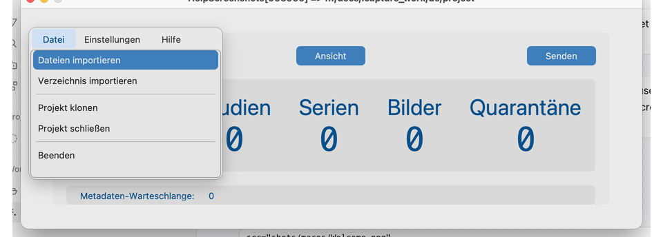
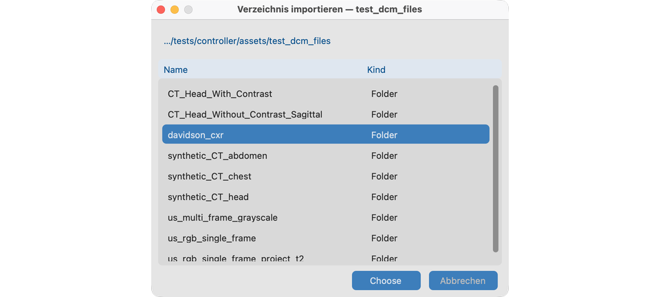
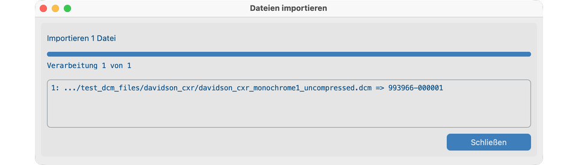
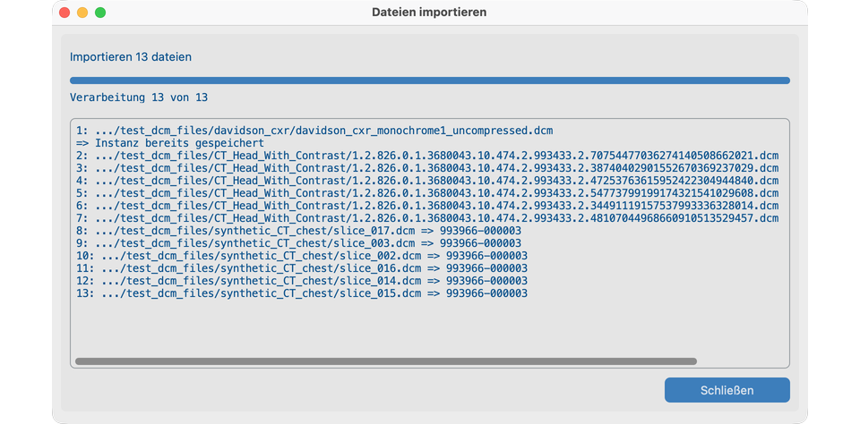
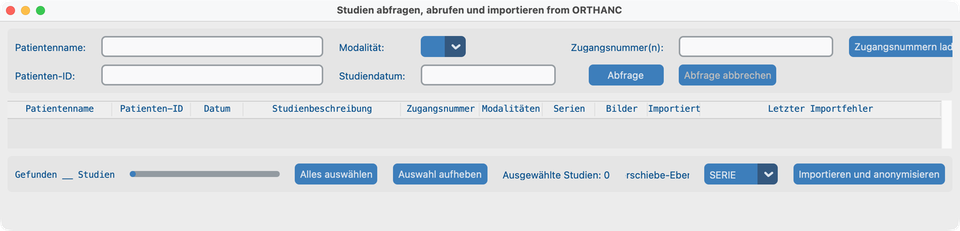
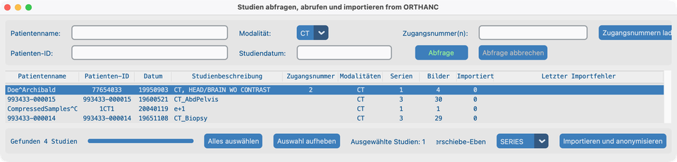
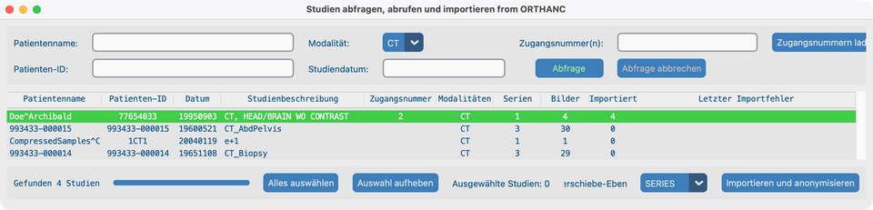

# Suchen

## Ziel

DICOM-Studien in Ihr Projekt bringen, sodass sie de-identifiziert und unter **Ansicht → Datensatz** gelistet sind. Sie können:

1. **Von diesem Computer importieren** — Dateien oder einen Ordner über das Menü **Datei**.
2. **Ein entferntes Bildgebungssystem durchsuchen** — PACS / VNA / Orthanc über Dashboard-**Suchen**.

Konfigurieren Sie [Query Server, Modalitäten, Speicherklassen und Netzwerk-Zeitüberschreitungen](../05-create-project/), bevor Sie sich auf entfernte Suche verlassen.

---

## Aus Ordner oder Dateien

### 1. Import über das Datei-Menü öffnen

Mit geöffnetem Projekt:

- **Datei → Dateien importieren** — eine oder mehrere Dateien wählen (Standardfilter oft `.dcm`; im Dateidialog änderbar).
- **Datei → Verzeichnis importieren** — jede Datei unter diesem Ordner und seinen Unterordnern wird versucht, nicht nur `.dcm`.

Bereits importierte Instanzen (gleiche SOP Instance UID bereits in diesem Projekt) werden **übersprungen**, nicht in Quarantäne gelegt.

### 2. Ordner wählen (Verzeichnis importieren)

Nach **Verzeichnis importieren** öffnet sich der OS-Ordnerdialog. Navigieren Sie zu Ihrem Studienbaum und klicken Sie **Choose**.

Navigieren Sie zu `tests/controller/assets/test_dcm_files` (oder einem Studienordner darunter wie `davidson_cxr` oder `CT_Head_With_Contrast`).

### 3. Was für einen erfolgreichen Import gelten muss

Eine Datei wird nur akzeptiert, wenn alles zutrifft:

1. Gültige DICOM-Part-10-Datei mit Datei-Metainformationen (einschließlich DICOM-Preamble).
2. Enthält **SOP Class UID**, **Study Instance UID**, **Series Instance UID** und **SOP Instance UID**.
3. Ihre Speicherklasse ist durch die [Speicherklassen](../05-create-project/#storage-classes) dieses Projekts erlaubt.
4. Geschützte Identität (PHI) kann erfolgreich erfasst werden.
5. Sie wurde noch nicht in dieses Projekt importiert.

Wenn eine [Patienten-Nachschlagetabelle](../05-create-project/#patient-lookup-table) erforderlich ist, muss die PHI-Patienten-ID auch einem Eintrag entsprechen — sonst landet die Datei in Quarantäne als **Lookup_Miss**.

### 4. `davidson_cxr` importieren (Einzelstudien-Demo)

Demo-Thoraxröntgen, später in [Ansicht](../07-view/) und [Pixel-PHI entfernen](../08-process/02-remove-burned-in-text/) verwendet.

Pfad: `tests/controller/assets/test_dcm_files/davidson_cxr`

1. **Datei → Verzeichnis importieren** wählen.
2. Den Ordner `davidson_cxr` auswählen und **Choose** klicken.
3. Warten, bis der Dialog **Dateien importieren** fertig ist und **Schließen** erscheint.

Eine erfolgreiche Zeile zeigt einen verkürzten Pfad und **PHI-Patienten-ID → anonymisierte Patienten-ID** (z. B. `…/davidson_cxr_….dcm => 993627-000001`).

### 5. Importprotokoll lesen (viele Dateien)

Beim Import eines größeren Baums listet derselbe Dialog **ein Ergebnis pro Datei** im scrollbaren Feld:

- **Erfolg:** `path => anonymized Patient ID`
- **Bereits gespeichert:** übersprungen (gleiche SOP Instance UID)
- **Fehler:** `path` dann `=>` und ein kurzer Grund (ungültiges DICOM, fehlende Attribute, Speicherklasse, PHI-Erfassung, Lookup-Fehler)

**Schließen** klicken, wenn fertig. Die Zähler für Patienten / Studien / Bilder im Dashboard aktualisieren sich; Quarantäne-Zähler steigen nur bei abgelehnten Dateien.

### Quarantäne

Fehlgeschlagene Dateien landen in den privaten Quarantäneordnern des Projekts (Namen können in der UI mit Leerzeichen oder Unterstrichen erscheinen):

| Ordner | Typische Ursache |
| ---------------------------------- | ----------------------------------------- |
| `Invalid_DICOM` / DICOM-Lesefehler | Kein gültiges DICOM oder unlesbar |
| `Missing_Attributes` | Erforderliche UIDs / SOP Class fehlen |
| `Invalid_Storage_Class` | Speicherklasse für das Projekt nicht aktiviert |
| `Capture_PHI_Error` | PHI konnte nicht erfasst werden |
| `Lookup_Miss` | Patienten-ID nicht in der Nachschlagetabelle |

Prüfen Sie die Quarantäne-Zähler im Dashboard. Einstellungen oder Quelldateien korrigieren, dann erneut importieren.

---

## Von einem entfernten Bildgebungssystem (Dashboard-**Suchen**)

### 1. Suchen öffnen

Im Dashboard auf **Suchen** klicken. Die App macht zuerst ein **C-ECHO** zum konfigurierten Query Server. Wenn das Echo gelingt, öffnet sich das Fenster **Studien abfragen, abrufen und importieren**.

Dieses Fenster hat drei Bereiche:

1. **Kriterien** — Patientenname, Patienten-ID, Modalität, Studiendatum, Zugangsnummer(n), **Zugangsnummern laden**, **Abfrage** / **Abfrage abbrechen**, **Importierte Studien anzeigen**.
2. **Ergebnistabelle** — von C-FIND zurückgegebene Studien.
3. **Importleiste** — Zähler Gefunden, **Alles auswählen** / **Auswahl aufheben**, **Verschiebe-Ebene**, **Importieren und anonymisieren**.

!!! tip "IT um Hilfe bitten"
    Der Query Server muss diesem Computer C-ECHO, C-FIND und C-MOVE erlauben und Ihren **Lokalen Server** (Adresse, Port, AE Title) als C-MOVE-Ziel kennen. Siehe [Projekt anlegen → Wenn Sie mit der IT sprechen](../05-create-project/#when-you-talk-to-it).

### 2. Nach Studien suchen

Mindestens **ein** Kriterium eingeben, dann **Abfrage** klicken (oder Return drücken). Eine leere Abfrage wird abgelehnt.

| Feld | Hinweise |
| -------------------- | ---------------------------------------------------------------------------------------------- |
| **Patientenname** | Buchstaben (inkl. Akzente), Ziffern, `^`-Namensseparator; `?` = ein Zeichen, `*` = beliebige Zeichenkette |
| **Patienten-ID** | ASCII-Buchstaben/Ziffern; Platzhalter `?` und `*` |
| **Modalität** | Dropdown aus den in den Projekteinstellungen konfigurierten Modalitäten |
| **Studiendatum** | Ein Tag oder ein Bereich: `YYYYMMDD` oder `YYYYMMDD-YYYYMMDD` |
| **Zugangsnummer(n)** | ASCII, Ziffern und `/ - _ , .`; Platzhalter `?` und `*` |

Weitere Zugangsoptionen:

- Eine **kommagetrennte Liste** in Zugangsnummer(n) eingeben, um mehrere Suchen auf einmal auszuführen.
- **Zugangsnummern laden**, um eine `.txt`- oder `.csv`-Datei zu laden (komma- oder zeilengetrennt). Vor dem Massenlauf bestätigen. Nicht gefundene Zugangsnummern können in eine Textdatei geschrieben werden.

Weitere Steuerelemente:

- **Importierte Studien anzeigen** — wenn aus, werden Studien, die bereits in diesem Projekt sind, in der Ergebnisliste ausgeblendet.
- **Abfrage abbrechen** — stoppt eine laufende Abfrage.
- Nur Studien, deren Modalitäten für das Projekt erlaubt sind, erscheinen und können ausgewählt werden.
- Der Status unten zeigt nach erfolgreicher Abfrage **Gefunden N Studien**.

### 3. Beispiel: CT-Abfrage (`Doe^Archibald`)

1. **Modalität** auf **CT** setzen.
2. **Abfrage** klicken.
3. Die Kopf-CT-Zeile **Doe^Archibald** anklicken (dunkle Auswahlmarkierung).
4. **Ausgewählte Studien: 1** bestätigen und **Verschiebe-Ebene** wählen (oft **STUDIE** oder **SERIE**).

### 4. Studien auswählen und importieren

1. Studien auswählen: Einfachklick, Mehrfachauswahl (**⌘** / **Ctrl**+Klick), **Alles auswählen** oder **Auswahl aufheben**.
2. **Verschiebe-Ebene** wählen: **STUDIE**, **SERIE** oder **INSTANZ** (DICOM-C-MOVE-Ebene). STUDIE bevorzugen, wenn das Archiv es unterstützt; SERIE oder INSTANZ versuchen, wenn Übertragungen stocken.
3. **Importieren und anonymisieren** klicken. Die App baut eine Studienhierarchie für die gewählte Verschiebe-Ebene und öffnet dann den Fortschrittsdialog **Studien importieren**.
4. Der Fortschritt verfolgt zuerst den Metadatenabruf, dann empfangene Bilder gegenüber der Hierarchie. Eine Studie ist fertig, wenn alle erwarteten Dateien ankommen **oder** eine [Netzwerk-Zeitüberschreitung](../05-create-project/#network-timeouts) für diese Übertragung abläuft.
5. Wenn der Dialog **Import abgeschlossen** zeigt, **Schließen** klicken.

### 5. Grüne Hervorhebung bestätigen (CT-Serie importiert)

Erfolgreich importierte Studien sind in der Abfrage-Ergebnisliste **grün hervorgehoben**, und die Spalte **Imported** zeigt, wie viele Bilder im Projekt gelandet sind. Mit **Verschiebe-Ebene = SERIE** schließt die CT-Serie für Doe^Archibald ab, wobei Imported mit Images übereinstimmt.

Sie können dieselben Studien nach Anpassen von Timeout oder Verschiebe-Ebene erneut auswählen — bereits importierte Instanzen werden übersprungen.

### Langsame oder unideale Archive behandeln

Viele VNAs verschieben Bilder asynchron und verhalten sich nicht wie ein Lehrbuch-PACS. Wenn Importe unvollständig sind:

- **Netzwerk-Zeitüberschreitung** in den Projekteinstellungen verlängern.
- **Verschiebe-Ebene** ändern (Studie → Serie → Instanz) und **Importieren und anonymisieren** erneut versuchen.
- Mit der IT bestätigen, dass das C-MOVE-Ziel dem AE Title Ihres Lokalen Servers entspricht und dass Modalitäten / Speicherklassen die erwarteten Studien erlauben.

---

## So sieht es aus, wenn es passt

- Studien erscheinen unter [Ansicht → Datensatz](../07-view/).
- Die Dashboard-Zähler für Patienten / Studien / Bilder steigen; die Quarantäne bleibt leer oder enthält nur erwartete Ablehnungen.
- Lokale Importdialoge zeigen vor **Schließen** eine klare Erfolgs- oder Fehlerzeile pro Datei.
- Entfernte Importe zeigen nach erfolgreichem Lauf grüne Hervorhebung in den Abfrageergebnissen.
- Der Statustext unten im Dashboard spiegelt die letzte Suche oder den letzten Import wider.

## Wenn es fehlschlägt

| Symptom | Was versuchen |
| ----------------------------------------- | ----------------------------------------------------------------------------------- |
| Suchen-Schaltfläche bleibt deaktiviert / Echo fehlgeschlagen | Query Server offline oder blockiert; Adresse, Port, AE Title mit IT prüfen |
| Verbindungsfehler bei Abfrage | C-ECHO fehlgeschlagen — Query-Server-Einstellungen oder Netzwerk prüfen |
| Leere Ergebnisse | Platzhalter/Datum erweitern; **Importierte Studien anzeigen** einschalten; Projektmodalitäten prüfen |
| Nichts importiert aus Ordner | Speicherklassen / Modalitäten; gültiges Part-10-DICOM; Nachschlagetabelle falls erforderlich |
| Lookup_Miss | Patienten-ID zur Nachschlagetabelle hinzufügen oder Lookup-Anforderungen lockern |
| Teilweiser PACS-Import | Längere Netzwerk-Zeitüberschreitung; andere Verschiebe-Ebene; Auswahl erneut versuchen |
| Dateien ignoriert ohne Quarantäne | Bereits importiert (gleiche SOP Instance UID) |

## Nächste Schritte

Weiter mit [Ansicht](../07-view/), um das Importierte zu durchsuchen.
