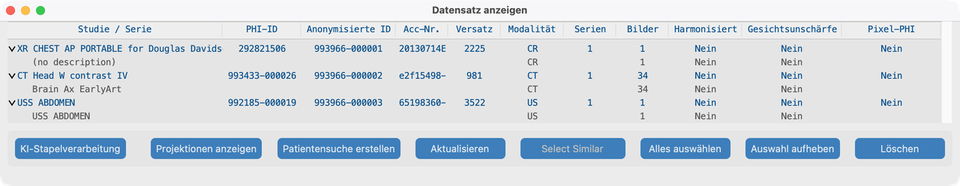
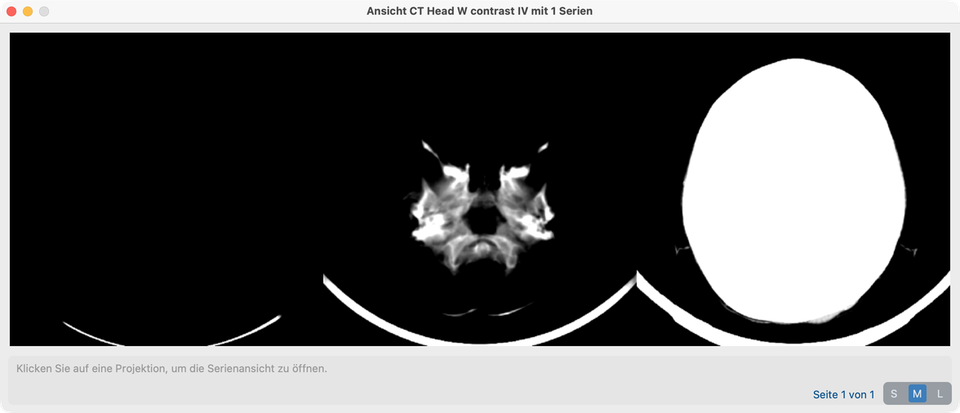
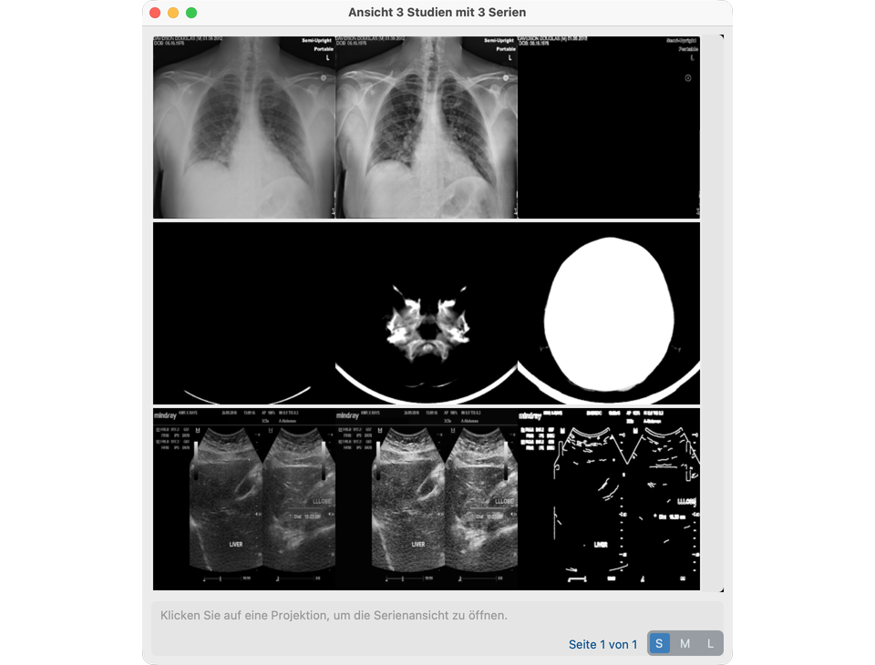
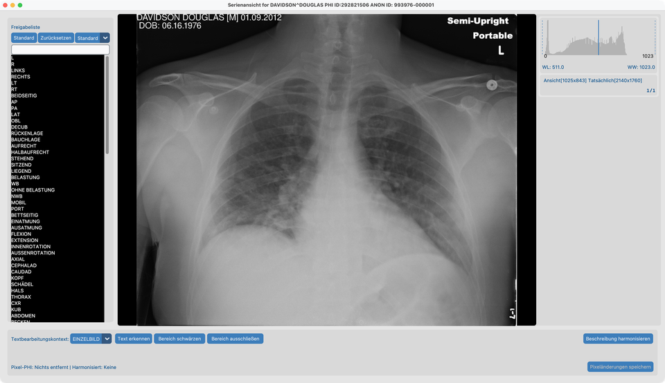
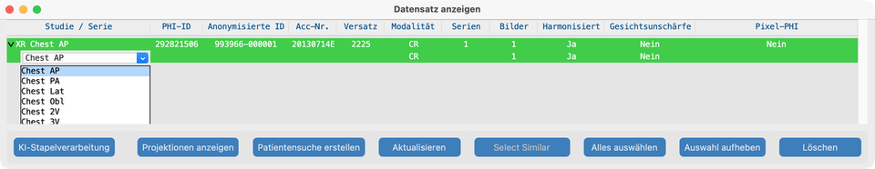
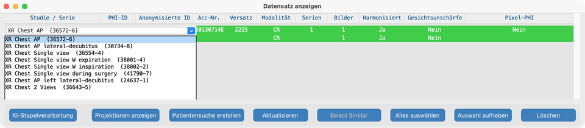
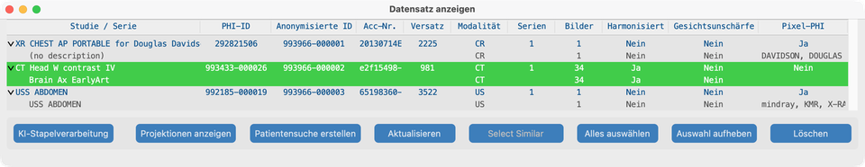
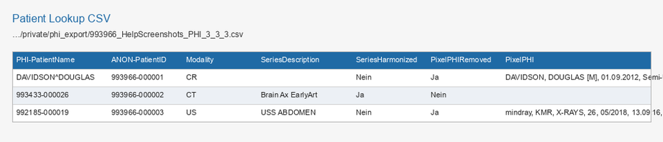

# Ansicht

Dashboard-**Ansicht** öffnet den **Datensatz** — die Liste von allem in Ihrem Projekt (Patienten, Studien und Serien). Vom Datensatz aus öffnen Sie **Studienprojektionen** oder eine vollständige **Serienansicht**, um Pixel zu prüfen und Verarbeiten-Werkzeuge auszuführen.

(Frühere Versionen nannten den Datensatz PHI Index.)

## Ziel

Sehen, was Sie importiert haben, KI-Statusspalten prüfen, Projektionen für eine Studie öffnen, eine Serie zur Prüfung oder für [Verarbeiten](../08-process/)-Werkzeuge öffnen und bei Bedarf eine **Patientensuche**-CSV exportieren.

## Demo-Studien

Nach dem Import aus `tests/controller/assets/test_dcm_files` (siehe [Suchen](../06-search/)) sollte der Datensatz diese drei Studien listen (Hilfe-Screenshots verwenden **keine** synthetischen Phantome):

| Fixture | Rolle im Handbuch |
| --- | --- |
| **`davidson_cxr`** | Hier in der Serienansicht öffnen; eingebrannter Text in [Pixel-PHI entfernen](../08-process/02-remove-burned-in-text/) |
| **`CT_Head_With_Contrast`** | [Harmonisieren](../08-process/03-harmonize-names/) und [Gesichtsunschärfe](../08-process/04-blur-faces/) |
| **`us_rgb_single_frame`** | Ultraschall Einzelbild; eingebrannte Overlays in [Pixel-PHI entfernen](../08-process/02-remove-burned-in-text/) (Exclude-Area-Demos) |

## Datensatz öffnen

1. Im Dashboard auf **Ansicht** klicken.
2. Eine **Studien**-Zeile aufklappen (Dreieck), um verschachtelte **Serien** zu sehen.
3. PHI- / anonymisierte IDs und die KI-Statusspalten beachten.

### Spalten (V19)

| Status | Bedeutung |
| --- | --- |
| **Harmonisiert** | Serienbeschreibung standardisiert (oder Studienbeschreibung angewendet) |
| **Gesichtsunschärfe** | Gesichts-De-Identifikation angewendet |
| **Pixel-PHI** | Scan / Entfernung eingebrannten Texts erfasst |

## Rechtsklick im Datensatz (am wichtigsten)

Hover-Tipps am Baum sagen, was ein Rechtsklick tut. Die Auswahl folgt der Zeile unter dem Zeiger.

**Linksklick** auf die Studien- oder Serien-**Beschreibung** (erste Spalte), wenn eine einzelne Zeile ausgewählt ist — siehe [Studien- und Serienbeschreibungen bearbeiten](#edit-study-and-series-descriptions) unten. Mit **Shift** oder **Cmd/Ctrl+Klick** mehrfach auswählen; dann **Rechtsklick** auf die Auswahl, um eine Beschreibung für alle ausgewählten Zeilen zu setzen.

### Rechtsklick auf eine **Studie** → Projektionen anzeigen

Rechtsklick auf eine **Studien**-Zeile (nicht eine verschachtelte Serie), um die **Projektionsansicht** für diese Studie zu öffnen.

- Sie sehen Zusammenfassungs-Projektionsbilder für jede Serie in der Studie (nützlich, um eine Mehrserien-Untersuchung schnell zu scannen).
- Auf eine Projektionskachel klicken, um in die volle **Serienansicht** für diese Serie zu springen.

### Mehrere Studien → Projektionen anzeigen

Um mehrere Untersuchungen gleichzeitig zu durchsuchen:

1. Im Datensatz zwei oder mehr **Studien**-Zeilen auswählen (Shift+Klick und/oder Cmd/Ctrl+Klick), oder **Alles auswählen** verwenden.
2. In der Datensatz-Symbolleiste auf **Projektionen anzeigen** klicken.

Der Fenstertitel wird zu **View N Studies with M Series** (und **over P Pages**, wenn das Raster Seiten braucht). Jede Serie erhält weiterhin eine Projektionskachel.

### Projektionskacheln, S / M / L und wie sie entstehen

Jede Kachel ist ein Streifen aus **drei** Vorschaubildern für eine Serie:

| Serientyp | Links | Mitte | Rechts |
| --- | --- | --- | --- |
| **Mehrfachbild** (z. B. CT-Stack) | **Min**-Intensität über Frames | **Mean** | **Max** |
| **Einzelbild** (z. B. CXR, viele US) | Graustufen | **CLAHE**-Kontrast | **Edge** (Canny) |

Die Steuerung **S / M / L** legt fest, wie groß jedes der drei Panels gezeichnet wird (vor der Anzeigeskalierung):

| Größe | Kachel-Panelgröße | Typische Nutzung |
| --- | --- | --- |
| **S** | 200×200 | Viele Serien auf einer Seite |
| **M** | 400×400 | Standardgröße für Hilfe / Prüfung |
| **L** | 800×800 | Anatomie im Streifen genauer prüfen |

Größenänderung berechnet neu, wie viele Kacheln pro Seite passen, und kann einen Seitenschieber hinzufügen. Auf eine Kachel klicken, um diese Serie in der **Serienansicht** zu öffnen.

**Was passiert, wenn eine Projektion erstellt wird**

1. Die App sucht eine zwischengespeicherte `Projection.pkl` neben den Seriendateien.
2. Bei Cache-Treffer lädt sie dieses Objekt und zeichnet die drei Bilder (auf S/M/L skaliert).
3. Bei Fehlschlag lädt sie jeden Frame der Serie, berechnet die drei Bilder oben (bei Mehrfachbild fenstergewichtet), schreibt `Projection.pkl` und zeichnet die Kachel.
4. Pixeländerungen, die die Serie auf der Festplatte ändern, ungültigen den Cache, sodass der nächste Öffnen-Vorgang aus aktuellen Pixeln neu aufbaut.

Dieses Datensatz-Fenster **Projektionen anzeigen** ist getrennt von den Slice-/Min-/Mean-/Max-Modi in der Serienansicht.

### Rechtsklick auf eine **Serie** → Serienansicht

1. Die Studie aufklappen, die die Serie enthält (z. B. `davidson_cxr`).
2. **Rechtsklick auf die Serienzeile** (nicht die Studienzeile).
3. Die **Serienansicht** öffnet sich und lädt die Bilder.

Das ist der Hauptweg, eine Serie zur Prüfung und für Verarbeiten-Werkzeuge (Pixel-PHI entfernen, Harmonisieren, Gesichtsunschärfe) zu öffnen.

## Studien- und Serienbeschreibungen bearbeiten

Nach [Harmonisieren](../08-process/03-harmonize-names/) (Serienansicht oder [KI-Stapelverarbeitung](../08-process/05-run-on-many-studies/)) zeigen grüne **Harmonisiert**-Zeilen den standardisierten Namen. Sie können RadLex-/LOINC-Namen auch auf **noch nicht harmonisierten** Zeilen im Datensatz setzen — die Wahl eines Standardnamens schreibt DICOM und markiert die Zeile als harmonisiert (grün nach Aktualisierung).

Hover-Tooltips erklären, was ein Klick oder eine Symbolleistenaktion tut (einschließlich warum eine Schaltfläche deaktiviert ist).

**Einfachklick** wählt eine Zeile. **Doppelklick** auf eine Studien- oder Serienbeschreibung (harmonisiert oder nicht) öffnet **Set description**. **Esc** oder Wegklicken bricht ein offenes Inline-Menü ab. **Shift+Klick** und **Cmd/Ctrl+Klick** ändern nur die Auswahl — sie öffnen den Editor nicht. Bei mehreren ausgewählten Serien oder Studien (gleiche Modalität) **Rechtsklick** auf die Auswahl, um **Set description** zu öffnen.

### Serienbeschreibung (RadLex)

1. Studie aufklappen und **Doppelklick** auf die **Serien**-Beschreibung in der ersten Spalte (eine Zeile ausgewählt).
2. Einen RadLex-/Playbook-Stil-Namen für **diese Modalität** wählen (z. B. XR-Ansichten: Chest AP → PA / Lat / Obl / 2V; CT/MR: Ebene oder Kontrastwechsel).
3. Der Baum aktualisiert sich, wenn Sie einen Wert wählen.

### Studienbeschreibung (LOINC)

1. **Doppelklick** auf die **Studien**-Beschreibung in der ersten Spalte (die Elternzeile).
2. Einen **LOINC** Long Common Name für **dieses Modalitätspräfix** wählen (XR / US / MG / CT / MR). Jede Option erscheint als `Long Common Name  (LoincNumber)`.
3. Die Liste wird aus den harmonisierten Seriennamen der Studie gerankt, wenn verfügbar (und Ansichtsanzahl für CXR, wenn bekannt), dann aus dem LOINC-Katalog derselben Modalität aufgefüllt.
4. Das Anwenden einer Wahl aktualisiert Study Description (und Procedure Code Sequence, wenn eine LOINC-Nummer vorhanden ist).

### Set description (Gruppenbearbeitung)

1. **Nur Serien** oder **nur Studien** auswählen, alle mit derselben Modalitätskohorte.
2. **Rechtsklick** auf eine ausgewählte Zeile und einen RadLex- (Serie) oder LOINC-Wert (Studie) wählen.
3. Genau dieser String wird auf jede ausgewählte Zeile angewendet. Hover-Tipps ändern sich im Mehrfachauswahlmodus entsprechend.

### Select Similar

Mit einer **einzelnen** ausgewählten Studie oder Serie fügt **Select Similar** andere Zeilen hinzu, die bereits dieselben Serienbeschreibungen (Studien) bzw. denselben Serienbeschreibungstext (Serien) teilen. Dann Rechtsklick auf die Auswahl, um eine Beschreibung für alle ausgewählten Zeilen zu setzen.

## Serienansicht — was Sie tun können

Die Serienansicht ist der Ort, an dem Sie Pixel betrachten und serienweise Werkzeuge ausführen (Modelle müssen bereit sein — siehe [KI-Funktionen einrichten](../03-ai-features-setup/)):

- Frames scrollen; Histogramm und Symbolleisten nach Bedarf nutzen
- **Eingebrannten Text erkennen / entfernen** (OCR) und Whitelist bearbeiten → [Pixel-PHI entfernen](../08-process/02-remove-burned-in-text/)
- **Beschreibung harmonisieren** → [Namen harmonisieren](../08-process/03-harmonize-names/)
- **Gesichtsunschärfe** (wenn geeignet) → [Gesichter unscharf machen](../08-process/04-blur-faces/)
- **Segmentation-Latch**-Overlays aus zwischengespeicherten Anatomie-Masken (nach Harmonisieren)
- Manuelle Schwärzungsrechtecke
- Analyse-Cache leeren (schreibt für sich allein keine DICOM-Pixel um)

In der Serienansicht können Mehrfachbild-Serien auch **Slice-/Min-/Mean-/Max**-Projektionsmodi im Viewer zeigen (gleiche Idee wie der Mehrfachbild-Streifen oben, aber für interaktives Scrollen).

## Weitere Datensatz-Aktionen

- Studien für [KI-Stapelverarbeitung](../08-process/05-run-on-many-studies/) oder [Senden](../09-send/) auswählen
- KI-Statusspalten nach Serienansicht oder Stapelläufen stichprobenartig prüfen
- **Patientensuche erstellen** CSV (unten)

## Patientensuche-CSV erstellen

Nutzen Sie den Datensatz, um eine Tabelle zu exportieren, die PHI-Kennungen auf anonymisierte IDs (und Serien-KI-Status) abbildet. Das ist getrennt von der optionalen [CTP-Patienten-Nachschlagetabelle](../05-create-project/#patient-lookup-table) beim Import.

### Wann verwenden

- Eine Mapping-Datei an Empfängerstandort oder Studienkoordinator geben
- Prüfen, welche Serien harmonisiert, gesichtsunscharf gemacht oder von Pixel-PHI bereinigt wurden
- Eine dauerhafte Kopie unter dem privaten Speicher des Projekts behalten

### Schritte

1. **Datensatz** vom Dashboard öffnen (**Ansicht**).
2. In der Datensatz-Symbolleiste auf **Patientensuche erstellen** klicken (keine Studienauswahl nötig — die CSV deckt den gesamten Projektindex ab). Am besten nach [Verarbeiten](../08-process/) exportieren, damit die KI-Statusspalten gefüllt sind.

3. Bei Erfolg zeigt ein Dialog den gespeicherten Pfad. Dateien werden geschrieben unter:

   `…/<project>/private/phi_export/`

   Dateinamensmuster:

   `{site_id}_{project_name}_PHI_{patients}_{studies}_{series}.csv`

4. Die CSV in einer Tabellenkalkulation öffnen. **Eine Zeile pro Serie** (Studien- und Patientenfelder wiederholen sich auf jeder Serienzeile). Studien ohne Serien erzeugen weiterhin eine Zeile mit leeren Serienspalten. Hilfebeispiele verwenden **davidson CXR**, **CT head** (`CT_Head_With_Contrast`) und **ultrasound single-frame** (keine synthetischen Phantome).

### Spalten (Überblick)

| Gruppe | Beispiele |
| --- | --- |
| Anonymisierte IDs | `ANON-PatientID`, `ANON-PatientName`, `ANON-StudyUID`, `ANON-SeriesUID`, `ANON-AccNo` |
| PHI-Gegenstücke | `PHI-PatientName`, `PHI-PatientID`, `PHI-StudyDate`, `PHI-StudyUID`, `PHI-AccNo` |
| Studie / Serie | `DateOffset`, `Series`, `StudyInstances`, `Modality`, `SeriesDescription`, `Instances` |
| KI-Status | `SeriesHarmonized`, `FaceBlurred`, `PixelPHIRemoved`, `PixelPHI` |

## So sieht es aus, wenn es passt

- Der verschachtelte Studien → Serien-Baum entspricht dem Importierten (`davidson_cxr`, `CT_Head_With_Contrast`, `us_rgb_single_frame`).
- Rechtsklick auf Studie öffnet Projektionen; Mehrfachauswahl + **Projektionen anzeigen** öffnet alle ausgewählten Studien; Rechtsklick auf Serie öffnet Serienansicht; Mehrfachauswahl + Rechtsklick öffnet **Set description**.
- Doppelklick auf eine **Serien**- oder **Studien**-Beschreibung (Einzelauswahl) öffnet RadLex-/LOINC-**Set description**; Einfachklick wählt nur die Zeile; Modifier-Klicks behalten die Mehrfachauswahl.
- **S / M / L** ändert die Kachelgröße; beim ersten Öffnen kann `Projection.pkl` unter jeder Serie entstehen.
- `davidson_cxr` lädt und scrollt in der Serienansicht.
- KI-Spalten aktualisieren sich nach Verarbeiten-Werkzeugen.
- **Patientensuche erstellen** schreibt eine CSV unter `private/phi_export/` mit den erwarteten Spalten.

## Wenn es fehlschlägt

- Leere Liste → zuerst importieren ([Suchen](../06-search/)).
- Serie fehlt auf der Festplatte → **Series Not Found**; erneut importieren oder Speicherpfad prüfen.
- Werkzeuge in der Serienansicht ausgegraut → Modelle laden / Lizenz akzeptieren unter [KI-Funktionen](../03-ai-features-setup/).
- Harmonisieren läuft bereits → andere Serie zuerst beenden oder abbrechen.
- Fehler bei Patientensuche erstellen → sicherstellen, dass das Projekt Studien im Datensatz-Index hat und `private/phi_export/` beschreibbar ist.

## Nächste Schritte

Weiter mit [Verarbeiten](../08-process/) — Pixel-PHI entfernen, Harmonisieren, Gesichtsunschärfe und Stapel. Nach der Prüfung [Senden](../09-send/) anonymisierter Patienten.
