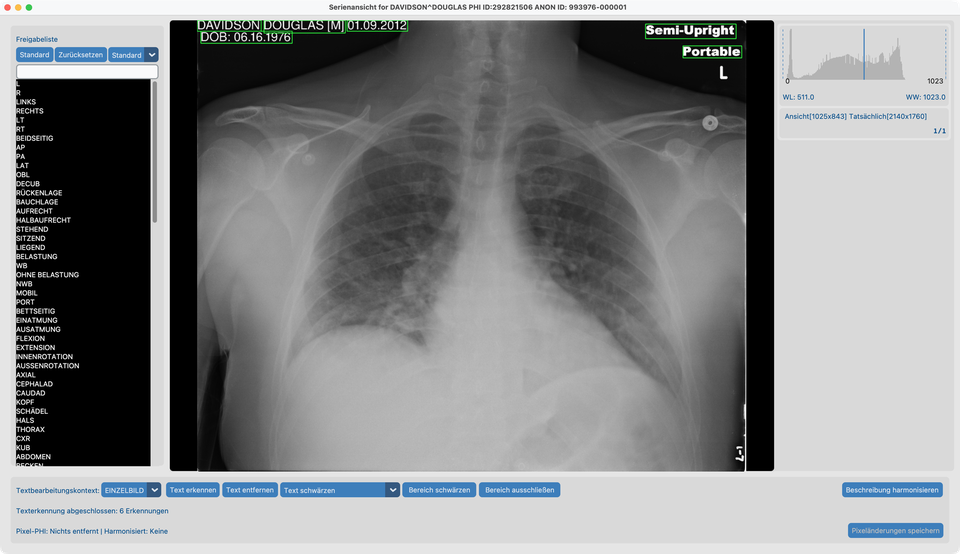
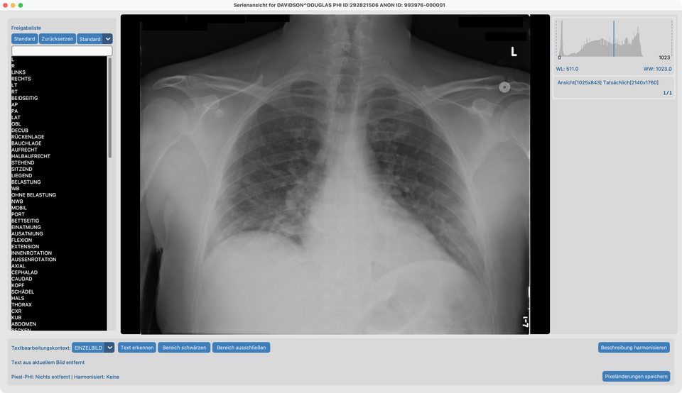
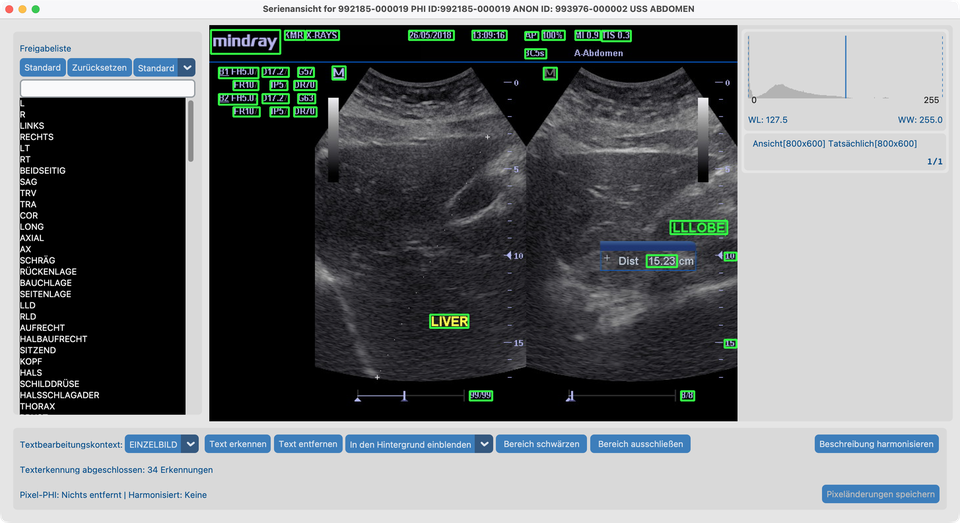
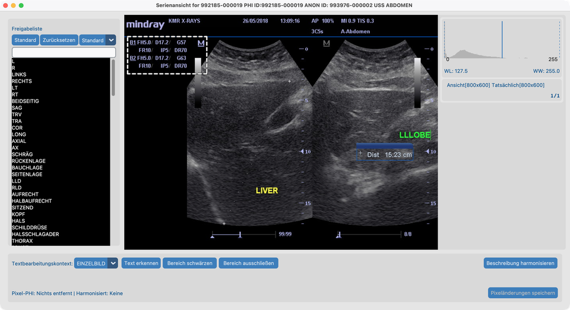
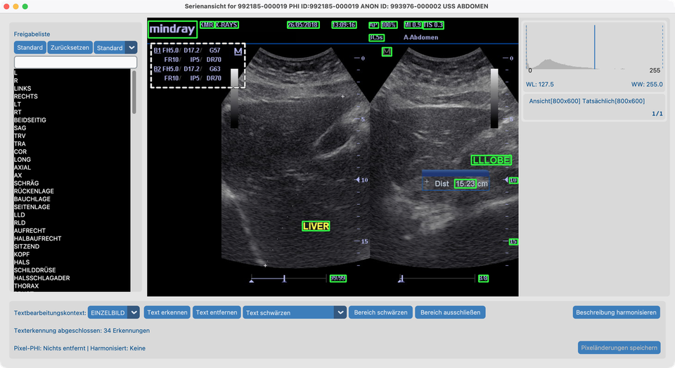

# 8.1 Pixel-PHI entfernen

Manche Bilder haben **Patientennamen oder Beschriftungen auf die Pixel gezeichnet**. Das Bereinigen der DICOM-Tags allein entfernt sie nicht.

## Demo-Serien

| Serie | Pfad | Verwendung |
| --- | --- | --- |
| **`davidson_cxr`** | `tests/controller/assets/test_dcm_files/davidson_cxr` | Whitelist → Erkennen → **Schwärzen** |
| **`us_rgb_single_frame`** | `tests/controller/assets/test_dcm_files/us_rgb_single_frame` (`US_RGB_SingleFrame.dcm`) | Erkennen → **In den Hintergrund einblenden**; **Exclude Area** auf dem Maschinenparameter-Block unter **mindray** |

Jeden Ordner in Ihr Projekt importieren, dann die Serie in der **Serienansicht** öffnen.

## Ziel

1. Auf `davidson_cxr` eingebrannten Text erkennen und PHI **schwärzen**, während nützliche Marker über die Standard-Whitelist erhalten bleiben.
2. Auf `us_rgb_single_frame` eingebrannten Text erkennen und durch **Einblenden in den Hintergrund** (Inpaint) entfernen.
3. Auf derselben Farb-US-Serie den nicht-PHI-Maschinenparameterstreifen mit **Exclude Area** markieren, damit Text erkennen und Text entfernen ihn überspringen.

## Bevor Sie starten

1. [KI-Funktionen einrichten](../../03-ai-features-setup/) abschließen, damit OCR-Modelle bereit sind.
2. Die Demo-Serien importieren und in der Serienansicht aus dem [Datensatz](../../07-view/) öffnen.

## Ablauf auf `davidson_cxr` (schwärzen)

Diese Schritte der Reihe nach ausführen. Die Screenshots passen zu diesem Fixture.

### 1. Standard-Whitelist und Frame-Kontext

1. Die **Standard-Whitelist** belassen (nicht zurücksetzen).
2. Bearbeitungskontext auf **Frame** setzen (noch nicht ganze Serie).

### 2. Text erkennen

1. Auf **Text erkennen** klicken.
2. Warten, bis die Erkennung fertig ist. **Grüne Rechtecke** markieren Text, der entfernt würde.

Auf diesem Thoraxröntgen sollten Sie grüne Boxen um Patientenname, Datum, Geburtsdatum und ähnliche PHI sehen — aber **nicht** um **Portable** oder **L**. Diese Wörter stehen bereits auf der Standard-Whitelist, daher lässt Text erkennen sie in Ruhe.

**Whitelist-Match-Dropdown** (neben Standard / Zurücksetzen — hier auf **Standard**):

Steuert, wie genau OCR-Text einem Whitelist-Eintrag entsprechen muss, um als Behalter zu gelten:

| Einstellung | Wirkung |
| --- | --- |
| **Exakt** | Nur Text ausblenden, der buchstabengetreu einem Whitelist-Eintrag entspricht |
| **Strikt** | Fast exakt — nur winzige OCR-Fehler |
| **Standard** (Voreinstellung) | Erlaubt kleine OCR-Fehler (z. B. `AXIL` trifft weiterhin `AXIAL`) |
| **Tolerant** | Am nachsichtigsten — besser bei verrauschtem Text und kurzen Markern |

Eine strengere Einstellung wählen, wenn zu viel Text übersprungen wird; eine lockerere, wenn nützliche Marker immer wieder eingerahmt werden.

### 3. Prüfen und Behalter zur Whitelist hinzufügen

1. Wenn ein grünes Rechteck Text abdeckt, den Sie **behalten** wollen, auf dieses Rechteck klicken.
2. Der Text wird links zur Whitelist hinzugefügt und wird nicht entfernt.

Auf `davidson_cxr` sind **Portable** und **L** bereits von der Standard-Whitelist abgedeckt — Sie müssen sie meist nicht erneut hinzufügen.

### 4. Text entfernen per Schwärzen

1. Entfernungsmodus-Dropdown auf **Text schwärzen** setzen.
2. Auf **Text entfernen** klicken.
3. PHI-Bereiche werden solid schwarz; Whitelist-Behalter bleiben.
4. Auf **Pixeländerungen speichern** klicken, wenn Sie zufrieden sind.

Schwärzen ist die übliche Wahl zur De-Identifikation: entfernter Text ist klar weg und aus den Pixeln nicht wiederherstellbar.

## Ablauf auf `us_rgb_single_frame` (in den Hintergrund einblenden)

Diesen Farb-Ultraschall-Frame nutzen, wenn entfernter Text wie benachbartes Gewebe aussehen soll statt schwarzer Balken.

### 5. Text entfernen per Einblenden in den Hintergrund

1. **`us_rgb_single_frame`** (`US_RGB_SingleFrame.dcm`) importieren und in der Serienansicht öffnen.
2. Bearbeitungskontext auf **Frame** belassen.
3. Entfernungsmodus-Dropdown auf **In den Hintergrund einblenden** setzen.
4. Auf **Text erkennen** klicken und auf die grünen Rechtecke warten.

5. Auf **Text entfernen** klicken.
6. Erkannter Text wird durch Einblenden mit umgebenden Pixeln übermalt (Inpaint), dann **Pixeländerungen speichern**.

**Text schwärzen** vs **In den Hintergrund einblenden**: Schwärzen ersetzt Text durch Schwarz; Einblenden füllt den Bereich so, dass er zum Bild darum passt. Schwärzen bevorzugen, wenn Sie eine offensichtliche, irreversible Schwärzung brauchen; Einblenden, wenn ein unauffälligeres Ergebnis akzeptabel ist (z. B. manche Ultraschall-Overlays).

## Ablauf auf Farb-US (Exclude Area)

Dieselbe Serie **`us_rgb_single_frame`** nutzen, wenn OCR Maschineneinstellungen einrahmt, die **keine PHI** sind. **Exclude Area** überspringt eine räumliche Region für Text erkennen und Text entfernen, ohne Pixel zu ändern (anders als **Bereich schwärzen**).

### 6. Parameterblock unter mindray ausschließen

Auf diesem Frame sitzt ein dichter Block von Maschinenparametern (Gain, Depth, FR, DR und ähnliche Tokens) **oben links**, direkt **unter** dem Logo **mindray**.

1. **`us_rgb_single_frame`** in der Serienansicht mit Bearbeitungskontext **Frame** öffnen.
2. Ein Rechteck über diesen Parameterblock ziehen (**mindray** und echte PHI-/Standortbeschriftungen außen lassen, wenn sie noch erkannt werden sollen). Ausstehende Zeichnungen erscheinen als **solid blaue** Rechtecke.
3. Auf **Exclude Area** klicken. Das Rechteck wandert in die Ausschlussliste und wird als **weiße gepunktete Kontur** (ohne Füllung) neu gezeichnet.

4. Auf **Text erkennen** klicken. Grüne Boxen sollten auf PHI-/Herstellertext **außerhalb** des Blocks erscheinen; die Parameter-Tokens innerhalb der gepunkteten Region sollten **nicht** zur Entfernung eingerahmt werden.

5. Optional **In den Hintergrund einblenden** oder **Text schwärzen** wählen, dann **Text entfernen** und **Pixeländerungen speichern**.
6. Auf ein weiß gepunktetes Rechteck klicken, um es aus der Ausschlussliste zu entfernen, wenn Sie anpassen müssen.

**Whitelist** vs **Exclude Area** vs **Bereich schwärzen**: Die Whitelist behält bestimmte OCR-*Zeichenketten*; Exclude Area überspringt eine *Region* (keine Pixeländerung); Bereich schwärzen malt gezeichnete Rechtecke schwarz. Ausschlussrechtecke möglichst **vor** Text erkennen setzen (oder danach erneut erkennen). Mit Bearbeitungskontext **Series** propagiert das Zeichnen über Frames, sodass dasselbe Panel auf einer Cine-Schleife ausgeschlossen werden kann.

## Nach der Demo

- Der Datensatz-Status **Pixel-PHI** sollte sich für jede gespeicherte Serie aktualisieren.
- Modalitäts-Whitelists und das Match-Dropdown (Exakt → Tolerant) leben in der Serienansicht; strengeres Matching bedeutet, dass weniger OCR-Treffer als Whitelist-Behalter gelten.
- Ausschlussregionen gelten für die aktuelle Serienansicht-Sitzung (wie andere Canvas-Overlays). Serie erneut öffnen und neu zeichnen, wenn Sie sie wieder brauchen.
- Um dasselbe Werkzeug auf vielen Studien auszuführen, siehe [8.4 Auf vielen Studien ausführen](../05-run-on-many-studies/).

## So sieht es aus, wenn es passt

- Auf `davidson_cxr`: PHI geschwärzt; Orientierungsmarker behalten, wenn auf Whitelist.
- Auf `us_rgb_single_frame`: eingebrannte Beschriftungen ohne solide schwarze Balken eingeblendet entfernt; mit Exclude Area wird der mindray-Parameterblock nicht als PHI entfernt.
- Spalte **Pixel-PHI** aktualisiert sich im Datensatz.

## Wenn es fehlschlägt

- Viele Fehlboxen → Match-Strenge erhöhen; Behalter whitelisten; oder **Exclude Area** für ganze Panels.
- Verpasster Text → manuell **Bereich schwärzen**.
- Parametertext noch eingerahmt → Ausschlussrechteck vergrößern und erneut erkennen; gepunktete Konturen anklicken zum Löschen und Neuzeichnen.
- Werkzeuge ausgegraut → [KI-Funktionen](../../03-ai-features-setup/) abschließen.

## Nächste Schritte

Weiter mit [8.2 Namen harmonisieren](../03-harmonize-names/) anhand von **`CT_Head_With_Contrast`**.
