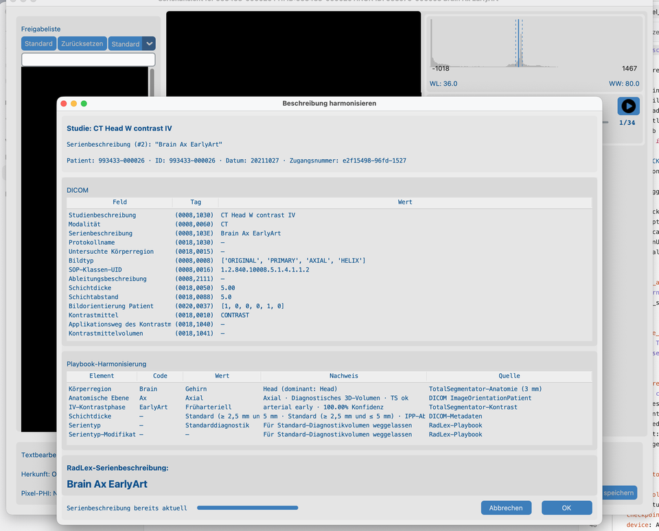
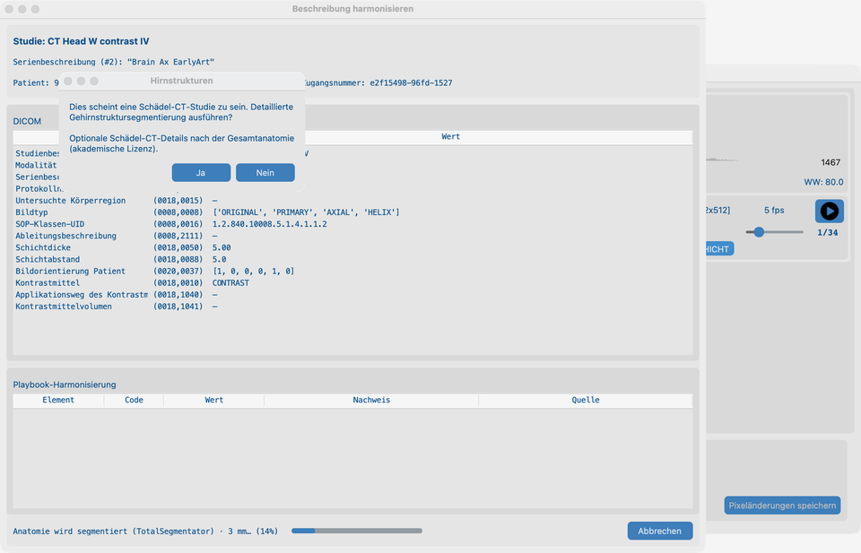
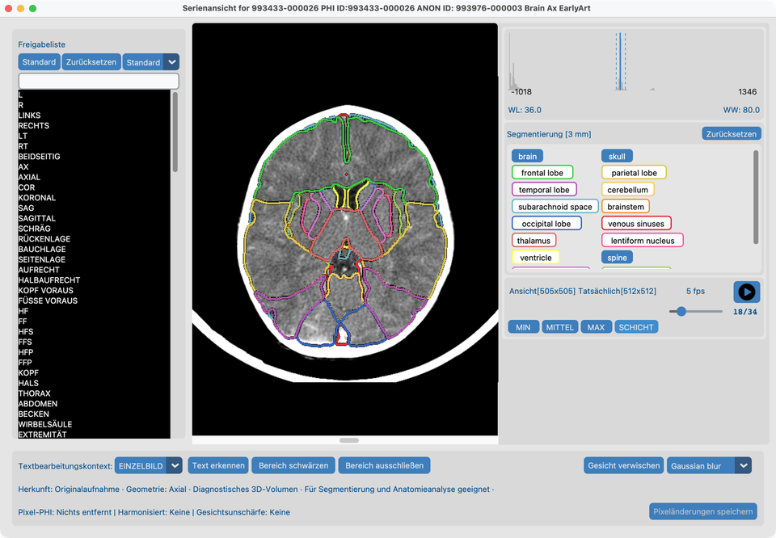
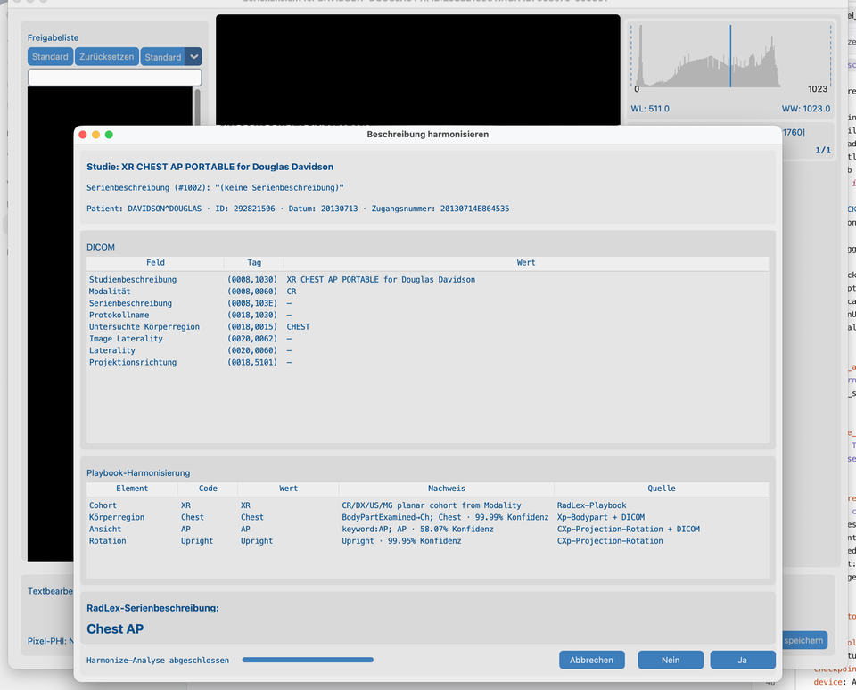
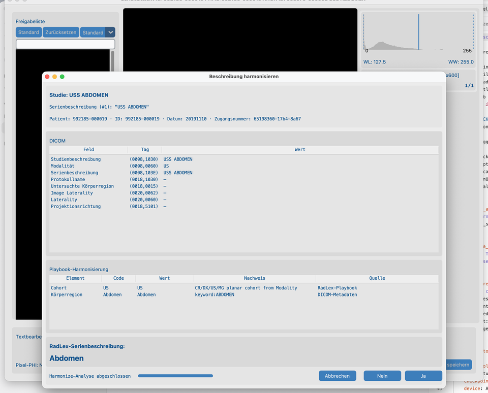

# 8.2 Namen harmonisieren

Forschungsdatensätze verwenden oft inkonsistenten **Series Description**-Text. **Harmonisieren** schlägt einen Standardnamen aus Anatomie und (bei CT/MR) Kontrast vor — Stil RSNA Radiology Playbook / RadLex. Es ändert **keine** Pixel.

## Demo-Serien

| Fixture | Pfad unter `tests/controller/assets/test_dcm_files/` | Was es zeigt |
| --- | --- | --- |
| **`CT_Head_With_Contrast`** | `CT_Head_With_Contrast` | CT-Pfad: TotalSegmentator-Anatomie / Kontrast, Hirnstrukturen-Prompt, Overlays |
| **`davidson_cxr`** | `davidson_cxr` | XR planarer Pfad: optional **Xp-Bodypart** + **CXp-Projection-Rotation** |
| **`us_rgb_single_frame`** | `us_rgb_single_frame` | US planarer Pfad: nur DICOM-Metadaten (kein TotalSegmentator) |

Eine Serie importieren, in der **Serienansicht** öffnen, dann Harmonisieren ausführen. **`CT_Head_With_Contrast`** in [8.3 Gesichter unscharf machen](../04-blur-faces/) wiederverwenden.

## Ziel

1. Auf **`CT_Head_With_Contrast`**: **Beschreibung harmonisieren** ausführen, bei Angebot den Hirnstrukturen-Prompt beantworten, Anwenden, dann Segmentierungs-Overlays auf dem mittleren Schnitt prüfen.
2. Auf **`davidson_cxr`** und **`us_rgb_single_frame`**: Harmonisieren ausführen und die Playbook-Tabelle lesen — **Quelle** benennt das Modell oder DICOM (gleiche Idee wie CTs „TotalSegmentator anatomy“).

## Bevor Sie starten

1. [KI-Funktionen einrichten](../../03-ai-features-setup/) abschließen — Harmonize-CT-Paket, Auflösung und Hirnstrukturen für die CT-Demo.
2. Optional **XR body part** und **XR chest view** herunterladen, damit die CXR-Demo Pixel-Fusion zeigt (ohne sie harmonisiert XR weiterhin aus DICOM-Tags).
3. Die Demo-Serien importieren ([Suchen](../../06-search/)) und jeweils in der **Serienansicht** öffnen ([Ansicht](../../07-view/) — Rechtsklick auf die Serienzeile).

## Ablauf auf `CT_Head_With_Contrast`

### 1. Beschreibung harmonisieren (aus der Serienansicht)

1. Mit offenem `CT_Head_With_Contrast` in der **Serienansicht** auf **Beschreibung harmonisieren** klicken.
2. Warten, bis die Analyse fertig ist — die Tabelle **Playbook-Harmonisierung** füllt sich mit Anatomie-/Kontrastnachweisen (keine leere Tabelle mitten im Fortschritt).
3. Vorgeschlagene Series Description prüfen, dann **Ja** zum Anwenden oder **Nein** / **Abbrechen**.

Die Serienansicht bleibt hinter dem Dialog, damit der Kontext der offenen Serie erhalten bleibt.

### 2. Hirnstrukturen-Prompt

Auf einer CT-Kopfserie fragt Harmonisieren, ob vor dem Weiterlaufen eine **detaillierte Hirnstruktur-Segmentierung** ausgeführt werden soll:

1. Die **Hirnstrukturen**-Ja/Nein-Meldung lesen (akademische Lizenz / Modelle erforderlich — siehe [KI-Funktionen](../../03-ai-features-setup/)).
2. **Ja** wählen, um Hirnstrukturen in diesem Lauf einzubeziehen, oder **Nein** nur für Standardanatomie.

### 3. Segmentierte Serienansicht

Nachdem Sie einen Harmonize-Lauf mit Hirnstrukturen akzeptiert haben (**Ja** auf dem Prompt):

1. Die Serienansicht zeigt Latch-Schaltflächen für das ganze **brain** plus detaillierte Strukturen (Hirnstamm, Lappen, Ventrikel, …), wenn das lizenzierte Paket lief.
2. **Alle** Strukturen auswählen, die Sie prüfen möchten (einschließlich **brain**).
3. Zum **mittleren Schnitt** gehen, um Overlays auf einem repräsentativen Frame zu sehen.

## Planare Harmonisierung (XR und US)

CR/DX, Ultraschall und Mammographie nutzen einen **separaten** Harmonize-Pfad von CT/MR: kein TotalSegmentator, keine Dicken-/Kontrast-Buckets. Die Playbook-Tabelle verwendet weiterhin **Nachweis** (was gemessen wurde) und **Quelle** (woher es kam).

### Thoraxröntgen (`davidson_cxr`)

1. **`davidson_cxr`** in der Serienansicht öffnen → **Beschreibung harmonisieren**.
2. Wenn XR-Modelle installiert sind, ist Body-Part-**Quelle** **Xp-Bodypart** (oder mit DICOM fusioniert); **View** / **Rotation** nutzen **CXp-Projection-Rotation**, wenn die Anatomie Chest ist.
3. Nachweise sehen aus wie CT-Klassifikatorzeilen — z. B. `Chest · 99.00% confidence` — keine undurchsichtigen `pixel:…`-Tokens.
4. Rotation ist nur Analyse; SeriesDescription bleibt z. B. `Chest AP` / `Chest Lat`.

### Ultraschall (`us_rgb_single_frame`)

1. **`us_rgb_single_frame`** in der Serienansicht öffnen → **Beschreibung harmonisieren**.
2. Kohorte / Körperteil / Modus kommen aus DICOM-Tags und Schlüsselwörtern; Quelle ist **DICOM metadata** oder **RadLex Playbook**.
3. Keine XR-Pixelpakete und kein TotalSegmentator auf US.

## Hinweise (wie im Produktivbetrieb)

- Scouts, MIP/VR, Dosisberichte und ähnliche Serien werden meist übersprungen.
- **CT:** Anatomie-Segmentierung + Kontrastphase, wenn Modelle es erlauben (TotalSegmentator).
- **MR:** Anatomie aus MR-Paketen; IV-Kontrast aus DICOM-Headern (TotalSegmentator).
- **XR (CR/DX):** planare Harmonisierung; optional Xp-Bodypart + nur-Thorax CXp Ansicht/Rotation (Soft-Downloads).
- **US / MG:** planare Harmonisierung nur aus DICOM — **kein** TotalSegmentator und **keine** XR-Pixelpakete.
- **SC / OT / DOC:** Harmonisieren wird nicht angeboten.
- Nachdem alle Serien einer Studie harmonisiert sind, wird die beste **LOINC-Studienbeschreibung** automatisch angewendet (gleicher Pfad wie KI-Stapel). Später im [Datensatz](../../07-view/#edit-harmonized-descriptions) ändern. Reine XR/US/MG-Studien nutzen das passende LOINC-Präfix.
- Im [Datensatz](../../07-view/#edit-study-and-series-descriptions) Doppelklick auf eine Studien- oder Serienbeschreibung (oder Mehrfachauswahl und Rechtsklick für **Set description**), um LOINC- (Studie) oder RadLex-Namen (Serie) zu wählen — auch für noch nicht grüne Zeilen. Einfachklick wählt nur die Zeile.
- Ergebnisse werden unter dem Serienordner zwischengespeichert — **Analyse-Cache leeren** für einen frischen CT/MR-Lauf.
- Stapel: [8.4 Auf vielen Studien ausführen](../05-run-on-many-studies/) (Auflösung kommt aus KI-Funktionen, nicht pro Stapel).

## So sieht es aus, wenn es passt

- CT: SeriesDescription wirkt konsistent für dieses Kopf-CT; Datensatz **Harmonisiert** aktualisiert sich; nach Hirn-Ja zeichnen Latch-Overlays auf dem mittleren Schnitt.
- CXR: Playbook-**Quelle** nennt **Xp-Bodypart** / **CXp-Projection-Rotation** (oder DICOM) mit lesbarem Konfidenz-Nachweis.
- US: Playbook-Zeilen zitieren **DICOM metadata** / **RadLex Playbook**; vorgeschlagener Name passt zu Ultraschall-Anatomie/Modus.

## Wenn es fehlschlägt

- Ungeeignete Serie → erwartetes Überspringen.
- Bereits harmonisiert → Analyse-Cache leeren zum erneuten Lauf.
- Modelle nicht bereit → [KI-Funktionen](../../03-ai-features-setup/).

## Nächste Schritte

Weiter mit [8.3 Gesichter unscharf machen](../04-blur-faces/) auf derselben Serie `CT_Head_With_Contrast` (Gaussian).
