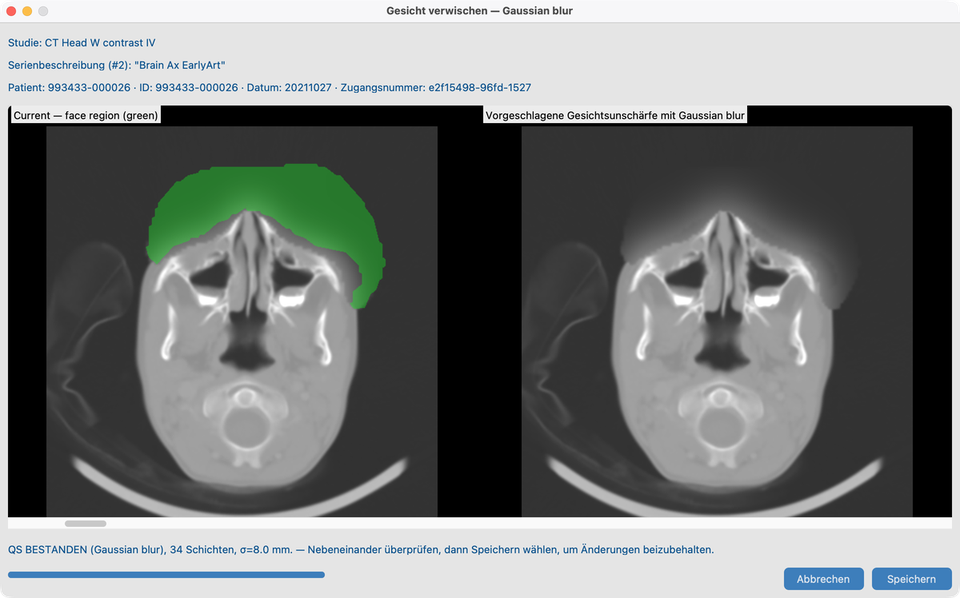

# 8.3 Gesichter unscharf machen

Bei manchen **Kopf-CT- oder MR**-Untersuchungen können Gesichtszüge auch nach bereinigten Tags noch Erkennung ermöglichen. **Gesichts-De-Identifikation** macht den Gesichtsbereich unscharf und lässt Sie die Qualität prüfen, bevor Sie das Ergebnis behalten.

## Demo-Serie

**`CT_Head_With_Contrast`** — dieselbe Serie wie [8.2 Namen harmonisieren](../03-harmonize-names/)  
(`tests/controller/assets/test_dcm_files/CT_Head_With_Contrast`).

Bevorzugt zuerst Harmonisieren, damit Anatomie-Hinweise die Eignung verbessern, dann Gesichtsunschärfe auf dieser Serie öffnen.

## Ziel

Auf `CT_Head_With_Contrast` Gesichtsunschärfe im Modus **Gaussian** ausführen, QA prüfen und bei Bedarf speichern.

## Bevor Sie starten

1. [KI-Funktionen einrichten](../../03-ai-features-setup/) abschließen — Gesichtsmodelle und akademische Lizenz.
2. **`CT_Head_With_Contrast`** importieren (und idealerweise Harmonisieren in 8.2 abschließen).
3. Die Serie in der Serienansicht öffnen.

## Ablauf auf `CT_Head_With_Contrast` (Gaussian)

1. `CT_Head_With_Contrast` in der Serienansicht öffnen.
2. **Gesichtsunschärfe** / Vorschau starten.
3. Unschärfemodus auf **Gaussian** setzen (übliche Voreinstellung für diese Demo).
4. Nebeneinander prüfen: aktuelles Bild vs. vorgeschlagene Unschärfe; grüne Kontur zeigt den Gesichtsbereich.
5. **QS BESTANDEN** vs **QS FEHLGESCHLAGEN** prüfen (Pixel außerhalb der Maske geändert).
6. **Speichern**, um zu behalten, oder verwerfen.

### Andere Unschärfemodi

Stapel und Serienansicht können auch Median, Pixelate oder Fill Noise anbieten. Die dokumentierte Demo nutzt nur **Gaussian**.

## Stapel

Siehe [8.4 Auf vielen Studien ausführen](../05-run-on-many-studies/). Nicht-Kopf-Serien werden übersprungen.

## So sieht es aus, wenn es passt

- Gesicht auf `CT_Head_With_Contrast` abgedeckt; Anatomie außerhalb der Maske unverändert.
- Datensatz-Status **Gesichtsunschärfe** aktualisiert sich.

## Wenn es fehlschlägt

- Keine Kopfserie / unzureichende Gesichtsmaske → überspringen oder zuerst Harmonisieren (8.2).
- Bereits angewendet → wird nicht erneut unscharf gemacht, außer über einen bewussten erneuten Lauf.
- QS FEHLGESCHLAGEN → nicht speichern; Modus anpassen oder Maske prüfen.
- Werkzeuge ausgegraut → [KI-Funktionen](../../03-ai-features-setup/).

## Nächste Schritte

Weiter mit [8.4 Auf vielen Studien ausführen](../05-run-on-many-studies/), um diese Werkzeuge über eine Kohorte zu stapeln.
