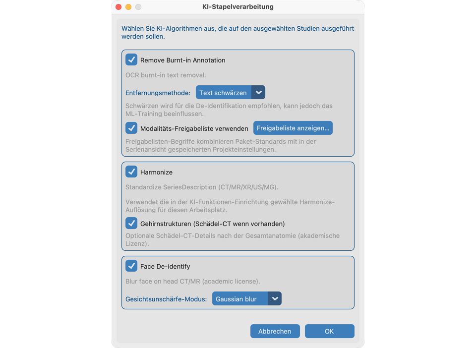

# 8.4 Auf vielen Studien ausführen

**KI-Stapelverarbeitung** führt dieselben Werkzeuge aus den Kapiteln 8.1–8.3 über ausgewählte Studien aus dem Datensatz aus — ohne jede Serie manuell zu öffnen.

## Demo-Studien

Verwenden Sie dieselben Fixtures, die Sie einzeln geübt haben:

| Werkzeug im Stapel | Fixture einbeziehen |
| --- | --- |
| Pixel-PHI entfernen | **`davidson_cxr`** |
| Harmonisieren + Gesichtsunschärfe | **`CT_Head_With_Contrast`** |

Beide importieren (oder den ganzen Baum `test_dcm_files`), **Datensatz** öffnen, diese Studien auswählen, dann KI-Stapelverarbeitung starten.

## Ziel

Eine Kohorte für eingebrannten Text, Harmonisieren und/oder Gesichtsunschärfe mit Fortschritt und Zusammenfassung verarbeiten.

## Bevor Sie starten

1. Die Demo-Serien oben (und weitere benötigte Studien) importieren.
2. [KI-Funktionen einrichten](../../03-ai-features-setup/) für jedes auszuführende Werkzeug abschließen.
3. Optional 8.1–8.3 einmal durchgehen, damit Sie die erwarteten Ergebnisse kennen.

## Stapel starten

1. **Datensatz** öffnen und Studien auswählen (`davidson_cxr` und `CT_Head_With_Contrast` für eine vollständige Demo einbeziehen).
2. **KI-Stapelverarbeitung** starten.
3. In den Optionen Algorithmen wählen:
   - Pixel-PHI entfernen (Schwärzen vs. Einblenden; Modalitäten-Whitelist ein/aus) — übt `davidson_cxr`
   - Harmonisieren (Arbeitsplatz-CT/MR-Auflösung aus KI-Funktionen) — übt `CT_Head_With_Contrast`
   - Gesichtsunschärfe (**Gaussian**, passend zu Kapitel 8.3) — übt `CT_Head_With_Contrast`
4. Modalitäten-Whitelists in der Vorschau prüfen, falls angeboten.
5. Speicherwarnung bestätigen, falls gezeigt, dann starten.

## Arbeitsreihenfolge

Für jede Serie laufen ausgewählte Werkzeuge in einer stabilen Reihenfolge (Pixel-PHI → Harmonisieren → Gesichtsunschärfe), damit der Speicherverbrauch vorhersehbar bleibt.

## Während des Laufs

- Fortschritt zeigt Studie / Serie / Phase.
- Abbrechen stoppt nach Möglichkeit nach dem aktuellen Schritt.
- Wenig Speicher kann mit klarer Warnung abbrechen.
- Bereits verarbeitete Serien werden standardmäßig übersprungen.

## Danach

- Zusammenfassung lesen (abgeschlossen / übersprungen / fehlgeschlagen).
- Serienansicht auf `davidson_cxr` und `CT_Head_With_Contrast` stichprobenartig prüfen vor dem Export.
- Derselbe Job auf einem **Server ohne Fenster** → [Ohne Oberfläche ausführen](../../10-headless/).

## So sieht es aus, wenn es passt

- Zusammenfassung entspricht den Erwartungen; Datensatz-KI-Spalten für die Demo-Studien aktualisiert.
- Protokolldatei hat Details zu Übersprungenen.

## Wenn es fehlschlägt

- Funktionen nicht bereit → [KI-Funktionen](../../03-ai-features-setup/).
- Keine Serien für die Auswahl → Datensatz-Auswahl prüfen.
- Zu wenig Speicher → andere Apps schließen oder weniger Studien verarbeiten.

## Nächste Schritte

Weiter mit [Senden](../../09-send/), um anonymisierte Studien zu exportieren (oder [ohne Oberfläche ausführen](../../10-headless/) für Server-Stapel).
