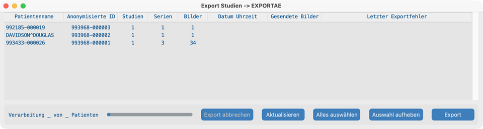
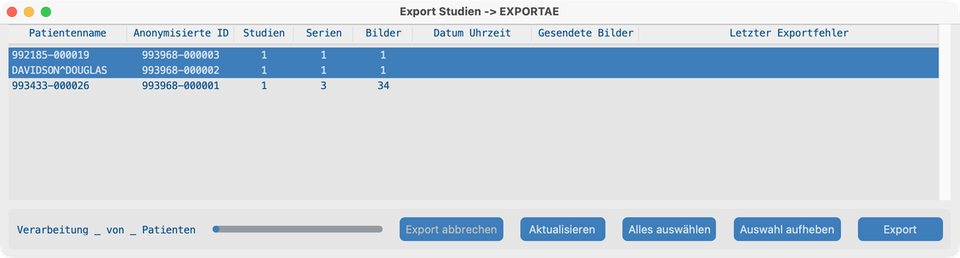
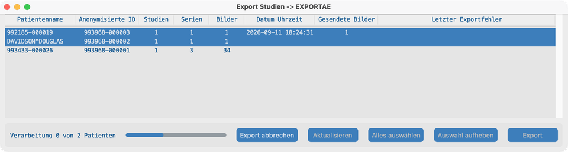
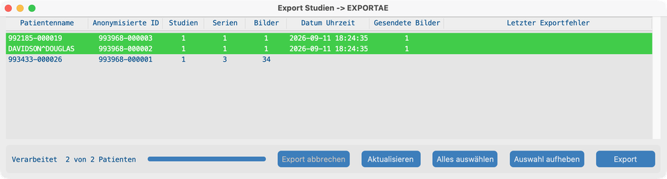

# Senden

## Ziel

Anonymisierte Patienten an ein entferntes DICOM-System oder AWS S3 senden. Den Status beobachten, bis Zeilen als gesendet erscheinen.

## Bevor Sie starten

1. Den **Export-Server** (oder AWS Cognito für S3) in den [Projekteinstellungen](../05-create-project/) konfigurieren.
2. Mindestens eine Studie importieren, damit die Senden-Liste nicht leer ist ([Suchen](../06-search/) oder Datensatz).

## Ablauf

### 1. Erste Senden-Ansicht

1. Im Dashboard auf **Senden** klicken.
2. Das Export-Fenster listet anonymisierte Patienten (ein Patient kann mehrere Studien umfassen).
3. Bestätigen, dass der Titel Ihr Ziel zeigt (Export-AE-Title oder AWS-Projekt).

### 2. Patienten auswählen

1. Eine oder mehrere Patientenzeilen anklicken (SHIFT / CMD oder CTRL für Mehrfachauswahl), oder auf **Alles auswählen** klicken.
2. **Auswahl aufheben** nutzen, wenn Sie neu beginnen müssen.
3. Bereits gesendete Zeilen (grün) bleiben meist unberührt; die App sendet abgeschlossene Objekte standardmäßig nicht erneut.

### 3. Senden

1. Auf **Export** klicken.
2. Bei DICOM-Zielen prüft die App den Export-Server zuerst per Echo; Verbindungsfehler mit der IT beheben, wenn das Echo fehlschlägt.
3. Während der Export läuft, werden Aktionsschaltflächen deaktiviert, **Export abbrechen** aktiviert, und die Statuszeile zeigt Fortschritt (z. B. Verarbeitung 0 von N Patienten).
4. **Datum Uhrzeit** und **Gesendete Bilder** aktualisieren sich, wenn jeder Patient fertig ist.

### 4. Gesendet

1. Wenn alle ausgewählten Patienten fertig sind, zeigt der Status **Processed N of N Patients**.
2. Erfolgreiche Zeilen werden **grün** mit ausgefülltem **Datum Uhrzeit** und **Gesendete Bilder**.
3. Nicht ausgewählte Patienten bleiben unverändert.
4. Fehlgeschlagene Zeilen werden **rot** und zeigen **Letzter Exportfehler**; bei Bedarf auswählen und erneut exportieren.

## So sieht es aus, wenn es passt

- Ausgewählte Patienten schließen mit grünen Zeilen und passenden Zählern **Gesendete Bilder** ab.
- Ziel-PACS oder S3-Bucket zeigt die anonymisierten Studien.

## Wenn es fehlschlägt

- Echo- / Authentifizierungsfehler → Export-Server oder AWS-Cognito-Anmeldedaten mit der IT prüfen.
- Nichts ausgewählt → zuerst Patienten auswählen.
- Teilweise Fehler → **Letzter Exportfehler** lesen, Ziel korrigieren, rote Zeilen erneut auswählen, Export wiederholen.

## Nächste Schritte

Optional: [Ohne Oberfläche ausführen](../10-headless/) für Labor-/Server-Empfang oder Nachtstapel.
