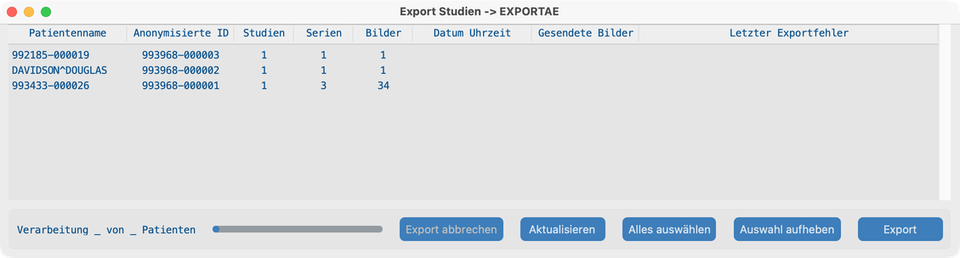
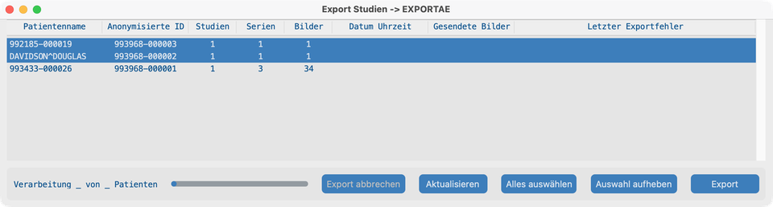
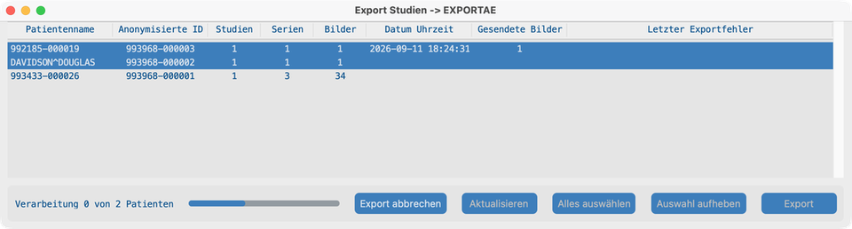
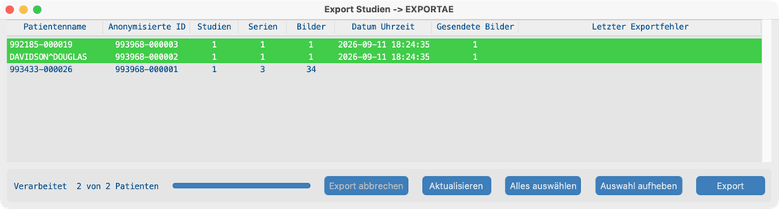

# Senden

## Ziel

Anonymisierte Patienten an ein entferntes DICOM-System oder AWS S3 senden. Den Status beobachten, bis Zeilen als gesendet erscheinen.

## Bevor Sie starten

1. Den **Export-Server** (oder AWS Cognito für S3) in den [Projekteinstellungen](../05-create-project/) konfigurieren.
2. Mindestens eine Studie importieren, damit die Senden-Liste nicht leer ist ([Suchen](../06-search/) oder Datensatz).

## Ablauf

### 1. Erste Senden-Ansicht

1. Im Dashboard auf **Senden** klicken.
2. Das Export-Fenster listet anonymisierte Patienten (ein Patient kann mehrere Studien umfassen).
3. Bestätigen, dass der Titel Ihr Ziel zeigt (Export-AE-Title oder AWS-Projekt).

### 2. Patienten auswählen

1. Eine oder mehrere Patientenzeilen anklicken (SHIFT / CMD oder CTRL für Mehrfachauswahl), oder auf **Alles auswählen** klicken.
2. **Auswahl aufheben** nutzen, wenn Sie neu beginnen müssen.
3. Bereits gesendete Zeilen (grün) bleiben meist unberührt; die App sendet abgeschlossene Objekte standardmäßig nicht erneut.

### 3. Senden

1. Optional **Segmente als DICOM-SEG exportieren** aktivieren (siehe [unten](#segmente-als-dicom-seg-exportieren)).
2. Auf **Export** klicken.
3. Bei DICOM-Zielen prüft die App den Export-Server zuerst per Echo; Verbindungsfehler mit der IT beheben, wenn das Echo fehlschlägt.
4. Während der Export läuft, werden Aktionsschaltflächen deaktiviert, **Export abbrechen** aktiviert, und die Statuszeile zeigt Fortschritt (z. B. Verarbeitung 0 von N Patienten).
5. **Datum Uhrzeit** und **Gesendete Bilder** aktualisieren sich, wenn jeder Patient fertig ist.

### 4. Gesendet

1. Wenn alle ausgewählten Patienten fertig sind, zeigt der Status **Processed N of N Patients**.
2. Erfolgreiche Zeilen werden **grün** mit ausgefülltem **Datum Uhrzeit** und **Gesendete Bilder**.
3. Nicht ausgewählte Patienten bleiben unverändert.
4. Fehlgeschlagene Zeilen werden **rot** und zeigen **Letzter Exportfehler**; bei Bedarf auswählen und erneut exportieren.

## Segmente als DICOM-SEG exportieren

Wenn **Segmente als DICOM-SEG exportieren** im Senden-Fenster aktiviert ist, wandelt die App Segmente auf dem Datenträger in DICOM-Segmentation-Objekte um und sendet sie zusammen mit den anonymisierten Bildern (DICOM-Server oder AWS S3).

### Was enthalten ist

Pro Serie mit Segmentdaten:

- **TotalSegmentator**-Anatomiemasken aus dem Serien-Cache (`0_TS_SEG/seg/`), z. B. Gehirn- und Hirnstrukturmasken nach Harmonisieren / Brain Structures
- **Benutzer-ROI-Annotationen** aus der Serienansicht (`0_TS_SEG/annotations/`)

Face-Blur-Masken werden **nicht** als DICOM-SEG exportiert.

### Wie viele DICOM-Dateien

- **Eine DICOM-SEG-Datei pro Quellserie** (nicht eine Datei pro Organ oder Label).
- Lokal wird sie vor dem Senden neben den Bildern der Serie als `roi_annotations.seg.dcm` geschrieben.
- Diese eine Datei enthält **alle** Segmente der Serie (TS-Strukturen und Benutzer-ROIs) als Einträge in der DICOM-`SegmentSequence`, mit Binärframes je Segment auf Slices mit Voxeln.

### Verwendetes SEG-Format

Exportierte Objekte folgen der DICOM-IOD **Segmentation Storage** (SOP-Klasse `1.2.840.10008.5.1.4.1.1.66.4`), Modalität **SEG**:

| Attribut | Verwendeter Wert |
| --- | --- |
| `SegmentationType` | `BINARY` |
| `BitsAllocated` / `BitsStored` | `1` (bitgepackte Frames; für BINARY laut DICOM erlaubt) |
| `ImageType` | `DERIVED\PRIMARY` |
| Transfer Syntax | Explicit VR Little Endian |
| Algorithmustypen | `AUTOMATIC` für TotalSegmentator-Masken; `MANUAL` für Benutzer-ROIs (Mischung in einer Datei erlaubt) |

Zusätzlich für die Viewer-Verknüpfung:

- Top-Level-`ReferencedSeriesSequence` (Quellserie + Instanz-UIDs)
- Multi-Frame-`DimensionOrganizationSequence` / `DimensionIndexSequence`
- Pro Frame: Ebenenlage/-orientierung und Ableitungsreferenzen auf Quellslices

**Anzeige:** Orthanc und viele PACS **speichern** die SEG als Geschwisterserie unter derselben Studie. Eingebauter Orthanc Explorer und Viewer wie Horos **überlagern** SEG oft nicht auf CT/MR, auch wenn das Objekt gültig ist. Zum Prüfen der Overlays die **gesamte Studie** (Bilder + SEG) in einem SEG-fähigen Tool öffnen, z. B. **3D Slicer**, MITK oder OHIF — nicht die SEG-Datei allein.

### Darstellung auf dem DICOM-Server

| | Quell-CT / -MR-Bilder | DICOM-SEG |
| --- | --- | --- |
| Studie | Anonymisierte Studie | **Dieselbe Studie** (`StudyInstanceUID`) |
| Serie | Original-Bildserie | **Eigene Serie** (neue `SeriesInstanceUID`, Seriennummer `9001`) |
| Serienbeschreibung | Original (z. B. Routine Brain) | `Anatomy Segments`, `ROI Annotations` oder `Segments + ROI Annotations` |
| Instanzen | Viele Bildinstanzen | **Eine** SEG-Instanz für diese Serie |

Das SEG-Objekt liegt **nicht** in der Quell-Bildserie. Im Archiv erscheint es als **Geschwister-SEG-Serie unter derselben Studie**.

Hat eine Serie weder TS-Masken noch Benutzerannotationen, wird für diese Serie keine SEG-Datei erzeugt.

### Spalten in der Export-Ansicht

Die Patientenliste zeigt:

- **Bilder** — Anzahl anonymisierter Instanzen (ohne vorbereitete `roi_annotations.seg.dcm`)
- **Segmente** — Summe exportierbarer Segment-**Labels** für den Patienten (TS-Anatomiemasken + Benutzer-ROIs; Face Blur ausgenommen)
- **Gesendete Bilder** — erfolgreich gesendete Dateien. Mit **Segmente als DICOM-SEG exportieren** zählt jede segmentierte Serie **eine** SEG-Instanz (alle Labels einer Serie in einer DICOM-SEG-Datei), also ungefähr `Bilder + (Anzahl segmentierter Serien)`

## So sieht es aus, wenn es passt

- Ausgewählte Patienten schließen mit grünen Zeilen und passenden Zählern **Gesendete Bilder** ab.
- Ziel-PACS oder S3-Bucket zeigt die anonymisierten Studien.
- Mit **Segmente als DICOM-SEG exportieren** hat jede segmentierte Serie zusätzlich eine Geschwister-**SEG**-Serie am Ziel (gleiche Studie, eigene Serie).

## Wenn es fehlschlägt

- Echo- / Authentifizierungsfehler → Export-Server oder AWS-Cognito-Anmeldedaten mit der IT prüfen.
- Nichts ausgewählt → zuerst Patienten auswählen.
- Teilweise Fehler → **Letzter Exportfehler** lesen, Ziel korrigieren, rote Zeilen erneut auswählen, Export wiederholen.

## Nächste Schritte

Optional: [Ohne Oberfläche ausführen](../10-headless/) für Labor-/Server-Empfang oder Nachtstapel.
