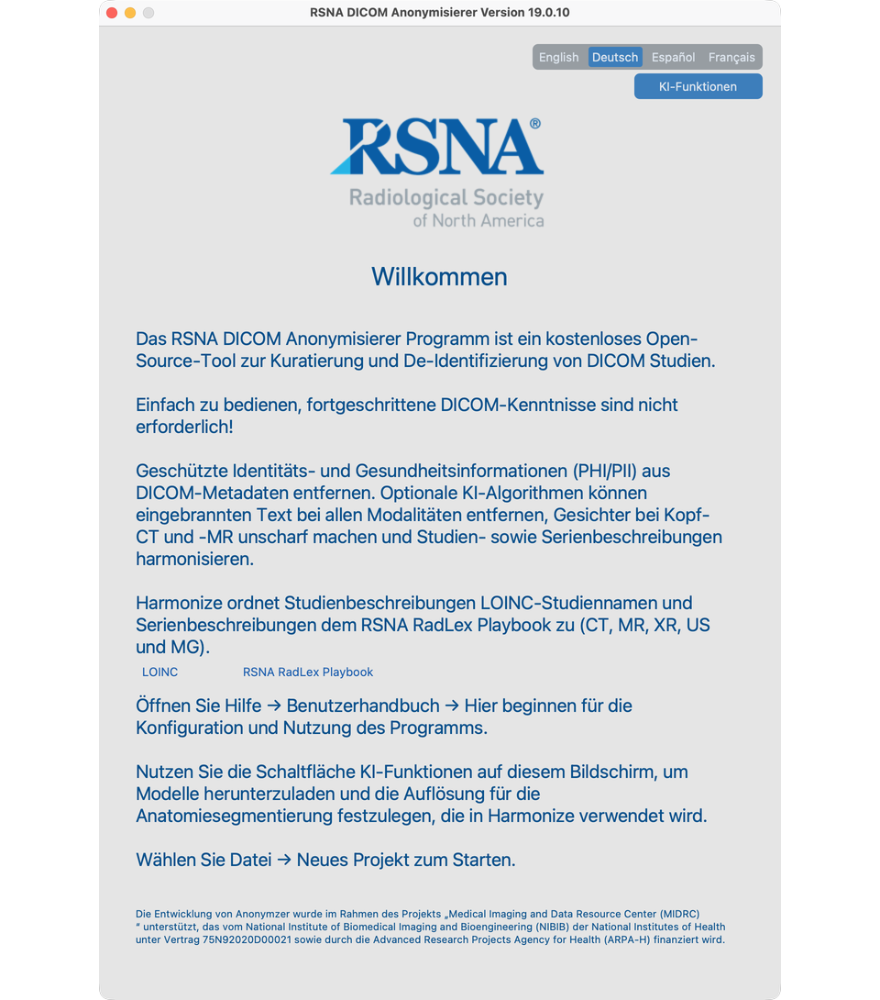

# T1 — App installieren und öffnen

## Ziel
Den Anonymizer installieren und den Willkommen-Bildschirm mit verfügbaren KI-Funktionen erreichen.

## Schritte
1. uv installieren (`uv --version` zur Prüfung), eine Python-3.12-venv mit tkinter anlegen, dann `uv pip install rsna-anonymizer` (19.0.1).
2. Unter macOS vor KI-Funktionen `brew install libomp`.
3. `rsna-anonymizer` starten; Willkommen bestätigen; **KI-Funktionen** öffnen und benötigte Downloads starten.

## Video
<!-- Replace VIDEO_ID when published

<iframe src="https://www.youtube.com/embed/VIDEO_ID" title="T1 Install" frameborder="0" allowfullscreen></iframe>

-->

Vollständige Details: [Installation und erster Start](../02-install/)
