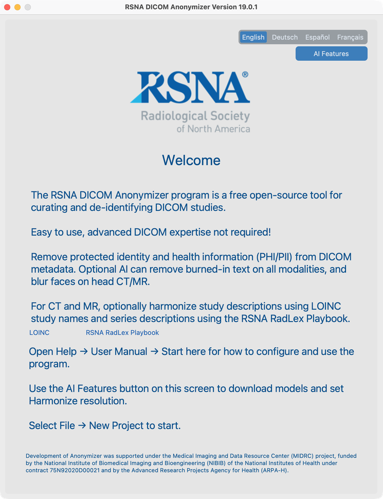

# Install and first launch

**Version 19.0.1** is the first official V19 release. You need **Python 3.11 or 3.12** with **tkinter**, installed via **uv**. Python 3.13 is not supported.

## Install with uv and tkinter

You need three things: **uv**, a Python environment that includes **tkinter**, and on macOS, for AI Features, the C++ libray **libomp**.

### 1. Install uv

[uv](https://docs.astral.sh/uv/) manages Python, the virtual environment, and large AI packages.

```bash
# macOS / Linux
curl -LsSf https://astral.sh/uv/install.sh | sh

# Windows (PowerShell)
irm https://astral.sh/uv/install.ps1 | iex
```

Confirm uv is available:

```bash
uv --version
```

### 2. Install Python with tkinter, then the app

The desktop window needs **tkinter**. Install a Python that includes it, then create the venv and install **19.0.1**:


| Platform    | Ensure tkinter is available                                                                                                           |
| ----------- | ------------------------------------------------------------------------------------------------------------------------------------- |
| **Windows** | Install Python 3.11 or 3.12 from [python.org](https://www.python.org/downloads/) with **Add to PATH** and **tcl/tk and IDLE** checked |
| **macOS**   | Prefer `uv python install 3.12` (Tk 9.x). Or Homebrew: `brew install python@3.12 python-tk@3.12`                                      |
| **Linux**   | `sudo apt install python3.12 python3.12-tk python3.12-venv` (or matching 3.11 packages)                                               |


```bash
uv python install 3.12
uv venv rsna-anonymizer --python 3.12
source rsna-anonymizer/bin/activate   # Windows: rsna-anonymizer\Scripts\activate

uv pip install rsna-anonymizer       # version 19.0.1
```

### 3. Verify the install

```bash
python --version          # 3.11.x or 3.12.x
python -m tkinter         # a small Tk window must open — required for the UI
rsna-anonymizer --version # should report 19.0.1
```

If `python -m tkinter` fails, recreate the venv with a Python that includes Tk (table above), then reinstall.

### 4. macOS only — OpenMP for AI Features

On macOS, **AI Features** (TotalSegmentator / Harmonize contrast and related tools) need the C++ OpenMP library `**libomp`**. Install it once with Homebrew **before** you download or run those models:

```bash
brew install libomp
```

Without `libomp`, Harmonize contrast can crash (for example exit 139 or XGBoost OpenMP errors). Linux and Windows normally do not need this step.

### 5. Run

```bash
rsna-anonymizer
```

## First launch



1. The **Welcome** screen opens.
2. Optional but recommended: click **AI Features** on Welcome to download models / accept the face license (see [AI Features setup](../07-process/01-ai-features-setup)). Setup is only available from Welcome — close the project to return there later. On macOS, install `libomp` first (step 4 above).
3. Create or open a project from the **File** menu.

## Upgrade

```bash
source rsna-anonymizer/bin/activate
uv pip install --upgrade rsna-anonymizer
```

See the [CHANGELOG](https://github.com/RSNA/anonymizer/blob/V19/CHANGELOG.md) for release notes.

## Next steps

Continue with [Words we use](../03-words-we-use/), then [Create a project](../04-create-project/).
