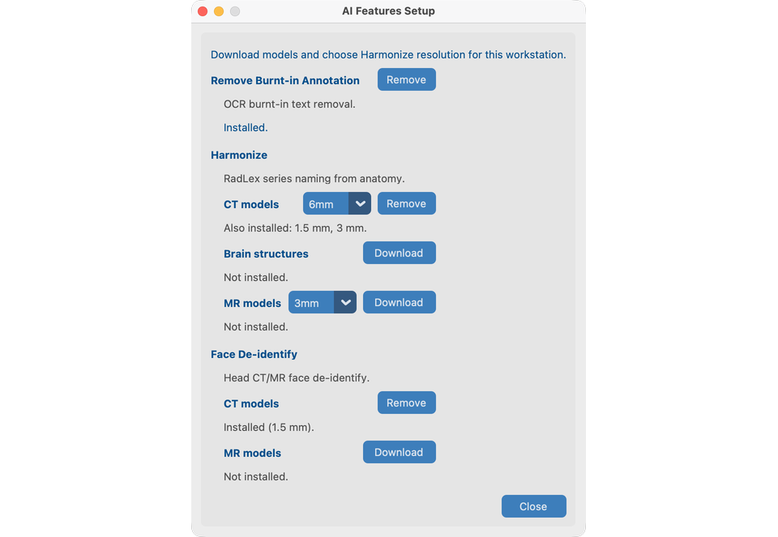

# AI Features setup

AI Features are **optional**. They run on your computer after a one-time download. Images are not uploaded for processing.

Do this chapter **before** the tool walkthroughs on `davidson_cxr` and `CT_Head_With_Contrast`.

## Goal

Download the models you need and choose Harmonize resolution for this workstation.

## Open setup

From the **Welcome** screen only: click **AI Features**.

Close the project (or start the app) to return to Welcome if you need to download models or change Harmonize resolution later.

## What you configure (V19)

| Item | Needed for demo |
| --- | --- |
| **Remove burned-in text** (OCR) | Chapter 8.1 — `davidson_cxr` |
| **Harmonize** CT pack + resolution (1.5 / 3 / 6 mm) | Chapter 8.2 — `CT_Head_With_Contrast` |
| **Harmonize** XR body part (optional) | Pixel anatomy for CR/DX when DICOM body-part tags are missing or wrong |
| **Harmonize** XR chest view (optional) | Pixel AP/PA/Lat (+ rotation QC) for chest CR/DX |
| **Face de-identify** + academic license `aca_…` | Chapter 8.3 — `CT_Head_With_Contrast` |
| **Brain structures** (optional licensed pack) | Chapter 8.2 — Harmonize brain-structures prompt |

There are **no project on/off checkboxes**. If models are installed and ready, tools appear in Series View and batch.

XR Harmonize works without the XR body-part or chest-view packs (DICOM tags / keywords only). When installed, CR/DX series can use:

- EfficientNet-B4 body-part classifier ([Xp-Bodypart-Mislabel-Checker](https://huggingface.co/spaces/MedicalAILabo/Xp-Bodypart-Mislabel-Checker); Mitsuyama et al., *European Radiology* 2025), fused with DICOM anatomy.
- Chest-only projection/rotation classifier ([CXp-Projection-Rotation-Mislabel-Checker](https://huggingface.co/spaces/MedicalAILabo/CXp-Projection-Rotation-Mislabel-Checker)) to refine AP/PA/Lat; rotation is shown in the Harmonize analysis table and is not written into SeriesDescription.

Mammography and ultrasound do not use these models.

## First-time steps

1. Open **AI Features**.
2. Download **Remove burned-in text**, **Harmonize** (CT), and **Face de-identify**.
3. Enter or validate the academic license when prompted (face / brain structures).
4. Choose Harmonize CT resolution; download if the pack is missing.
5. Optionally download **Brain structures** for the CT Harmonize demo, and **XR body part** / **XR chest view** for the CXR Harmonize demo in chapter 8.2.
6. Close the dialog. Preferences stay on this workstation.

!!! tip "Internet only for download"
    After models and license are in place, processing is local. On **macOS**, install the OpenMP C++ library before using Harmonize / related AI Features: `brew install libomp` (see [Install](../02-install/#4-macos-only--openmp-for-ai-features)).

## Remove models

Use **Remove** on a tool card to delete downloaded files. This does not undo changes already written to anonymized images.

## What good looks like

- Status shows ready for OCR, Harmonize CT, and Face.
- You can open Series View tools on the demo series in [Process](../08-process/) chapters 8.1–8.3.

## If it fails

- Download incomplete → check network and retry.
- TotalSegmentator / OpenMP on macOS → `brew install libomp`.
- License invalid → check `aca_` format or the vendor URL in the dialog.

## Next steps

1. [Words we use](../04-words-we-use/) and [Create a project](../05-create-project/), or
2. Jump to [Process](../08-process/) tools once you have imported studies — start with [8.1 Remove Pixel PHI](../08-process/02-remove-burned-in-text/)
