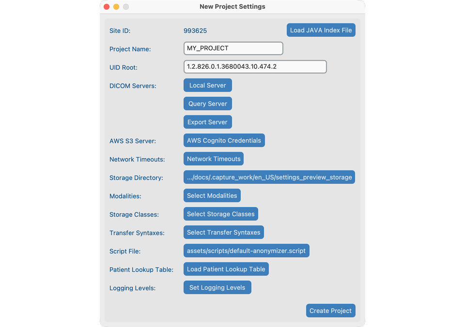
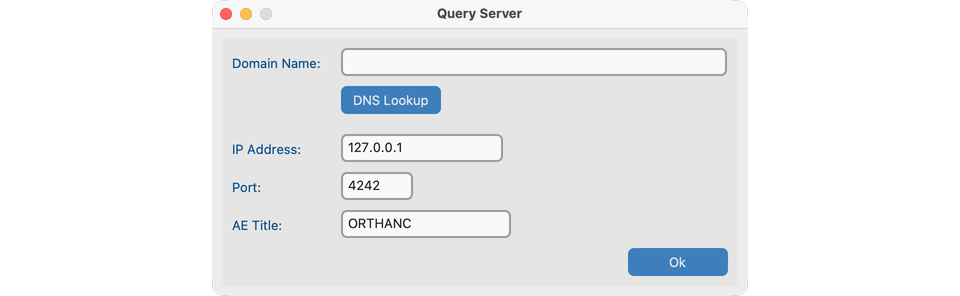
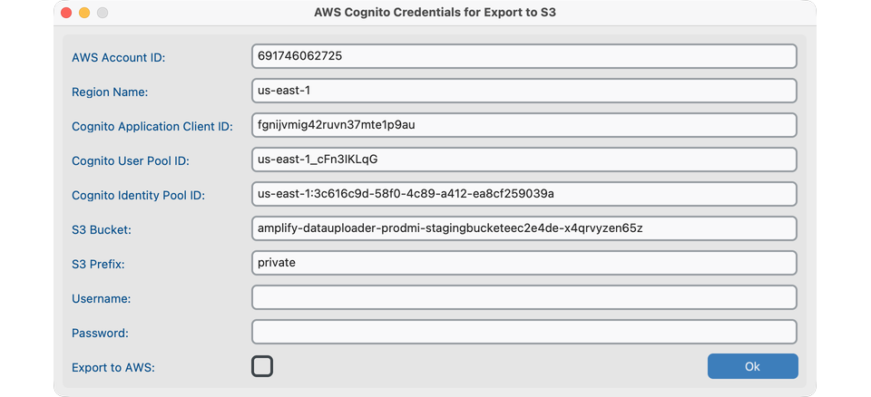
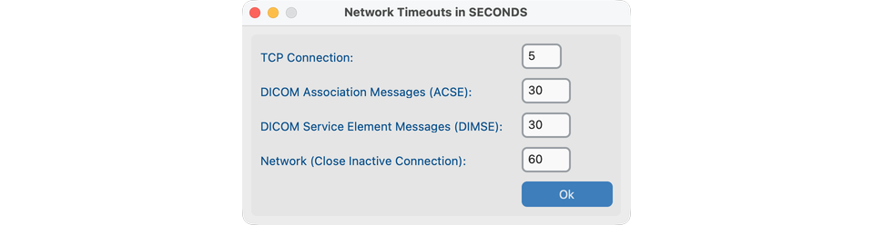
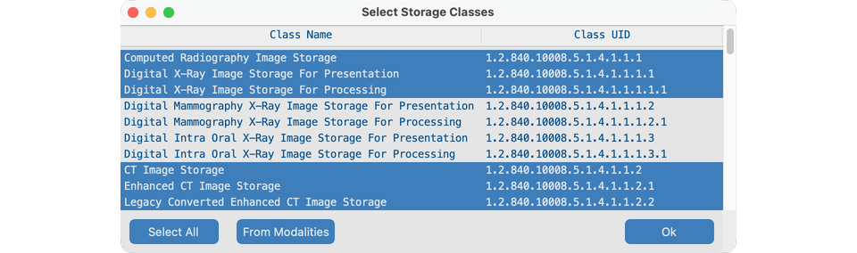
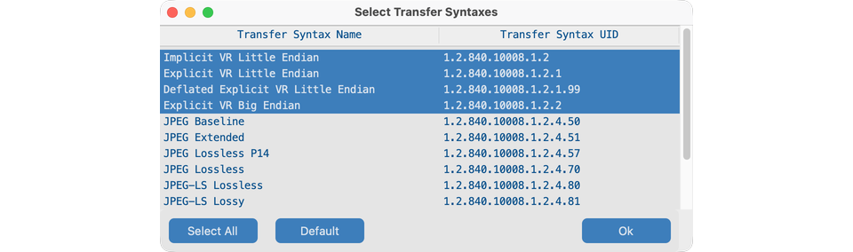
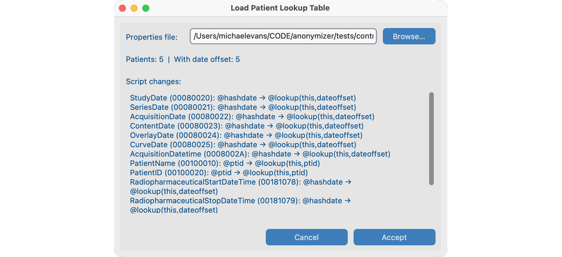
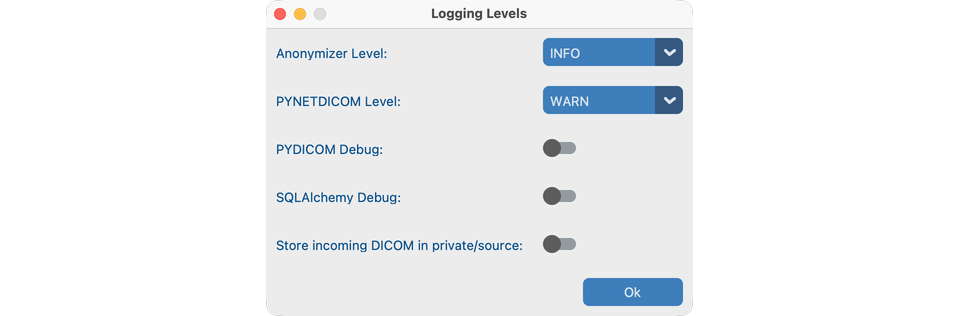
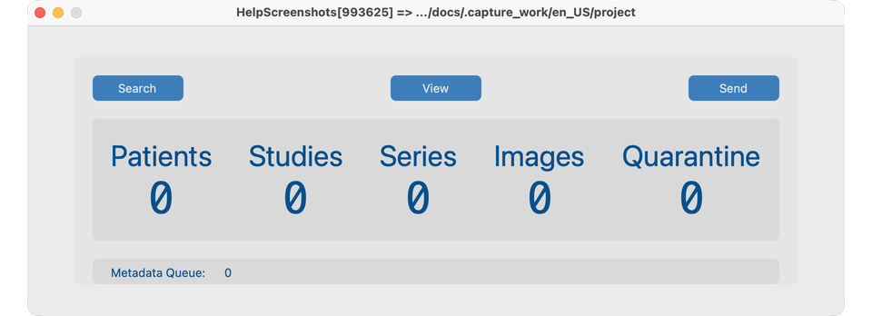

# Create a project

A **project** keeps settings and anonymized storage together. Create it once in the desktop window, even if a server will later run [headless](../10-headless/).

## Goal

Open a clean project with a storage folder and site identity ready for import.

## Create a new project

1. From **File → New Project**, open **New Project Settings**.
2. Choose a **Project Name** (short, under 16 characters) and confirm the **Storage Directory**.
3. Review Site ID and UID Root (usually leave defaults unless continuing a Java Anonymizer site).
4. Confirm modalities and network settings with IT if you will query a PACS.
5. Save / create the project. The **Dashboard** opens.

## Everyday project actions

| Action         | How                                                                                                  |
| -------------- | ---------------------------------------------------------------------------------------------------- |
| Close          | **File → Close Project** or close the window                                                         |
| Re-open        | **File → Open Recent**                                                                               |
| Clone settings | **File → Clone** into a new storage folder (no images copied). Keep UID Root unique across projects. |

## What good looks like

- Dashboard shows your project name and Site ID.
- Storage directory exists and is writable.
- You can open the currently curated **Dataset** (empty until you import) by clicking **View**.

## When you talk to IT

Share these ideas (details live in Project Settings dialogs):

- **Local server** — address, port, and AE Title this computer uses to **receive** images.
- **Query server** — the hospital archive you search and retrieve from.
- **Export server** or **AWS** — where anonymized studies will be sent.
- **Modalities / storage classes / transfer syntaxes** — which image types are allowed.
- **Network timeouts** — how long to wait for slow archives.
- **Patient lookup table** — optional CTP `.properties` mapping for PatientID and Date shift (see [Lookup table](#patient-lookup-table)).

If the project will live on a lab server, continue with [Run headless](../10-headless/).

## Project Settings (every control)

Open **File → Project Settings** (or New Project Settings when creating). Configure these before Search / Send:

### Local Server

Address, port, and AE Title this computer uses to **receive** images.

### Query Server

Hospital archive used by Dashboard **Search**.

### Export Server

DICOM destination used when you **Send** (settings label may still say Export Server).

### AWS Cognito (optional)

Credentials for S3 Send when enabled.

### Network Timeouts

How long to wait for slow archives.

### Modalities / Storage Classes / Transfer Syntaxes

Which image types and encodings are allowed.

### Patient Lookup Table

Optional CTP `.properties` mapping of PHI patient IDs to anonymized IDs and date offsets. Browse → preview → Accept.

### Logging Levels

Raise anonymizer / network logging when troubleshooting with IT.

## Dashboard after create

The Dashboard exposes the main workflow buttons: **Search**, **View**, and **Send**.

## If it fails

- Storage path not writable → choose another folder.
- Name too long → shorten project name.
- Cloning warning about UID Root → use a unique root per project to avoid ID clashes.

## Next steps

Continue with [Search](../06-search/) to import studies into the project.

