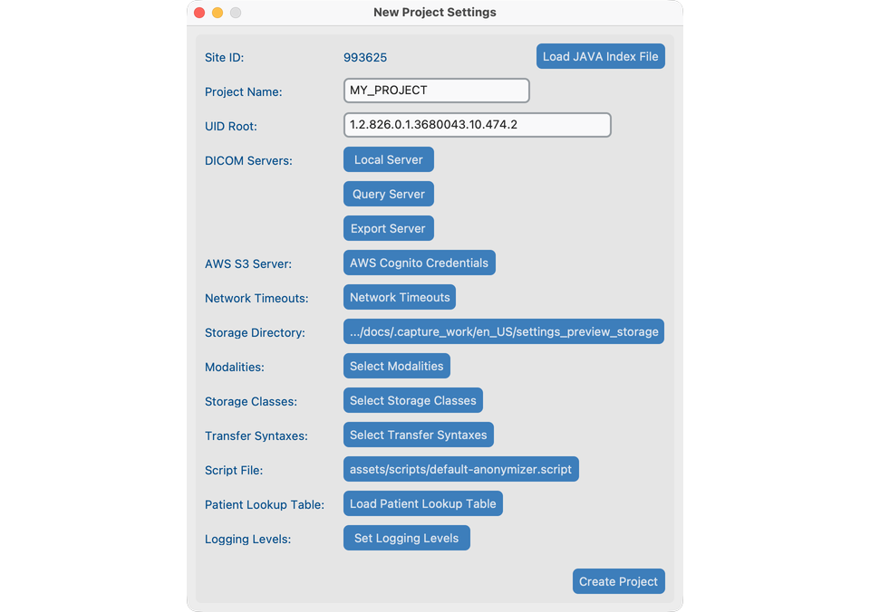
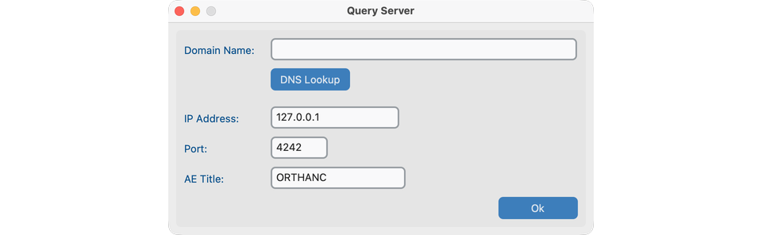
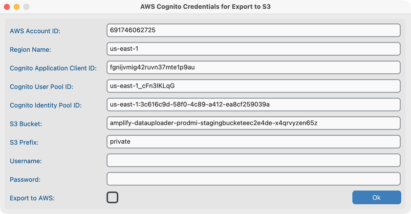
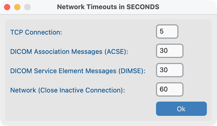
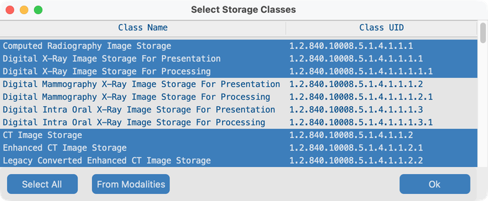
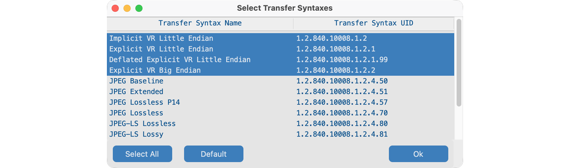
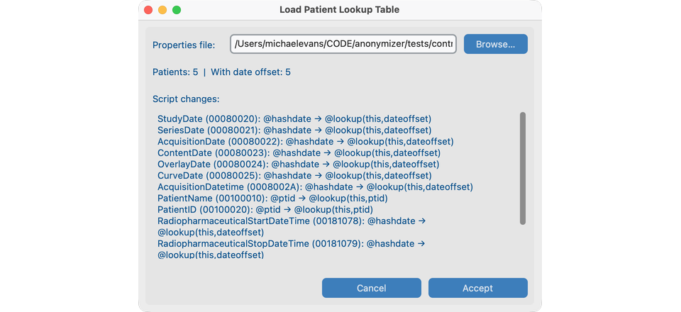
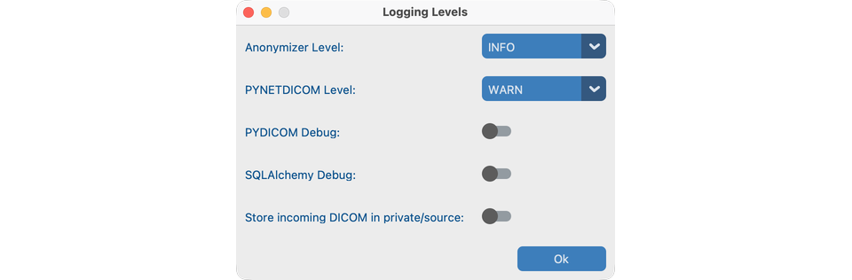
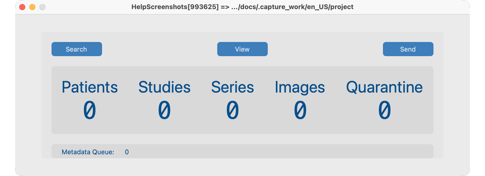

# Create a project

A **project** keeps settings and anonymized storage together. Create it once in the desktop window, even if a server will later run [headless](../10-headless/).

## Goal

Open a clean project with a storage folder and site identity ready for import.

## Create a new project

1. From **File → New Project**, open **New Project Settings**.
2. Choose a **Project Name** (short, under 16 characters) and confirm the **Storage Directory**.
3. Review Site ID and UID Root (usually leave defaults unless continuing a Java Anonymizer site).
4. Confirm modalities and network settings with IT if you will query a PACS.
5. Save / create the project. The **Dashboard** opens.



## Everyday project actions


| Action         | How                                                                                                  |
| -------------- | ---------------------------------------------------------------------------------------------------- |
| Close          | **File → Close Project** or close the window                                                         |
| Re-open        | **File → Open Recent**                                                                               |
| Clone settings | **File → Clone** into a new storage folder (no images copied). Keep UID Root unique across projects. |


## What good looks like

- Dashboard shows your project name and Site ID.
- Storage directory exists and is writable.
- You can open the currently curated **Dataset** (empty until you import) by clicking **View**.


## When you talk to IT

Share these ideas (details live in Project Settings dialogs):

- **Local server** — address, port, and AE Title this computer uses to **receive** images.
- **Query server** — the hospital archive you search and retrieve from.
- **Export server** or **AWS** — where anonymized studies will be sent.
- **Modalities / storage classes / transfer syntaxes** — which image types are allowed.
- **Network timeouts** — how long to wait for slow archives.
- **Anonymizer script** — which DICOM tags are kept, removed, or transformed (see [Anonymizer Script Editor](#anonymizer-script-editor)).
- **Patient lookup table** — optional CTP `.properties` mapping for PatientID and Date shift (loaded from the [Anonymizer Script Editor](#anonymizer-script-editor)).

If the project will live on a lab server, continue with [Run headless](../10-headless/).

## Project Settings (every control)

Open **File → Project Settings** (or New Project Settings when creating). Configure these before Search / Send:

### Local Server

Address, port, and AE Title this computer uses to **receive** images.


### Query Server

Hospital archive used by Dashboard **Search**.



For remotes that speak **DICOMweb**, open the Query Server dialog and enable **DICOMweb**. Enter the **HTTP Port**, **Path** (for example `/dicom-web`), optional **Use HTTPS**, and optional username/password. Search then uses QIDO-RS and import uses WADO-RS. The DIMSE port and AE Title remain for **Echo** and dual-stack servers. Echo still uses DIMSE.

### Export Server

DICOM destination used when you **Send** (settings label may still say Export Server).


When **DICOMweb** is enabled on the Export Server, Send uses STOW-RS instead of C-STORE.

### AWS Cognito (optional)

Credentials for S3 Send when enabled.



### Network Timeouts

How long to wait for slow archives.



### Modalities / Storage Classes / Transfer Syntaxes

Which image types and encodings are allowed.





### Anonymizer Script Editor

The project **anonymizer script** is a CTP-compatible XML file that lists every DICOM tag the Anonymizer knows about and what to do with it. The packaged default follows the DICOM Basic Application Confidentiality Profile described in [De-identification protocol](../deidentification-protocol.md).

Open **File → Project Settings** (or New Project Settings), then click **Edit Anonymizer Script**. The editor loads the packaged default until you Accept; after that it opens your project-private copy and shows its path at the top of the dialog.

#### Views

| View | What you see |
| --- | --- |
| **Active** (default) | Tags that are **kept** or **transformed** (not `@remove()`). This is the list that matters day to day — about 1.5k rows instead of the full ~4.6k. |
| **Removed** | Tags marked `@remove()` (deleted on anonymize). |
| **All** | Every tag rule in the script. |

Search and the **Operand** filter apply inside the current view.

#### Change a rule

1. Select a row in the list. Operands are shown in script syntax (for example `@keep`, `@remove()`, `@uid`, `@always()YES`).
2. To learn about an operand without changing the script, use the toolbar **Operand** filter or the detail **Operand** dropdown — **How this operand works** updates immediately. Assignment only happens when you click **Apply**.
3. If the operand needs a parameter, **Apply** prompts for the value with units and meaning. Use **Change parameter** to edit it later on a rule that already uses that operand:
   - **@round(this,n)** — age band width in whole years
   - **@always()** — fixed replacement text (CTP style, e.g. `YES`). Stores as `@always()YES`. Bare literals such as `YES` in older scripts are the same operand and remain valid.
   - **@incrementdate(this,n)** — fixed day offset (CTP DATEINC). Prompted when you apply the operand (default 365). Because DATEINC is trial-wide, confirming applies the same `@incrementdate(this,n)` to every date-shift field in the script (for example all `@hashdate` rules), and the prompt lists those fields.
   - **@rebasedate(this,origin)** — epoch ORIGIN as YYYYMMDD (default `19600101`). Prompted when you apply the operand; if basedates are not loaded, Apply opens the lookup-table dialog first.
   - **@lookup(this,ptid)** / **@lookup(this,dateoffset)** — if the required lookup table (or dateoffset rows) is not loaded, Apply opens the lookup-table dialog first.
4. Choosing **@remove()** (then Apply) demotes the tag out of the Active view (it stays in the script as `@remove()`).

#### Longitudinal dates (TCIA-style)

All date-shift strategies preserve intervals between a patient's studies. When any of them runs, the anonymizer sets `(0028,0303) LongitudinalTemporalInformationModified = MODIFIED` (DICOM option 113107).

| Strategy | Operand | When to use |
| --- | --- | --- |
| Patient hash | `@hashdate` (default script) | No mapping table; deterministic per-patient offset |
| Lookup offset | `@lookup(this,dateoffset)` | Controlled per-patient offset from site `.properties` |
| Trial-wide offset | `@incrementdate(this,n)` | Same DATEINC for every patient (`n` set in the script editor) |
| Epoch rebase | `@rebasedate(this,origin)` | TCIA/NCTN style: `origin + (date − basedate)`; needs `basedate/` rows |

Lookup `.properties` may include registration/event dates:

```text
ptid/MRN-1=SITE-0001
basedate/MRN-1=20180327
```

With basedates loaded, `@rebasedate(this,origin)` appears in the operand list. Anonymize also writes `(0012,0052)` / `(0012,0053)=REGISTRATION` from PHI StudyDate − basedate.

#### Add a missing tag

If the script is missing any DICOM dictionary tags, **Add from Dictionary** appears on the bottom bar. Search those missing tags and **Add** one (default `@keep`). When the script already covers the dictionary, the button is hidden.

#### Patient Lookup Table

`@lookup(this,ptid)`, `@lookup(this,dateoffset)`, and `@rebasedate(this,origin)` appear in the operand list. Choosing one and clicking **Apply** opens **Load Patient Lookup Table** when the required table (or dateoffset / basedate entries) is not loaded yet. On a rule that already uses a lookup-dependent operand, use **Load Lookup Table** / **Replace Lookup Table** beside the Operand control.

A CTP/TCIA `.properties` file maps each PHI Patient ID to an anonymized ID, and optionally a per-patient date offset and/or registration basedate:

```text
ptid/MRN-1001=527408-000101
dateoffset/MRN-1001=42
basedate/MRN-1001=20180327
```

Accept stores a private project copy, rewrites matching Patient ID / date rules to `@lookup…`, and enables runtime lookup. With date offsets present, `@lookup(this,dateoffset)` can be applied; with `basedate/` rows, `@rebasedate(this,origin)` can be applied (you are prompted for the ORIGIN date).

!!! note "Existing projects"
    Loading a lookup table does **not** re-anonymize files already in the dataset — they stay unchanged. Patients already imported keep working without a lookup-table row. **New** files whose PHI Patient ID is not in the table are quarantined as **Lookup_Miss** and are not stored.



#### Save

- **Accept** validates operands, writes a private copy under `{storage}/private/{site_id}-anonymizer.script`, reloads the live anonymizer rules, and points the project at that file. The packaged default asset is never overwritten. The dialog shows the project script path once that private copy exists.
- **Revert** reloads the file from disk and discards unsaved edits.
- **Cancel** closes without saving.

### Logging Levels

Raise anonymizer / network logging when troubleshooting with IT.



## Dashboard after create



The Dashboard exposes the main workflow buttons: **Search**, **View**, and **Send**.

## If it fails

- Storage path not writable → choose another folder.
- Name too long → shorten project name.
- Cloning warning about UID Root → use a unique root per project to avoid ID clashes.
- Script editor **Accept** rejected → fix unsupported `@…` operands listed in the error. Empty `@always()` is invalid (supply text, e.g. `@always()YES`). Bare non-`@` literals such as `YES` are accepted as fixed values.

## Next steps

Continue with [Search](../06-search/) to import studies into the project.

