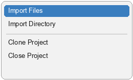
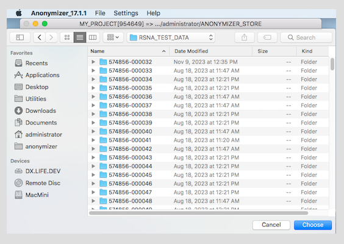
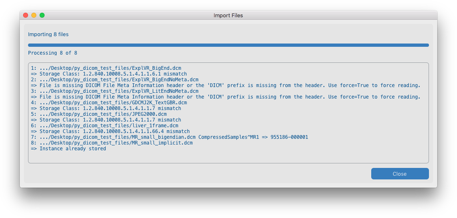
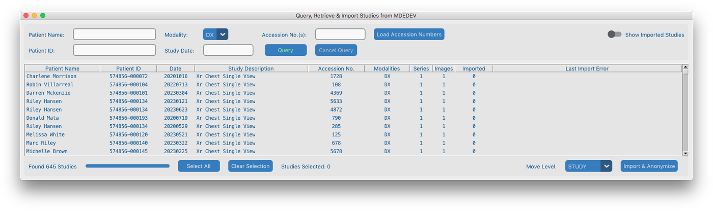
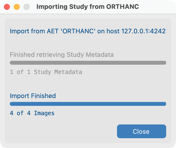
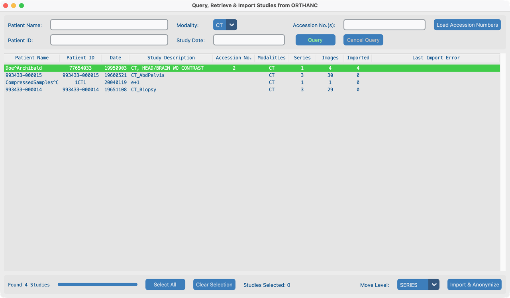

# Search

## Goal

Bring DICOM studies into your project so they are de-identified and listed under **View → Dataset**. You can:

1. **Import from this computer** — files or a folder via the **File** menu.
2. **Search a remote imaging system** — PACS / VNA / Orthanc via Dashboard **Search**.

Configure the [Query Server, modalities, storage classes, and network timeouts](../05-create-project/) before you rely on remote Search.

---

## From a folder or files

### 1. Open Import from the File menu

With a project open, use:

- **File → Import Files** — pick one or more files (default filter is often `.dcm`; you can change it in the file dialog).
- **File → Import Directory** — every file under that folder and its subfolders is attempted, not only `.dcm`.

Already-imported instances (same SOP Instance UID already in this project) are **skipped**, not quarantined.

### 2. Choose a folder (Import Directory)

After **Import Directory**, the OS folder dialog opens. Navigate to your study tree and click **Choose**.

### 3. What must be true for a file to import

A file is accepted only if all of these hold:

1. Valid DICOM Part 10 file with file meta information (including the DICOM preamble).
2. Contains **SOP Class UID**, **Study Instance UID**, **Series Instance UID**, and **SOP Instance UID**.
3. Its storage class is allowed by this project’s [storage classes](../05-create-project/#storage-classes).
4. Protected identity (PHI) can be captured successfully.
5. It has not already been imported into this project.

If a [patient lookup table](../05-create-project/#patient-lookup-table) is required, the PHI Patient ID must also match an entry—or the file is quarantined as **Lookup_Miss**.

### 4. Import `davidson_cxr` (single study demo)

Demo chest X-ray used later in [View](../07-view/) and [Remove Pixel PHI](../08-process/02-remove-burned-in-text/).

Path: `tests/controller/assets/test_dcm_files/davidson_cxr`

1. Choose **File → Import Directory**.
2. Select the `davidson_cxr` folder and click **Choose**.
3. Wait until the **Import Files** dialog finishes and **Close** appears.

A successful line shows an abridged path and **PHI Patient ID → anonymized Patient ID** (for example `…/davidson_cxr_….dcm => 993627-000001`).

### 5. Read the import log (many files)

When you import a larger tree, the same dialog lists **one outcome per file** in the scrollable box:

- **Success:** `path => anonymized Patient ID`
- **Already stored:** skipped (same SOP Instance UID)
- **Failure:** `path` then `=>` and a short reason (invalid DICOM, missing attributes, storage class, PHI capture, lookup miss)

Click **Close** when finished. Dashboard patient / study / image counts update; quarantine counts rise only for rejected files.

### Quarantine

Failed files land under the project’s private quarantine folders (names may appear with spaces or underscores in the UI):

| Folder                             | Typical cause                             |
| ---------------------------------- | ----------------------------------------- |
| `Invalid_DICOM` / DICOM read error | Not valid DICOM, or unreadable            |
| `Missing_Attributes`               | Required UIDs / SOP Class missing         |
| `Invalid_Storage_Class`            | Storage class not enabled for the project |
| `Capture_PHI_Error`                | Could not capture PHI                     |
| `Lookup_Miss`                      | Patient ID not in the lookup table        |

Review quarantine counts on the Dashboard. Fix settings or source files, then import again.

---

## From a remote imaging system (Dashboard **Search**)

### 1. Open Search

On the Dashboard, click **Search**. The app first **C-ECHO**s the configured Query Server. If the echo succeeds, the **Query, Retrieve & Import** window opens.

This window has three bands:

1. **Criteria** — Patient Name, Patient ID, Modality, Study Date, Accession No.(s), **Load Accession Numbers**, **Query** / **Cancel Query**, **Show Imported Studies**.
2. **Results table** — studies returned by C-FIND.
3. **Import bar** — Found count, **Select All** / **Clear Selection**, **Move Level**, **Import & Anonymize**.

!!! tip "Ask IT for help"
    The Query Server must allow this computer to C-ECHO, C-FIND, and C-MOVE, and must know your **Local Server** (address, port, AE Title) as the C-MOVE destination. See [Create a project → When you talk to IT](../05-create-project/#when-you-talk-to-it).

### 2. Search for studies

Enter **at least one** criterion, then click **Query** (or press Return). An empty query is rejected.

| Field                | Notes                                                                                          |
| -------------------- | ---------------------------------------------------------------------------------------------- |
| **Patient Name**     | Letters (including accents), digits, `^` name separator; `?` = one character, `*` = any string |
| **Patient ID**       | ASCII letters/digits; `?` and `*` wildcards                                                    |
| **Modality**         | Dropdown from modalities configured in Project Settings                                        |
| **Study Date**       | One day or a range: `YYYYMMDD` or `YYYYMMDD-YYYYMMDD`                                          |
| **Accession No.(s)** | ASCII, digits, and `/ - _ , .`; `?` and `*` wildcards                                          |

Extra accession options:

- Type a **comma-separated list** in Accession No.(s) to run several searches in one go.
- Use **Load Accession Numbers** to load a `.txt` or `.csv` file (comma- or line-delimited). Confirm before the bulk query runs. Accession numbers that are not found can be written to a text file for follow-up.

Other controls:

- **Show Imported Studies** — when off, studies already in this project are hidden from the results list.
- **Cancel Query** — stops an in-progress query.
- Only studies whose modalities are allowed for the project appear and can be selected.
- Status at the bottom shows **Found N Studies** after a successful query.

### 3. Example: CT query (`Doe^Archibald`)

1. Set **Modality** to **CT**.
2. Click **Query**.
3. Click the **Doe^Archibald** head CT row (dark selection highlight).
4. Confirm **Studies Selected: 1** and choose **Move Level** (often **STUDY** or **SERIES**).

### 4. Select studies and import

1. Select studies: single click, multi-select (**⌘** / **Ctrl**+click), **Select All**, or **Clear Selection**.
2. Choose **Move Level**: **STUDY**, **SERIES**, or **INSTANCE** (DICOM C-MOVE level). Prefer STUDY when the archive supports it; try SERIES or INSTANCE if transfers stall.
3. Click **Import & Anonymize**. The app builds a study hierarchy for the selected move level, then opens the **Import Studies** progress dialog.
4. Progress tracks metadata retrieval, then images received versus the hierarchy. A study finishes when all expected files arrive **or** a [Network Timeout](../05-create-project/#network-timeouts) expires for that transfer.
5. When the dialog shows **Import Finished**, click **Close**.

### 5. Confirm green highlight

Successfully imported studies are **highlighted green** in the Query results list, and the **Imported** column shows how many images landed in the project.

You can select the same studies again after adjusting timeout or move level—already-imported instances are skipped.

### Handling slow or non-ideal archives

Many VNAs move images asynchronously and do not behave like a textbook PACS. If imports are incomplete:

- Lengthen **Network Timeout** in Project Settings.
- Change **Move Level** (Study → Series → Instance) and retry **Import & Anonymize**.
- Confirm with IT that C-MOVE destination matches your Local Server AE Title and that modalities / storage classes allow the studies you expect.

---

## What good looks like

- Studies appear under [View → Dataset](../07-view/).
- Dashboard patient / study / image counts increase; quarantine stays empty or only holds expected rejects.
- Local import dialogs show a clear success or error line per file before you click **Close**.
- Remote imports show green highlighting in Query results after a successful run.
- Status text at the bottom of the Dashboard reflects the last Search or import action.

## If it fails

| Symptom                                   | What to try                                                                         |
| ----------------------------------------- | ----------------------------------------------------------------------------------- |
| Search button stays disabled / echo fails | Query Server offline or blocked; verify address, port, AE Title with IT             |
| Connection error on Query                 | C-ECHO failed—fix Query Server settings or network                                  |
| Empty results                             | Broaden wildcards/date; turn on **Show Imported Studies**; check project modalities |
| Nothing imports from folder               | Storage classes / modalities; valid Part 10 DICOM; Lookup table if required         |
| Lookup_Miss                               | Add the Patient ID to the lookup table or relax lookup requirements                 |
| Partial PACS import                       | Longer Network Timeout; different Move Level; retry selection                       |
| Files ignored with no quarantine          | Already imported (same SOP Instance UID)                                            |

## Next steps

Continue with [View](../07-view/) to browse what you imported.
