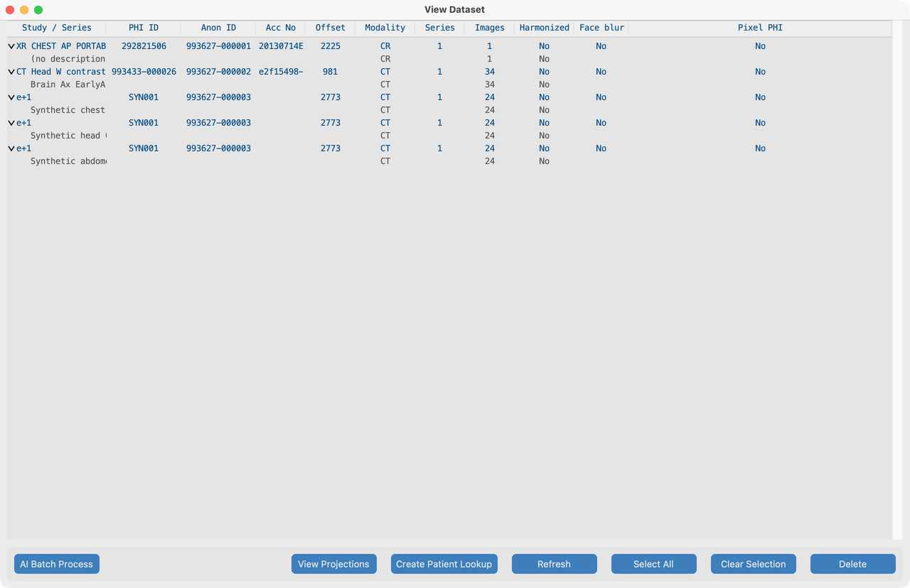

# View

The **Dataset** view lists everything in your project: patients, studies, and series. (Earlier versions called this the PHI Index.)

## Goal

See what you imported, check AI status columns, and open a series for review or Process tools.

## Demo studies

After importing from `tests/controller/assets/test_dcm_files` (see [Search](../05-search/)), Dataset should list multiple studies, including:

| Fixture | Role in the manual |
| --- | --- |
| **`davidson_cxr`** | Review here; burned-in text demo in [7.2](../07-process/02-remove-burned-in-text/) |
| **`Brain_Ax_EarlyArt`** | Harmonize / face blur in [7.3](../07-process/03-harmonize-names/) and [7.4](../07-process/04-blur-faces/) |
| Synthetic CT / US folders | Extra rows so the tree shows a realistic multi-study list |

## Open Dataset

1. From the Dashboard, click **View**.
2. Expand each **study** row (triangle) to see nested **series**.
3. Note PHI / anonymized IDs and AI status columns.

## Columns (V19)

| Status | Meaning |
| --- | --- |
| **Harmonized** | Series description standardized (or study-level description applied) |
| **Face blur** | Face de-identification applied |
| **Pixel PHI** | Burned-in text scan / removal recorded |

Cells are centered; PHI and anonymized IDs autosize for readability.

## Common actions

1. Expand a study to inspect series (as in the screenshot above).
2. Open **Series View** on `davidson_cxr` to review pixels (next page).
3. Select studies for [AI Batch Process](../07-process/05-run-on-many-studies/) or Send.
4. Spot-check after AI tools before sending data out.

## What good looks like

- Nested study → series tree matches what you imported from `test_dcm_files`.
- You can count several studies (not an empty list).
- AI columns update after Series View or batch runs.

## If it fails

- Empty list → import first ([Search](../05-search/)).
- Series missing on disk → **Series Not Found**; re-import or check storage path.

## Next steps

1. [Series View](series.md) — review pixels for one series
2. [Process](../07-process/) — AI tools on the studies you imported
