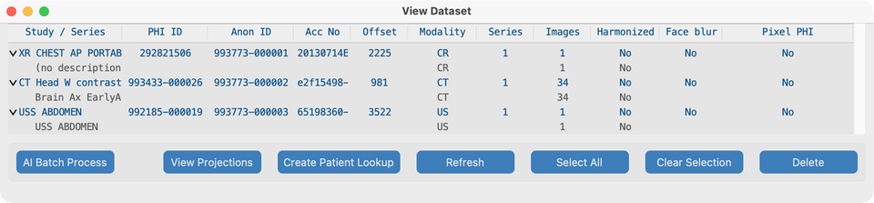
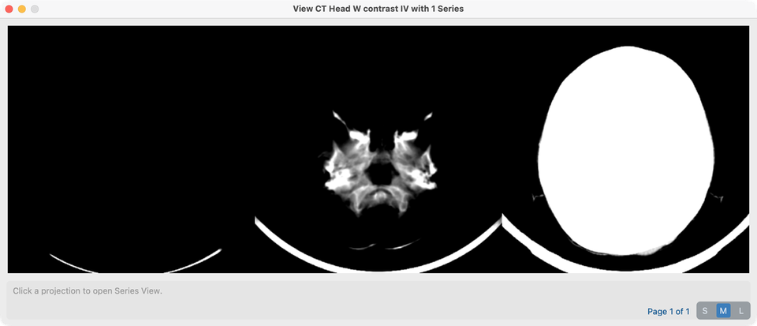
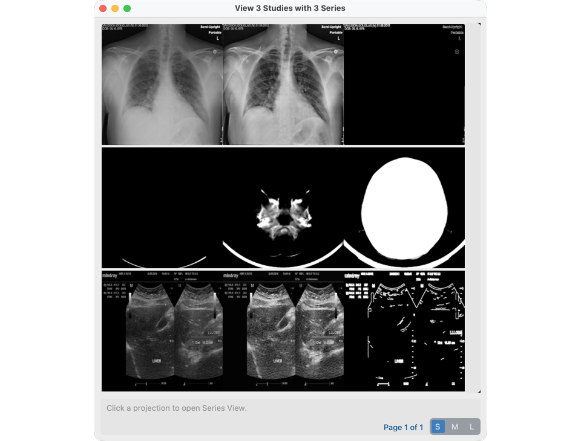
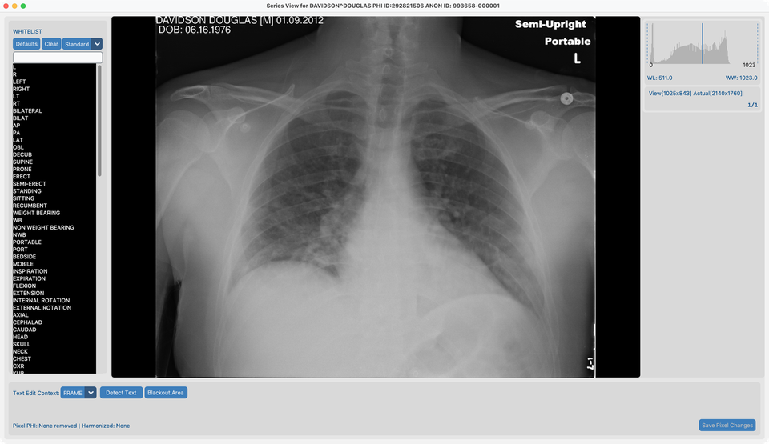
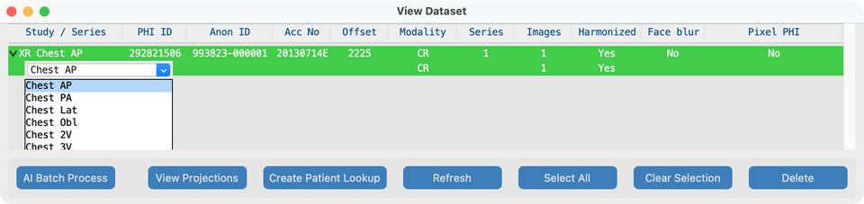
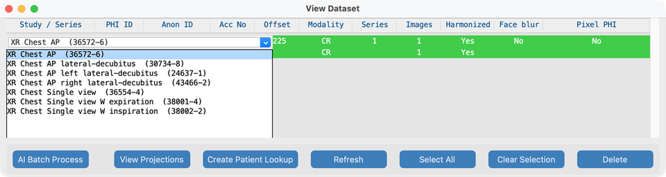
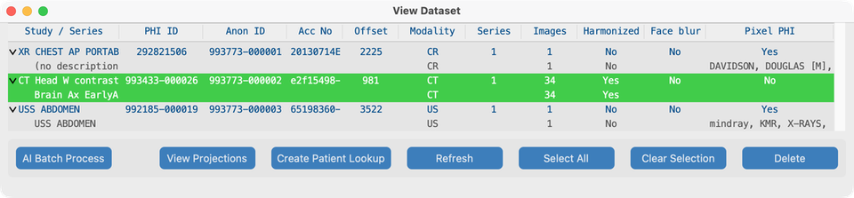
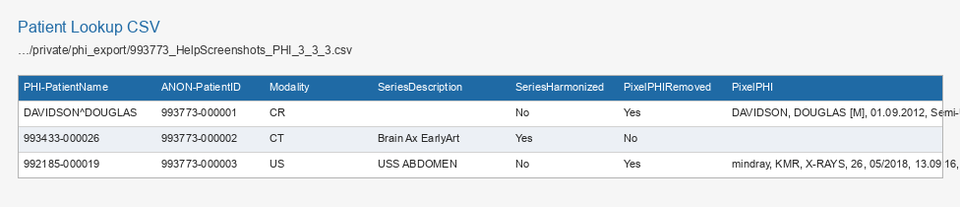

# View

Dashboard **View** opens the **Dataset** — the list of everything in your project (patients, studies, and series). From Dataset you open **study projections** or a full **Series View** to review pixels and run Process tools.

(Earlier versions called Dataset the PHI Index.)

## Goal

See what you imported, check AI status columns, open projections for a study, open a series for review or [Process](../08-process/) tools, and export a **Patient Lookup** CSV when needed.

## Demo studies

After importing from `tests/controller/assets/test_dcm_files` (see [Search](../06-search/)), Dataset should list these three studies (help shots do **not** use synthetic phantoms):

| Fixture | Role in the manual |
| --- | --- |
| **`davidson_cxr`** | Open in Series View here; burned-in text in [Remove Pixel PHI](../08-process/02-remove-burned-in-text/) |
| **`CT_Head_With_Contrast`** | [Harmonize](../08-process/03-harmonize-names/) and [Face blur](../08-process/04-blur-faces/) |
| **`us_rgb_single_frame`** | Ultrasound single-frame; burned-in overlays in [Remove Pixel PHI](../08-process/02-remove-burned-in-text/) (exclude-area demos) |

## Open Dataset

1. From the Dashboard, click **View**.
2. Expand a **study** row (triangle) to see nested **series**.
3. Note PHI / anonymized IDs and the AI status columns.

### Columns (V19)

| Status | Meaning |
| --- | --- |
| **Harmonized** | Series description standardized (or study-level description applied) |
| **Face blur** | Face de-identification applied |
| **Pixel PHI** | Burned-in text scan / removal recorded |

## Right-click in Dataset (most important)

Hover tips on the tree say what a right-click will do. Selection follows the row under the pointer.

**Left-click** the study or series **description** (first column) only when that row is already **harmonized** (green) — see [Edit harmonized descriptions](#edit-harmonized-descriptions) below. Use **Shift** or **Cmd/Ctrl+Click** to multi-select studies without opening the description menu.

### Right-click a **study** → View Projections

Right-click a **study** row (not a nested series) to open **Projection View** for that study.

- You see summary projection images for each series in the study (useful to scan a multi-series exam quickly).
- Click a projection tile when you want to jump into full **Series View** for that series.

### Multiple studies → View Projections

To browse several exams at once:

1. In Dataset, select two or more **study** rows (Shift+Click and/or Cmd/Ctrl+Click), or use **Select All**.
2. Click **View Projections** in the Dataset toolbar.

The window title becomes **View N Studies with M Series** (and **over P Pages** when the grid needs paging). Each series still gets one projection tile.

### Projection tiles, S / M / L, and how they are built

Each tile is a strip of **three** preview images for one series:

| Series type | Left | Center | Right |
| --- | --- | --- | --- |
| **Multi-frame** (e.g. CT stack) | **Min** intensity across frames | **Mean** | **Max** |
| **Single-frame** (e.g. CXR, many US) | Grayscale | **CLAHE** contrast | **Edge** (Canny) |

The **S / M / L** control sets how large each of those three panels is drawn (before display scaling):

| Size | Tile panel size | Typical use |
| --- | --- | --- |
| **S** | 200×200 | Fit many series on one page |
| **M** | 400×400 | Default help / review size |
| **L** | 800×800 | Inspect anatomy in the strip |

Changing size recalculates how many tiles fit per page and may add a page slider. Click any tile to open that series in **Series View**.

**What happens when a projection is created**

1. The app looks for a cached `Projection.pkl` next to the series files.
2. On a cache hit, it loads that object and draws the three images (resized to S/M/L).
3. On a miss, it loads every frame in the series, computes the three images above (windowed for multi-frame), writes `Projection.pkl`, then draws the tile.
4. Pixel edits that change the series on disk invalidate the cache so the next open rebuilds from current pixels.

This Dataset **View Projections** window is separate from the slice / min / mean / max modes inside Series View.

### Right-click a **series** → Series View

1. Expand the study that contains the series (for example `davidson_cxr`).
2. **Right-click the series row** (not the study row).
3. **Series View** opens and loads the images.

That is the main way to open a series for review and for Process tools (Remove Pixel PHI, Harmonize, Face blur).

## Edit harmonized descriptions

After [Harmonize](../08-process/03-harmonize-names/) (Series View or [AI Batch](../08-process/05-run-on-many-studies/)), green **Harmonized** rows show the standardized name in the first column. You can change that name from Dataset without re-running analysis.

Click only **harmonized** (green) descriptions. Non-harmonized rows are not editable this way. **Esc** or click away cancels. Multi-select is unchanged: **Shift+Click** and **Cmd/Ctrl+Click** only change selection — they do not open the menu.

### Series description (RadLex)

1. Expand the study and click the **series** description in the first column.
2. Choose a RadLex / Playbook-style alternative for **that modality** (for example XR views: Chest AP → PA / Lat / Obl / 2V; CT/MR: plane or contrast swaps).
3. The tree refreshes when you pick a value.

### Study description (LOINC)

1. Click the **study** description in the first column (the parent row).
2. Choose a **LOINC** Long Common Name for **that modality prefix** (XR / US / MG / CT / MR). Each option is shown as `Long Common Name  (LoincNumber)`.
3. The list is ranked from the study’s harmonized series names (and view count for CXR when known), then padded from the same modality’s LOINC catalog — not from other studies in the project.
4. Applying a choice updates Study Description (and Procedure Code Sequence when a LOINC number is present).

## Series View — what you can do

Series View is where you look at pixels and run per-series tools (models must be ready — see [AI Features setup](../03-ai-features-setup/)):

- Scroll frames; use the histogram and toolbars as needed
- **Detect / remove burned-in text** (OCR) and whitelist editing → [Remove Pixel PHI](../08-process/02-remove-burned-in-text/)
- **Harmonize Description** → [Harmonize names](../08-process/03-harmonize-names/)
- **Face blur** (when eligible) → [Blur faces](../08-process/04-blur-faces/)
- **Segmentation latch** overlays from cached anatomy masks (after Harmonize)
- Manual blackout rectangles
- Clear analysis cache (does not by itself rewrite DICOM pixels)

Inside Series View, multi-frame series can also show **slice / min / mean / max** projection modes in the viewer (same idea as the multi-frame strip above, but for interactive scrolling).

## Other Dataset actions

- Select studies for [AI Batch Process](../08-process/05-run-on-many-studies/) or [Send](../09-send/)
- Spot-check AI status columns after Series View or batch runs
- **Create Patient Lookup** CSV (below)

## Create Patient Lookup CSV

Use Dataset to export a spreadsheet that maps PHI identifiers to anonymized IDs (and series AI status). This is separate from the optional [CTP Patient Lookup Table](../05-create-project/#patient-lookup-table) used at import time.

### When to use it

- Hand a mapping file to the receiving site or study coordinator
- Audit which series were harmonized, face-blurred, or had pixel PHI removed
- Keep a durable copy under the project’s private storage

### Steps

1. Open **Dataset** from the Dashboard (**View**).
2. Click **Create Patient Lookup** in the Dataset toolbar (no study selection required — the CSV covers the whole project index). Prefer exporting after [Process](../08-process/) so AI status columns are populated.

3. On success, a dialog shows the saved path. Files are written under:

   `…/<project>/private/phi_export/`

   Filename pattern:

   `{site_id}_{project_name}_PHI_{patients}_{studies}_{series}.csv`

4. Open the CSV in a spreadsheet. **One row per series** (study and patient fields are repeated on each series row). Studies with no series still emit one row with empty series columns. Help examples use **davidson CXR**, **CT head** (`CT_Head_With_Contrast`), and **ultrasound single-frame** (not synthetic phantoms).

### Columns (summary)

| Group | Examples |
| --- | --- |
| Anonymized IDs | `ANON-PatientID`, `ANON-PatientName`, `ANON-StudyUID`, `ANON-SeriesUID`, `ANON-AccNo` |
| PHI counterparts | `PHI-PatientName`, `PHI-PatientID`, `PHI-StudyDate`, `PHI-StudyUID`, `PHI-AccNo` |
| Study / series | `DateOffset`, `Series`, `StudyInstances`, `Modality`, `SeriesDescription`, `Instances` |
| AI status | `SeriesHarmonized`, `FaceBlurred`, `PixelPHIRemoved`, `PixelPHI` |

## What good looks like

- Nested study → series tree matches what you imported (`davidson_cxr`, `CT_Head_With_Contrast`, `us_rgb_single_frame`).
- Right-click study opens projections; multi-select + **View Projections** opens all selected studies; right-click series opens Series View.
- Clicking a **harmonized** (green) **series** description opens RadLex alternatives; clicking a **study** description opens LOINC options for that modality; modifier clicks keep multi-select.
- **S / M / L** changes tile size; first open may build `Projection.pkl` under each series.
- `davidson_cxr` loads and scrolls in Series View.
- AI columns update after Process tools.
- **Create Patient Lookup** writes a CSV under `private/phi_export/` that opens with the expected columns.

## If it fails

- Empty list → import first ([Search](../06-search/)).
- Series missing on disk → **Series Not Found**; re-import or check storage path.
- Tools greyed out in Series View → download models / accept license in [AI Features](../03-ai-features-setup/).
- Harmonize already running → finish or cancel the other series first.
- Create Patient Lookup error → ensure the project has studies in the Dataset index and that `private/phi_export/` is writable.

## Next steps

Continue with [Process](../08-process/) — Remove Pixel PHI, Harmonize, Face blur, and batch. After review, [Send](../09-send/) anonymized patients.
