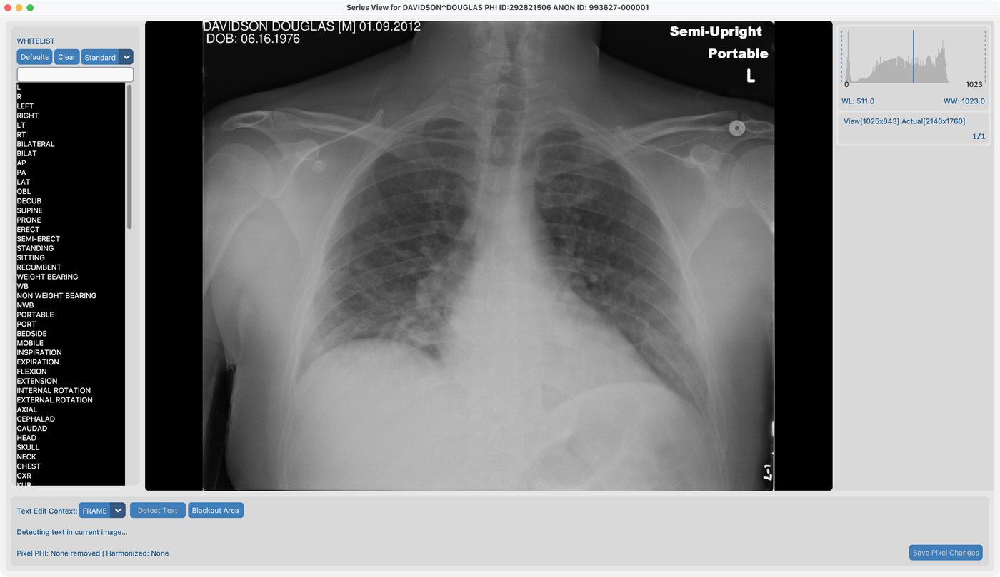

# 8.1 Remove Pixel PHI

Some images have **patient names or labels drawn onto the pixels**. Cleaning DICOM tags alone does not remove them.

## Demo series

**`davidson_cxr`** — `tests/controller/assets/test_dcm_files/davidson_cxr` (non-synthetic chest X-ray).

Import this folder (or the parent `test_dcm_files` tree) into your project, then open the series in **Series View**.

## Goal

On `davidson_cxr`, detect burned-in text with OCR and remove it while keeping useful markers via the default whitelist.

## Before you start

1. Complete [AI Features setup](../../03-ai-features-setup/) so OCR models are ready.
2. Import **`davidson_cxr`** and open it in Series View from [Dataset](../../07-view/).

## Workflow on `davidson_cxr`

Follow these steps in order. Screenshots match this fixture.

### 1. Default whitelist and Frame context

1. Keep the **default whitelist** (do not clear it).
2. Set edit context to **Frame** (not whole series yet).

### 2. Detect Text

1. Click **Detect Text**.
2. Green rectangles mark candidate text on the frame.

### 3. Review and whitelist keepers

1. Click a green rectangle to **whitelist** text you want to keep (for example orientation markers).
2. Whitelisted items appear in the list on the left.

### 4. Remove Text

1. Choose removal mode: **black out** (recommended for de-identification) or **blend / inpaint**.
2. Run **Remove Text** for the frame.
3. Save pixel changes when prompted.

## After the demo

- Dataset **Pixel PHI** status should update for this series.
- Modality whitelists and match strictness (for example Exact) live in the Series View toolbar / project whitelist files.
- To run the same tool on many studies, see [8.4 Run on many studies](../05-run-on-many-studies/).

## What good looks like

- PHI labels gone on `davidson_cxr`; orientation markers kept if whitelisted.
- **Pixel PHI** column updates in Dataset.

## If it fails

- Many false boxes → tighten match strictness; whitelist keepers.
- Missed text → manual blackout.
- Tools greyed out → finish [AI Features](../../03-ai-features-setup/).

## Next steps

Continue with [8.2 Harmonize names](../03-harmonize-names/) using **`Brain_Ax_EarlyArt`**.
