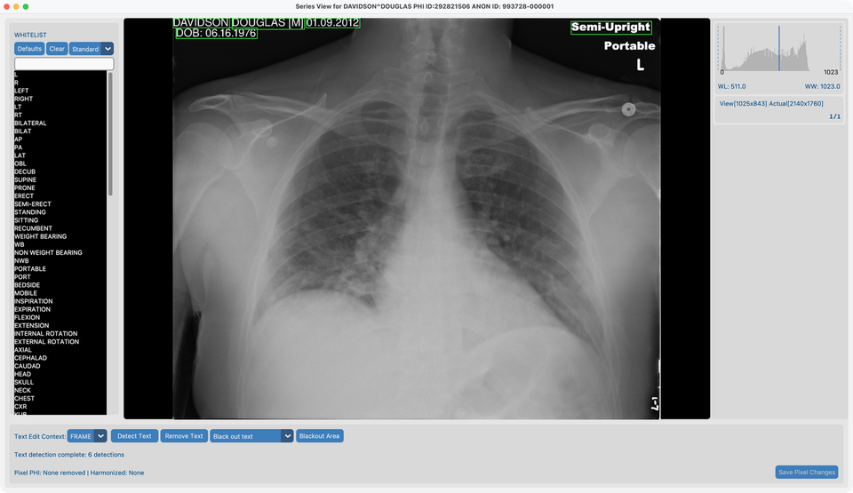
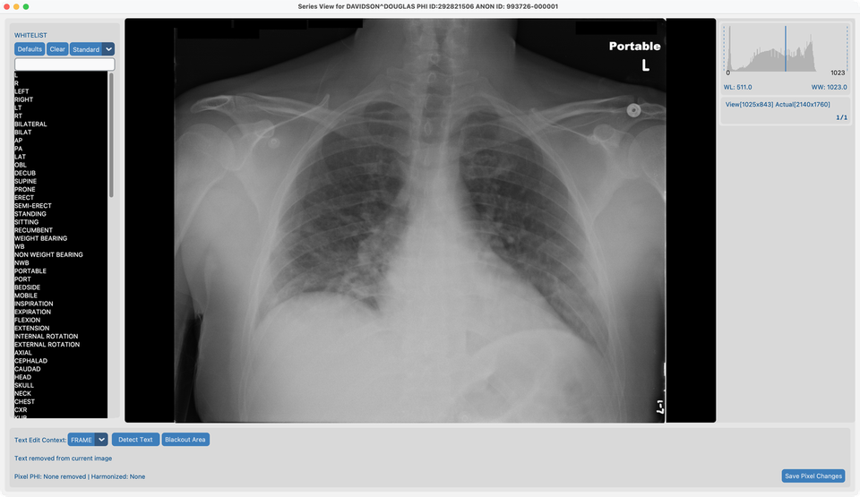
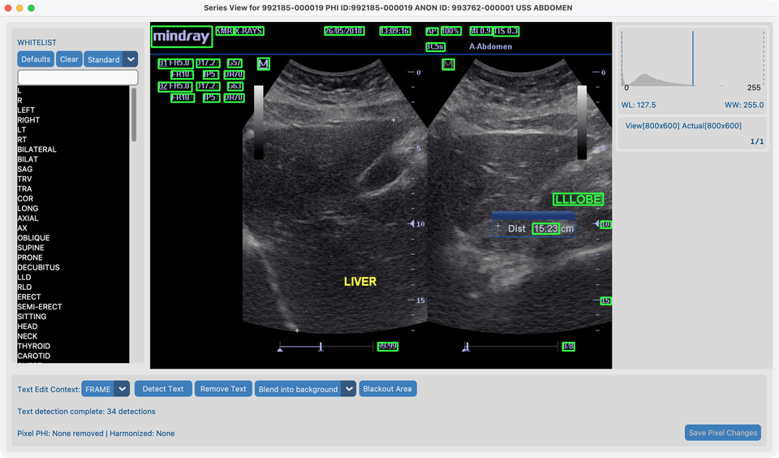
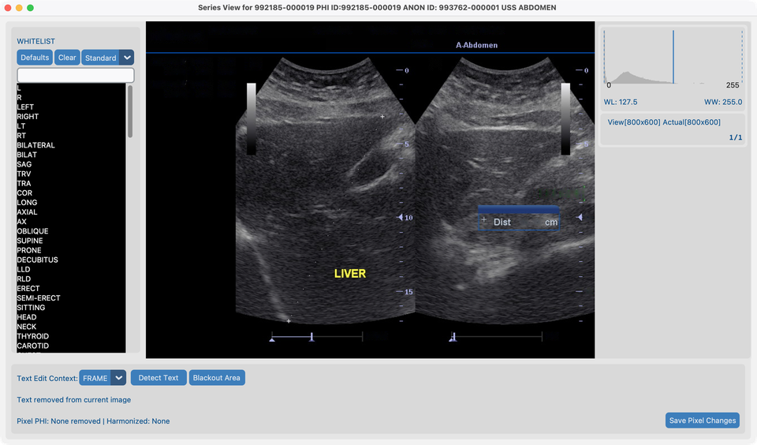
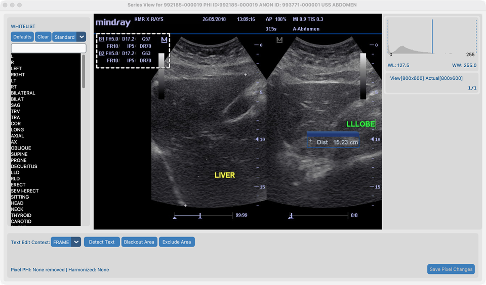
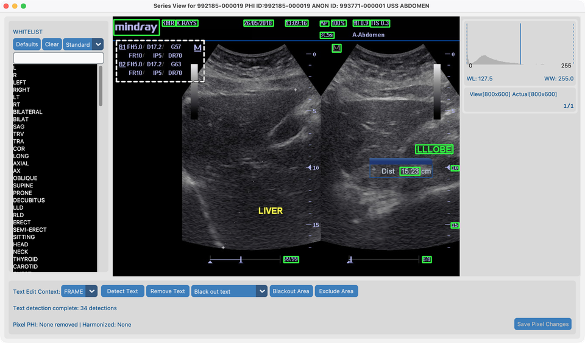

# 8.1 Remove Pixel PHI

Some images have **patient names or labels drawn onto the pixels**. Cleaning DICOM tags alone does not remove them.

## Demo series

| Series | Path | Used for |
| --- | --- | --- |
| **`davidson_cxr`** | `tests/controller/assets/test_dcm_files/davidson_cxr` | Whitelist → Detect → **Black out** |
| **`us_rgb_single_frame`** | `tests/controller/assets/test_dcm_files/us_rgb_single_frame` (`US_RGB_SingleFrame.dcm`) | Detect → **Blend into background**; **Exclude Area** on the machine-parameter block under **mindray** |

Import each folder into your project, then open the series in **Series View**.

## Goal

1. On `davidson_cxr`, detect burned-in text and **black out** PHI while keeping useful markers via the default whitelist.
2. On `us_rgb_single_frame`, detect burned-in text and remove it by **blending into the background** (inpaint).
3. On the same color US series, mark the non-PHI machine-parameter strip with **Exclude Area** so Detect Text and Remove Text skip it.

## Before you start

1. Complete [AI Features setup](../../03-ai-features-setup/) so OCR models are ready.
2. Import the demo series and open them in Series View from [Dataset](../../07-view/).

## Workflow on `davidson_cxr` (black out)

Follow these steps in order. Screenshots match this fixture.

### 1. Default whitelist and Frame context

1. Keep the **default whitelist** (do not clear it).
2. Set edit context to **Frame** (not whole series yet).

### 2. Detect Text

1. Click **Detect Text**.
2. Wait until detection finishes. **Green rectangles** mark text that would be removed.

On this chest X-ray you should see green boxes around the patient name, date, DOB, and similar PHI — but **not** around **Portable** or **L**. Those words are already on the default whitelist, so Detect Text leaves them alone.

**Whitelist match dropdown** (next to Defaults / Clear — here set to **Standard**):

Controls how closely OCR text must match a whitelist entry to be treated as a keeper:

| Setting | Effect |
| --- | --- |
| **Exact** | Only hide text that matches a whitelist entry letter-for-letter |
| **Strict** | Almost exact — tiny OCR mistakes only |
| **Standard** (default) | Allows small OCR errors (for example `AXIL` still matches `AXIAL`) |
| **Lenient** | Most forgiving — better for noisy text and short markers |

Use a stricter setting if too much text is skipped; use a looser one if useful markers keep getting boxed.

### 3. Review and whitelist keepers

1. If a green rectangle covers text you want to **keep**, click that rectangle.
2. The text is added to the whitelist on the left and will not be removed.

On `davidson_cxr`, **Portable** and **L** are already covered by the default whitelist — you usually do not need to add them again.

### 4. Remove Text using black out

1. Set the removal mode dropdown to **Black out text**.
2. Click **Remove Text**.
3. PHI regions become solid black; whitelisted keepers stay.
4. Click **Save Pixel Changes** when you are satisfied.

Black out is the usual choice for de-identification: removed text is clearly gone and cannot be recovered from the pixels.

## Workflow on `us_rgb_single_frame` (blend into background)

Use this color ultrasound frame when you want removed text to look like nearby tissue instead of black bars.

### 5. Remove Text using blend with background

1. Import and open **`us_rgb_single_frame`** (`US_RGB_SingleFrame.dcm`) in Series View.
2. Keep edit context on **Frame**.
3. Set the removal mode dropdown to **Blend into background**.
4. Click **Detect Text** and wait for the green rectangles.

5. Click **Remove Text**.
6. Detected text is painted out by blending with surrounding pixels (inpaint), then **Save Pixel Changes**.

**Black out** vs **Blend into background**: black out replaces text with black; blend fills the area so it matches the image around it. Prefer black out when you need an obvious, irreversible redaction; prefer blend when a less conspicuous result is acceptable (for example some ultrasound overlays).

## Workflow on Color US (Exclude Area)

Use the same **`us_rgb_single_frame`** series when OCR boxes machine settings that are **not PHI**. **Exclude Area** skips a spatial region for Detect Text and Remove Text without changing pixels (unlike **Blackout Area**).

### 6. Exclude the parameter block under mindray

On this frame, a dense block of machine parameters (gain, depth, FR, DR, and similar tokens) sits on the **upper left**, directly **below** the **mindray** logo.

1. Open **`us_rgb_single_frame`** in Series View with edit context **Frame**.
2. Draw a rectangle covering that parameter block (leave **mindray** and true PHI / site labels outside if you still want them detected). Pending draws appear as **solid blue** rectangles.
3. Click **Exclude Area**. The rectangle moves to the exclude list and redraws as a **white dotted outline** (no fill).

4. Click **Detect Text**. Green boxes should appear on PHI / vendor text **outside** the block; the parameter tokens inside the dotted region should **not** be boxed for removal.

5. Optionally choose **Blend into background** or **Black out text**, then **Remove Text** and **Save Pixel Changes**.
6. Click a white dotted rectangle to remove it from the exclude list if you need to adjust.

**Whitelist** vs **Exclude Area** vs **Blackout Area**: whitelist keeps specific OCR *strings*; Exclude Area skips a *region* (no pixel change); Blackout Area paints drawn rectangles black. Prefer setting exclude rectangles **before** Detect Text (or Detect again after adjusting). With **Series** edit context, drawing propagates across frames so the same panel can be excluded on a cine loop.

## After the demo

- Dataset **Pixel PHI** status should update for each series you saved.
- Modality whitelists and the match dropdown (Exact → Lenient) live in Series View; stricter matching means fewer OCR hits are treated as whitelist keepers.
- Exclude regions are for the current Series View session (same as other canvas overlays). Re-open the series and redraw if you need them again.
- To run the same tool on many studies, see [8.4 Run on many studies](../05-run-on-many-studies/).

## What good looks like

- On `davidson_cxr`: PHI blacked out; orientation markers kept if whitelisted.
- On `us_rgb_single_frame`: burned-in labels blended away without solid black bars; with Exclude Area, the mindray parameter block is not removed as PHI.
- **Pixel PHI** column updates in Dataset.

## If it fails

- Many false boxes → tighten match strictness; whitelist keepers; or **Exclude Area** for whole panels.
- Missed text → manual **Blackout Area**.
- Parameter text still boxed → enlarge the exclude rectangle and Detect again; click dotted outlines to delete and redraw.
- Tools greyed out → finish [AI Features](../../03-ai-features-setup/).

## Next steps

Continue with [8.2 Harmonize names](../03-harmonize-names/) using **`CT_Head_With_Contrast`**.
