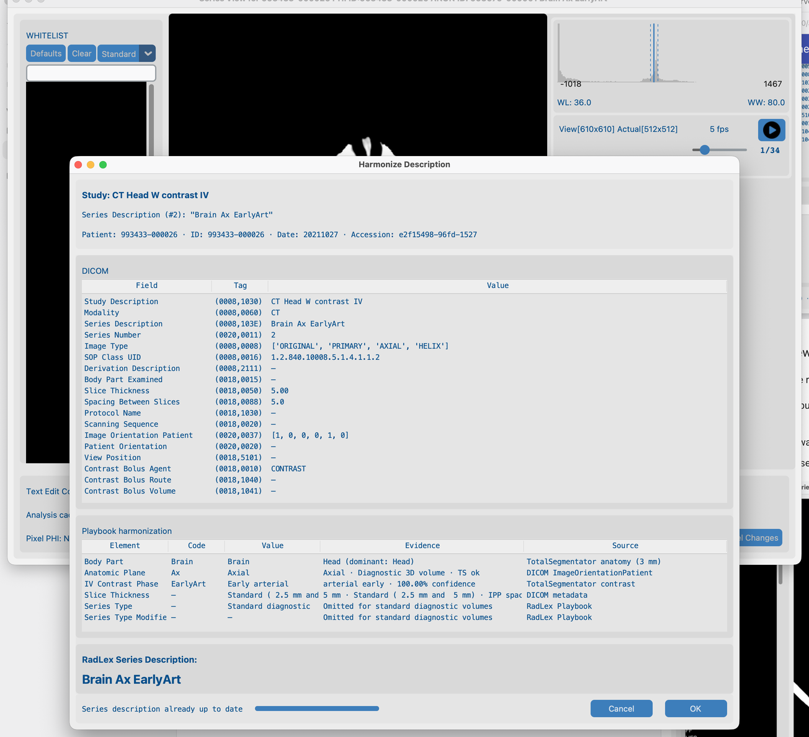
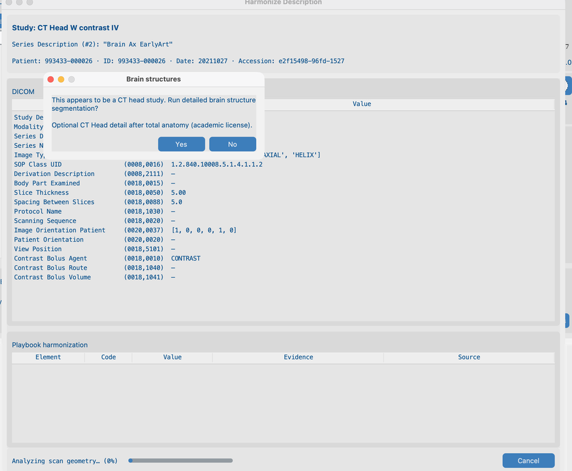
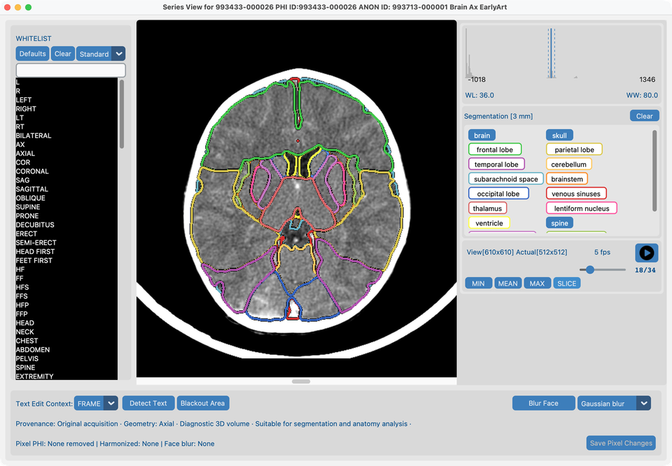
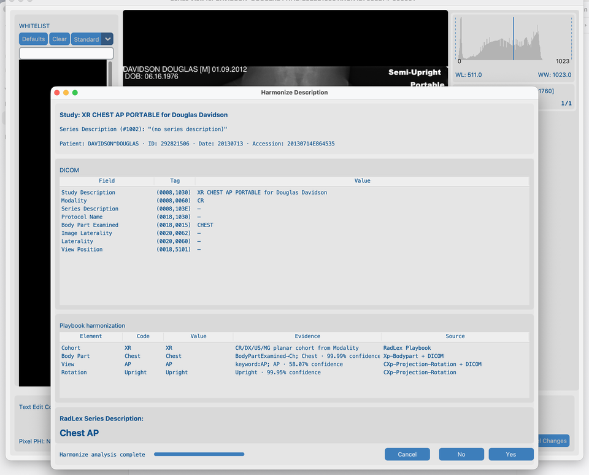
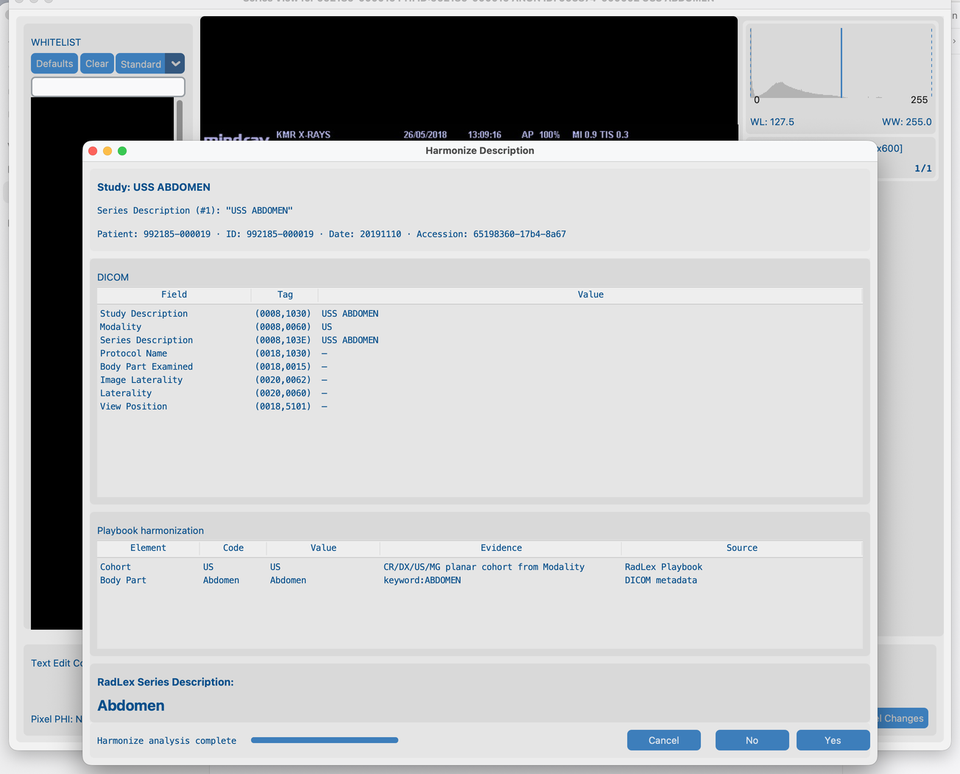

# 8.2 Harmonize names

Research datasets often use inconsistent **Series Description** text. **Harmonize** suggests a standard name from anatomy and (for CT/MR) contrast — RSNA Radiology Playbook / RadLex style. It does **not** change pixels.

## Demo series

| Fixture | Path under `tests/controller/assets/test_dcm_files/` | What it shows |
| --- | --- | --- |
| **`CT_Head_With_Contrast`** | `CT_Head_With_Contrast` | CT path: TotalSegmentator anatomy / contrast, brain-structures prompt, overlays |
| **`davidson_cxr`** | `davidson_cxr` | XR planar path: optional **Xp-Bodypart** + **CXp-Projection-Rotation** |
| **`us_rgb_single_frame`** | `us_rgb_single_frame` | US planar path: DICOM metadata only (no TotalSegmentator) |

Import a series, open it in **Series View**, then run Harmonize. Reuse **`CT_Head_With_Contrast`** in [8.3 Blur faces](../04-blur-faces/).

## Goal

1. On **`CT_Head_With_Contrast`**: run **Harmonize Description**, answer the brain-structures prompt when offered, Apply, then review segmentation overlays on the middle slice.
2. On **`davidson_cxr`** and **`us_rgb_single_frame`**: run Harmonize and read the Playbook table — **Source** names the model or DICOM (same idea as CT’s “TotalSegmentator anatomy”).

## Before you start

1. Complete [AI Features setup](../../03-ai-features-setup/) — Harmonize CT pack, resolution, and Brain structures for the CT demo.
2. Optionally download **XR body part** and **XR chest view** so the CXR demo shows pixel fusion (without them, XR still Harmonizes from DICOM tags).
3. Import the demo series ([Search](../../06-search/)) and open each in **Series View** ([View](../../07-view/) — right-click the series row).

## Workflow on `CT_Head_With_Contrast`

### 1. Harmonize Description (from Series View)

1. With `CT_Head_With_Contrast` open in **Series View**, click **Harmonize Description**.
2. Wait until analysis finishes — the **Playbook harmonization** table fills with anatomy / contrast evidence (not an empty table mid-progress).
3. Review the suggested Series Description, then **Yes** to apply, or **No** / **Cancel**.

The Series View remains behind the dialog so you keep context for the open series.

### 2. Brain structures prompt

On a CT head series, Harmonize asks whether to run **detailed brain structure segmentation** before the job continues:

1. Read the **Brain structures** Yes/No message (academic license / models required — see [AI Features](../../03-ai-features-setup/)).
2. Choose **Yes** to include brain structures in this run, or **No** for standard anatomy only.

### 3. Segmented Series View

After you Accept a Harmonize run that included brain structures (**Yes** on the prompt):

1. Series View shows latch buttons for whole **brain** plus detailed structures (brainstem, lobes, ventricles, …) when the licensed pack ran.
2. Select **all** structures you want to review (including **brain**).
3. Go to the **middle slice** to see overlays on a representative frame.

## Planar Harmonize (XR and US)

CR/DX, ultrasound, and mammography use a **separate** Harmonize path from CT/MR: no TotalSegmentator, no thickness/contrast buckets. The Playbook table still uses **Evidence** (what was measured) and **Source** (where it came from).

### Chest X-ray (`davidson_cxr`)

1. Open **`davidson_cxr`** in Series View → **Harmonize Description**.
2. When XR models are installed, **Body Part** Source is **Xp-Bodypart** (or fused with DICOM); **View** / **Rotation** use **CXp-Projection-Rotation** when anatomy is Chest.
3. Evidence looks like CT classifier rows — e.g. `Chest · 99.00% confidence` — not opaque `pixel:…` tokens.
4. Rotation is analysis-only; SeriesDescription stays e.g. `Chest AP` / `Chest Lat`.

### Ultrasound (`us_rgb_single_frame`)

1. Open **`us_rgb_single_frame`** in Series View → **Harmonize Description**.
2. Cohort / body part / mode come from DICOM tags and keywords; Source is **DICOM metadata** or **RadLex Playbook**.
3. No XR pixel packs and no TotalSegmentator run on US.

## Notes (same as production use)

- Scouts, MIP/VR, dose reports, and similar series are usually skipped.
- **CT:** anatomy segmentation + contrast phase when models allow (TotalSegmentator).
- **MR:** anatomy from MR packs; IV contrast from DICOM headers (TotalSegmentator).
- **XR (CR/DX):** planar Harmonize; optional Xp-Bodypart + chest-only CXp view/rotation (soft downloads).
- **US / MG:** planar Harmonize from DICOM only — **no** TotalSegmentator and **no** XR pixel packs.
- **SC / OT / DOC:** Harmonize is not offered.
- After all series in a study are harmonized, the best **LOINC study description** is applied automatically (same path as AI Batch). Change it later from [Dataset](../../07-view/#edit-harmonized-descriptions). Pure XR/US/MG studies use the matching LOINC prefix.
- In [Dataset](../../07-view/#edit-study-and-series-descriptions), click a study or series description (or multi-select and right-click for **Set description**) to pick LOINC (study) or RadLex (series) names — including for rows not yet green.
- Results cache under the series folder — **Clear Analysis Cache** for a fresh CT/MR run.
- Batch: [8.4 Run on many studies](../05-run-on-many-studies/) (resolution comes from AI Features, not per batch).

## What good looks like

- CT: SeriesDescription looks consistent for this head CT; Dataset **Harmonized** updates; after brain Yes, latch overlays draw on the middle slice.
- CXR: Playbook **Source** names **Xp-Bodypart** / **CXp-Projection-Rotation** (or DICOM) with readable confidence evidence.
- US: Playbook rows cite **DICOM metadata** / **RadLex Playbook**; suggested name matches ultrasound anatomy/mode.

## If it fails

- Not suitable series → expected skip.
- Already harmonized → Clear Analysis Cache to re-run.
- Models not ready → [AI Features](../../03-ai-features-setup/).

## Next steps

Continue with [8.3 Blur faces](../04-blur-faces/) on the **same** `CT_Head_With_Contrast` series (Gaussian).
