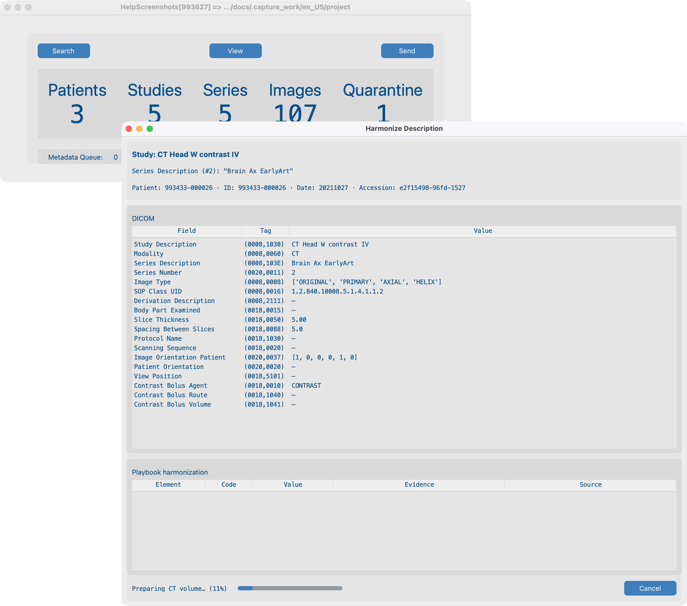
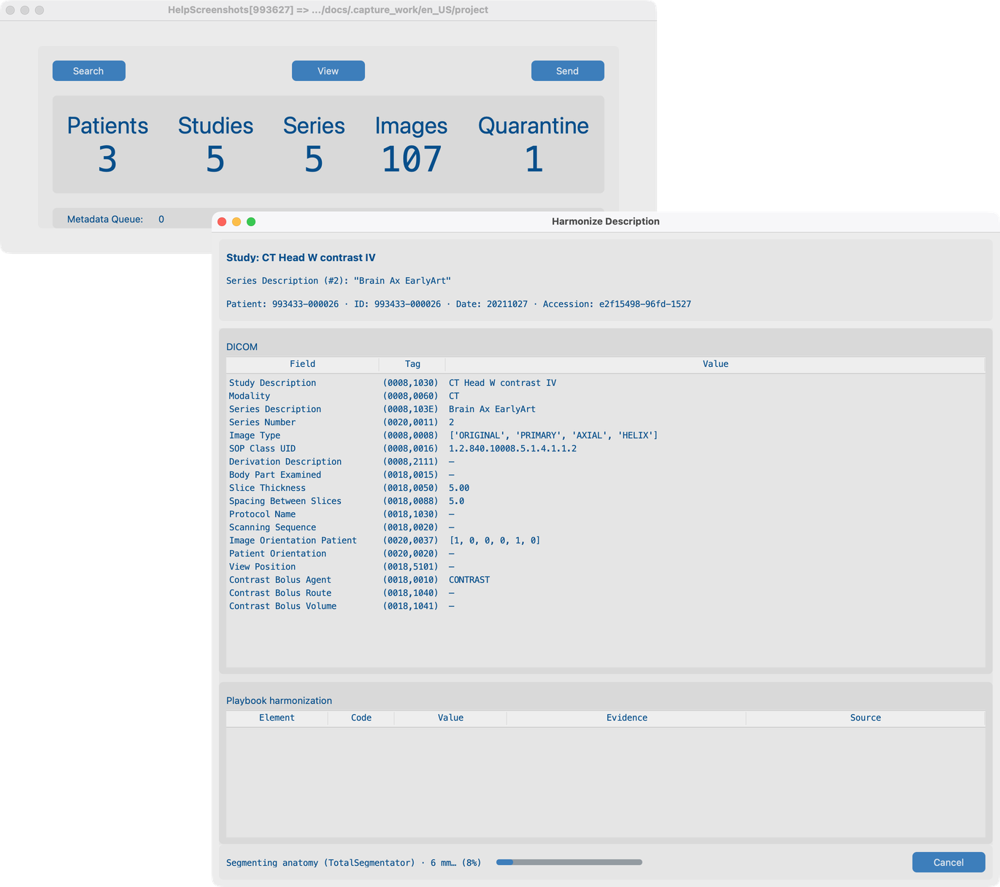

# 8.2 Harmonize names

Research datasets often use inconsistent **Series Description** text. **Harmonize** suggests a standard name from anatomy and contrast (RSNA Radiology Playbook / RadLex style). It does **not** change pixels.

## Demo series

**`Brain_Ax_EarlyArt`** — `tests/controller/assets/test_dcm_files/Brain_Ax_EarlyArt` (non-synthetic head CT).

Import this series, open it in **Series View**, then run Harmonize. The same series is used again in [8.3 Blur faces](../04-blur-faces/).

## Goal

On `Brain_Ax_EarlyArt`, run **Harmonize Description**, then optionally **Segment Brain Features**, and apply a clear SeriesDescription.

## Before you start

1. Complete [AI Features setup](../../03-ai-features-setup/) — Harmonize CT pack, resolution, and optionally Brain structures.
2. Import **`Brain_Ax_EarlyArt`** and open it in Series View.

## Workflow on `Brain_Ax_EarlyArt`

### 1. Harmonize Description

1. Open `Brain_Ax_EarlyArt` in Series View.
2. Click **Harmonize Description**.
3. Review suggested description, regions, contrast / phase evidence, and geometry notes.
4. **Apply** to write the series description, or cancel.

### 2. Segment Brain Features (optional)

1. On the same Harmonize results for this head CT, enable **Segment Brain Features** when offered (licensed pack).
2. Review the extra anatomy detail, then Apply if you want it in the description workflow.

## Notes (same as production use)

- Scouts, MIP/VR, dose reports, and similar series are usually skipped.
- **CT:** anatomy segmentation + contrast phase when models allow.
- **MR:** anatomy from MR packs; IV contrast from DICOM headers.
- After the last CT series in a study is harmonized, a **LOINC study description** may be suggested.
- Results cache under the series folder — **Clear Analysis Cache** for a fresh run.
- Batch: [8.4 Run on many studies](../05-run-on-many-studies/) (resolution comes from AI Features, not per batch).

## What good looks like

- SeriesDescription looks consistent for this head CT.
- Dataset **Harmonized** column updates.

## If it fails

- Not suitable series → expected skip.
- Already harmonized → Clear Analysis Cache to re-run.
- Models not ready → [AI Features](../../03-ai-features-setup/).

## Next steps

Continue with [8.3 Blur faces](../04-blur-faces/) on the **same** `Brain_Ax_EarlyArt` series (Gaussian).
