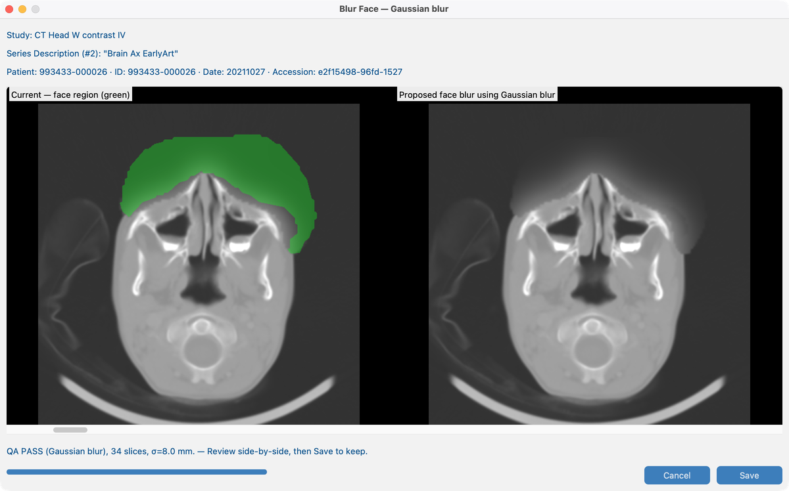

# 8.3 Blur faces

On some **head CT or MR** exams, facial features could allow recognition even after tags are cleaned. **Face de-identify** blurs the face region and lets you review quality before keeping the result.

## Demo series

**`Brain_Ax_EarlyArt`** — same series as [8.2 Harmonize names](../03-harmonize-names/)  
(`tests/controller/assets/test_dcm_files/Brain_Ax_EarlyArt`).

Prefer Harmonize first so anatomy hints improve eligibility, then open face blur on this series.

## Goal

On `Brain_Ax_EarlyArt`, run face blur in **Gaussian** mode, review QA, and save if appropriate.

## Before you start

1. Complete [AI Features setup](../../03-ai-features-setup/) — face models and academic license.
2. Import **`Brain_Ax_EarlyArt`** (and ideally finish Harmonize in 8.2).
3. Open the series in Series View.

## Workflow on `Brain_Ax_EarlyArt` (Gaussian)

1. Open `Brain_Ax_EarlyArt` in Series View.
2. Start **Face blur** / preview.
3. Set blur mode to **Gaussian** (common default for this demo).
4. Review side-by-side: current image vs proposed blur; green outline shows the face region.
5. Check **QA PASS** vs **QA FAIL** (pixels changed outside the mask).
6. **Save** to keep, or discard.

### Other blur modes

Batch and Series View may also offer median, pixelate, or fill noise. The documented demo uses **Gaussian** only.

## Batch

See [8.4 Run on many studies](../05-run-on-many-studies/). Non-head series are skipped.

## What good looks like

- Face covered on `Brain_Ax_EarlyArt`; anatomy outside the mask unchanged.
- Dataset **Face blur** status updates.

## If it fails

- Not a head series / insufficient face mask → skip or run Harmonize first (8.2).
- Already applied → will not re-blur unless you use a deliberate re-run path.
- QA FAIL → do not save; adjust mode or inspect mask.
- Tools greyed out → [AI Features](../../03-ai-features-setup/).

## Next steps

Continue with [8.4 Run on many studies](../05-run-on-many-studies/) to batch these tools across a cohort.
