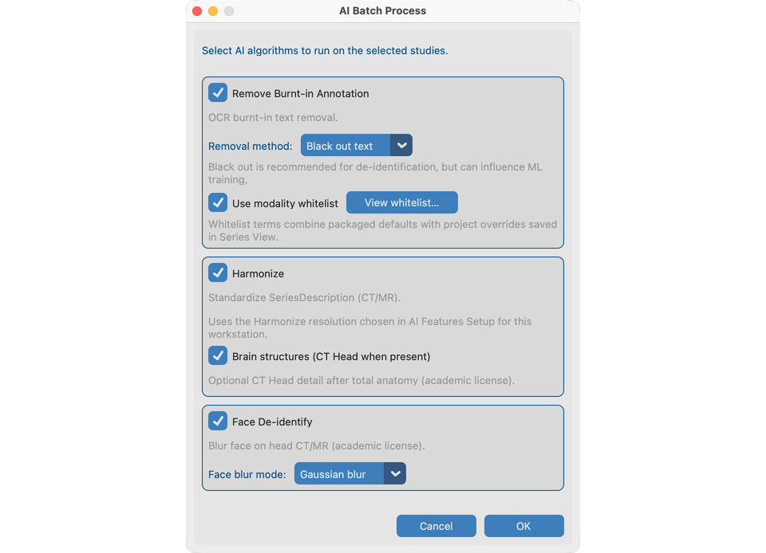

# 8.4 Run on many studies

**AI Batch Process** runs the same tools from chapters 8.1–8.3 across selected studies from the Dataset—without opening each series by hand.

## Demo studies

Use the same fixtures you practiced one-at-a-time:

| Tool in batch | Fixture to include |
| --- | --- |
| Remove Pixel PHI | **`davidson_cxr`** |
| Harmonize + Face blur | **`CT_Head_With_Contrast`** |

Import both (or the full `test_dcm_files` tree), open **Dataset**, select those studies, then start AI Batch Process.

## Goal

Process a cohort for burned-in text, Harmonize, and/or face blur with progress and a summary.

## Before you start

1. Import the demo series above (and any other studies you need).
2. Finish [AI Features setup](../../03-ai-features-setup/) for every tool you will run.
3. Optionally walk 8.1–8.3 once so you know expected results.

## Start a batch

1. Open **Dataset** and select studies (include `davidson_cxr` and `CT_Head_With_Contrast` for a full demo).
2. Start **AI Batch Process**.
3. In options, choose algorithms:
   - Remove Pixel PHI (blackout vs blend; modality whitelist on/off) — exercises `davidson_cxr`
   - Harmonize (workstation CT/MR resolution from AI Features) — exercises `CT_Head_With_Contrast`
   - Face blur (**Gaussian** to match chapter 8.3) — exercises `CT_Head_With_Contrast`
4. Preview modality whitelists if offered.
5. Confirm memory warning if shown, then start.

## Order of work

For each series, selected tools run in a stable order (pixel PHI → Harmonize → face blur) so memory use stays predictable.

## During the run

- Progress shows study / series / phase.
- Cancel stops after the current step when possible.
- Low memory can abort with a clear warning.
- Already-processed series are skipped by default.

## Afterward

- Read the summary (completed / skipped / failed).
- Spot-check Series View on `davidson_cxr` and `CT_Head_With_Contrast` before export.
- Same job on a **server without a window** → [Run headless](../../10-headless/).

## What good looks like

- Summary matches expectations; Dataset AI columns updated for the demo studies.
- Log file has detail for any skips.

## If it fails

- Features not ready → [AI Features](../../03-ai-features-setup/).
- No series for selection → check Dataset selection.
- Insufficient memory → close other apps or process fewer studies.

## Next steps

Continue with [Send](../../09-send/) to export anonymized studies (or [run headless](../../10-headless/) for server batch).
