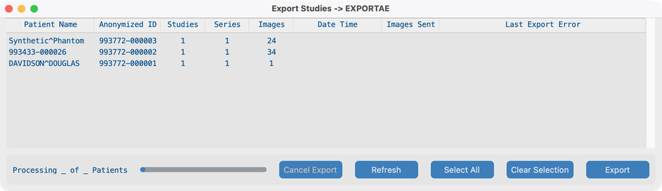
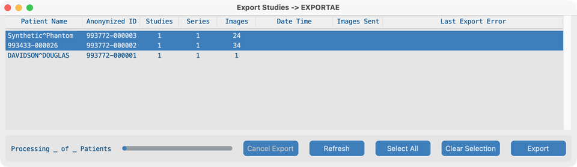
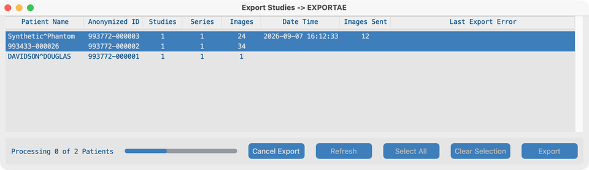
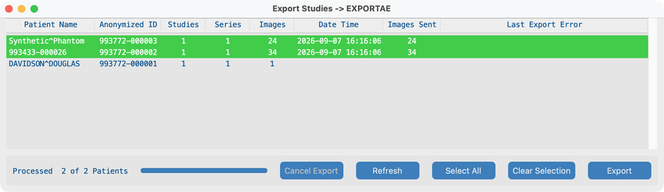

# Send

## Goal

Send anonymized patients to a remote DICOM system or AWS S3. Watch status until rows show as sent.

## Before you start

1. Configure the **Export Server** (or AWS Cognito for S3) in [Project Settings](../05-create-project/).
2. Import at least one study so the Send list is not empty ([Search](../06-search/) or Dataset).

## Workflow

### 1. Initial Send view

1. From the Dashboard, click **Send**.
2. The Export window lists anonymized patients (a patient may include several studies).
3. Confirm the title shows your destination (export AE title or AWS project).

### 2. Select patients

1. Click one or more patient rows (SHIFT / CMD or CTRL for multi-select), or click **Select All**.
2. Use **Clear Selection** if you need to start over.
3. Already-sent rows (green) are usually left alone; the app does not re-send completed objects by default.

### 3. Sending

1. Click **Export**.
2. For DICOM destinations, the app echoes the export server first; fix connection errors with IT if echo fails.
3. While export runs, action buttons disable, **Cancel Export** enables, and the status line shows progress (for example Processing 0 of N Patients).
4. **Date Time** and **Images Sent** update as each patient finishes.

### 4. Sent

1. When all selected patients finish, status shows **Processed N of N Patients**.
2. Successful rows turn **green** with **Date Time** and **Images Sent** filled.
3. Patients you did not select stay unchanged.
4. Failed rows turn **red** and show **Last Export Error**; select them and export again if needed.

## What good looks like

- Selected patients complete with green rows and matching **Images Sent** counts.
- Destination PACS or S3 bucket shows the anonymized studies.

## If it fails

- Echo / auth failure → check export server or AWS Cognito credentials with IT.
- Nothing selected → select patients first.
- Partial failures → read **Last Export Error**, fix the destination, re-select red rows, Export again.

## Next steps

Optional: [Run headless](../10-headless/) for lab/server receive or overnight batch.
