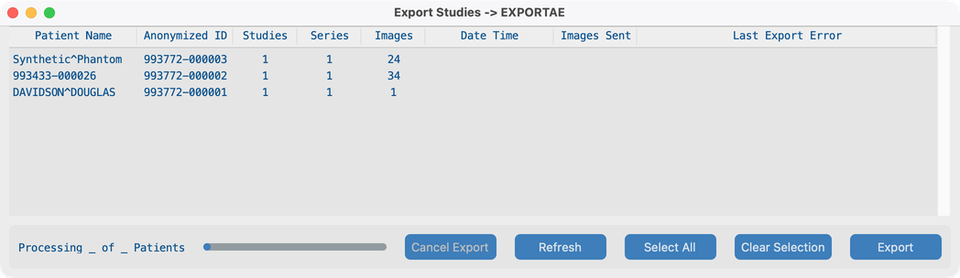
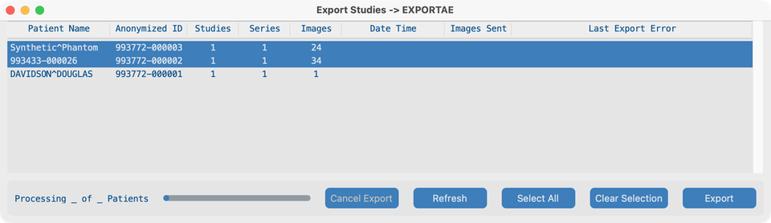
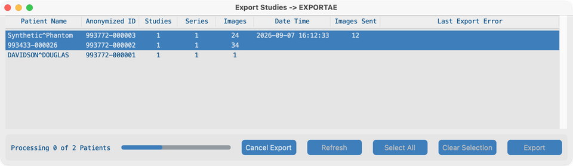
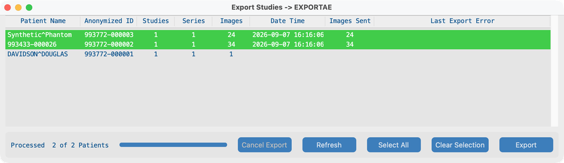

# Send

## Goal

Send anonymized patients to a remote DICOM system or AWS S3. Watch status until rows show as sent.

## Before you start

1. Configure the **Export Server** (or AWS Cognito for S3) in [Project Settings](../05-create-project/).
2. Import at least one study so the Send list is not empty ([Search](../06-search/) or Dataset).

## Workflow

### 1. Initial Send view

1. From the Dashboard, click **Send**.
2. The Export window lists anonymized patients (a patient may include several studies).
3. Confirm the title shows your destination (export AE title or AWS project).

### 2. Select patients

1. Click one or more patient rows (SHIFT / CMD or CTRL for multi-select), or click **Select All**.
2. Use **Clear Selection** if you need to start over.
3. Already-sent rows (green) are usually left alone; the app does not re-send completed objects by default.

### 3. Sending

1. Optionally check **Export segments as DICOM-SEG** (see [below](#export-segments-as-dicom-seg)).
2. Click **Export**.
3. For DICOM destinations, the app echoes the export server first; fix connection errors with IT if echo fails.
4. While export runs, action buttons disable, **Cancel Export** enables, and the status line shows progress (for example Processing 0 of N Patients).
5. **Date Time** and **Images Sent** update as each patient finishes.

### 4. Sent

1. When all selected patients finish, status shows **Processed N of N Patients**.
2. Successful rows turn **green** with **Date Time** and **Images Sent** filled.
3. Patients you did not select stay unchanged.
4. Failed rows turn **red** and show **Last Export Error**; select them and export again if needed.

## Export segments as DICOM-SEG

When **Export segments as DICOM-SEG** is checked on the Send window, the app converts on-disk segments into DICOM Segmentation objects and sends them with the anonymized images (DICOM server or AWS S3).

### What is included

For each series that has segment data:

- **TotalSegmentator** anatomy masks from the series cache (`0_TS_SEG/seg/`), such as brain and brain-structure masks after Harmonize / Brain Structures
- **User ROI annotations** from Series View (`0_TS_SEG/annotations/`), including planar CR/DX/US/MG ROIs painted in pixel space when patient orientation tags are absent

Face Blur masks are **not** exported as DICOM-SEG.

### How many DICOM files

- **One DICOM-SEG file per source series** (not one file per organ or label).
- Locally it is written next to that series’ images as `roi_annotations.seg.dcm` before send.
- That single file holds **all** segments for the series (TS structures and user ROIs) as separate entries in the DICOM `SegmentSequence`, with binary frames for each segment on slices that contain voxels.

### SEG format used

Exported objects follow the DICOM **Segmentation Storage** IOD (SOP Class `1.2.840.10008.5.1.4.1.1.66.4`), modality **SEG**:

| Attribute | Value used |
| --- | --- |
| `SegmentationType` | `BINARY` |
| `BitsAllocated` / `BitsStored` | `1` (bit-packed frames; DICOM-allowed for BINARY) |
| `ImageType` | `DERIVED\PRIMARY` |
| Transfer syntax | Explicit VR Little Endian |
| Algorithm types | `AUTOMATIC` for TotalSegmentator masks; `MANUAL` for user ROIs (mixed in one file is allowed) |

Also included for viewer linkage:

- Top-level `ReferencedSeriesSequence` (source series + instance UIDs)
- Multi-frame `DimensionOrganizationSequence` / `DimensionIndexSequence`
- Per-frame plane position/orientation and derivation references to source slices

**Viewing:** Orthanc and many PACS will **store** the SEG as a sibling series under the same study. Built-in Orthanc Explorer and viewers such as Horos often **do not overlay** SEG on the source images (CT/MR or planar XR/US/MG) even when the object is valid. To review overlays, open the **whole study** (images + SEG) in a SEG-capable tool such as **3D Slicer**, MITK, or OHIF—not the SEG file alone. For lesion / disease-area labelling intent and NIfTI vs SEG roles, see [Labelling lesions and disease areas](../07-view/#labelling-lesions-and-disease-areas).

### How it appears on the DICOM server

| | Source CT / MR images | DICOM-SEG |
| --- | --- | --- |
| Study | Anonymized study | **Same study** (`StudyInstanceUID`) |
| Series | Original image series | **Separate series** (new `SeriesInstanceUID`, series number `9001`) |
| Series description | Original (e.g. Routine Brain) | `Anatomy Segments`, `ROI Annotations`, or `Segments + ROI Annotations` |
| Instances | Many image instances | **One** SEG instance for that series |

The SEG object is **not** stored inside the source image series. On the archive it appears as a **sibling SEG series under the same study**.

If a series has no TS masks and no user annotations, no SEG file is created for that series.

### Export View columns

The patient list includes:

- **Images** — anonymized instance count (excludes prepared `roi_annotations.seg.dcm` files)
- **Segments** — total exportable segment **labels** for that patient (TS anatomy masks + user ROIs; Face Blur excluded)
- **Images Sent** — files successfully sent. With **Export segments as DICOM-SEG** checked, each segmented series adds **one** SEG instance to this total (all labels for that series share one DICOM-SEG file), so a full send is approximately `Images + (segmented series count)`

## What good looks like

- Selected patients complete with green rows and matching **Images Sent** counts.
- Destination PACS or S3 bucket shows the anonymized studies.
- With **Export segments as DICOM-SEG** checked, each segmented series also has a sibling **SEG** series on the destination (same study, separate series).

## If it fails

- Echo / auth failure → check export server or AWS Cognito credentials with IT.
- Nothing selected → select patients first.
- Partial failures → read **Last Export Error**, fix the destination, re-select red rows, Export again.

## Next steps

Optional: [Run headless](../10-headless/) for lab/server receive or overnight batch.
