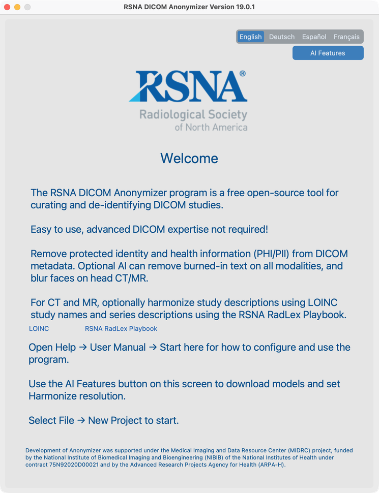

# T1 — Install and open the app

## Goal
Install the Anonymizer and reach the Welcome screen with AI Features available.

## Steps
1. Install uv (`uv --version` to confirm), create a Python 3.12 venv that includes tkinter, then `uv pip install rsna-anonymizer` (19.0.1).
2. On macOS, `brew install libomp` before using AI Features.
3. Run `rsna-anonymizer`; confirm Welcome opens; open **AI Features** and start any needed downloads.

## Video
<!-- Replace VIDEO_ID when published

<iframe src="https://www.youtube.com/embed/VIDEO_ID" title="T1 Install" frameborder="0" allowfullscreen></iframe>

-->

Full detail: [Install and first launch](../02-install/)

