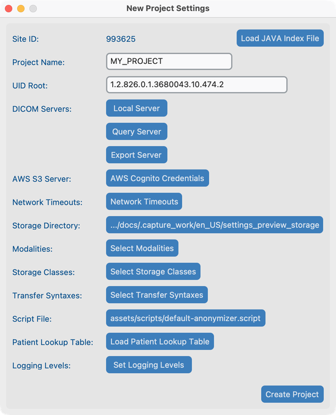
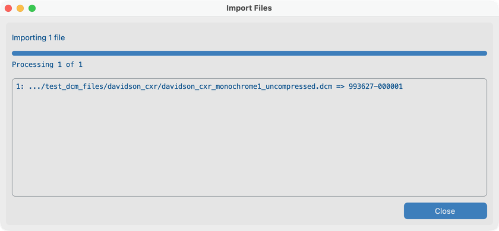

# T2 — Create a project and import a folder

## Goal
Create a project and import a test folder so studies appear in Dataset.

## Steps
1. **File → New Project** and set storage.
2. Import a directory of DICOM test files.
3. Open **Dataset** and expand a study.

## Video
<!-- YouTube embed placeholder -->

See [Create a project](../04-create-project/) and [Search](../05-search/).

