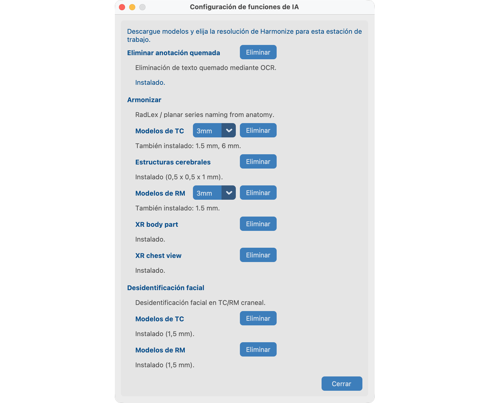

# Configuración de Funciones de IA

Las Funciones de IA son **opcionales**. Se ejecutan en su ordenador tras una descarga única. Las imágenes no se suben para procesarlas.

Haga este capítulo **antes** de los recorridos de herramientas con `davidson_cxr` y `CT_Head_With_Contrast`.

## Objetivo

Descargar los modelos que necesita y elegir la resolución de Harmonize para esta estación de trabajo.

## Abrir la configuración

Solo desde la pantalla **Bienvenido**: pulse **Funciones de IA**.

Cierre el proyecto (o inicie la aplicación) para volver a Bienvenido si necesita descargar modelos o cambiar la resolución de Harmonize más adelante.

## Qué configura (V19)

| Elemento | Necesario para la demo |
| --- | --- |
| **Quitar texto quemado** (OCR) | Capítulo 8.1 — `davidson_cxr` |
| **Harmonize** paquete CT + resolución (1.5 / 3 / 6 mm) | Capítulo 8.2 — `CT_Head_With_Contrast` |
| **Harmonize** parte del cuerpo XR (opcional) | Anatomía por píxeles para CR/DX cuando faltan o están mal las etiquetas DICOM de parte del cuerpo |
| **Harmonize** proyección de tórax XR (opcional) | Proyección AP/PA/Lat por píxeles (+ QC de rotación) para CR/DX de tórax |
| **Desidentificación facial** + licencia académica `aca_…` | Capítulo 8.3 — `CT_Head_With_Contrast` |
| **Estructuras cerebrales** (paquete con licencia, opcional) | Capítulo 8.2 — mensaje de estructuras cerebrales de Harmonize |

**No hay casillas de activar/desactivar por proyecto**. Si los modelos están instalados y listos, las herramientas aparecen en Vista de Series y en el lote.

Harmonize XR funciona sin los paquetes de parte del cuerpo XR o proyección de tórax (solo etiquetas / palabras clave DICOM). Cuando están instalados, las series CR/DX pueden usar:

- Clasificador de parte del cuerpo EfficientNet-B4 ([Xp-Bodypart-Mislabel-Checker](https://huggingface.co/spaces/MedicalAILabo/Xp-Bodypart-Mislabel-Checker); Mitsuyama et al., *European Radiology* 2025), fusionado con la anatomía DICOM.
- Clasificador de proyección/rotación solo tórax ([CXp-Projection-Rotation-Mislabel-Checker](https://huggingface.co/spaces/MedicalAILabo/CXp-Projection-Rotation-Mislabel-Checker)) para refinar AP/PA/Lat; la rotación se muestra en la tabla de análisis de Harmonize y no se escribe en SeriesDescription.

Mamografía y ecografía no usan estos modelos.

## Pasos la primera vez

1. Abra **Funciones de IA**.
2. Descargue **Quitar texto quemado**, **Harmonize** (CT) y **Desidentificación facial**.
3. Introduzca o valide la licencia académica cuando se le pida (cara / estructuras cerebrales).
4. Elija la resolución CT de Harmonize; descargue si falta el paquete.
5. Opcionalmente descargue **Estructuras cerebrales** para la demo CT de Harmonize, y **parte del cuerpo XR** / **proyección de tórax XR** para la demo CXR de Harmonize en el capítulo 8.2.
6. Cierre el diálogo. Las preferencias permanecen en esta estación de trabajo.

!!! tip "Internet solo para la descarga"
    Tras tener modelos y licencia, el procesamiento es local. En **macOS**, instale la biblioteca C++ OpenMP antes de usar Harmonize / Funciones de IA relacionadas: `brew install libomp` (véase [Instalación](../02-install/#4-macos-only--openmp-for-ai-features)).

## Quitar modelos

Use **Eliminar** en la tarjeta de una herramienta para borrar los archivos descargados. Esto no deshace los cambios ya escritos en las imágenes anonimizadas.

## Cómo se ve cuando va bien

- El estado muestra listo para OCR, Harmonize CT y Face.
- Puede abrir las herramientas de Vista de Series en las series de demo de los capítulos 8.1–8.3 de [Procesar](../08-process/).

## Si falla

- Descarga incompleta → compruebe la red e inténtelo de nuevo.
- TotalSegmentator / OpenMP en macOS → `brew install libomp`.
- Licencia no válida → compruebe el formato `aca_` o la URL del proveedor en el diálogo.

## Siguientes pasos

1. [Palabras que usamos](../04-words-we-use/) y [Crear un proyecto](../05-create-project/), o
2. Salte a las herramientas de [Procesar](../08-process/) cuando haya importado estudios — empiece por [8.1 Quitar PHI de píxeles](../08-process/02-remove-burned-in-text/)
