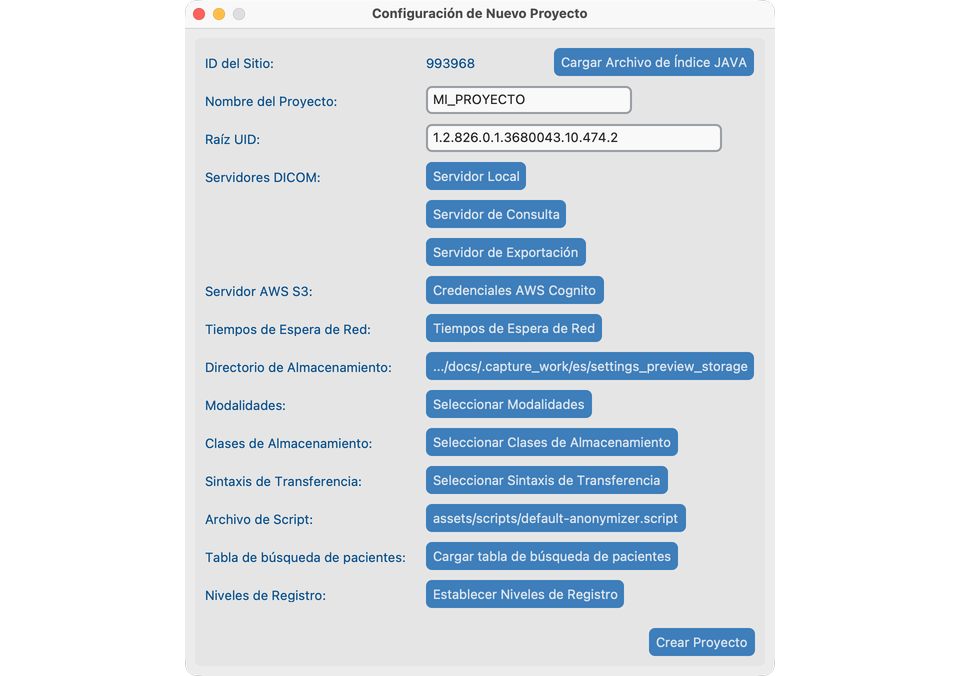
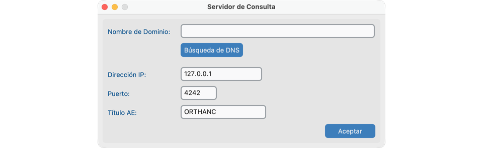
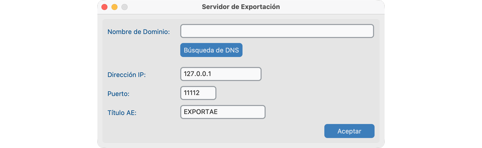
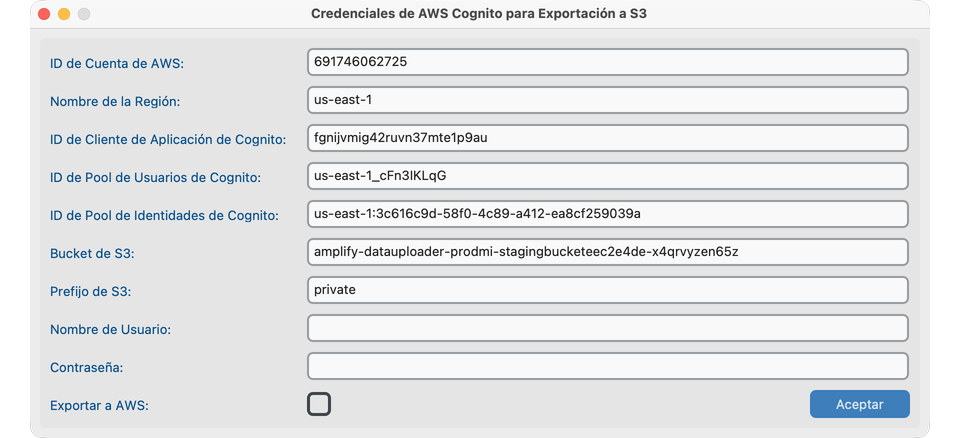
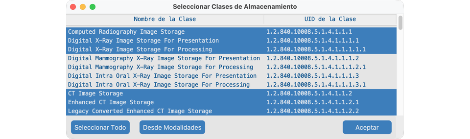
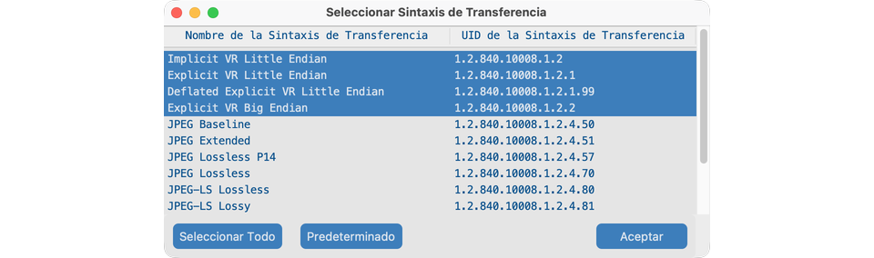
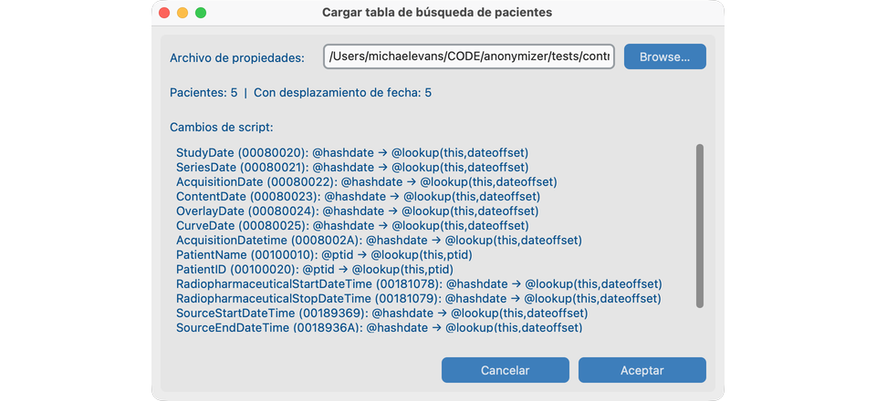
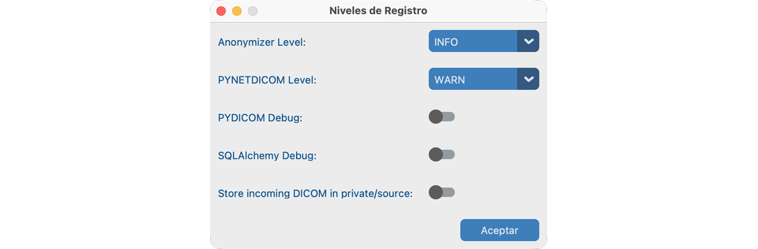
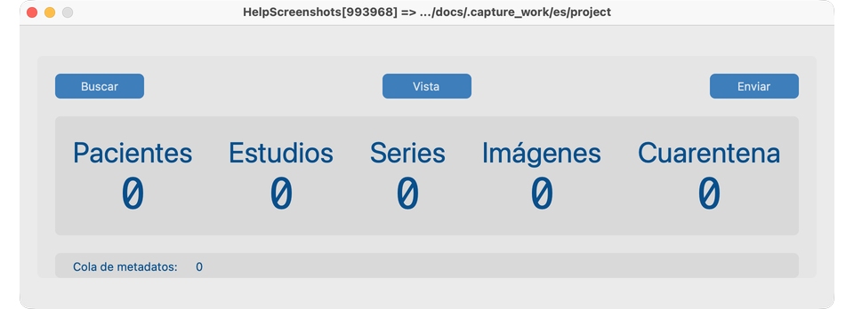

# Crear un proyecto

Un **proyecto** mantiene juntos los ajustes y el almacenamiento anonimizado. Créelo una vez en la ventana de escritorio, aunque un servidor ejecute después [sin interfaz](../10-headless/).

## Objetivo

Abrir un proyecto limpio con carpeta de almacenamiento e identidad del sitio listos para importar.

## Crear un proyecto nuevo

1. Desde **Archivo → Nuevo Proyecto**, abra **Configuración de Nuevo Proyecto**.
2. Elija un **Nombre del Proyecto** (corto, menos de 16 caracteres) y confirme el **Directorio de Almacenamiento**.
3. Revise ID del Sitio y Raíz UID (normalmente deje los valores predeterminados salvo que continúe un sitio del Java Anonymizer).
4. Confirme modalidades y ajustes de red con TI si va a consultar un PACS.
5. Guarde / cree el proyecto. Se abre el **Panel de control**.

## Acciones cotidianas del proyecto

| Acción | Cómo |
| -------------- | ---------------------------------------------------------------------------------------------------- |
| Cerrar | **Archivo → Cerrar Proyecto** o cierre la ventana |
| Reabrir | **Archivo → Abrir Reciente** |
| Clonar ajustes | **Archivo → Clonar** en una carpeta de almacenamiento nueva (no se copian imágenes). Mantenga la Raíz UID única entre proyectos. |

## Cómo se ve cuando va bien

- El Panel de control muestra el nombre del proyecto y el ID del Sitio.
- El directorio de almacenamiento existe y es escribible.
- Puede abrir el **Conjunto de datos** curado actual (vacío hasta que importe) pulsando **Vista**.

## Cuando hable con TI

Comparta estas ideas (los detalles están en los diálogos de Ajustes del Proyecto):

- **Servidor Local** — dirección, puerto y AE Title que este ordenador usa para **recibir** imágenes.
- **Servidor de Consulta** — el archivo hospitalario desde el que busca y recupera.
- **Servidor de Exportación** o **AWS** — adónde se enviarán los estudios anonimizados.
- **Modalidades / clases de almacenamiento / sintaxis de transferencia** — qué tipos de imagen se permiten.
- **Tiempos de espera de red** — cuánto esperar ante archivos lentos.
- **Tabla de búsqueda de pacientes** — mapeo opcional CTP `.properties` para PatientID y desplazamiento de fecha (véase [Tabla de búsqueda](#patient-lookup-table)).

Si el proyecto vivirá en un servidor de laboratorio, continúe con [Ejecutar sin interfaz](../10-headless/).

## Ajustes del Proyecto (cada control)

Abra **Archivo → Ajustes del Proyecto** (o Configuración de Nuevo Proyecto al crear). Configure esto antes de Buscar / Enviar:

### Servidor Local

Dirección, puerto y AE Title que este ordenador usa para **recibir** imágenes.

### Servidor de Consulta

Archivo hospitalario usado por **Buscar** del Panel de control.

### Servidor de Exportación

Destino DICOM usado cuando **Enviar** (la etiqueta de ajustes puede seguir diciendo Export Server).

### AWS Cognito (opcional)

Credenciales para Enviar a S3 cuando esté habilitado.

### Tiempos de Espera de Red

Cuánto esperar ante archivos lentos.

### Modalidades / Clases de Almacenamiento / Sintaxis de Transferencia

Qué tipos de imagen y codificaciones se permiten.

### Tabla de búsqueda de pacientes

Mapeo opcional CTP `.properties` de IDs PHI de paciente a IDs anonimizados y desplazamientos de fecha. Examinar → vista previa → Aceptar.

### Niveles de Registro

Suba el registro del anonimizador / red al solucionar problemas con TI.

## Panel de control tras crear

El Panel de control muestra los botones principales del flujo: **Buscar**, **Vista** y **Enviar**.

## Si falla

- Ruta de almacenamiento no escribible → elija otra carpeta.
- Nombre demasiado largo → acorte el nombre del proyecto.
- Aviso al clonar sobre Raíz UID → use una raíz única por proyecto para evitar choques de ID.

## Siguientes pasos

Continúe con [Buscar](../06-search/) para importar estudios al proyecto.
