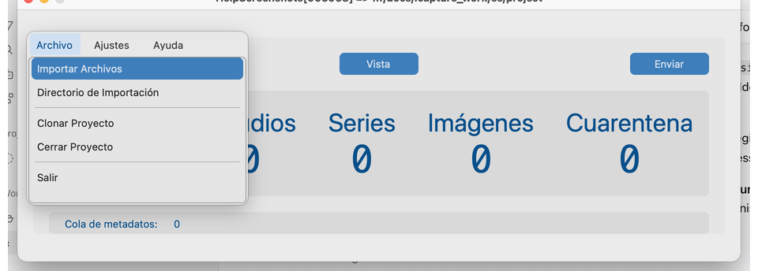
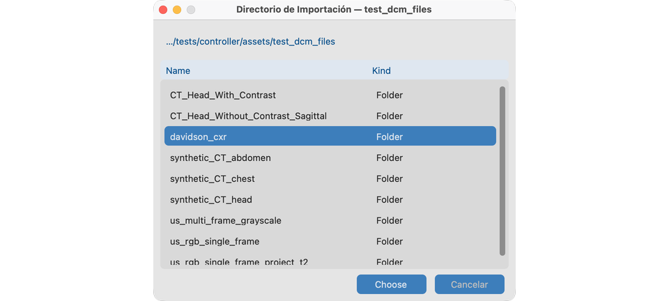
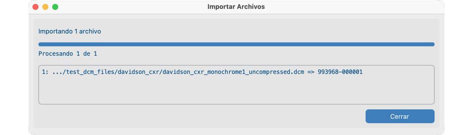
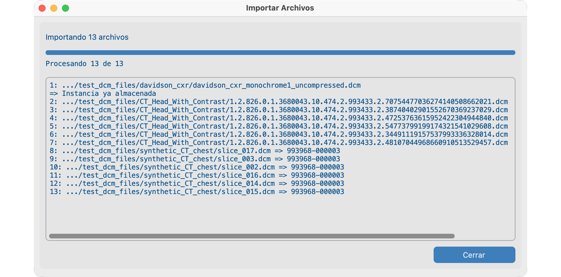
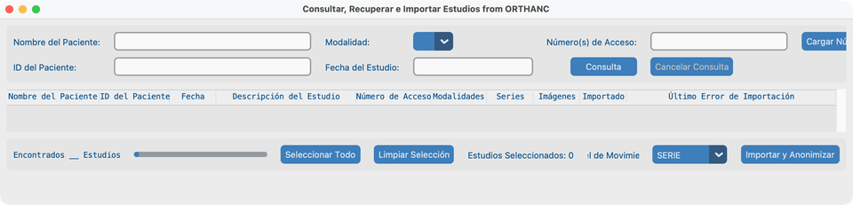
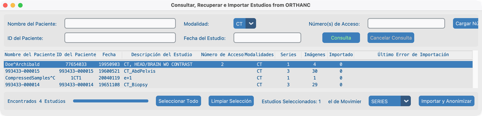
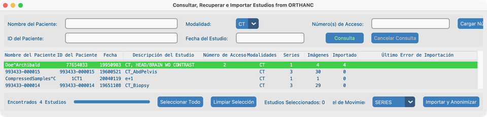

# Buscar

## Objetivo

Traer estudios DICOM a su proyecto para que se desidentifiquen y aparezcan en **Vista → Conjunto de datos**. Puede:

1. **Importar desde este ordenador** — archivos o una carpeta mediante el menú **Archivo**.
2. **Buscar en un sistema de imagen remoto** — PACS / VNA / Orthanc mediante **Buscar** del Panel de control.

Configure el [Servidor de Consulta, modalidades, clases de almacenamiento y tiempos de espera de red](../05-create-project/) antes de confiar en Buscar remoto.

---

## Desde una carpeta o archivos

### 1. Abrir Importar desde el menú Archivo

Con un proyecto abierto, use:

- **Archivo → Importar Archivos** — elija uno o más archivos (el filtro predeterminado suele ser `.dcm`; puede cambiarlo en el diálogo de archivos).
- **Archivo → Directorio de Importación** — se intenta cada archivo bajo esa carpeta y sus subcarpetas, no solo `.dcm`.

Las instancias ya importadas (mismo SOP Instance UID ya en este proyecto) se **omiten**, no se ponen en cuarentena.

### 2. Elegir una carpeta (Directorio de Importación)

Tras **Directorio de Importación**, se abre el diálogo de carpeta del SO. Navegue al árbol de su estudio y pulse **Elegir**.

Navegue a `tests/controller/assets/test_dcm_files` (o a una carpeta de estudio bajo ella como `davidson_cxr` o `CT_Head_With_Contrast`).

### 3. Qué debe cumplirse para que un archivo se importe

Un archivo solo se acepta si se cumplen todas estas condiciones:

1. Archivo DICOM Part 10 válido con información de metaarchivo (incluido el preámbulo DICOM).
2. Contiene **SOP Class UID**, **Study Instance UID**, **Series Instance UID** y **SOP Instance UID**.
3. Su clase de almacenamiento está permitida por las [clases de almacenamiento](../05-create-project/#storage-classes) de este proyecto.
4. La identidad protegida (PHI) puede capturarse correctamente.
5. No se ha importado ya en este proyecto.

Si se requiere una [tabla de búsqueda de pacientes](../05-create-project/#patient-lookup-table), el ID de Paciente PHI también debe coincidir con una entrada—o el archivo se pone en cuarentena como **Lookup_Miss**.

### 4. Importar `davidson_cxr` (demo de un solo estudio)

Radiografía de tórax de demo usada más adelante en [Vista](../07-view/) y [Quitar PHI de píxeles](../08-process/02-remove-burned-in-text/).

Ruta: `tests/controller/assets/test_dcm_files/davidson_cxr`

1. Elija **Archivo → Directorio de Importación**.
2. Seleccione la carpeta `davidson_cxr` y pulse **Elegir**.
3. Espere hasta que el diálogo **Importar Archivos** termine y aparezca **Cerrar**.

Una línea correcta muestra una ruta abreviada y **ID de Paciente PHI → ID de Paciente anonimizado** (por ejemplo `…/davidson_cxr_….dcm => 993627-000001`).

### 5. Leer el registro de importación (muchos archivos)

Al importar un árbol mayor, el mismo diálogo lista **un resultado por archivo** en el cuadro desplazable:

- **Éxito:** `path => anonymized Patient ID`
- **Ya almacenado:** omitido (mismo SOP Instance UID)
- **Fallo:** `path` luego `=>` y un motivo breve (DICOM no válido, atributos faltantes, clase de almacenamiento, captura PHI, fallo de búsqueda)

Pulse **Cerrar** al terminar. Los conteos de pacientes / estudios / imágenes del Panel de control se actualizan; los conteos de cuarentena solo suben por archivos rechazados.

### Cuarentena

Los archivos fallidos van a las carpetas de cuarentena privadas del proyecto (los nombres pueden aparecer con espacios o guiones bajos en la UI):

| Carpeta | Causa típica |
| ---------------------------------- | ----------------------------------------- |
| `Invalid_DICOM` / error de lectura DICOM | No es DICOM válido, o ilegible |
| `Missing_Attributes` | Faltan UIDs / SOP Class obligatorios |
| `Invalid_Storage_Class` | Clase de almacenamiento no habilitada para el proyecto |
| `Capture_PHI_Error` | No se pudo capturar PHI |
| `Lookup_Miss` | ID de Paciente no está en la tabla de búsqueda |

Revise los conteos de cuarentena en el Panel de control. Corrija ajustes o archivos de origen, luego importe de nuevo.

---

## Desde un sistema de imagen remoto (**Buscar** del Panel de control)

### 1. Abrir Buscar

En el Panel de control, pulse **Buscar**. La aplicación hace primero **C-ECHO** al Servidor de Consulta configurado. Si el eco tiene éxito, se abre la ventana **Consultar, Recuperar e Importar Estudios**.

Esta ventana tiene tres bandas:

1. **Criterios** — Nombre del Paciente, ID del Paciente, Modalidad, Fecha del Estudio, Número(s) de Acceso, **Cargar Números de Acceso**, **Consulta** / **Cancelar Consulta**, **Mostrar Estudios Importados**.
2. **Tabla de resultados** — estudios devueltos por C-FIND.
3. **Barra de importación** — conteo Encontrados, **Seleccionar Todo** / **Limpiar Selección**, **Nivel de Movimiento**, **Importar y Anonimizar**.

!!! tip "Pida ayuda a TI"
    El Servidor de Consulta debe permitir a este ordenador C-ECHO, C-FIND y C-MOVE, y debe conocer su **Servidor Local** (dirección, puerto, AE Title) como destino C-MOVE. Véase [Crear un proyecto → Cuando hable con TI](../05-create-project/#when-you-talk-to-it).

### 2. Buscar estudios

Introduzca **al menos un** criterio, luego pulse **Consulta** (o pulse Return). Una consulta vacía se rechaza.

| Campo | Notas |
| -------------------- | ---------------------------------------------------------------------------------------------- |
| **Nombre del Paciente** | Letras (incluidos acentos), dígitos, separador de nombre `^`; `?` = un carácter, `*` = cualquier cadena |
| **ID del Paciente** | Letras/dígitos ASCII; comodines `?` y `*` |
| **Modalidad** | Desplegable de modalidades configuradas en Ajustes del Proyecto |
| **Fecha del Estudio** | Un día o un rango: `YYYYMMDD` o `YYYYMMDD-YYYYMMDD` |
| **Número(s) de Acceso** | ASCII, dígitos y `/ - _ , .`; comodines `?` y `*` |

Opciones extra de acceso:

- Escriba una **lista separada por comas** en Número(s) de Acceso para varias búsquedas de una vez.
- Use **Cargar Números de Acceso** para cargar un archivo `.txt` o `.csv` (delimitado por comas o por líneas). Confirme antes de que corra la consulta masiva. Los números de acceso no encontrados pueden escribirse en un archivo de texto para seguimiento.

Otros controles:

- **Mostrar Estudios Importados** — cuando está desactivado, los estudios ya en este proyecto se ocultan de la lista de resultados.
- **Cancelar Consulta** — detiene una consulta en curso.
- Solo aparecen y se pueden seleccionar estudios cuyas modalidades estén permitidas para el proyecto.
- El estado al pie muestra **Encontrados N Estudios** tras una consulta correcta.

### 3. Ejemplo: consulta CT (`Doe^Archibald`)

1. Ponga **Modalidad** en **CT**.
2. Pulse **Consulta**.
3. Pulse la fila de CT de cabeza **Doe^Archibald** (resaltado oscuro de selección).
4. Confirme **Estudios Seleccionados: 1** y elija **Nivel de Movimiento** (a menudo **STUDY** o **SERIES**).

### 4. Seleccionar estudios e importar

1. Seleccione estudios: clic simple, selección múltiple (**⌘** / **Ctrl**+clic), **Seleccionar Todo** o **Limpiar Selección**.
2. Elija **Nivel de Movimiento**: **STUDY**, **SERIES** o **INSTANCE** (nivel DICOM C-MOVE). Prefiera STUDY cuando el archivo lo soporte; pruebe SERIES o INSTANCE si las transferencias se atascan.
3. Pulse **Importar y Anonimizar**. La aplicación construye una jerarquía de estudio para el nivel de movimiento seleccionado, luego abre el diálogo de progreso **Importar Estudios**.
4. El progreso sigue la recuperación de metadatos, luego las imágenes recibidas frente a la jerarquía. Un estudio termina cuando llegan todos los archivos esperados **o** expira un [Tiempo de Espera de Red](../05-create-project/#network-timeouts) para esa transferencia.
5. Cuando el diálogo muestra **Importación Finalizada**, pulse **Cerrar**.

### 5. Confirmar resaltado verde (series CT importadas)

Los estudios importados correctamente se **resaltan en verde** en la lista de resultados de Consulta, y la columna **Importados** muestra cuántas imágenes llegaron al proyecto. Con **Nivel de Movimiento = SERIES**, la serie CT de Doe^Archibald termina con Importados coincidiendo con Imágenes.

Puede seleccionar los mismos estudios de nuevo tras ajustar el tiempo de espera o el nivel de movimiento—las instancias ya importadas se omiten.

### Manejar archivos lentos o no ideales

Muchos VNA mueven imágenes de forma asíncrona y no se comportan como un PACS de libro. Si las importaciones están incompletas:

- Alargue el **Tiempo de Espera de Red** en Ajustes del Proyecto.
- Cambie el **Nivel de Movimiento** (Study → Series → Instance) y reintente **Importar y Anonimizar**.
- Confirme con TI que el destino C-MOVE coincide con el AE Title de su Servidor Local y que modalidades / clases de almacenamiento permiten los estudios que espera.

---

## Cómo se ve cuando va bien

- Los estudios aparecen en [Vista → Conjunto de datos](../07-view/).
- Los conteos de pacientes / estudios / imágenes del Panel de control aumentan; la cuarentena permanece vacía o solo guarda rechazos esperados.
- Los diálogos de importación local muestran una línea clara de éxito o error por archivo antes de pulsar **Cerrar**.
- Las importaciones remotas muestran resaltado verde en los resultados de Consulta tras una ejecución correcta.
- El texto de estado al pie del Panel de control refleja la última acción de Buscar o importación.

## Si falla

| Síntoma | Qué intentar |
| ----------------------------------------- | ----------------------------------------------------------------------------------- |
| El botón Buscar permanece desactivado / el eco falla | Servidor de Consulta fuera de línea o bloqueado; verifique dirección, puerto, AE Title con TI |
| Error de conexión en Consulta | Falló C-ECHO—corrija ajustes del Servidor de Consulta o la red |
| Resultados vacíos | Amplíe comodines/fecha; active **Mostrar Estudios Importados**; compruebe modalidades del proyecto |
| Nada se importa desde carpeta | Clases de almacenamiento / modalidades; DICOM Part 10 válido; tabla de búsqueda si se requiere |
| Lookup_Miss | Añada el ID de Paciente a la tabla de búsqueda o relaje los requisitos de búsqueda |
| Importación PACS parcial | Tiempo de Espera de Red más largo; otro Nivel de Movimiento; reintente la selección |
| Archivos ignorados sin cuarentena | Ya importados (mismo SOP Instance UID) |

## Siguientes pasos

Continúe con [Vista](../07-view/) para recorrer lo que importó.
