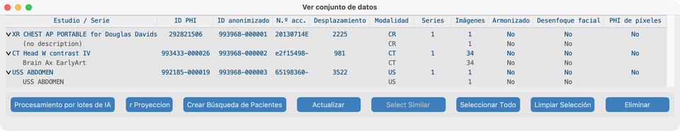
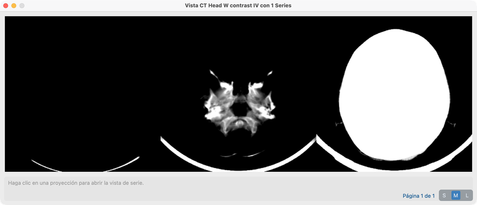
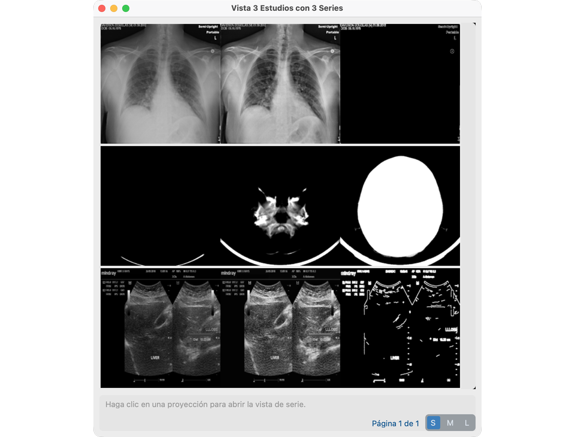
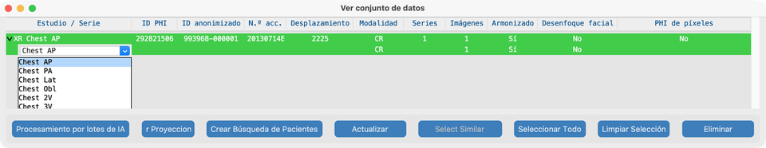
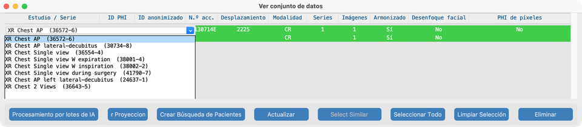
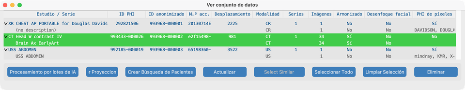
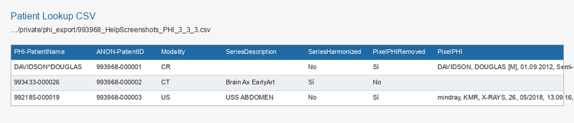

# Vista

**Vista** del Panel de control abre el **Conjunto de datos** — la lista de todo en su proyecto (pacientes, estudios y series). Desde el Conjunto de datos abre **proyecciones de estudio** o una **Vista de Series** completa para revisar píxeles y ejecutar herramientas de Procesar.

(Versiones anteriores llamaban al Conjunto de datos Índice PHI.)

## Objetivo

Ver lo que importó, comprobar columnas de estado de IA, abrir proyecciones de un estudio, abrir una serie para revisión o herramientas de [Procesar](../08-process/), y exportar un CSV de **Búsqueda de Pacientes** cuando haga falta.

## Estudios de demo

Tras importar desde `tests/controller/assets/test_dcm_files` (véase [Buscar](../06-search/)), el Conjunto de datos debería listar estos tres estudios (las capturas de ayuda **no** usan phantoms sintéticos):

| Fixture | Papel en el manual |
| --- | --- |
| **`davidson_cxr`** | Abrir en Vista de Series aquí; texto quemado en [Quitar PHI de píxeles](../08-process/02-remove-burned-in-text/) |
| **`CT_Head_With_Contrast`** | [Armonizar](../08-process/03-harmonize-names/) y [Desenfoque facial](../08-process/04-blur-faces/) |
| **`us_rgb_single_frame`** | Ecografía de un solo fotograma; superposiciones quemadas en [Quitar PHI de píxeles](../08-process/02-remove-burned-in-text/) (demos de área de exclusión) |

## Abrir el Conjunto de datos

1. Desde el Panel de control, pulse **Vista**.
2. Expanda una fila de **estudio** (triángulo) para ver las **series** anidadas.
3. Observe los IDs PHI / anonimizados y las columnas de estado de IA.

### Columnas (V19)

| Estado | Significado |
| --- | --- |
| **Armonizado** | Descripción de serie estandarizada (o descripción a nivel de estudio aplicada) |
| **Desenfoque facial** | Desidentificación facial aplicada |
| **PHI de píxeles** | Escaneo / eliminación de texto quemado registrado |

## Clic derecho en el Conjunto de datos (lo más importante)

Las sugerencias al pasar el ratón sobre el árbol dicen qué hará un clic derecho. La selección sigue la fila bajo el puntero.

**Clic izquierdo** en la **descripción** del estudio o serie (primera columna) cuando hay una sola fila seleccionada — véase [Editar descripciones de estudio y serie](#edit-study-and-series-descriptions) más abajo. Use **Shift** o **Cmd/Ctrl+Clic** para selección múltiple; luego **clic derecho** en la selección para fijar una descripción en todas las filas seleccionadas.

### Clic derecho en un **estudio** → Ver Proyecciones

Clic derecho en una fila de **estudio** (no una serie anidada) para abrir la **Vista de Proyección** de ese estudio.

- Ve imágenes de proyección resumen de cada serie del estudio (útil para recorrer rápidamente un examen multi-serie).
- Pulse un mosaico de proyección cuando quiera saltar a la **Vista de Series** completa de esa serie.

### Varios estudios → Ver Proyecciones

Para recorrer varios exámenes a la vez:

1. En el Conjunto de datos, seleccione dos o más filas de **estudio** (Shift+Clic y/o Cmd/Ctrl+Clic), o use **Seleccionar Todo**.
2. Pulse **Ver Proyecciones** en la barra de herramientas del Conjunto de datos.

El título de la ventana pasa a **Ver N Estudios con M Series** (y **en P Páginas** cuando la cuadrícula necesita paginación). Cada serie sigue teniendo un mosaico de proyección.

### Mosaicos de proyección, S / M / L, y cómo se construyen

Cada mosaico es una franja de **tres** imágenes de vista previa de una serie:

| Tipo de serie | Izquierda | Centro | Derecha |
| --- | --- | --- | --- |
| **Multi-fotograma** (p. ej. pila CT) | Intensidad **Mín** entre fotogramas | **Media** | **Máx** |
| **Un solo fotograma** (p. ej. CXR, muchos US) | Escala de grises | Contraste **CLAHE** | **Borde** (Canny) |

El control **S / M / L** fija cuán grande se dibuja cada uno de esos tres paneles (antes del escalado de visualización):

| Tamaño | Tamaño del panel del mosaico | Uso típico |
| --- | --- | --- |
| **S** | 200×200 | Encajar muchas series en una página |
| **M** | 400×400 | Tamaño predeterminado de ayuda / revisión |
| **L** | 800×800 | Inspeccionar anatomía en la franja |

Cambiar el tamaño recalcula cuántos mosaicos caben por página y puede añadir un deslizador de página. Pulse cualquier mosaico para abrir esa serie en **Vista de Series**.

**Qué ocurre al crear una proyección**

1. La aplicación busca un `Projection.pkl` en caché junto a los archivos de la serie.
2. Si hay acierto de caché, carga ese objeto y dibuja las tres imágenes (redimensionadas a S/M/L).
3. Si falla la caché, carga cada fotograma de la serie, calcula las tres imágenes anteriores (con ventana para multi-fotograma), escribe `Projection.pkl` y dibuja el mosaico.
4. Las ediciones de píxeles que cambian la serie en disco invalidan la caché para que la siguiente apertura se reconstruya desde los píxeles actuales.

Esta ventana **Ver Proyecciones** del Conjunto de datos es distinta de los modos corte / mín / media / máx dentro de Vista de Series.

### Clic derecho en una **serie** → Vista de Series

1. Expanda el estudio que contiene la serie (por ejemplo `davidson_cxr`).
2. **Clic derecho en la fila de la serie** (no en la fila del estudio).
3. Se abre **Vista de Series** y carga las imágenes.

Esa es la forma principal de abrir una serie para revisión y para herramientas de Procesar (Quitar PHI de píxeles, Harmonize, Desenfoque facial).

## Editar descripciones de estudio y serie

Tras [Armonizar](../08-process/03-harmonize-names/) (Vista de Series o [lote de IA](../08-process/05-run-on-many-studies/)), las filas verdes **Armonizado** muestran el nombre estandarizado. También puede fijar nombres RadLex / LOINC en filas **no armonizadas** desde el Conjunto de datos — elegir un nombre estándar escribe DICOM y marca la fila como armonizada (verde tras actualizar).

Las sugerencias al pasar el ratón explican qué hará un clic o una acción de la barra (incluido por qué un botón está desactivado).

**Clic simple** selecciona una fila. **Doble clic** en una descripción de estudio o serie (armonizada o no) abre **Establecer descripción**. **Esc** o clic fuera cancela un menú en línea abierto. **Shift+Clic** y **Cmd/Ctrl+Clic** solo cambian la selección — no abren el editor. Con varias series o estudios seleccionados (misma modalidad), **clic derecho** en la selección abre **Establecer descripción**.

### Descripción de serie (RadLex)

1. Expanda el estudio y haga **doble clic** en la descripción de la **serie** en la primera columna (una fila seleccionada).
2. Elija un nombre estilo RadLex / Playbook para **esa modalidad** (por ejemplo vistas XR: Chest AP → PA / Lat / Obl / 2V; CT/MR: plano o cambios de contraste).
3. El árbol se actualiza al elegir un valor.

### Descripción de estudio (LOINC)

1. Haga **doble clic** en la descripción del **estudio** en la primera columna (la fila padre).
2. Elija un Long Common Name **LOINC** para **ese prefijo de modalidad** (XR / US / MG / CT / MR). Cada opción se muestra como `Long Common Name  (LoincNumber)`.
3. La lista se ordena a partir de los nombres de serie armonizados del estudio cuando están disponibles (y conteo de vistas para CXR cuando se conoce), luego se completa con el catálogo LOINC de la misma modalidad.
4. Aplicar una elección actualiza Study Description (y Procedure Code Sequence cuando hay un número LOINC).

### Establecer descripción (edición en grupo)

1. Seleccione **solo series** o **solo estudios**, todos con la misma cohorte de modalidad.
2. **Clic derecho** en cualquier fila seleccionada y elija un valor RadLex (serie) o LOINC (estudio).
3. Esa cadena exacta se aplica a cada fila seleccionada. Las sugerencias al pasar el ratón cambian en modo de selección múltiple para indicarlo.

### Seleccionar similares

Con un **solo** estudio o serie seleccionado, **Seleccionar similares** añade otras filas que ya comparten las mismas descripciones de serie (estudios) o el mismo texto de descripción de serie (series). Luego clic derecho en la selección para fijar una descripción en todas las filas seleccionadas.

## Vista de Series — qué puede hacer

Vista de Series es donde mira píxeles y ejecuta herramientas por serie (los modelos deben estar listos — véase [Configuración de Funciones de IA](../03-ai-features-setup/)):

- Desplazarse por fotogramas; use el histograma y las barras de herramientas según necesite
- **Detectar / eliminar texto quemado** (OCR) y edición de lista blanca → [Quitar PHI de píxeles](../08-process/02-remove-burned-in-text/)
- **Armonizar descripción** → [Armonizar nombres](../08-process/03-harmonize-names/)
- **Desenfoque facial** (cuando sea elegible) → [Desenfocar caras](../08-process/04-blur-faces/)
- Superposiciones de **pestillo de segmentación** desde máscaras de anatomía en caché (tras Harmonize)
- Rectángulos de ocultación manual
- Borrar caché de análisis (por sí solo no reescribe píxeles DICOM)

Dentro de Vista de Series, las series multi-fotograma también pueden mostrar modos de proyección **corte / mín / media / máx** en el visor (misma idea que la franja multi-fotograma anterior, pero para desplazamiento interactivo).

## Otras acciones del Conjunto de datos

- Seleccionar estudios para [Procesamiento por lotes de IA](../08-process/05-run-on-many-studies/) o [Enviar](../09-send/)
- Comprobar columnas de estado de IA tras Vista de Series o ejecuciones por lotes
- CSV **Crear Búsqueda de Pacientes** (abajo)

## Crear CSV de Búsqueda de Pacientes

Use el Conjunto de datos para exportar una hoja que mapea identificadores PHI a IDs anonimizados (y estado de IA de series). Esto es distinto de la [Tabla de búsqueda de pacientes CTP](../05-create-project/#patient-lookup-table) opcional usada en la importación.

### Cuándo usarlo

- Entregar un archivo de mapeo al sitio receptor o al coordinador del estudio
- Auditar qué series se armonizaron, se desenfocaron la cara o tuvieron PHI de píxeles eliminado
- Conservar una copia duradera bajo el almacenamiento privado del proyecto

### Pasos

1. Abra el **Conjunto de datos** desde el Panel de control (**Vista**).
2. Pulse **Crear Búsqueda de Pacientes** en la barra de herramientas del Conjunto de datos (no hace falta seleccionar estudios — el CSV cubre todo el índice del proyecto). Prefiera exportar tras [Procesar](../08-process/) para que las columnas de estado de IA estén rellenadas.

3. Si tiene éxito, un diálogo muestra la ruta guardada. Los archivos se escriben bajo:

   `…/<project>/private/phi_export/`

   Patrón de nombre de archivo:

   `{site_id}_{project_name}_PHI_{patients}_{studies}_{series}.csv`

4. Abra el CSV en una hoja de cálculo. **Una fila por serie** (los campos de estudio y paciente se repiten en cada fila de serie). Los estudios sin series emiten igualmente una fila con columnas de serie vacías. Los ejemplos de ayuda usan **davidson CXR**, **CT head** (`CT_Head_With_Contrast`) y **ultrasound single-frame** (no phantoms sintéticos).

### Columnas (resumen)

| Grupo | Ejemplos |
| --- | --- |
| IDs anonimizados | `ANON-PatientID`, `ANON-PatientName`, `ANON-StudyUID`, `ANON-SeriesUID`, `ANON-AccNo` |
| Contrapartes PHI | `PHI-PatientName`, `PHI-PatientID`, `PHI-StudyDate`, `PHI-StudyUID`, `PHI-AccNo` |
| Estudio / serie | `DateOffset`, `Series`, `StudyInstances`, `Modality`, `SeriesDescription`, `Instances` |
| Estado de IA | `SeriesHarmonized`, `FaceBlurred`, `PixelPHIRemoved`, `PixelPHI` |

## Cómo se ve cuando va bien

- El árbol anidado estudio → serie coincide con lo importado (`davidson_cxr`, `CT_Head_With_Contrast`, `us_rgb_single_frame`).
- Clic derecho en estudio abre proyecciones; selección múltiple + **Ver Proyecciones** abre todos los estudios seleccionados; clic derecho en serie abre Vista de Series; selección múltiple + clic derecho abre **Establecer descripción**.
- Doble clic en una descripción de **serie** o **estudio** (selección simple) abre RadLex / LOINC **Establecer descripción**; clic simple solo selecciona la fila; clics con modificador mantienen la selección múltiple.
- **S / M / L** cambia el tamaño del mosaico; la primera apertura puede construir `Projection.pkl` bajo cada serie.
- `davidson_cxr` carga y se desplaza en Vista de Series.
- Las columnas de IA se actualizan tras las herramientas de Procesar.
- **Crear Búsqueda de Pacientes** escribe un CSV bajo `private/phi_export/` que se abre con las columnas esperadas.

## Si falla

- Lista vacía → importe primero ([Buscar](../06-search/)).
- Serie ausente en disco → **Serie no encontrada**; reimporte o compruebe la ruta de almacenamiento.
- Herramientas en gris en Vista de Series → descargue modelos / acepte licencia en [Funciones de IA](../03-ai-features-setup/).
- Harmonize ya en ejecución → termine o cancele la otra serie primero.
- Error al Crear Búsqueda de Pacientes → asegúrese de que el proyecto tiene estudios en el índice del Conjunto de datos y que `private/phi_export/` es escribible.

## Siguientes pasos

Continúe con [Procesar](../08-process/) — Quitar PHI de píxeles, Harmonize, Desenfoque facial y lote. Tras la revisión, [Enviar](../09-send/) pacientes anonimizados.
