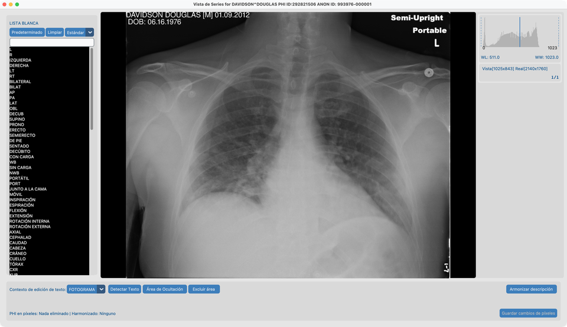
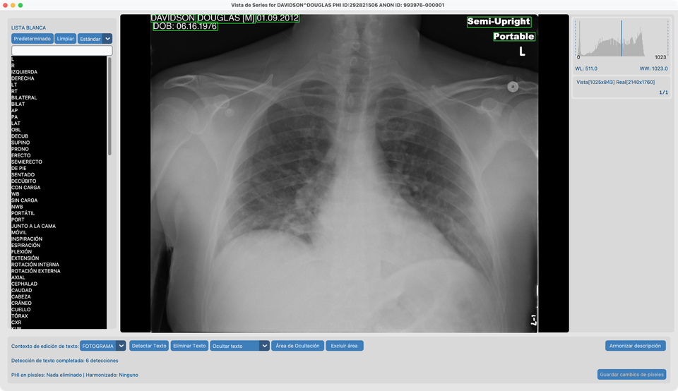
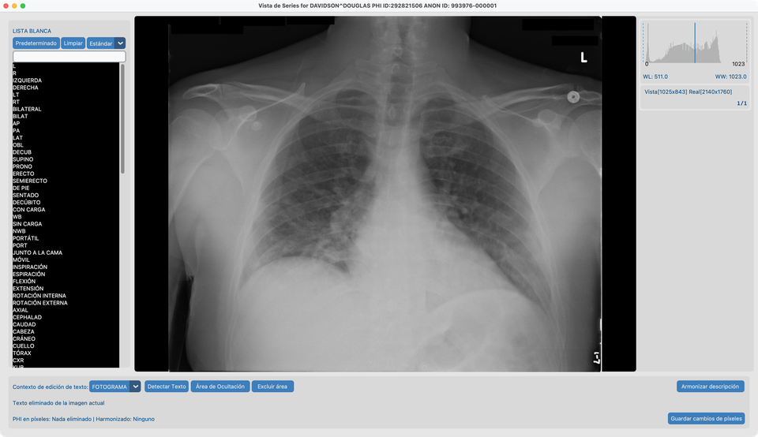
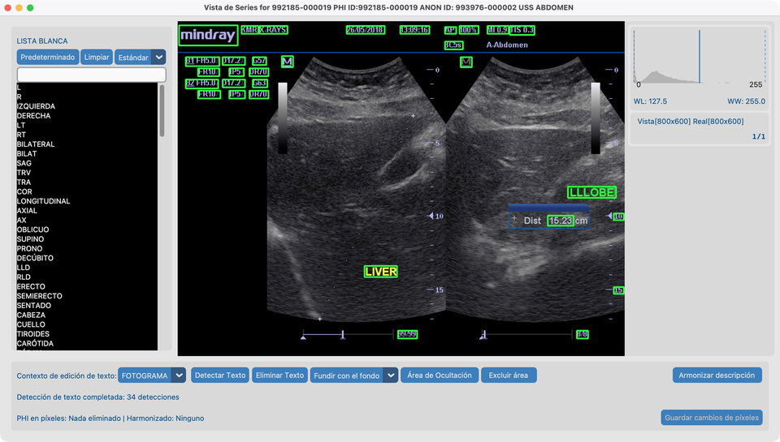
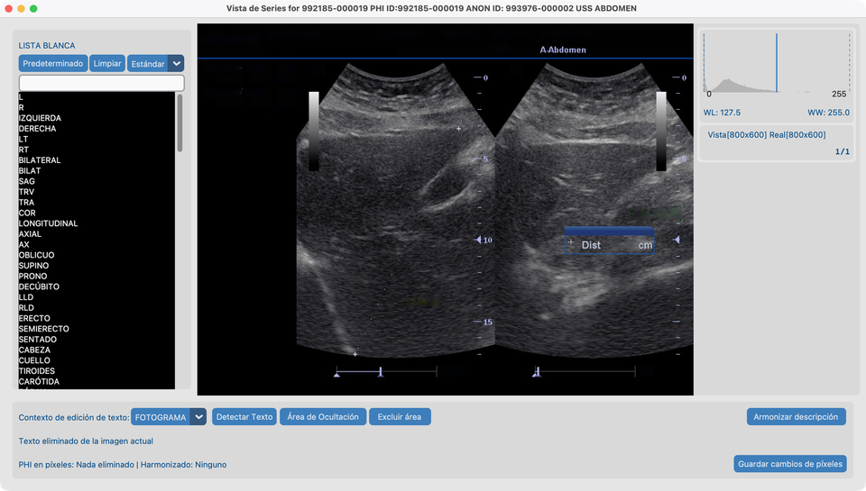
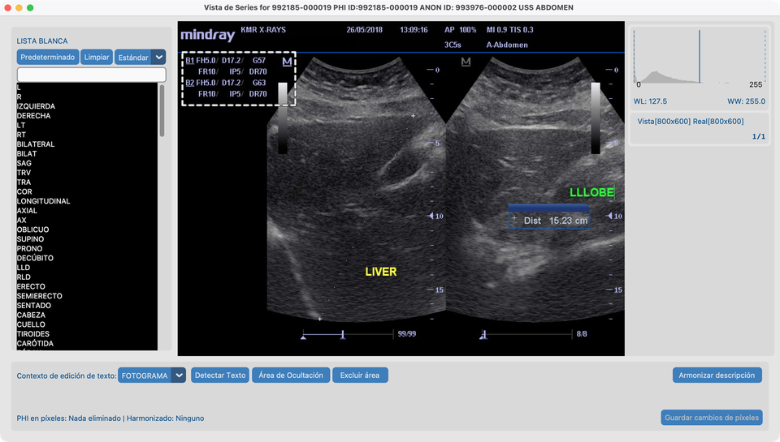
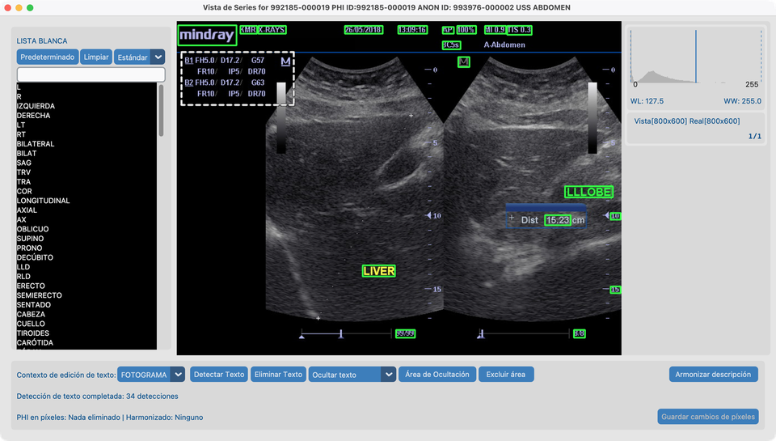

# 8.1 Quitar PHI de píxeles

Algunas imágenes tienen **nombres de paciente o etiquetas dibujadas en los píxeles**. Limpiar solo las etiquetas DICOM no las elimina.

## Series de demo

| Serie | Ruta | Usada para |
| --- | --- | --- |
| **`davidson_cxr`** | `tests/controller/assets/test_dcm_files/davidson_cxr` | Lista blanca → Detectar → **Ocultar** |
| **`us_rgb_single_frame`** | `tests/controller/assets/test_dcm_files/us_rgb_single_frame` (`US_RGB_SingleFrame.dcm`) | Detectar → **Fundir con el fondo**; **Excluir área** en el bloque de parámetros de máquina bajo **mindray** |

Importe cada carpeta en su proyecto, luego abra la serie en **Vista de Series**.

## Objetivo

1. En `davidson_cxr`, detectar texto quemado y **ocultar** PHI conservando marcadores útiles mediante la lista blanca predeterminada.
2. En `us_rgb_single_frame`, detectar texto quemado y eliminarlo **fundiéndolo con el fondo** (inpaint).
3. En la misma serie US en color, marcar la franja de parámetros de máquina que no es PHI con **Excluir área** para que Detectar Texto y Eliminar Texto la omitan.

## Antes de empezar

1. Complete [Configuración de Funciones de IA](../../03-ai-features-setup/) para que los modelos OCR estén listos.
2. Importe las series de demo y ábralas en Vista de Series desde el [Conjunto de datos](../../07-view/).

## Flujo en `davidson_cxr` (ocultar)

Siga estos pasos en orden. Las capturas coinciden con esta fixture.

### 1. Lista blanca predeterminada y contexto Fotograma

1. Conserve la **lista blanca predeterminada** (no la limpie).
2. Ponga el contexto de edición en **FOTOGRAMA** (aún no toda la serie).

### 2. Detectar Texto

1. Pulse **Detectar Texto**.
2. Espere a que termine la detección. Los **rectángulos verdes** marcan texto que se eliminaría.

En esta radiografía de tórax debería ver cajas verdes alrededor del nombre del paciente, fecha, fecha de nacimiento y PHI similar — pero **no** alrededor de **Portable** o **L**. Esas palabras ya están en la lista blanca predeterminada, así que Detectar Texto las deja en paz.

**Desplegable de coincidencia de lista blanca** (junto a Predeterminado / Limpiar — aquí en **Estándar**):

Controla cuán cerca debe coincidir el texto OCR con una entrada de lista blanca para tratarse como conservado:

| Ajuste | Efecto |
| --- | --- |
| **Exacto** | Solo ocultar texto que coincida letra a letra con una entrada de lista blanca |
| **Estricto** | Casi exacto — solo errores OCR mínimos |
| **Estándar** (predeterminado) | Permite pequeños errores OCR (por ejemplo `AXIL` sigue coincidiendo con `AXIAL`) |
| **Flexible** | El más indulgente — mejor para texto ruidoso y marcadores cortos |

Use un ajuste más estricto si se omite demasiado texto; uno más laxo si los marcadores útiles siguen siendo enmarcados.

### 3. Revisar y poner en lista blanca lo que se conserva

1. Si un rectángulo verde cubre texto que quiere **conservar**, pulse ese rectángulo.
2. El texto se añade a la lista blanca de la izquierda y no se eliminará.

En `davidson_cxr`, **Portable** y **L** ya están cubiertos por la lista blanca predeterminada — normalmente no necesita añadirlos otra vez.

### 4. Eliminar Texto usando ocultar

1. Ponga el desplegable de modo de eliminación en **Ocultar texto**.
2. Pulse **Eliminar Texto**.
3. Las regiones PHI pasan a negro sólido; los conservados en lista blanca permanecen.
4. Pulse **Guardar cambios de píxeles** cuando esté satisfecho.

Ocultar es la elección habitual para desidentificación: el texto eliminado desaparece claramente y no se puede recuperar de los píxeles.

## Flujo en `us_rgb_single_frame` (fundir con el fondo)

Use este fotograma de ecografía en color cuando quiera que el texto eliminado se vea como tejido cercano en lugar de barras negras.

### 5. Eliminar Texto usando fundir con el fondo

1. Importe y abra **`us_rgb_single_frame`** (`US_RGB_SingleFrame.dcm`) en Vista de Series.
2. Mantenga el contexto de edición en **FOTOGRAMA**.
3. Ponga el desplegable de modo de eliminación en **Fundir con el fondo**.
4. Pulse **Detectar Texto** y espere los rectángulos verdes.

5. Pulse **Eliminar Texto**.
6. El texto detectado se pinta fundiendo con píxeles circundantes (inpaint), luego **Guardar cambios de píxeles**.

**Ocultar** vs **Fundir con el fondo**: ocultar sustituye el texto por negro; fundir rellena el área para que coincida con la imagen alrededor. Prefiera ocultar cuando necesite una redacción obvia e irreversible; prefiera fundir cuando un resultado menos llamativo sea aceptable (por ejemplo algunas superposiciones de ecografía).

## Flujo en US en color (Excluir área)

Use la misma serie **`us_rgb_single_frame`** cuando el OCR enmarque ajustes de máquina que **no son PHI**. **Excluir área** omite una región espacial para Detectar Texto y Eliminar Texto sin cambiar píxeles (a diferencia de **Área de Ocultación**).

### 6. Excluir el bloque de parámetros bajo mindray

En este fotograma, un bloque denso de parámetros de máquina (ganancia, profundidad, FR, DR y tokens similares) está a la **izquierda superior**, directamente **debajo** del logotipo **mindray**.

1. Abra **`us_rgb_single_frame`** en Vista de Series con contexto de edición **FOTOGRAMA**.
2. Dibuje un rectángulo que cubra ese bloque de parámetros (deje **mindray** y etiquetas PHI / de sitio verdaderas fuera si aún quiere detectarlas). Los dibujos pendientes aparecen como rectángulos **azul sólido**.
3. Pulse **Excluir área**. El rectángulo pasa a la lista de exclusión y se redibuja como un **contorno blanco punteado** (sin relleno).

4. Pulse **Detectar Texto**. Deberían aparecer cajas verdes en texto PHI / de proveedor **fuera** del bloque; los tokens de parámetros dentro de la región punteada **no** deberían enmarcarse para eliminación.

5. Opcionalmente elija **Fundir con el fondo** o **Ocultar texto**, luego **Eliminar Texto** y **Guardar cambios de píxeles**.
6. Pulse un rectángulo blanco punteado para quitarlo de la lista de exclusión si necesita ajustar.

**Lista blanca** vs **Excluir área** vs **Área de Ocultación**: la lista blanca conserva *cadenas* OCR concretas; Excluir área omite una *región* (sin cambio de píxeles); Área de Ocultación pinta de negro los rectángulos dibujados. Prefiera fijar rectángulos de exclusión **antes** de Detectar Texto (o Detectar de nuevo tras ajustar). Con contexto de edición **Series**, el dibujo se propaga entre fotogramas para poder excluir el mismo panel en un bucle de cine.

## Tras la demo

- El estado **PHI de píxeles** del Conjunto de datos debería actualizarse para cada serie que guardó.
- Las listas blancas de modalidad y el desplegable de coincidencia (Exacto → Flexible) viven en Vista de Series; una coincidencia más estricta significa que menos aciertos OCR se tratan como conservados de lista blanca.
- Las regiones de exclusión son de la sesión actual de Vista de Series (igual que otras superposiciones del lienzo). Vuelva a abrir la serie y redibuje si las necesita otra vez.
- Para ejecutar la misma herramienta en muchos estudios, véase [8.4 Ejecutar en muchos estudios](../05-run-on-many-studies/).

## Cómo se ve cuando va bien

- En `davidson_cxr`: PHI ocultado; marcadores de orientación conservados si están en lista blanca.
- En `us_rgb_single_frame`: etiquetas quemadas fundidas sin barras negras sólidas; con Excluir área, el bloque de parámetros mindray no se elimina como PHI.
- La columna **PHI de píxeles** se actualiza en el Conjunto de datos.

## Si falla

- Muchas cajas falsas → endurezca la rigor de coincidencia; ponga en lista blanca lo que conserve; o **Excluir área** para paneles enteros.
- Texto perdido → **Área de Ocultación** manual.
- Texto de parámetros aún enmarcado → amplíe el rectángulo de exclusión y Detecte de nuevo; pulse contornos punteados para borrar y redibujar.
- Herramientas en gris → termine [Funciones de IA](../../03-ai-features-setup/).

## Siguientes pasos

Continúe con [8.2 Armonizar nombres](../03-harmonize-names/) usando **`CT_Head_With_Contrast`**.
