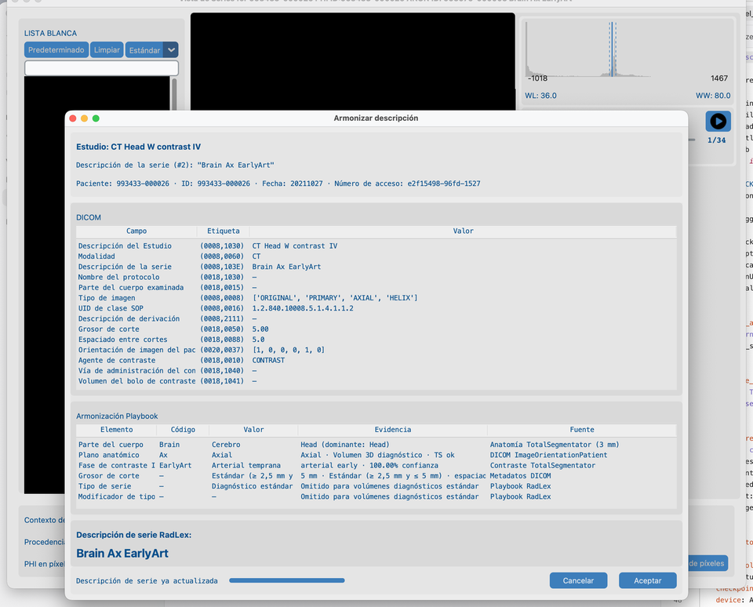
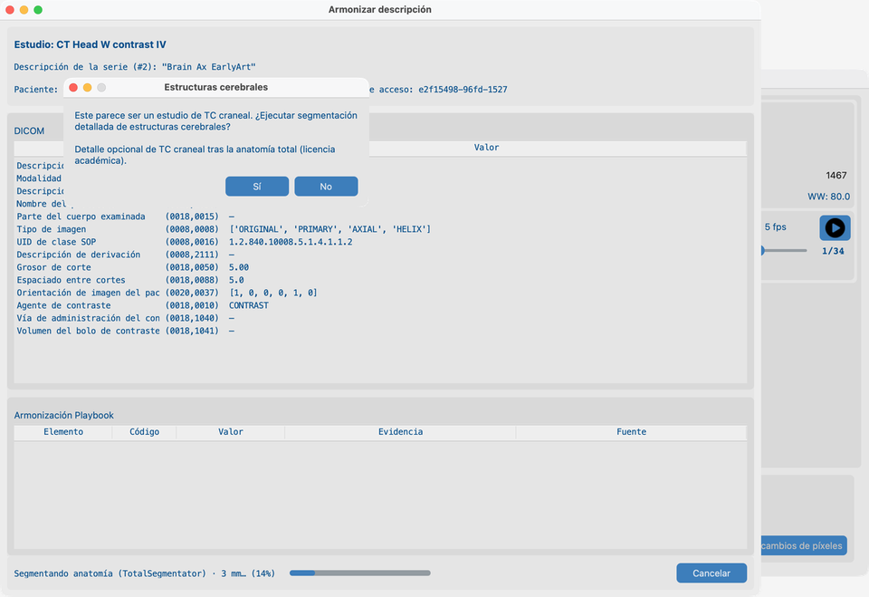
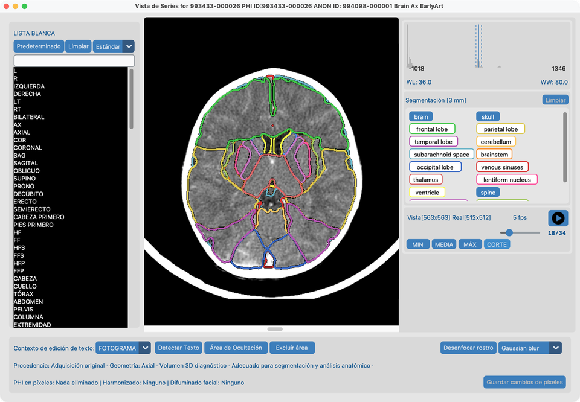
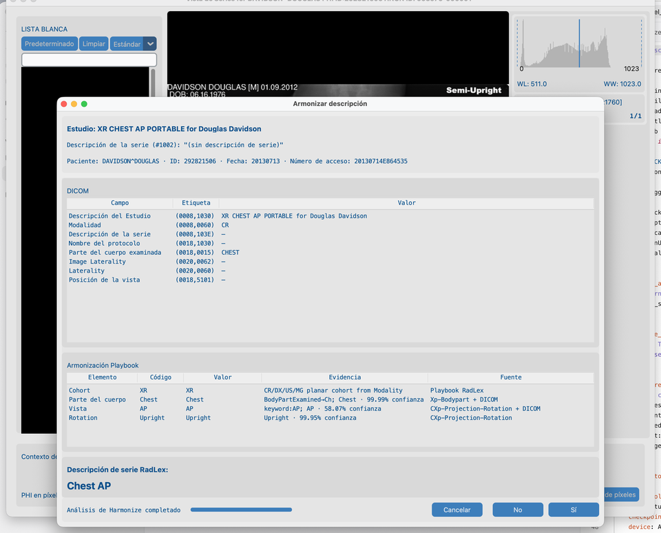
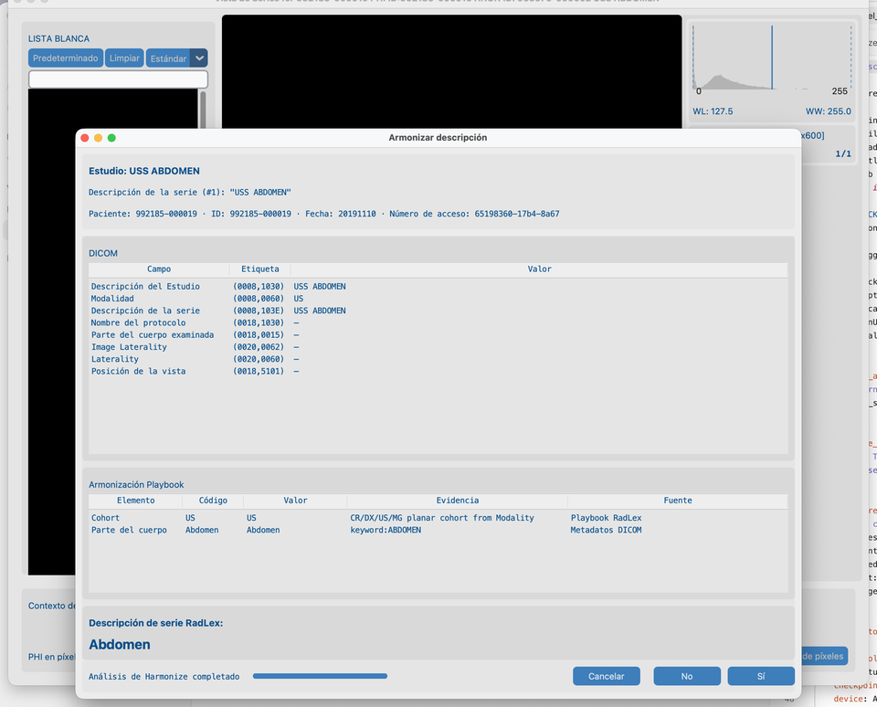

# 8.2 Armonizar nombres

Los conjuntos de datos de investigación suelen usar texto inconsistente de **Series Description**. **Harmonize** sugiere un nombre estándar a partir de la anatomía y (para CT/MR) el contraste — estilo RSNA Radiology Playbook / RadLex. **No** cambia píxeles.

## Series de demo

| Fixture | Ruta bajo `tests/controller/assets/test_dcm_files/` | Qué muestra |
| --- | --- | --- |
| **`CT_Head_With_Contrast`** | `CT_Head_With_Contrast` | Ruta CT: anatomía / contraste TotalSegmentator, mensaje de estructuras cerebrales, superposiciones |
| **`davidson_cxr`** | `davidson_cxr` | Ruta planar XR: **Xp-Bodypart** + **CXp-Projection-Rotation** opcionales |
| **`us_rgb_single_frame`** | `us_rgb_single_frame` | Ruta planar US: solo metadatos DICOM (sin TotalSegmentator) |

Importe una serie, ábrala en **Vista de Series** y ejecute Harmonize. Reutilice **`CT_Head_With_Contrast`** en [8.3 Desenfocar caras](../04-blur-faces/).

## Objetivo

1. En **`CT_Head_With_Contrast`**: ejecutar **Armonizar descripción**, responder al mensaje de estructuras cerebrales cuando se ofrezca, Aplicar, luego revisar las superposiciones de segmentación en el corte medio.
2. En **`davidson_cxr`** y **`us_rgb_single_frame`**: ejecutar Harmonize y leer la tabla Playbook — **Fuente** nombra el modelo o DICOM (misma idea que “anatomía TotalSegmentator” de CT).

## Antes de empezar

1. Complete [Configuración de Funciones de IA](../../03-ai-features-setup/) — paquete CT de Harmonize, resolución y Estructuras cerebrales para la demo CT.
2. Opcionalmente descargue **parte del cuerpo XR** y **proyección de tórax XR** para que la demo CXR muestre fusión por píxeles (sin ellos, XR sigue armonizando desde etiquetas DICOM).
3. Importe las series de demo ([Buscar](../../06-search/)) y abra cada una en **Vista de Series** ([Vista](../../07-view/) — clic derecho en la fila de la serie).

## Flujo en `CT_Head_With_Contrast`

### 1. Armonizar descripción (desde Vista de Series)

1. Con `CT_Head_With_Contrast` abierto en **Vista de Series**, pulse **Armonizar descripción**.
2. Espere a que termine el análisis — la tabla de **Armonización Playbook** se rellena con evidencia de anatomía / contraste (no una tabla vacía a mitad del progreso).
3. Revise la Series Description sugerida, luego **Sí** para aplicar, o **No** / **Cancelar**.

La Vista de Series permanece detrás del diálogo para conservar el contexto de la serie abierta.

### 2. Mensaje de estructuras cerebrales

En una serie CT de cabeza, Harmonize pregunta si ejecutar **segmentación detallada de estructuras cerebrales** antes de que el trabajo continúe:

1. Lea el mensaje Sí/No de **Estructuras cerebrales** (se requiere licencia académica / modelos — véase [Funciones de IA](../../03-ai-features-setup/)).
2. Elija **Sí** para incluir estructuras cerebrales en esta ejecución, o **No** solo para anatomía estándar.

### 3. Vista de Series segmentada

Tras Aceptar una ejecución de Harmonize que incluyó estructuras cerebrales (**Sí** en el mensaje):

1. Vista de Series muestra botones de pestillo para el **cerebro** completo más estructuras detalladas (tronco encefálico, lóbulos, ventrículos, …) cuando corrió el paquete con licencia.
2. Seleccione **todas** las estructuras que quiera revisar (incluido **cerebro**).
3. Vaya al **corte medio** para ver superposiciones en un fotograma representativo.

## Harmonize planar (XR y US)

CR/DX, ecografía y mamografía usan una ruta de Harmonize **separada** de CT/MR: sin TotalSegmentator, sin cubos de grosor/contraste. La tabla Playbook sigue usando **Evidencia** (qué se midió) y **Fuente** (de dónde vino).

### Radiografía de tórax (`davidson_cxr`)

1. Abra **`davidson_cxr`** en Vista de Series → **Armonizar descripción**.
2. Cuando están instalados los modelos XR, la Fuente de **Parte del cuerpo** es **Xp-Bodypart** (o fusionada con DICOM); **Vista** / **Rotación** usan **CXp-Projection-Rotation** cuando la anatomía es Chest.
3. La evidencia se parece a las filas del clasificador CT — p. ej. `Chest · 99.00% confidence` — no tokens opacos `pixel:…`.
4. La rotación es solo de análisis; SeriesDescription permanece p. ej. `Chest AP` / `Chest Lat`.

### Ecografía (`us_rgb_single_frame`)

1. Abra **`us_rgb_single_frame`** en Vista de Series → **Armonizar descripción**.
2. Cohorte / parte del cuerpo / modo vienen de etiquetas y palabras clave DICOM; la Fuente es **metadatos DICOM** o **RadLex Playbook**.
3. No corren paquetes de píxeles XR ni TotalSegmentator en US.

## Notas (igual que en producción)

- Scouts, MIP/VR, informes de dosis y series similares suelen omitirse.
- **CT:** segmentación de anatomía + fase de contraste cuando los modelos lo permiten (TotalSegmentator).
- **MR:** anatomía desde paquetes MR; contraste IV desde cabeceras DICOM (TotalSegmentator).
- **XR (CR/DX):** Harmonize planar; Xp-Bodypart opcional + vista/rotación CXp solo tórax (descargas opcionales).
- **US / MG:** Harmonize planar solo desde DICOM — **sin** TotalSegmentator y **sin** paquetes de píxeles XR.
- **SC / OT / DOC:** no se ofrece Harmonize.
- Tras armonizar todas las series de un estudio, se aplica automáticamente la mejor **descripción de estudio LOINC** (misma ruta que el lote de IA). Cámbiela después desde el [Conjunto de datos](../../07-view/#edit-harmonized-descriptions). Estudios XR/US/MG puros usan el prefijo LOINC correspondiente.
- En el [Conjunto de datos](../../07-view/#edit-study-and-series-descriptions), doble clic en una descripción de estudio o serie (o selección múltiple y clic derecho para **Establecer descripción**) para elegir nombres LOINC (estudio) o RadLex (serie) — también en filas aún no verdes. Clic simple solo selecciona la fila.
- Los resultados se almacenan en caché bajo la carpeta de la serie — **Borrar caché de análisis** para una ejecución CT/MR nueva.
- Lote: [8.4 Ejecutar en muchos estudios](../05-run-on-many-studies/) (la resolución viene de Funciones de IA, no por lote).

## Cómo se ve cuando va bien

- CT: SeriesDescription se ve coherente para este CT de cabeza; **Armonizado** del Conjunto de datos se actualiza; tras Sí cerebral, las superposiciones de pestillo se dibujan en el corte medio.
- CXR: **Fuente** del Playbook nombra **Xp-Bodypart** / **CXp-Projection-Rotation** (o DICOM) con evidencia de confianza legible.
- US: las filas del Playbook citan **metadatos DICOM** / **RadLex Playbook**; el nombre sugerido coincide con anatomía/modo de ecografía.

## Si falla

- Serie no adecuada → omisión esperada.
- Ya armonizado → Borrar caché de análisis para volver a ejecutar.
- Modelos no listos → [Funciones de IA](../../03-ai-features-setup/).

## Siguientes pasos

Continúe con [8.3 Desenfocar caras](../04-blur-faces/) en la **misma** serie `CT_Head_With_Contrast` (Gaussian).
