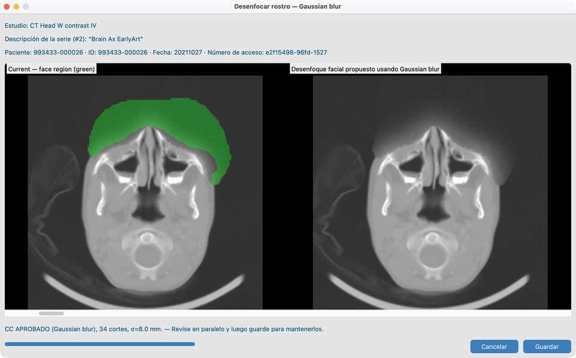

# 8.3 Desenfocar caras

En algunos exámenes de **CT o MR de cabeza**, los rasgos faciales podrían permitir el reconocimiento incluso tras limpiar las etiquetas. **Desidentificación facial** desenfoca la región de la cara y le permite revisar la calidad antes de conservar el resultado.

## Serie de demo

**`CT_Head_With_Contrast`** — la misma serie que [8.2 Armonizar nombres](../03-harmonize-names/)  
(`tests/controller/assets/test_dcm_files/CT_Head_With_Contrast`).

Prefiera Harmonize primero para que las pistas anatómicas mejoren la elegibilidad, luego abra el desenfoque facial en esta serie.

## Objetivo

En `CT_Head_With_Contrast`, ejecutar desenfoque facial en modo **Gaussian**, revisar el CC y guardar si procede.

## Antes de empezar

1. Complete [Configuración de Funciones de IA](../../03-ai-features-setup/) — modelos de cara y licencia académica.
2. Importe **`CT_Head_With_Contrast`** (e idealmente termine Harmonize en 8.2).
3. Abra la serie en Vista de Series.

## Flujo en `CT_Head_With_Contrast` (Gaussian)

1. Abra `CT_Head_With_Contrast` en Vista de Series.
2. Inicie **Desenfoque facial** / vista previa.
3. Ponga el modo de desenfoque en **Gaussian** (predeterminado habitual de esta demo).
4. Revise lado a lado: imagen actual vs desenfoque propuesto; el contorno verde muestra la región facial.
5. Compruebe **CC APROBADO** vs **CC FALLIDO** (píxeles cambiados fuera de la máscara).
6. **Guardar** para conservar, o descartar.

### Otros modos de desenfoque

El lote y Vista de Series también pueden ofrecer mediana, pixelado o relleno de ruido. La demo documentada usa solo **Gaussian**.

## Lote

Véase [8.4 Ejecutar en muchos estudios](../05-run-on-many-studies/). Las series que no son de cabeza se omiten.

## Cómo se ve cuando va bien

- Cara cubierta en `CT_Head_With_Contrast`; anatomía fuera de la máscara sin cambios.
- El estado **Desenfoque facial** del Conjunto de datos se actualiza.

## Si falla

- No es serie de cabeza / máscara facial insuficiente → omitir o ejecutar Harmonize primero (8.2).
- Ya aplicado → no vuelve a desenfocar salvo que use una vía deliberada de reejecución.
- CC FALLIDO → no guarde; ajuste el modo o inspeccione la máscara.
- Herramientas en gris → [Funciones de IA](../../03-ai-features-setup/).

## Siguientes pasos

Continúe con [8.4 Ejecutar en muchos estudios](../05-run-on-many-studies/) para lotear estas herramientas en una cohorte.
