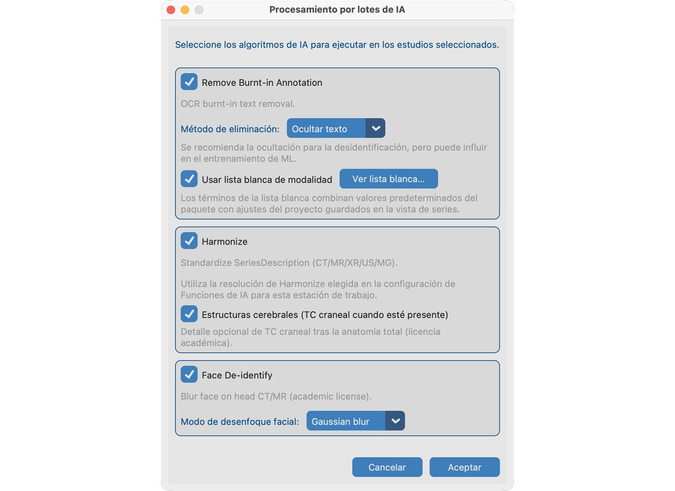

# 8.4 Ejecutar en muchos estudios

**Procesamiento por lotes de IA** ejecuta las mismas herramientas de los capítulos 8.1–8.3 en estudios seleccionados del Conjunto de datos—sin abrir cada serie a mano.

## Estudios de demo

Use las mismas fixtures que practicó una a una:

| Herramienta en el lote | Fixture a incluir |
| --- | --- |
| Quitar PHI de píxeles | **`davidson_cxr`** |
| Harmonize + Desenfoque facial | **`CT_Head_With_Contrast`** |

Importe ambas (o el árbol completo `test_dcm_files`), abra **Conjunto de datos**, seleccione esos estudios e inicie Procesamiento por lotes de IA.

## Objetivo

Procesar una cohorte para texto quemado, Harmonize y/o desenfoque facial con progreso y un resumen.

## Antes de empezar

1. Importe las series de demo anteriores (y cualquier otro estudio que necesite).
2. Termine [Configuración de Funciones de IA](../../03-ai-features-setup/) para cada herramienta que va a ejecutar.
3. Opcionalmente recorra 8.1–8.3 una vez para conocer los resultados esperados.

## Iniciar un lote

1. Abra **Conjunto de datos** y seleccione estudios (incluya `davidson_cxr` y `CT_Head_With_Contrast` para una demo completa).
2. Inicie **Procesamiento por lotes de IA**.
3. En opciones, elija algoritmos:
   - Quitar PHI de píxeles (ocultar vs fundir; lista blanca de modalidad activada/desactivada) — ejercita `davidson_cxr`
   - Harmonize (resolución CT/MR de la estación desde Funciones de IA) — ejercita `CT_Head_With_Contrast`
   - Desenfoque facial (**Gaussian** para coincidir con el capítulo 8.3) — ejercita `CT_Head_With_Contrast`
4. Previsualice las listas blancas de modalidad si se ofrecen.
5. Confirme el aviso de memoria si aparece, luego inicie.

## Orden de trabajo

Para cada serie, las herramientas seleccionadas se ejecutan en un orden estable (PHI de píxeles → Harmonize → desenfoque facial) para que el uso de memoria sea predecible.

## Durante la ejecución

- El progreso muestra estudio / serie / fase.
- Cancelar detiene tras el paso actual cuando es posible.
- Poca memoria puede abortar con un aviso claro.
- Las series ya procesadas se omiten por defecto.

## Después

- Lea el resumen (completados / omitidos / fallidos).
- Compruebe una muestra en Vista de Series en `davidson_cxr` y `CT_Head_With_Contrast` antes de exportar.
- El mismo trabajo en un **servidor sin ventana** → [Ejecutar sin interfaz](../../10-headless/).

## Cómo se ve cuando va bien

- El resumen coincide con lo esperado; columnas de IA del Conjunto de datos actualizadas para los estudios de demo.
- El archivo de registro detalla cualquier omisión.

## Si falla

- Funciones no listas → [Funciones de IA](../../03-ai-features-setup/).
- Sin series para la selección → compruebe la selección del Conjunto de datos.
- Memoria insuficiente → cierre otras aplicaciones o procese menos estudios.

## Siguientes pasos

Continúe con [Enviar](../../09-send/) para exportar estudios anonimizados (o [ejecutar sin interfaz](../../10-headless/) para lotes en servidor).
