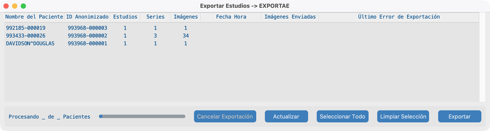
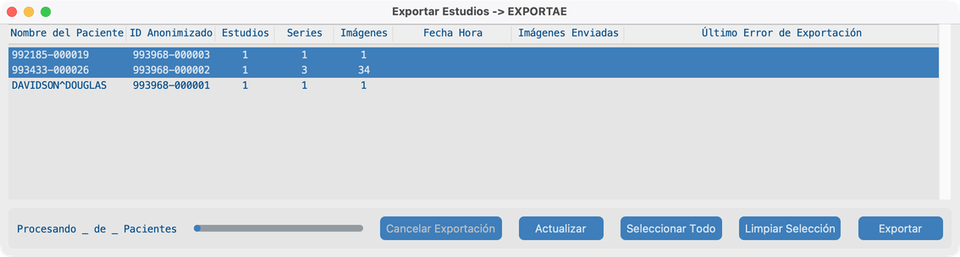
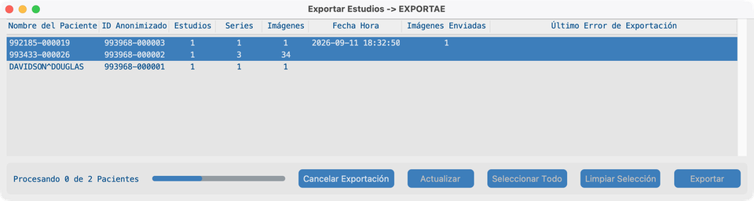
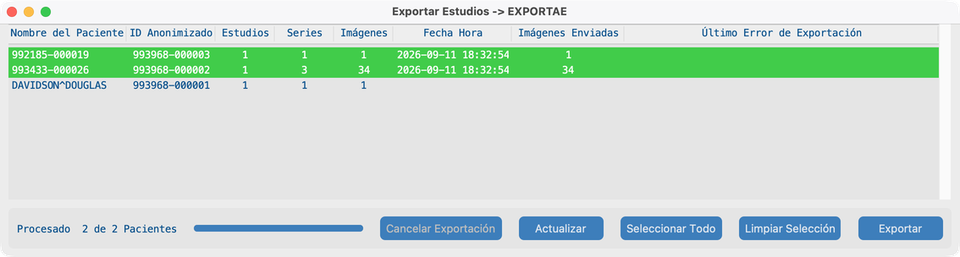

# Enviar

## Objetivo

Enviar pacientes anonimizados a un sistema DICOM remoto o a AWS S3. Observe el estado hasta que las filas se muestren como enviadas.

## Antes de empezar

1. Configure el **Servidor de Exportación** (o AWS Cognito para S3) en [Ajustes del Proyecto](../05-create-project/).
2. Importe al menos un estudio para que la lista de Enviar no esté vacía ([Buscar](../06-search/) o Conjunto de datos).

## Flujo de trabajo

### 1. Vista inicial de Enviar

1. Desde el Panel de control, pulse **Enviar**.
2. La ventana de Exportación lista pacientes anonimizados (un paciente puede incluir varios estudios).
3. Confirme que el título muestra su destino (AE title de exportación o proyecto AWS).

### 2. Seleccionar pacientes

1. Pulse una o más filas de paciente (SHIFT / CMD o CTRL para selección múltiple), o pulse **Seleccionar Todo**.
2. Use **Limpiar Selección** si necesita empezar de nuevo.
3. Las filas ya enviadas (verdes) suelen dejarse; la aplicación no reenvía objetos completados por defecto.

### 3. Enviando

1. Pulse **Exportar**.
2. Para destinos DICOM, la aplicación hace eco del servidor de exportación primero; corrija errores de conexión con TI si el eco falla.
3. Mientras corre la exportación, los botones de acción se desactivan, **Cancelar Exportación** se activa y la línea de estado muestra el progreso (por ejemplo Procesando 0 de N Pacientes).
4. **Fecha Hora** e **Imágenes Enviadas** se actualizan al terminar cada paciente.

### 4. Enviado

1. Cuando terminan todos los pacientes seleccionados, el estado muestra **Procesado N de N Pacientes**.
2. Las filas correctas pasan a **verde** con **Fecha Hora** e **Imágenes Enviadas** rellenados.
3. Los pacientes que no seleccionó permanecen sin cambios.
4. Las filas fallidas pasan a **rojo** y muestran **Último Error de Exportación**; selecciónelas y exporte de nuevo si hace falta.

## Cómo se ve cuando va bien

- Los pacientes seleccionados terminan con filas verdes y conteos de **Imágenes Enviadas** coincidentes.
- El PACS de destino o el bucket S3 muestra los estudios anonimizados.

## Si falla

- Fallo de eco / autenticación → compruebe el servidor de exportación o las credenciales de AWS Cognito con TI.
- Nada seleccionado → seleccione pacientes primero.
- Fallos parciales → lea **Último Error de Exportación**, corrija el destino, vuelva a seleccionar las filas rojas, Exportar de nuevo.

## Siguientes pasos

Opcional: [Ejecutar sin interfaz](../10-headless/) para recepción en laboratorio/servidor o lote nocturno.
