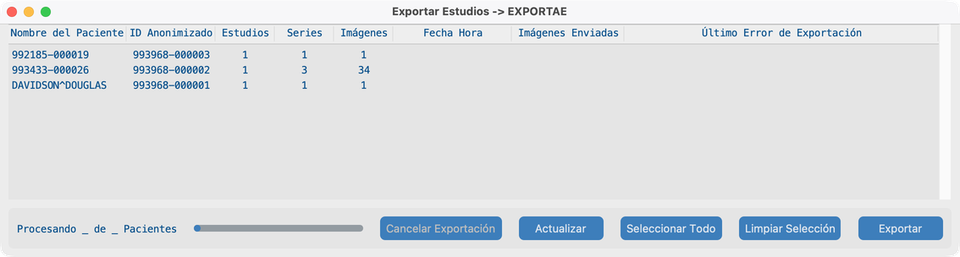
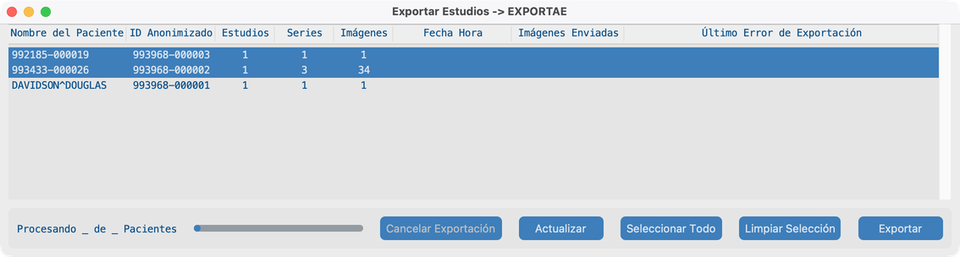
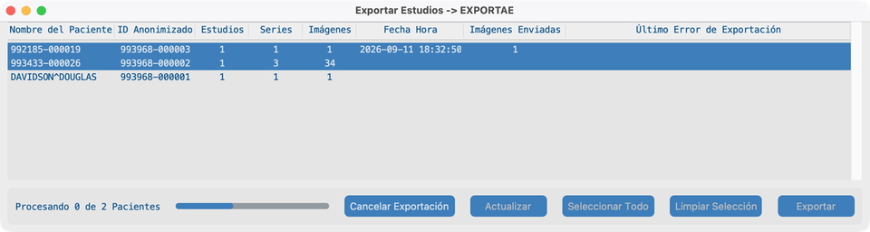
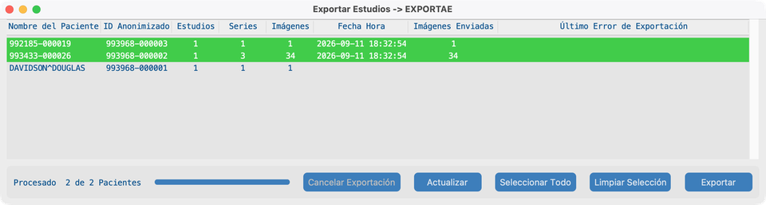

# Enviar

## Objetivo

Enviar pacientes anonimizados a un sistema DICOM remoto o a AWS S3. Observe el estado hasta que las filas se muestren como enviadas.

## Antes de empezar

1. Configure el **Servidor de Exportación** (o AWS Cognito para S3) en [Ajustes del Proyecto](../05-create-project/).
2. Importe al menos un estudio para que la lista de Enviar no esté vacía ([Buscar](../06-search/) o Conjunto de datos).

## Flujo de trabajo

### 1. Vista inicial de Enviar

1. Desde el Panel de control, pulse **Enviar**.
2. La ventana de Exportación lista pacientes anonimizados (un paciente puede incluir varios estudios).
3. Confirme que el título muestra su destino (AE title de exportación o proyecto AWS).

### 2. Seleccionar pacientes

1. Pulse una o más filas de paciente (SHIFT / CMD o CTRL para selección múltiple), o pulse **Seleccionar Todo**.
2. Use **Limpiar Selección** si necesita empezar de nuevo.
3. Las filas ya enviadas (verdes) suelen dejarse; la aplicación no reenvía objetos completados por defecto.

### 3. Enviando

1. Opcionalmente active **Exportar segmentos como DICOM-SEG** (véase [abajo](#exportar-segmentos-como-dicom-seg)).
2. Pulse **Exportar**.
3. Para destinos DICOM, la aplicación hace eco del servidor de exportación primero; corrija errores de conexión con TI si el eco falla.
4. Mientras corre la exportación, los botones de acción se desactivan, **Cancelar Exportación** se activa y la línea de estado muestra el progreso (por ejemplo Procesando 0 de N Pacientes).
5. **Fecha Hora** e **Imágenes Enviadas** se actualizan al terminar cada paciente.

### 4. Enviado

1. Cuando terminan todos los pacientes seleccionados, el estado muestra **Procesado N de N Pacientes**.
2. Las filas correctas pasan a **verde** con **Fecha Hora** e **Imágenes Enviadas** rellenados.
3. Los pacientes que no seleccionó permanecen sin cambios.
4. Las filas fallidas pasan a **rojo** y muestran **Último Error de Exportación**; selecciónelas y exporte de nuevo si hace falta.

## Exportar segmentos como DICOM-SEG

Cuando **Exportar segmentos como DICOM-SEG** está marcado en la ventana Enviar, la aplicación convierte los segmentos en disco en objetos DICOM Segmentation y los envía junto con las imágenes anonimizadas (servidor DICOM o AWS S3).

### Qué se incluye

Por cada serie con datos de segmentos:

- Máscaras de anatomía **TotalSegmentator** del caché de la serie (`0_TS_SEG/seg/`), por ejemplo cerebro y estructuras cerebrales tras Harmonizar / Brain Structures
- **Anotaciones ROI de usuario** de la vista de serie (`0_TS_SEG/annotations/`)

Las máscaras de Face Blur **no** se exportan como DICOM-SEG.

### Cuántos archivos DICOM

- **Un archivo DICOM-SEG por serie de origen** (no un archivo por órgano o etiqueta).
- En local se escribe junto a las imágenes de esa serie como `roi_annotations.seg.dcm` antes del envío.
- Ese único archivo contiene **todos** los segmentos de la serie (estructuras TS y ROI de usuario) como entradas en la `SegmentSequence` DICOM, con frames binarios por segmento en los cortes con vóxeles.

### Formato SEG utilizado

Los objetos exportados siguen el IOD DICOM **Segmentation Storage** (clase SOP `1.2.840.10008.5.1.4.1.1.66.4`), modalidad **SEG**:

| Atributo | Valor usado |
| --- | --- |
| `SegmentationType` | `BINARY` |
| `BitsAllocated` / `BitsStored` | `1` (frames empaquetados en bits; permitido por DICOM para BINARY) |
| `ImageType` | `DERIVED\PRIMARY` |
| Sintaxis de transferencia | Explicit VR Little Endian |
| Tipos de algoritmo | `AUTOMATIC` para máscaras TotalSegmentator; `MANUAL` para ROI de usuario (mezclar en un archivo está permitido) |

También se incluye para enlace en el visor:

- `ReferencedSeriesSequence` de nivel superior (serie de origen + UIDs de instancia)
- `DimensionOrganizationSequence` / `DimensionIndexSequence` multiframe
- Por frame: posición/orientación del plano y referencias de derivación a los cortes de origen

**Visualización:** Orthanc y muchos PACS **almacenan** el SEG como serie hermana bajo el mismo estudio. El Explorador de Orthanc integrado y visores como Horos a menudo **no superponen** SEG sobre CT/MR aunque el objeto sea válido. Para revisar superposiciones, abra el **estudio completo** (imágenes + SEG) en una herramienta compatible con SEG como **3D Slicer**, MITK u OHIF — no el archivo SEG solo.

### Cómo aparece en el servidor DICOM

| | Imágenes CT / MR de origen | DICOM-SEG |
| --- | --- | --- |
| Estudio | Estudio anonimizado | **El mismo estudio** (`StudyInstanceUID`) |
| Serie | Serie de imagen original | **Serie distinta** (nuevo `SeriesInstanceUID`, número de serie `9001`) |
| Descripción de serie | Original (p. ej. Routine Brain) | `Anatomy Segments`, `ROI Annotations` o `Segments + ROI Annotations` |
| Instancias | Muchas instancias de imagen | **Una** instancia SEG para esa serie |

El objeto SEG **no** se guarda dentro de la serie de imagen de origen. En el archivo aparece como una **serie SEG hermana bajo el mismo estudio**.

Si una serie no tiene máscaras TS ni anotaciones de usuario, no se crea archivo SEG para esa serie.

### Columnas de la vista Exportar

La lista de pacientes incluye:

- **Imágenes** — recuento de instancias anonimizadas (excluye `roi_annotations.seg.dcm` preparados)
- **Segmentos** — total de **etiquetas** de segmento exportables del paciente (máscaras TS + ROI de usuario; Face Blur excluido)
- **Imágenes Enviadas** — archivos enviados con éxito. Con **Exportar segmentos como DICOM-SEG**, cada serie segmentada aporta **una** instancia SEG (todas las etiquetas de esa serie en un solo DICOM-SEG), ≈ `Imágenes + (series segmentadas)`

## Cómo se ve cuando va bien

- Los pacientes seleccionados terminan con filas verdes y conteos de **Imágenes Enviadas** coincidentes.
- El PACS de destino o el bucket S3 muestra los estudios anonimizados.
- Con **Exportar segmentos como DICOM-SEG** marcado, cada serie segmentada también tiene una serie **SEG** hermana en el destino (mismo estudio, serie distinta).

## Si falla

- Fallo de eco / autenticación → compruebe el servidor de exportación o las credenciales de AWS Cognito con TI.
- Nada seleccionado → seleccione pacientes primero.
- Fallos parciales → lea **Último Error de Exportación**, corrija el destino, vuelva a seleccionar las filas rojas, Exportar de nuevo.

## Siguientes pasos

Opcional: [Ejecutar sin interfaz](../10-headless/) para recepción en laboratorio/servidor o lote nocturno.
