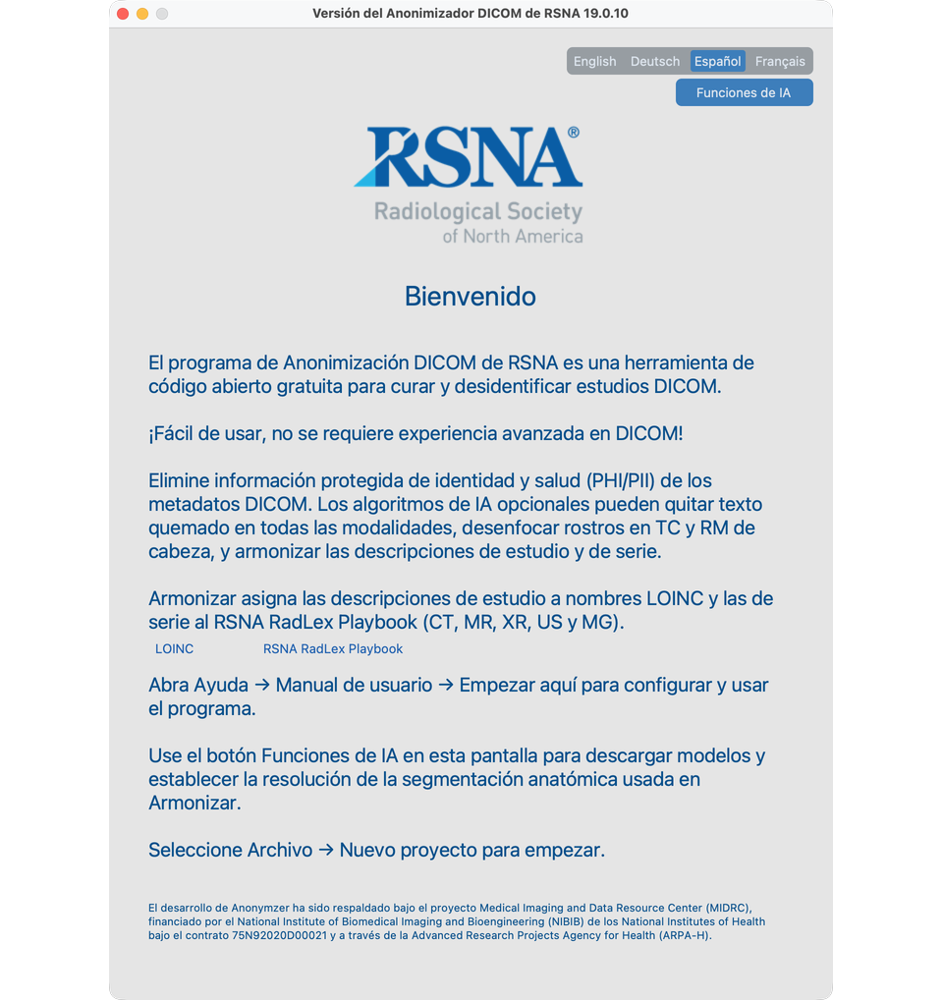

# T1 — Instalar y abrir la aplicación

## Objetivo
Instalar el Anonymizer y llegar a la pantalla Bienvenido con Funciones de IA disponibles.

## Pasos
1. Instale uv (`uv --version` para confirmar), cree un venv Python 3.12 que incluya tkinter, luego `uv pip install rsna-anonymizer` (19.0.1).
2. En macOS, `brew install libomp` antes de usar Funciones de IA.
3. Ejecute `rsna-anonymizer`; confirme que se abre Bienvenido; abra **Funciones de IA** e inicie las descargas necesarias.

## Vídeo
<!-- Replace VIDEO_ID when published

<iframe src="https://www.youtube.com/embed/VIDEO_ID" title="T1 Install" frameborder="0" allowfullscreen></iframe>

-->

Detalle completo: [Instalación y primer inicio](../02-install/)
