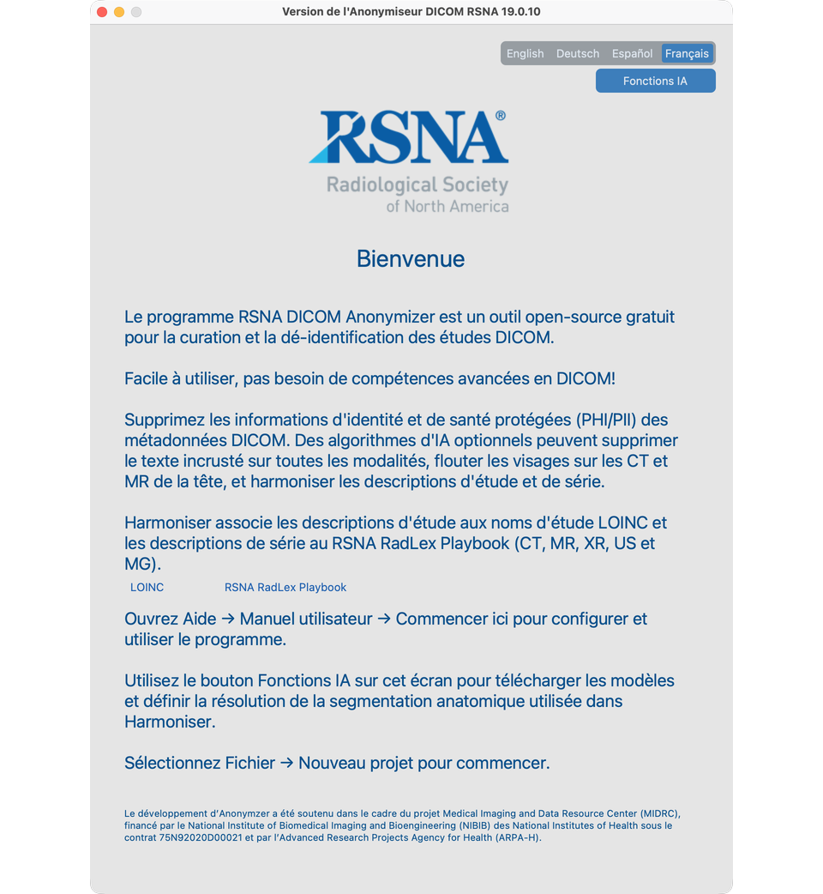

# Installation et premier lancement

**La version 19.0.1** est la première version officielle V19. Il vous faut **Python 3.11 ou 3.12** avec **tkinter**, installé via **uv**. Python 3.13 n’est pas pris en charge.

## Installation avec uv et tkinter

Il vous faut trois éléments : **uv**, un environnement Python avec **tkinter**, et sous macOS, pour les Fonctions IA, la bibliothèque C++ **libomp**.

### 1. Installer uv

[uv](https://docs.astral.sh/uv/) gère Python, l’environnement virtuel et les gros paquets d’IA.

```bash
# macOS / Linux
curl -LsSf https://astral.sh/uv/install.sh | sh

# Windows (PowerShell)
irm https://astral.sh/uv/install.ps1 | iex
```

Vérifiez que uv est disponible :

```bash
uv --version
```

### 2. Installer Python avec tkinter, puis l’application

La fenêtre de bureau a besoin de **tkinter**. Installez un Python qui l’inclut, créez le venv et installez **19.0.1** :


| Plateforme | Assurer la disponibilité de tkinter |
| ----------- | ------------------------------------------------------------------------------------------------------------------------------------- |
| **Windows** | Installez Python 3.11 ou 3.12 depuis [python.org](https://www.python.org/downloads/) avec **Add to PATH** et **tcl/tk and IDLE** |
| **macOS** | Préférez `uv python install 3.12` (Tk 9.x). Ou Homebrew : `brew install python@3.12 python-tk@3.12` |
| **Linux** | `sudo apt install python3.12 python3.12-tk python3.12-venv` (ou paquets 3.11 équivalents) |


```bash
uv python install 3.12
uv venv rsna-anonymizer --python 3.12
source rsna-anonymizer/bin/activate   # Windows: rsna-anonymizer\Scripts\activate

uv pip install rsna-anonymizer       # version 19.0.1
```

### 3. Vérifier l’installation

```bash
python --version          # 3.11.x or 3.12.x
python -m tkinter         # a small Tk window must open — required for the UI
rsna-anonymizer --version # should report 19.0.1
```

Si `python -m tkinter` échoue, recréez le venv avec un Python qui inclut Tk (tableau ci-dessus), puis réinstallez.

### 4. macOS uniquement — OpenMP pour les Fonctions IA

Sous macOS, les **Fonctions IA** (TotalSegmentator / contraste Harmonize et outils liés) ont besoin de la bibliothèque C++ OpenMP `**libomp`**. Installez-la une fois avec Homebrew **avant** de télécharger ou d’exécuter ces modèles :

```bash
brew install libomp
```

Sans `libomp`, le contraste Harmonize peut planter (par exemple code de sortie 139 ou erreurs OpenMP XGBoost). Sous Linux et Windows, cette étape n’est en général pas nécessaire.

### 5. Lancer

```bash
rsna-anonymizer
```

## Premier lancement



1. L’écran **Bienvenue** s’ouvre.
2. Optionnel mais recommandé : cliquez sur **Fonctions IA** dans Bienvenue pour télécharger les modèles / accepter la licence face (voir [Configuration des Fonctions IA](../03-ai-features-setup)). La configuration n’est disponible que depuis Bienvenue — fermez le projet pour y revenir plus tard. Sous macOS, installez d’abord `libomp` (étape 4 ci-dessus).
3. Créez ou ouvrez un projet depuis le menu **Fichier**.

## Mise à jour

```bash
source rsna-anonymizer/bin/activate
uv pip install --upgrade rsna-anonymizer
```

Notes de version : [CHANGELOG](https://github.com/RSNA/anonymizer/blob/master/CHANGELOG.md).

## Prochaines étapes

1. [Configuration des Fonctions IA](../03-ai-features-setup/) — depuis Bienvenue, télécharger les modèles (optionnel mais recommandé)
2. [Mots que nous utilisons](../04-words-we-use/), puis [Créer un projet](../05-create-project/)
