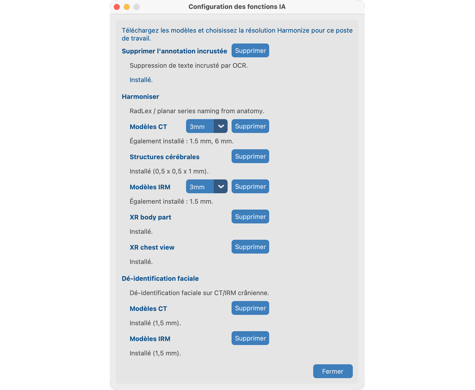

# Configuration des Fonctions IA

Les **Fonctions IA** sont **optionnelles**. Elles s’exécutent sur votre ordinateur après un téléchargement unique. Les images ne sont pas envoyées pour le traitement.

Faites ce chapitre **avant** les parcours d’outils sur `davidson_cxr` et `CT_Head_With_Contrast`.

## Objectif

Télécharger les modèles dont vous avez besoin et choisir la résolution Harmonize pour ce poste de travail.

## Ouvrir la configuration

Depuis l’écran **Bienvenue** uniquement : cliquez sur **Fonctions IA**.

Fermez le projet (ou lancez l’application) pour revenir à Bienvenue si vous devez télécharger des modèles ou modifier la résolution Harmonize plus tard.

## Ce que vous configurez (V19)

| Élément | Nécessaire pour la démo |
| --- | --- |
| **Supprimer le texte incrusté** (OCR) | Chapitre 8.1 — `davidson_cxr` |
| **Harmoniser** pack CT + résolution (1.5 / 3 / 6 mm) | Chapitre 8.2 — `CT_Head_With_Contrast` |
| **Harmoniser** région anatomique XR (optionnel) | Anatomie pixel pour CR/DX lorsque les tags DICOM de région anatomique manquent ou sont incorrects |
| **Harmoniser** vue thorax XR (optionnel) | Projection pixel AP/PA/Lat (+ QC de rotation) pour CR/DX thoraciques |
| **Dé-identification faciale** + licence académique `aca_…` | Chapitre 8.3 — `CT_Head_With_Contrast` |
| **Structures cérébrales** (pack sous licence, optionnel) | Chapitre 8.2 — invite Harmonize structures cérébrales |

Il n’y a **aucune case à cocher projet on/off**. Si les modèles sont installés et prêts, les outils apparaissent dans Vue des séries et dans le traitement par lots.

Harmonize XR fonctionne sans les packs région anatomique XR ou vue thorax (tags DICOM / mots-clés uniquement). Une fois installés, les séries CR/DX peuvent utiliser :

- Classifieur de région anatomique EfficientNet-B4 ([Xp-Bodypart-Mislabel-Checker](https://huggingface.co/spaces/MedicalAILabo/Xp-Bodypart-Mislabel-Checker) ; Mitsuyama et al., *European Radiology* 2025), fusionné avec l’anatomie DICOM.
- Classifieur de projection/rotation thorax uniquement ([CXp-Projection-Rotation-Mislabel-Checker](https://huggingface.co/spaces/MedicalAILabo/CXp-Projection-Rotation-Mislabel-Checker)) pour affiner AP/PA/Lat ; la rotation apparaît dans le tableau d’analyse Harmonize et n’est pas écrite dans SeriesDescription.

La mammographie et l’échographie n’utilisent pas ces modèles.

## Premières étapes

1. Ouvrez **Fonctions IA**.
2. Téléchargez **Supprimer le texte incrusté**, **Harmoniser** (CT) et **Dé-identification faciale**.
3. Saisissez ou validez la licence académique lorsque demandé (visage / structures cérébrales).
4. Choisissez la résolution Harmonize CT ; téléchargez si le pack manque.
5. Optionnellement, téléchargez **Structures cérébrales** pour la démo Harmonize CT, et **région anatomique XR** / **vue thorax XR** pour la démo Harmonize CXR du chapitre 8.2.
6. Fermez la boîte de dialogue. Les préférences restent sur ce poste de travail.

!!! tip "Internet uniquement pour le téléchargement"
    Une fois les modèles et la licence en place, le traitement est local. Sous **macOS**, installez la bibliothèque C++ OpenMP avant d’utiliser Harmonize / les Fonctions IA associées : `brew install libomp` (voir [Installation](../02-install/#4-macos-uniquement--openmp-pour-les-fonctions-ia)).

## Supprimer les modèles

Utilisez **Supprimer** sur la carte d’un outil pour effacer les fichiers téléchargés. Cela n’annule pas les modifications déjà écrites dans les images anonymisées.

## Ce qui indique que tout va bien

- Le statut indique prêt pour OCR, Harmonize CT et Face.
- Vous pouvez ouvrir les outils de Vue des séries sur les séries de démo dans les chapitres [Traiter](../08-process/) 8.1–8.3.

## En cas d’échec

- Téléchargement incomplet → vérifiez le réseau et réessayez.
- TotalSegmentator / OpenMP sous macOS → `brew install libomp`.
- Licence invalide → vérifiez le format `aca_` ou l’URL du fournisseur dans la boîte de dialogue.

## Prochaines étapes

1. [Mots que nous utilisons](../04-words-we-use/) et [Créer un projet](../05-create-project/), ou
2. Passez aux outils [Traiter](../08-process/) une fois les études importées — commencez par [8.1 Supprimer le PHI pixel](../08-process/02-remove-burned-in-text/)
