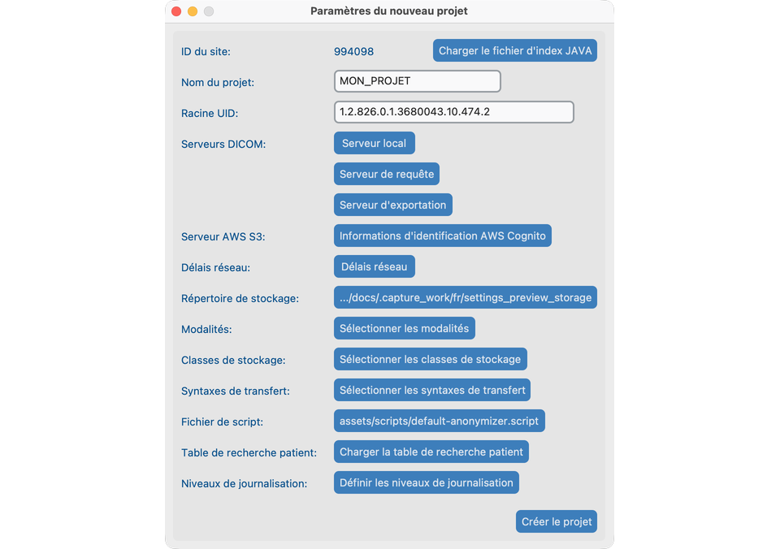
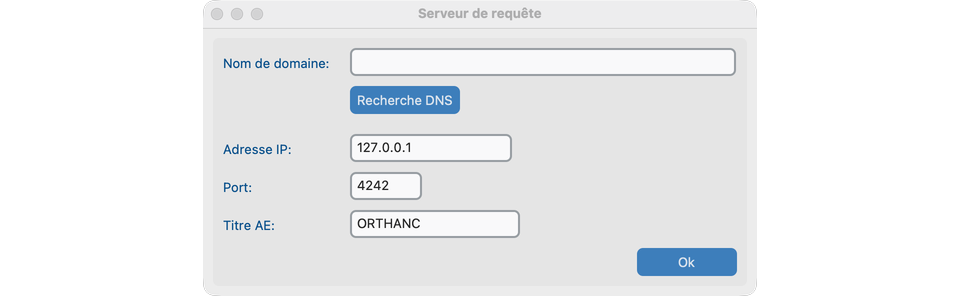
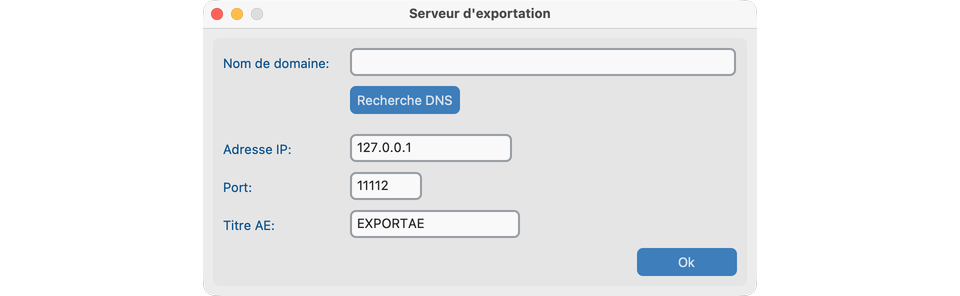
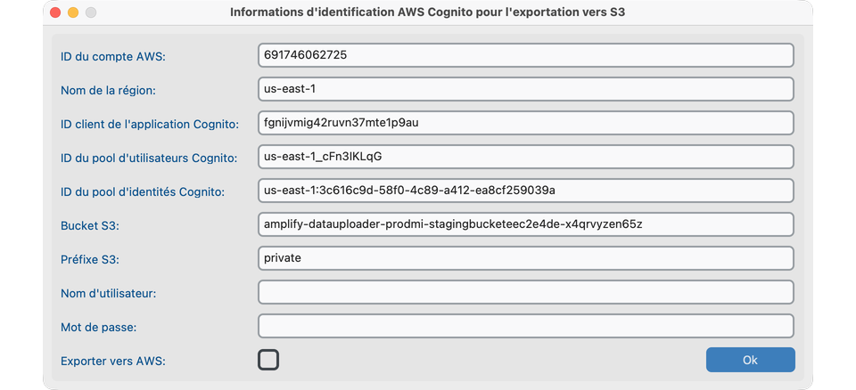
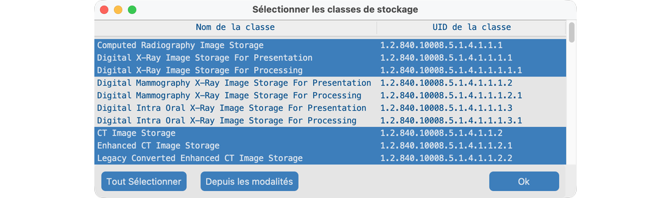
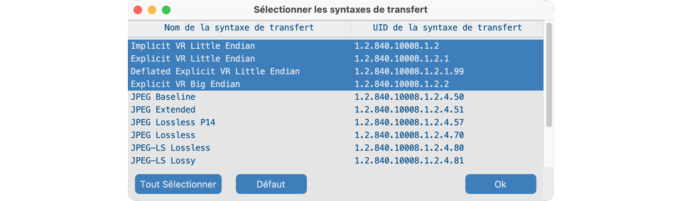
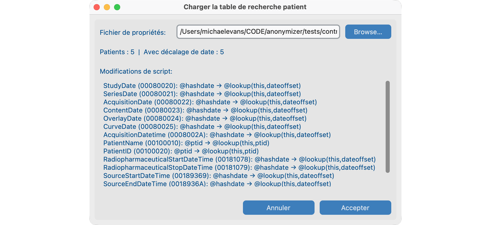
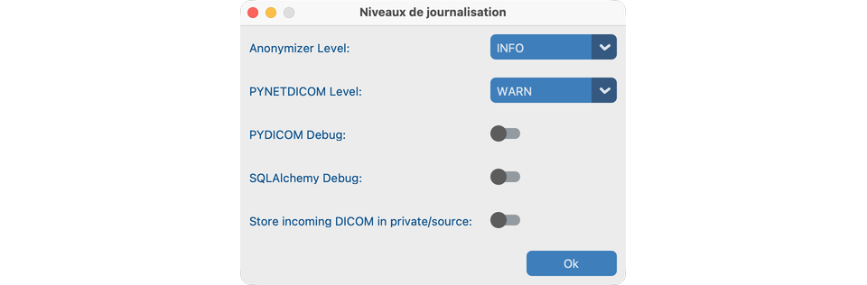
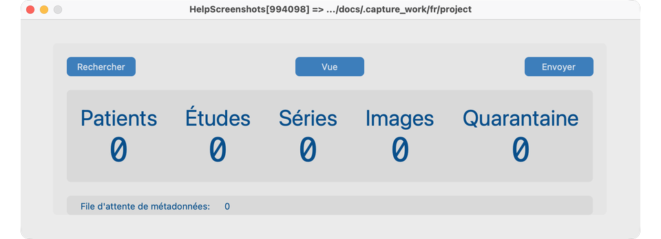

# Créer un projet

Un **projet** regroupe les paramètres et le stockage anonymisé. Créez-le une fois dans la fenêtre bureau, même si un serveur exécutera ensuite le mode [headless](../10-headless/).

## Objectif

Ouvrir un projet propre avec un dossier de stockage et une identité de site prêts pour l’import.

## Créer un nouveau projet

1. Depuis **Fichier → Nouveau projet**, ouvrez **Paramètres du nouveau projet**.
2. Choisissez un **Nom du projet** (court, moins de 16 caractères) et confirmez le **Répertoire de stockage**.
3. Vérifiez Site ID et UID Root (laissez en général les valeurs par défaut, sauf si vous continuez un site Java Anonymizer).
4. Confirmez les modalités et les paramètres réseau avec l’informatique si vous interrogez un PACS.
5. Enregistrez / créez le projet. Le **Tableau de bord** s’ouvre.

## Actions courantes sur le projet

| Action | Comment |
| -------------- | ---------------------------------------------------------------------------------------------------- |
| Fermer | **Fichier → Fermer le projet** ou fermer la fenêtre |
| Rouvrir | **Fichier → Ouvrir récent** |
| Cloner les paramètres | **Fichier → Cloner le projet** dans un nouveau dossier de stockage (aucune image copiée). Gardez un UID Root unique par projet. |

## Ce qui indique que tout va bien

- Le Tableau de bord affiche le nom du projet et le Site ID.
- Le répertoire de stockage existe et est accessible en écriture.
- Vous pouvez ouvrir le **Jeu de données** actuellement constitué (vide jusqu’à l’import) en cliquant sur **Vue**.

## Quand vous parlez à l’informatique

Partagez ces idées (les détails sont dans les dialogues Paramètres du projet) :

- **Serveur local** — adresse, port et AE Title que cet ordinateur utilise pour **recevoir** les images.
- **Serveur de requête** — l’archive hospitalière que vous interrogez et depuis laquelle vous récupérez.
- **Serveur d’exportation** ou **AWS** — où les études anonymisées seront envoyées.
- **Modalités / classes de stockage / transfer syntaxes** — quels types d’images sont autorisés.
- **Délais réseau** — combien de temps attendre les archives lentes.
- **Table de correspondance des patients** — mapping CTP `.properties` optionnel pour PatientID et décalage de date (voir [Table de correspondance](#table-de-correspondance-des-patients)).

Si le projet vivra sur un serveur de laboratoire, continuez avec [Exécution sans interface](../10-headless/).

## Paramètres du projet (tous les contrôles)

Ouvrez **Fichier → Paramètres du projet** (ou Paramètres du nouveau projet à la création). Configurez-les avant Rechercher / Envoyer :

### Serveur local

Adresse, port et AE Title que cet ordinateur utilise pour **recevoir** les images.

### Serveur de requête

Archive hospitalière utilisée par **Rechercher** sur le Tableau de bord.

### Serveur d’exportation

Destination DICOM utilisée lorsque vous **Envoyer** (l’étiquette des paramètres peut encore dire Export Server).

### AWS Cognito (optionnel)

Identifiants pour Envoyer vers S3 lorsque activé.

### Délais réseau

Combien de temps attendre les archives lentes.

### Modalités / classes de stockage / transfer syntaxes

Quels types d’images et encodages sont autorisés.

### Table de correspondance des patients

Mapping CTP `.properties` optionnel des identifiants patients PHI vers des identifiants anonymisés et des décalages de date. Parcourir → prévisualiser → Accepter.

### Niveaux de journalisation

Augmentez la journalisation anonymizer / réseau lors du dépannage avec l’informatique.

## Tableau de bord après création

Le Tableau de bord expose les principaux boutons de flux de travail : **Rechercher**, **Vue** et **Envoyer**.

## En cas d’échec

- Chemin de stockage non accessible en écriture → choisissez un autre dossier.
- Nom trop long → raccourcissez le nom du projet.
- Avertissement de clonage sur UID Root → utilisez une racine unique par projet pour éviter les collisions d’identifiants.

## Prochaines étapes

Continuez avec [Rechercher](../06-search/) pour importer des études dans le projet.
