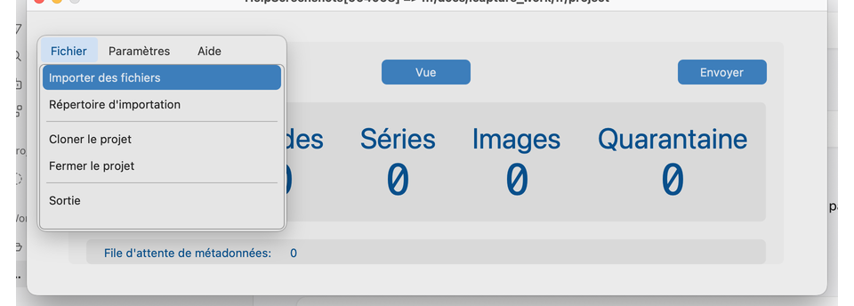
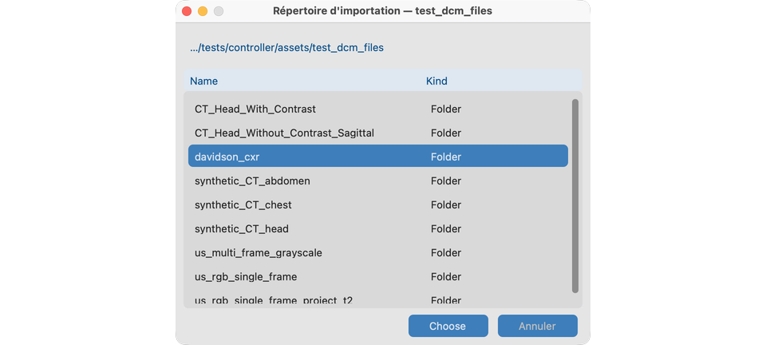
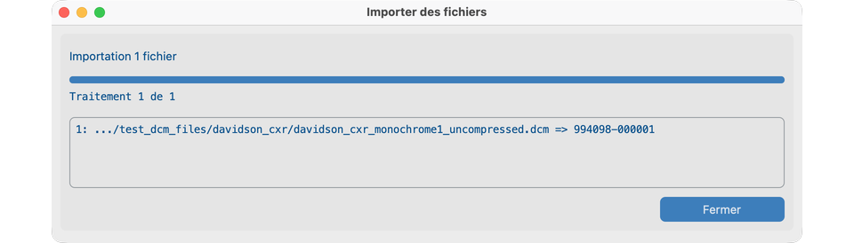
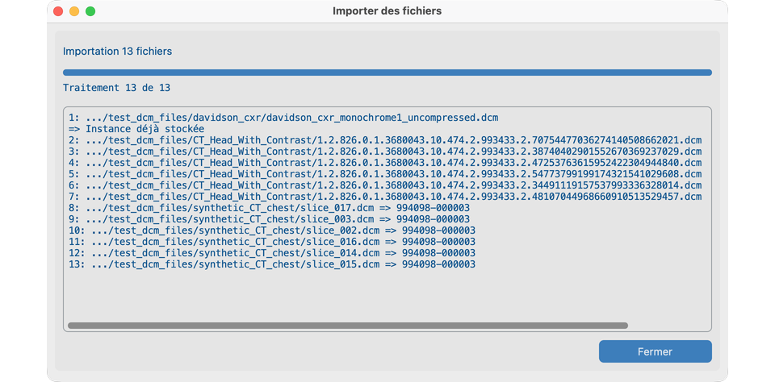
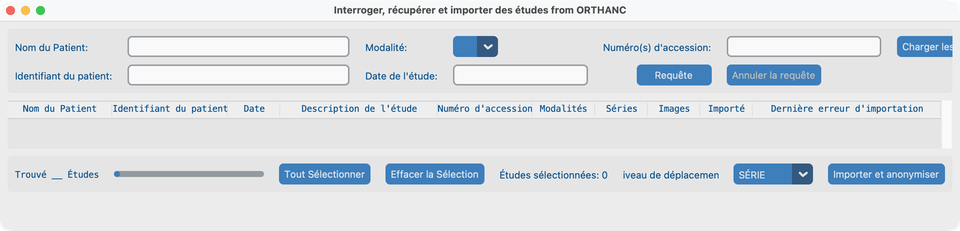
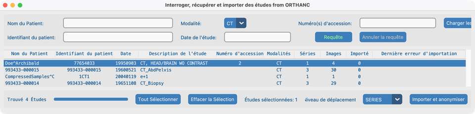
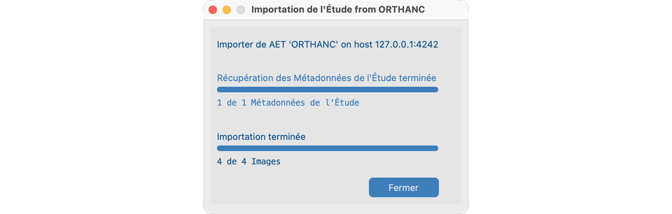
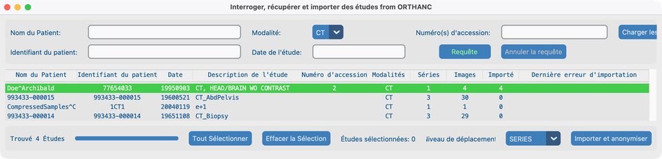

# Rechercher

## Objectif

Faire entrer des études DICOM dans votre projet pour qu’elles soient désidentifiées et listées sous **Vue → Jeu de données**. Vous pouvez :

1. **Importer depuis cet ordinateur** — fichiers ou dossier via le menu **Fichier**.
2. **Interroger un système d’imagerie distant** — PACS / VNA / Orthanc via **Rechercher** sur le Tableau de bord.

Configurez le [Serveur de requête, les modalités, les classes de stockage et les délais réseau](../05-create-project/) avant de vous fier à Rechercher à distance.

---

## Depuis un dossier ou des fichiers

### 1. Ouvrir Importer depuis le menu Fichier

Avec un projet ouvert, utilisez :

- **Fichier → Importer des fichiers** — choisissez un ou plusieurs fichiers (le filtre par défaut est souvent `.dcm` ; vous pouvez le changer dans la boîte de dialogue).
- **Fichier → Répertoire d'importation** — chaque fichier sous ce dossier et ses sous-dossiers est tenté, pas seulement `.dcm`.

Les instances déjà importées (même SOP Instance UID déjà dans ce projet) sont **ignorées**, pas mises en quarantaine.

### 2. Choisir un dossier (Répertoire d'importation)

Après **Répertoire d'importation**, la boîte de dialogue de dossier du système s’ouvre. Naviguez jusqu’à votre arborescence d’études et cliquez sur **Choose**.

Naviguez vers `tests/controller/assets/test_dcm_files` (ou un dossier d’étude dessous, comme `davidson_cxr` ou `CT_Head_With_Contrast`).

### 3. Conditions pour qu’un fichier soit importé

Un fichier n’est accepté que si tout ceci est vrai :

1. Fichier DICOM Part 10 valide avec méta-informations de fichier (y compris le préambule DICOM).
2. Contient **SOP Class UID**, **Study Instance UID**, **Series Instance UID** et **SOP Instance UID**.
3. Sa classe de stockage est autorisée par les [classes de stockage](../05-create-project/#modalites--classes-de-stockage--transfer-syntaxes) de ce projet.
4. L’identité protégée (PHI) peut être capturée avec succès.
5. Il n’a pas déjà été importé dans ce projet.

Si une [table de correspondance des patients](../05-create-project/#table-de-correspondance-des-patients) est requise, l’identifiant patient PHI doit aussi correspondre à une entrée — sinon le fichier est mis en quarantaine comme **Lookup_Miss**.

### 4. Importer `davidson_cxr` (démo d’une seule étude)

Radiographie thoracique de démo utilisée plus tard dans [Vue](../07-view/) et [Supprimer le PHI pixel](../08-process/02-remove-burned-in-text/).

Chemin : `tests/controller/assets/test_dcm_files/davidson_cxr`

1. Choisissez **Fichier → Répertoire d'importation**.
2. Sélectionnez le dossier `davidson_cxr` et cliquez sur **Choose**.
3. Attendez que la boîte de dialogue **Importer des fichiers** se termine et que **Fermer** apparaisse.

Une ligne réussie montre un chemin abrégé et **Identifiant patient PHI → Identifiant patient anonymisé** (par exemple `…/davidson_cxr_….dcm => 993627-000001`).

### 5. Lire le journal d’import (nombreux fichiers)

Lorsque vous importez une arborescence plus grande, la même boîte de dialogue liste **un résultat par fichier** dans la zone défilante :

- **Succès :** `path => anonymized Patient ID`
- **Déjà stocké :** ignoré (même SOP Instance UID)
- **Échec :** `path` puis `=>` et une courte raison (DICOM invalide, attributs manquants, classe de stockage, capture PHI, lookup miss)

Cliquez sur **Fermer** lorsque c’est terminé. Les compteurs patient / étude / image du Tableau de bord se mettent à jour ; les compteurs de quarantaine n’augmentent que pour les fichiers rejetés.

### Quarantaine

Les fichiers en échec aboutissent dans les dossiers de quarantaine privés du projet (les noms peuvent apparaître avec des espaces ou des underscores dans l’interface) :

| Dossier | Cause typique |
| ---------------------------------- | ----------------------------------------- |
| `Invalid_DICOM` / erreur de lecture DICOM | DICOM non valide, ou illisible |
| `Missing_Attributes` | UID / SOP Class requis manquants |
| `Invalid_Storage_Class` | Classe de stockage non activée pour le projet |
| `Capture_PHI_Error` | Impossible de capturer le PHI |
| `Lookup_Miss` | Identifiant patient absent de la table de correspondance |

Consultez les compteurs de quarantaine sur le Tableau de bord. Corrigez les paramètres ou les fichiers sources, puis importez à nouveau.

---

## Depuis un système d’imagerie distant (Tableau de bord **Rechercher**)

### 1. Ouvrir Rechercher

Sur le Tableau de bord, cliquez sur **Rechercher**. L’application fait d’abord un **C-ECHO** vers le Serveur de requête configuré. Si l’écho réussit, la fenêtre **Interroger, récupérer et importer des études** s’ouvre.

Cette fenêtre a trois bandes :

1. **Critères** — Nom du Patient, Identifiant du patient, Modalité, Date de l'étude, Numéro(s) d'accession, **Charger les numéros d'accession**, **Requête** / **Annuler la requête**, **Afficher les études importées**.
2. **Tableau des résultats** — études renvoyées par C-FIND.
3. **Barre d’import** — compteur Found, **Tout Sélectionner** / **Effacer la Sélection**, **Niveau de déplacement**, **Importer et anonymiser**.

!!! tip "Demandez de l’aide à l’informatique"
    Le Serveur de requête doit autoriser cet ordinateur à faire C-ECHO, C-FIND et C-MOVE, et doit connaître votre **Serveur local** (adresse, port, AE Title) comme destination C-MOVE. Voir [Créer un projet → Quand vous parlez à l’informatique](../05-create-project/#quand-vous-parlez-a-linformatique).

### 2. Rechercher des études

Saisissez **au moins un** critère, puis cliquez sur **Requête** (ou appuyez sur Return). Une requête vide est rejetée.

| Champ | Notes |
| -------------------- | ---------------------------------------------------------------------------------------------- |
| **Nom du Patient** | Lettres (y compris accents), chiffres, séparateur de nom `^` ; `?` = un caractère, `*` = toute chaîne |
| **Identifiant du patient** | Lettres/chiffres ASCII ; jokers `?` et `*` |
| **Modalité** | Liste déroulante depuis les modalités configurées dans Paramètres du projet |
| **Date de l'étude** | Un jour ou une plage : `YYYYMMDD` ou `YYYYMMDD-YYYYMMDD` |
| **Numéro(s) d'accession** | ASCII, chiffres, et `/ - _ , .` ; jokers `?` et `*` |

Options d’accession supplémentaires :

- Saisissez une **liste séparée par des virgules** dans Numéro(s) d'accession pour lancer plusieurs recherches d’un coup.
- Utilisez **Charger les numéros d'accession** pour charger un fichier `.txt` ou `.csv` (délimité par virgules ou par lignes). Confirmez avant que la requête en masse ne s’exécute. Les numéros d’accession non trouvés peuvent être écrits dans un fichier texte pour suivi.

Autres contrôles :

- **Afficher les études importées** — lorsque désactivé, les études déjà dans ce projet sont masquées de la liste de résultats.
- **Annuler la requête** — arrête une requête en cours.
- Seules les études dont les modalités sont autorisées pour le projet apparaissent et peuvent être sélectionnées.
- Le statut en bas affiche **Found N Studies** après une requête réussie.

### 3. Exemple : requête CT (`Doe^Archibald`)

1. Réglez **Modalité** sur **CT**.
2. Cliquez sur **Requête**.
3. Cliquez sur la ligne CT tête **Doe^Archibald** (surbrillance de sélection sombre).
4. Confirmez **Études sélectionnées: 1** et choisissez **Niveau de déplacement** (souvent **STUDY** ou **SERIES**).

### 4. Sélectionner des études et importer

1. Sélectionnez des études : clic simple, multi-sélection (**⌘** / **Ctrl**+clic), **Tout Sélectionner**, ou **Effacer la Sélection**.
2. Choisissez **Niveau de déplacement** : **STUDY**, **SERIES** ou **INSTANCE** (niveau DICOM C-MOVE). Préférez STUDY lorsque l’archive le prend en charge ; essayez SERIES ou INSTANCE si les transferts bloquent.
3. Cliquez sur **Importer et anonymiser**. L’application construit une hiérarchie d’études pour le niveau de déplacement sélectionné, puis ouvre la boîte de dialogue de progression **Import Studies**.
4. La progression suit la récupération des métadonnées, puis les images reçues par rapport à la hiérarchie. Une étude se termine lorsque tous les fichiers attendus arrivent **ou** qu’un [Délai réseau](../05-create-project/#delais-reseau) expire pour ce transfert.
5. Lorsque la boîte de dialogue affiche **Importation terminée**, cliquez sur **Fermer**.

### 5. Confirmer la surbrillance verte (série CT importée)

Les études importées avec succès sont **surlignées en vert** dans la liste de résultats de requête, et la colonne **Imported** indique combien d’images sont arrivées dans le projet. Avec **Niveau de déplacement = SERIES**, la série CT pour Doe^Archibald se termine avec Imported égal à Images.

Vous pouvez resélectionner les mêmes études après avoir ajusté le délai ou le niveau de déplacement — les instances déjà importées sont ignorées.

### Gérer les archives lentes ou non idéales

Beaucoup de VNA déplacent les images de façon asynchrone et ne se comportent pas comme un PACS « manuel ». Si les imports sont incomplets :

- Allongez le **Délai réseau** dans Paramètres du projet.
- Changez le **Niveau de déplacement** (Study → Series → Instance) et réessayez **Importer et anonymiser**.
- Confirmez avec l’informatique que la destination C-MOVE correspond à l’AE Title de votre Serveur local et que les modalités / classes de stockage autorisent les études attendues.

---

## Ce qui indique que tout va bien

- Les études apparaissent sous [Vue → Jeu de données](../07-view/).
- Les compteurs patient / étude / image du Tableau de bord augmentent ; la quarantaine reste vide ou ne contient que les rejets attendus.
- Les dialogues d’import local montrent une ligne claire de succès ou d’erreur par fichier avant que vous ne cliquiez sur **Fermer**.
- Les imports distants montrent une surbrillance verte dans les résultats de requête après une exécution réussie.
- Le texte de statut en bas du Tableau de bord reflète la dernière action Rechercher ou d’import.

## En cas d’échec

| Symptôme | Que tenter |
| ----------------------------------------- | ----------------------------------------------------------------------------------- |
| Bouton Rechercher reste désactivé / échec de l’écho | Serveur de requête hors ligne ou bloqué ; vérifiez adresse, port, AE Title avec l’informatique |
| Erreur de connexion sur Requête | C-ECHO échoué — corrigez les paramètres du Serveur de requête ou le réseau |
| Résultats vides | Élargissez jokers/date ; activez **Afficher les études importées** ; vérifiez les modalités du projet |
| Rien n’importe depuis un dossier | Classes de stockage / modalités ; DICOM Part 10 valide ; table de correspondance si requise |
| Lookup_Miss | Ajoutez l’identifiant patient à la table de correspondance ou assouplissez les exigences de lookup |
| Import PACS partiel | Délai réseau plus long ; Niveau de déplacement différent ; réessayez la sélection |
| Fichiers ignorés sans quarantaine | Déjà importés (même SOP Instance UID) |

## Prochaines étapes

Continuez avec [Vue](../07-view/) pour parcourir ce que vous avez importé.
