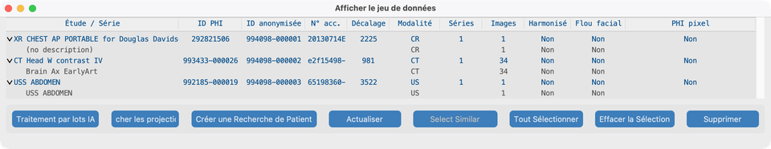
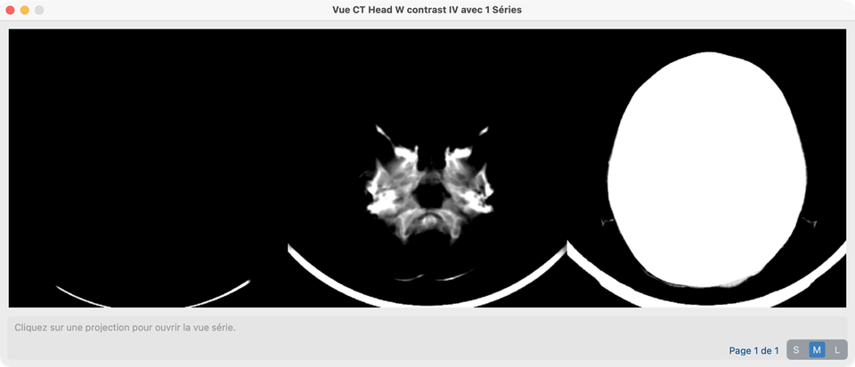
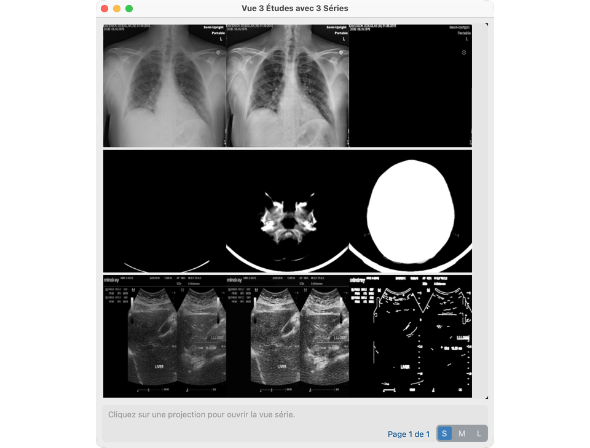
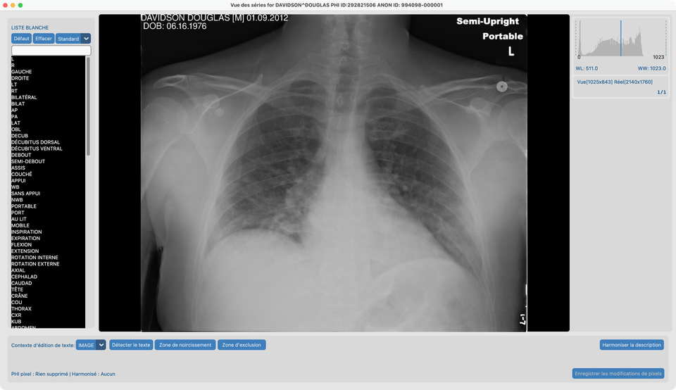
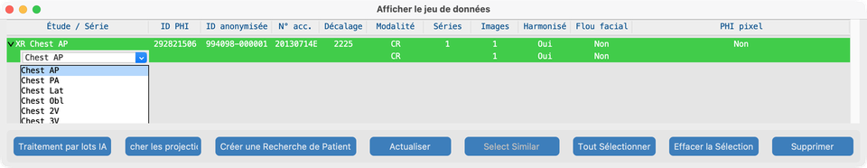
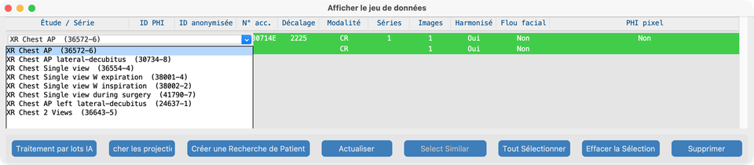
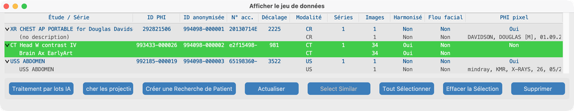
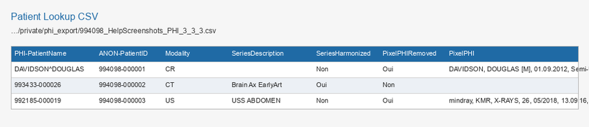

# Vue

**Vue** sur le Tableau de bord ouvre le **Jeu de données** — la liste de tout ce qui est dans votre projet (patients, études et séries). Depuis Jeu de données vous ouvrez des **projections d’étude** ou une **Vue des séries** complète pour revoir les pixels et lancer les outils Traiter.

(Les versions antérieures appelaient Jeu de données le PHI Index.)

## Objectif

Voir ce que vous avez importé, vérifier les colonnes de statut IA, ouvrir les projections d’une étude, ouvrir une série pour relecture ou outils [Traiter](../08-process/), et exporter un CSV **Créer une Recherche de Patient** si besoin.

## Études de démo

Après import depuis `tests/controller/assets/test_dcm_files` (voir [Rechercher](../06-search/)), Jeu de données doit lister ces trois études (les captures d’aide n’utilisent **pas** de fantômes synthétiques) :

| Fixture | Rôle dans le manuel |
| --- | --- |
| **`davidson_cxr`** | Ouvrir dans Vue des séries ici ; texte incrusté dans [Supprimer le PHI pixel](../08-process/02-remove-burned-in-text/) |
| **`CT_Head_With_Contrast`** | [Harmoniser](../08-process/03-harmonize-names/) et [Flouter les visages](../08-process/04-blur-faces/) |
| **`us_rgb_single_frame`** | Échographie mono-image ; incrustations dans [Supprimer le PHI pixel](../08-process/02-remove-burned-in-text/) (démos zone d’exclusion) |

## Ouvrir Jeu de données

1. Depuis le Tableau de bord, cliquez sur **Vue**.
2. Développez une ligne **étude** (triangle) pour voir les **séries** imbriquées.
3. Notez les identifiants PHI / anonymisés et les colonnes de statut IA.

### Colonnes (V19)

| Statut | Signification |
| --- | --- |
| **Harmonisé** | Description de série standardisée (ou description au niveau étude appliquée) |
| **Flou facial** | Dé-identification faciale appliquée |
| **PHI pixel** | Scan / suppression du texte incrusté enregistrés |

## Clic droit dans Jeu de données (le plus important)

Les info-bulles au survol de l’arbre indiquent ce qu’un clic droit fera. La sélection suit la ligne sous le pointeur.

**Clic gauche** sur la **description** d’étude ou de série (première colonne) lorsqu’une seule ligne est sélectionnée — voir [Modifier les descriptions d’étude et de série](#modifier-les-descriptions-detude-et-de-serie) ci-dessous. Utilisez **Shift** ou **Cmd/Ctrl+Click** pour multi-sélectionner ; puis **clic droit** sur la sélection pour définir une description sur toutes les lignes sélectionnées.

### Clic droit sur une **étude** → Afficher les projections

Clic droit sur une ligne **étude** (pas une série imbriquée) pour ouvrir **Projection View** pour cette étude.

- Vous voyez des images de projection résumées pour chaque série de l’étude (utile pour parcourir rapidement un examen multi-séries).
- Cliquez sur une tuile de projection lorsque vous voulez passer en **Vue des séries** complète pour cette série.

### Plusieurs études → Afficher les projections

Pour parcourir plusieurs examens à la fois :

1. Dans Jeu de données, sélectionnez deux lignes **étude** ou plus (Shift+Click et/ou Cmd/Ctrl+Click), ou utilisez **Tout Sélectionner**.
2. Cliquez sur **Afficher les projections** dans la barre d’outils Jeu de données.

Le titre de la fenêtre devient **View N Studies with M Series** (et **over P Pages** lorsque la grille a besoin de pagination). Chaque série reçoit toujours une tuile de projection.

### Tuiles de projection, S / M / L, et comment elles sont construites

Chaque tuile est une bande de **trois** images d’aperçu pour une série :

| Type de série | Gauche | Centre | Droite |
| --- | --- | --- | --- |
| **Multi-frame** (p. ex. pile CT) | Intensité **Min** sur les frames | **Mean** | **Max** |
| **Single-frame** (p. ex. CXR, beaucoup d’US) | Niveaux de gris | Contraste **CLAHE** | **Edge** (Canny) |

Le contrôle **S / M / L** définit la taille de dessin de chacun de ces trois panneaux (avant mise à l’échelle d’affichage) :

| Taille | Taille du panneau de tuile | Usage typique |
| --- | --- | --- |
| **S** | 200×200 | Faire tenir beaucoup de séries sur une page |
| **M** | 400×400 | Taille d’aide / relecture par défaut |
| **L** | 800×800 | Inspecter l’anatomie dans la bande |

Changer la taille recalcule combien de tuiles tiennent par page et peut ajouter un curseur de page. Cliquez sur n’importe quelle tuile pour ouvrir cette série en **Vue des séries**.

**Ce qui se passe lorsqu’une projection est créée**

1. L’application cherche un `Projection.pkl` en cache à côté des fichiers de la série.
2. En cas de cache hit, elle charge cet objet et dessine les trois images (redimensionnées en S/M/L).
3. En cas de miss, elle charge chaque frame de la série, calcule les trois images ci-dessus (fenêtrées pour multi-frame), écrit `Projection.pkl`, puis dessine la tuile.
4. Les éditions de pixels qui modifient la série sur le disque invalident le cache afin que la prochaine ouverture reconstruise à partir des pixels actuels.

Cette fenêtre **Afficher les projections** du Jeu de données est distincte des modes coupe / min / mean / max à l’intérieur de Vue des séries.

### Clic droit sur une **série** → Vue des séries

1. Développez l’étude qui contient la série (par exemple `davidson_cxr`).
2. **Clic droit sur la ligne série** (pas la ligne étude).
3. **Vue des séries** s’ouvre et charge les images.

C’est la façon principale d’ouvrir une série pour relecture et pour les outils Traiter (Supprimer le PHI pixel, Harmoniser, Flou facial).

## Modifier les descriptions d’étude et de série

Après [Harmoniser](../08-process/03-harmonize-names/) (Vue des séries ou [Traitement par lots IA](../08-process/05-run-on-many-studies/)), les lignes **Harmonisé** vertes montrent le nom standardisé. Vous pouvez aussi définir des noms RadLex / LOINC sur des lignes **non harmonisées** depuis Jeu de données — choisir un nom standard écrit le DICOM et marque la ligne harmonisée (verte après actualisation).

Les info-bulles expliquent ce qu’un clic ou une action de barre d’outils fera (y compris pourquoi un bouton est désactivé).

**Clic simple** sélectionne une ligne. **Double-clic** sur une description d’étude ou de série (harmonisée ou non) pour ouvrir **Définir la description**. **Esc** ou un clic ailleurs annule un menu inline ouvert. **Shift+Click** et **Cmd/Ctrl+Click** ne changent que la sélection — ils n’ouvrent pas l’éditeur. Avec plusieurs séries ou études sélectionnées (même modalité), **clic droit** sur la sélection pour ouvrir **Définir la description**.

### Description de série (RadLex)

1. Développez l’étude et **double-cliquez** la description de **série** dans la première colonne (une ligne sélectionnée).
2. Choisissez un nom style RadLex / Playbook pour **cette modalité** (par exemple vues XR : Chest AP → PA / Lat / Obl / 2V ; CT/MR : plans ou échanges de contraste).
3. L’arbre se rafraîchit lorsque vous choisissez une valeur.

### Description d’étude (LOINC)

1. **Double-cliquez** la description **étude** dans la première colonne (la ligne parente).
2. Choisissez un Long Common Name **LOINC** pour **ce préfixe de modalité** (XR / US / MG / CT / MR). Chaque option s’affiche comme `Long Common Name  (LoincNumber)`.
3. La liste est classée à partir des noms de séries harmonisés de l’étude lorsque disponibles (et du nombre de vues pour CXR lorsque connu), puis complétée depuis le catalogue LOINC de la même modalité.
4. Appliquer un choix met à jour Study Description (et Procedure Code Sequence lorsqu’un numéro LOINC est présent).

### Définir la description (édition de groupe)

1. Sélectionnez **uniquement des séries** ou **uniquement des études**, toutes avec la même cohorte de modalité.
2. **Clic droit** sur n’importe quelle ligne sélectionnée et choisissez une valeur RadLex (série) ou LOINC (étude).
3. Cette chaîne exacte est appliquée à chaque ligne sélectionnée. Les info-bulles changent en mode multi-sélection pour le dire.

### Sélectionner similaires

Avec une **seule** étude ou série sélectionnée, **Sélectionner similaires** ajoute d’autres lignes qui partagent déjà les mêmes descriptions de série (études) ou le même texte de description de série (séries). Puis clic droit sur la sélection pour définir une description sur toutes les lignes sélectionnées.

## Vue des séries — ce que vous pouvez faire

Vue des séries est l’endroit où vous regardez les pixels et lancez les outils par série (les modèles doivent être prêts — voir [Configuration des Fonctions IA](../03-ai-features-setup/)) :

- Faire défiler les frames ; utiliser l’histogramme et les barres d’outils selon besoin
- **Détecter / supprimer le texte incrusté** (OCR) et édition de liste blanche → [Supprimer le PHI pixel](../08-process/02-remove-burned-in-text/)
- **Harmoniser la description** → [Harmoniser les noms](../08-process/03-harmonize-names/)
- **Flou facial** (lorsque éligible) → [Flouter les visages](../08-process/04-blur-faces/)
- Superpositions **Segmentation latch** depuis les masques d’anatomie en cache (après Harmoniser)
- Rectangles de noircissement manuels
- Vider le cache d’analyse (ne réécrit pas à lui seul les pixels DICOM)

Dans Vue des séries, les séries multi-frame peuvent aussi afficher les modes de projection **slice / min / mean / max** dans le visualiseur (même idée que la bande multi-frame ci-dessus, mais pour le défilement interactif).

## Autres actions Jeu de données

- Sélectionner des études pour [Traitement par lots IA](../08-process/05-run-on-many-studies/) ou [Envoyer](../09-send/)
- Contrôler les colonnes de statut IA après Vue des séries ou lots
- CSV **Créer une Recherche de Patient** (ci-dessous)

## Créer une Recherche de Patient CSV

Utilisez Jeu de données pour exporter un tableur qui mappe les identifiants PHI vers les identifiants anonymisés (et le statut IA des séries). Ceci est distinct de la [Table de correspondance des patients CTP](../05-create-project/#table-de-correspondance-des-patients) optionnelle utilisée à l’import.

### Quand l’utiliser

- Remettre un fichier de mapping au site destinataire ou au coordinateur d’étude
- Auditer quelles séries ont été harmonisées, floutées au visage, ou ont eu le PHI pixel supprimé
- Garder une copie durable sous le stockage privé du projet

### Étapes

1. Ouvrez **Jeu de données** depuis le Tableau de bord (**Vue**).
2. Cliquez sur **Créer une Recherche de Patient** dans la barre d’outils Jeu de données (aucune sélection d’étude requise — le CSV couvre tout l’index du projet). Préférez exporter après [Traiter](../08-process/) pour que les colonnes de statut IA soient renseignées.

3. En cas de succès, une boîte de dialogue montre le chemin enregistré. Les fichiers sont écrits sous :

   `…/<project>/private/phi_export/`

   Motif de nom de fichier :

   `{site_id}_{project_name}_PHI_{patients}_{studies}_{series}.csv`

4. Ouvrez le CSV dans un tableur. **Une ligne par série** (les champs étude et patient sont répétés sur chaque ligne de série). Les études sans série émettent quand même une ligne avec des colonnes série vides. Les exemples d’aide utilisent **davidson CXR**, **CT head** (`CT_Head_With_Contrast`) et **ultrasound single-frame** (pas de fantômes synthétiques).

### Colonnes (résumé)

| Groupe | Exemples |
| --- | --- |
| Identifiants anonymisés | `ANON-PatientID`, `ANON-PatientName`, `ANON-StudyUID`, `ANON-SeriesUID`, `ANON-AccNo` |
| Contreparties PHI | `PHI-PatientName`, `PHI-PatientID`, `PHI-StudyDate`, `PHI-StudyUID`, `PHI-AccNo` |
| Étude / série | `DateOffset`, `Series`, `StudyInstances`, `Modality`, `SeriesDescription`, `Instances` |
| Statut IA | `SeriesHarmonized`, `FaceBlurred`, `PixelPHIRemoved`, `PixelPHI` |

## Ce qui indique que tout va bien

- L’arbre imbriqué étude → série correspond à ce que vous avez importé (`davidson_cxr`, `CT_Head_With_Contrast`, `us_rgb_single_frame`).
- Clic droit étude ouvre les projections ; multi-sélection + **Afficher les projections** ouvre toutes les études sélectionnées ; clic droit série ouvre Vue des séries ; multi-sélection + clic droit ouvre **Définir la description**.
- Double-cliquer une description **série** ou **étude** (sélection unique) ouvre RadLex / LOINC **Définir la description** ; un clic simple sélectionne seulement la ligne ; les clics avec modificateur gardent la multi-sélection.
- **S / M / L** change la taille des tuiles ; la première ouverture peut construire `Projection.pkl` sous chaque série.
- `davidson_cxr` se charge et défile dans Vue des séries.
- Les colonnes IA se mettent à jour après les outils Traiter.
- **Créer une Recherche de Patient** écrit un CSV sous `private/phi_export/` qui s’ouvre avec les colonnes attendues.

## En cas d’échec

- Liste vide → importez d’abord ([Rechercher](../06-search/)).
- Série manquante sur le disque → **Série non trouvée** ; réimportez ou vérifiez le chemin de stockage.
- Outils grisés dans Vue des séries → téléchargez les modèles / acceptez la licence dans [Fonctions IA](../03-ai-features-setup/).
- Harmonize déjà en cours → terminez ou annulez l’autre série d’abord.
- Erreur Créer une Recherche de Patient → assurez-vous que le projet a des études dans l’index Jeu de données et que `private/phi_export/` est accessible en écriture.

## Prochaines étapes

Continuez avec [Traiter](../08-process/) — Supprimer le PHI pixel, Harmoniser, Flou facial et lots. Après relecture, [Envoyer](../09-send/) les patients anonymisés.
