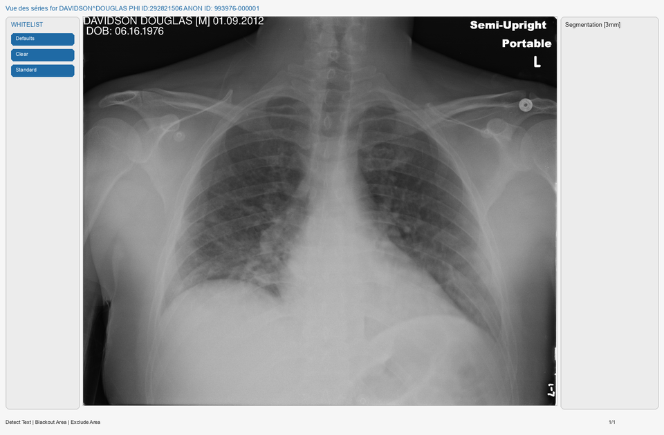
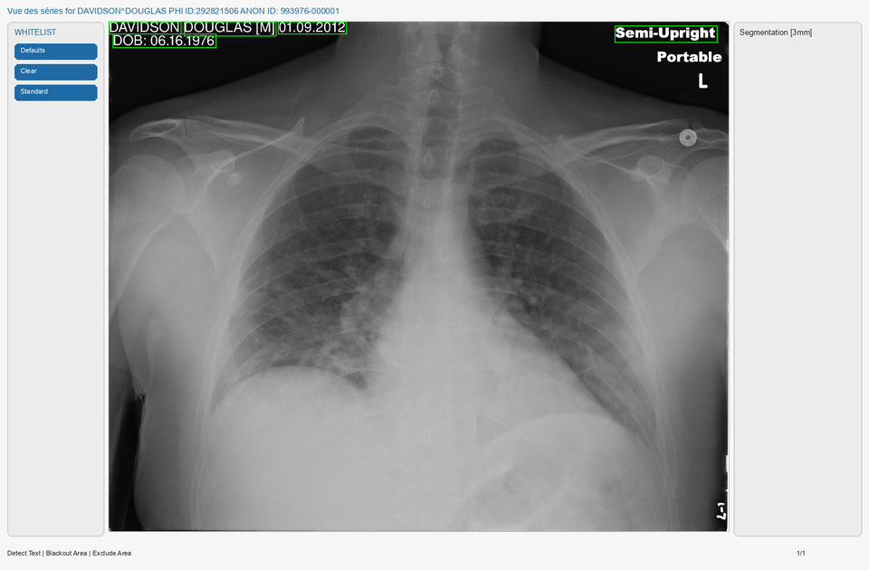
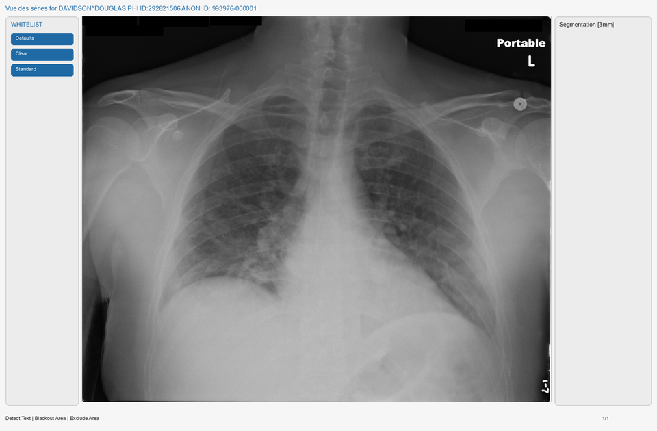
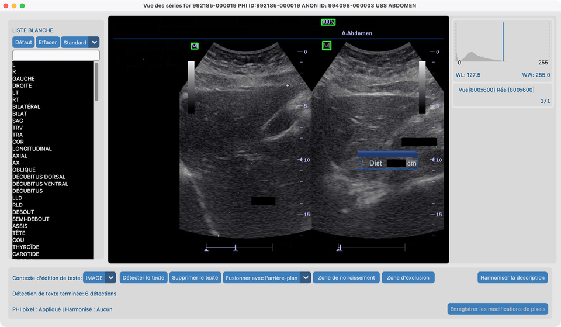
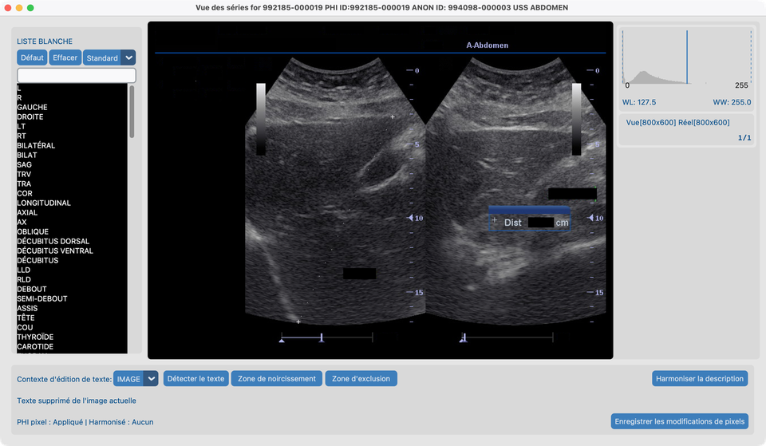
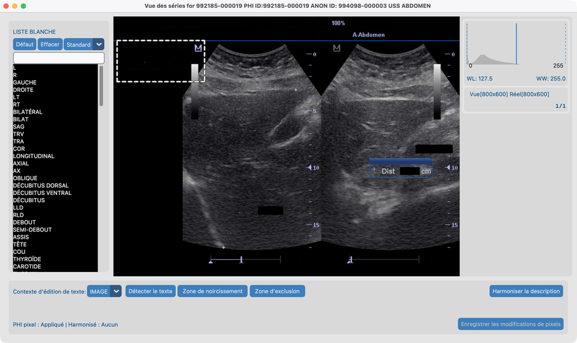
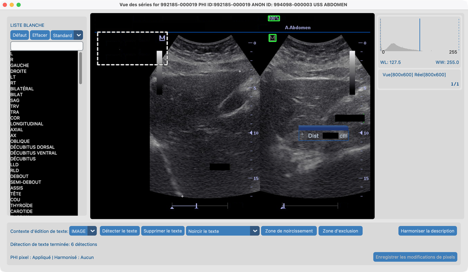

# 8.1 Supprimer le PHI pixel

Certaines images ont des **noms de patients ou des étiquettes dessinés sur les pixels**. Nettoyer les tags DICOM seuls ne les enlève pas.

## Séries de démo

| Série | Chemin | Utilisé pour |
| --- | --- | --- |
| **`davidson_cxr`** | `tests/controller/assets/test_dcm_files/davidson_cxr` | Liste blanche → Détecter → **Noircir** |
| **`us_rgb_single_frame`** | `tests/controller/assets/test_dcm_files/us_rgb_single_frame` (`US_RGB_SingleFrame.dcm`) | Détecter → **Fusionner avec l'arrière-plan** ; **Zone d'exclusion** sur le bloc de paramètres machine sous **mindray** |

Importez chaque dossier dans votre projet, puis ouvrez la série dans **Vue des séries**.

## Objectif

1. Sur `davidson_cxr`, détecter le texte incrusté et **noircir** le PHI tout en conservant les marqueurs utiles via la liste blanche par défaut.
2. Sur `us_rgb_single_frame`, détecter le texte incrusté et le supprimer en **fusionnant avec l'arrière-plan** (inpaint).
3. Sur la même série US couleur, marquer la bande de paramètres machine non-PHI avec **Zone d'exclusion** pour que Détecter le texte et Supprimer le texte la contournent.

## Avant de commencer

1. Terminez [Configuration des Fonctions IA](../../03-ai-features-setup/) pour que les modèles OCR soient prêts.
2. Importez les séries de démo et ouvrez-les dans Vue des séries depuis [Jeu de données](../../07-view/).

## Flux de travail sur `davidson_cxr` (noircir)

Suivez ces étapes dans l’ordre. Les captures correspondent à cette fixture.

### 1. Liste blanche par défaut et contexte Image

1. Conservez la **liste blanche par défaut** (ne l’effacez pas).
2. Réglez le contexte d’édition sur **IMAGE** (pas encore toute la série).

### 2. Détecter le texte

1. Cliquez sur **Détecter le texte**.
2. Attendez la fin de la détection. Des **rectangles verts** marquent le texte qui serait supprimé.

Sur cette radiographie thoracique vous devriez voir des cases vertes autour du nom du patient, de la date, de la date de naissance et d’un PHI similaire — mais **pas** autour de **Portable** ou **L**. Ces mots sont déjà sur la liste blanche par défaut, donc Détecter le texte les laisse tranquilles.

**Liste déroulante de correspondance de liste blanche** (à côté de Défaut / Effacer — ici réglée sur **Standard**) :

Contrôle à quel point le texte OCR doit correspondre à une entrée de liste blanche pour être traité comme à conserver :

| Réglage | Effet |
| --- | --- |
| **Exact** | Masquer uniquement le texte qui correspond lettre pour lettre à une entrée de liste blanche |
| **Strict** | Presque exact — seulement de minuscules erreurs OCR |
| **Standard** (défaut) | Autorise de petites erreurs OCR (par exemple `AXIL` correspond encore à `AXIAL`) |
| **Souple** | Le plus tolérant — mieux pour le texte bruité et les marqueurs courts |

Utilisez un réglage plus strict si trop de texte est ignoré ; un plus souple si des marqueurs utiles continuent d’être encadrés.

### 3. Revoir et conserver via la liste blanche

1. Si un rectangle vert couvre du texte que vous voulez **garder**, cliquez sur ce rectangle.
2. Le texte est ajouté à la liste blanche à gauche et ne sera pas supprimé.

Sur `davidson_cxr`, **Portable** et **L** sont déjà couverts par la liste blanche par défaut — vous n’avez en général pas besoin de les ajouter à nouveau.

### 4. Supprimer le texte en noircissant

1. Réglez la liste déroulante du mode de suppression sur **Noircir le texte**.
2. Cliquez sur **Supprimer le texte**.
3. Les régions PHI deviennent noires unies ; les conservations de liste blanche restent.
4. Cliquez sur **Enregistrer les modifications de pixels** lorsque vous êtes satisfait.

Noircir est le choix habituel pour la désidentification : le texte retiré est clairement parti et ne peut pas être récupéré depuis les pixels.

## Flux de travail sur `us_rgb_single_frame` (fusionner avec l'arrière-plan)

Utilisez cette frame d’échographie couleur lorsque vous voulez que le texte retiré ressemble au tissu voisin plutôt qu’à des barres noires.

### 5. Supprimer le texte en fusionnant avec l'arrière-plan

1. Importez et ouvrez **`us_rgb_single_frame`** (`US_RGB_SingleFrame.dcm`) dans Vue des séries.
2. Gardez le contexte d’édition sur **IMAGE**.
3. Réglez la liste déroulante du mode de suppression sur **Fusionner avec l'arrière-plan**.
4. Cliquez sur **Détecter le texte** et attendez les rectangles verts.

5. Cliquez sur **Supprimer le texte**.
6. Le texte détecté est peint en fusionnant avec les pixels environnants (inpaint), puis **Enregistrer les modifications de pixels**.

**Noircir le texte** vs **Fusionner avec l'arrière-plan** : noircir remplace le texte par du noir ; fusionner remplit la zone pour qu’elle corresponde à l’image autour. Préférez noircir lorsque vous avez besoin d’une rédaction évidente et irréversible ; préférez fusionner lorsqu’un résultat moins visible est acceptable (par exemple certaines incrustations d’échographie).

## Flux de travail sur US couleur (Zone d'exclusion)

Utilisez la même série **`us_rgb_single_frame`** lorsque l’OCR encadre des réglages machine qui ne sont **pas du PHI**. **Zone d'exclusion** ignore une région spatiale pour Détecter le texte et Supprimer le texte sans changer les pixels (contrairement à **Zone de noircissement**).

### 6. Exclure le bloc de paramètres sous mindray

Sur cette frame, un bloc dense de paramètres machine (gain, depth, FR, DR et jetons similaires) se trouve en **haut à gauche**, directement **sous** le logo **mindray**.

1. Ouvrez **`us_rgb_single_frame`** dans Vue des séries avec le contexte d’édition **IMAGE**.
2. Dessinez un rectangle couvrant ce bloc de paramètres (laissez **mindray** et le vrai PHI / étiquettes de site dehors si vous voulez encore les détecter). Les dessins en attente apparaissent comme des rectangles **bleus unis**.
3. Cliquez sur **Zone d'exclusion**. Le rectangle passe dans la liste d’exclusion et se redessine en **contour pointillé blanc** (sans remplissage).

4. Cliquez sur **Détecter le texte**. Des cases vertes devraient apparaître sur le PHI / texte fournisseur **hors** du bloc ; les jetons de paramètres à l’intérieur de la région pointillée ne devraient **pas** être encadrés pour suppression.

5. Optionnellement choisissez **Fusionner avec l'arrière-plan** ou **Noircir le texte**, puis **Supprimer le texte** et **Enregistrer les modifications de pixels**.
6. Cliquez sur un rectangle pointillé blanc pour le retirer de la liste d’exclusion si vous devez ajuster.

**Liste blanche** vs **Zone d'exclusion** vs **Zone de noircissement** : la liste blanche conserve des *chaînes* OCR spécifiques ; Zone d'exclusion ignore une *région* (pas de changement de pixels) ; Zone de noircissement peint en noir les rectangles dessinés. Préférez définir les rectangles d’exclusion **avant** Détecter le texte (ou Détecter à nouveau après ajustement). Avec le contexte d’édition **SÉRIE**, le dessin se propage entre les frames pour que le même panneau puisse être exclu sur une boucle ciné.

## Après la démo

- Le statut **PHI pixel** du Jeu de données doit se mettre à jour pour chaque série que vous avez enregistrée.
- Les listes blanches de modalité et la liste déroulante de correspondance (Exact → Souple) vivent dans Vue des séries ; une correspondance plus stricte signifie que moins de hits OCR sont traités comme des conservations de liste blanche.
- Les régions d’exclusion sont pour la session Vue des séries actuelle (comme les autres superpositions du canevas). Rouvrez la série et redessinez si vous en avez encore besoin.
- Pour lancer le même outil sur plusieurs études, voir [8.4 Exécuter sur plusieurs études](../05-run-on-many-studies/).

## Ce qui indique que tout va bien

- Sur `davidson_cxr` : PHI noirci ; marqueurs d’orientation conservés s’ils sont en liste blanche.
- Sur `us_rgb_single_frame` : étiquettes incrustées fusionnées sans barres noires unies ; avec Zone d'exclusion, le bloc de paramètres mindray n’est pas retiré comme PHI.
- La colonne **PHI pixel** se met à jour dans Jeu de données.

## En cas d’échec

- Beaucoup de fausses cases → resserrez le niveau de correspondance ; mettez des conservations en liste blanche ; ou **Zone d'exclusion** pour des panneaux entiers.
- Texte manqué → **Zone de noircissement** manuelle.
- Texte de paramètres encore encadré → agrandissez le rectangle d’exclusion et Détectez à nouveau ; cliquez les contours pointillés pour supprimer et redessiner.
- Outils grisés → terminez [Fonctions IA](../../03-ai-features-setup/).

## Prochaines étapes

Continuez avec [8.2 Harmoniser les noms](../03-harmonize-names/) en utilisant **`CT_Head_With_Contrast`**.
