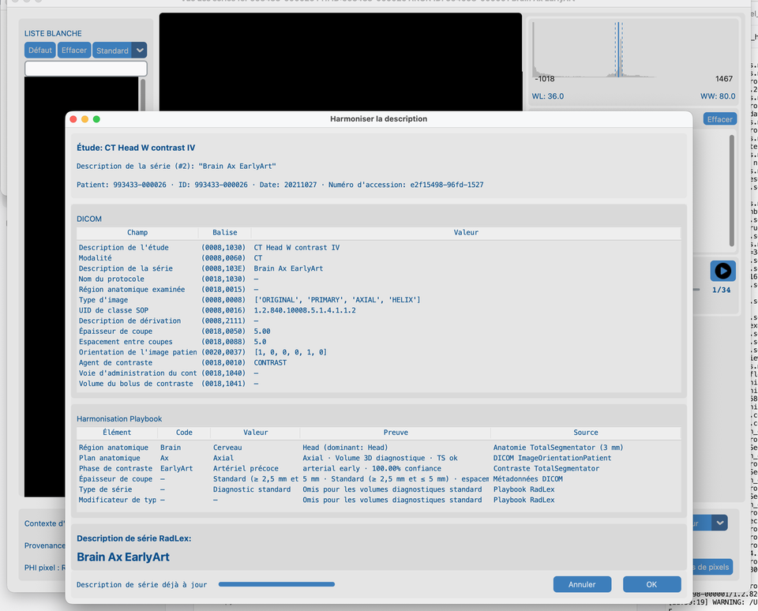
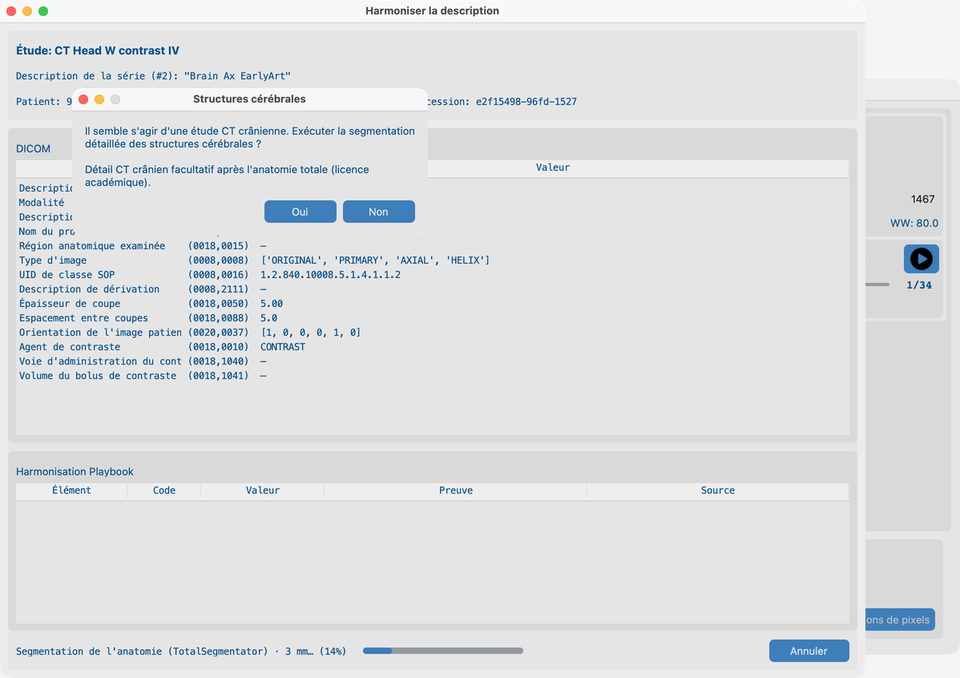
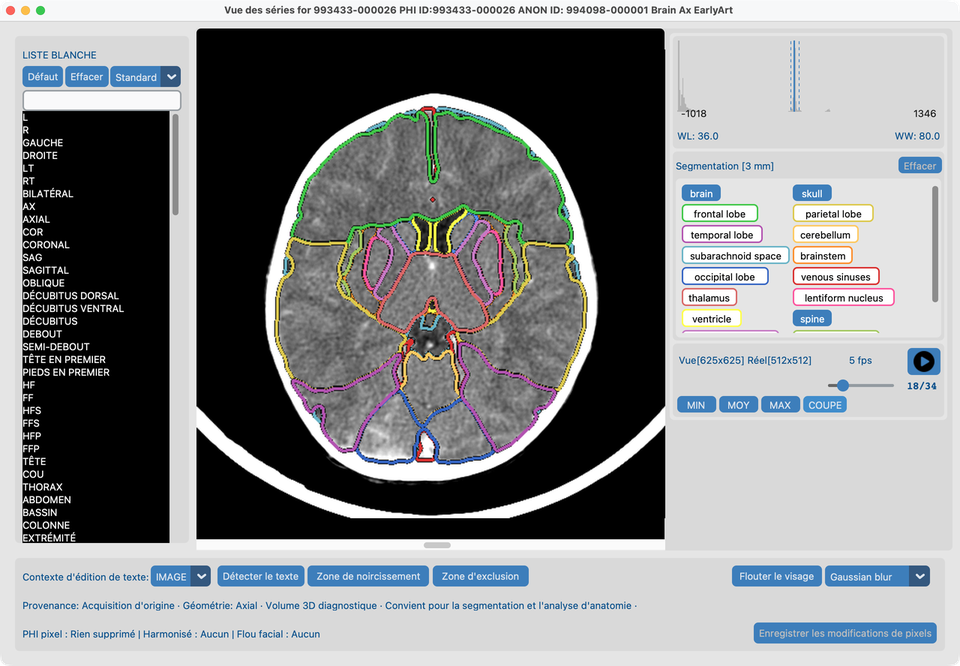
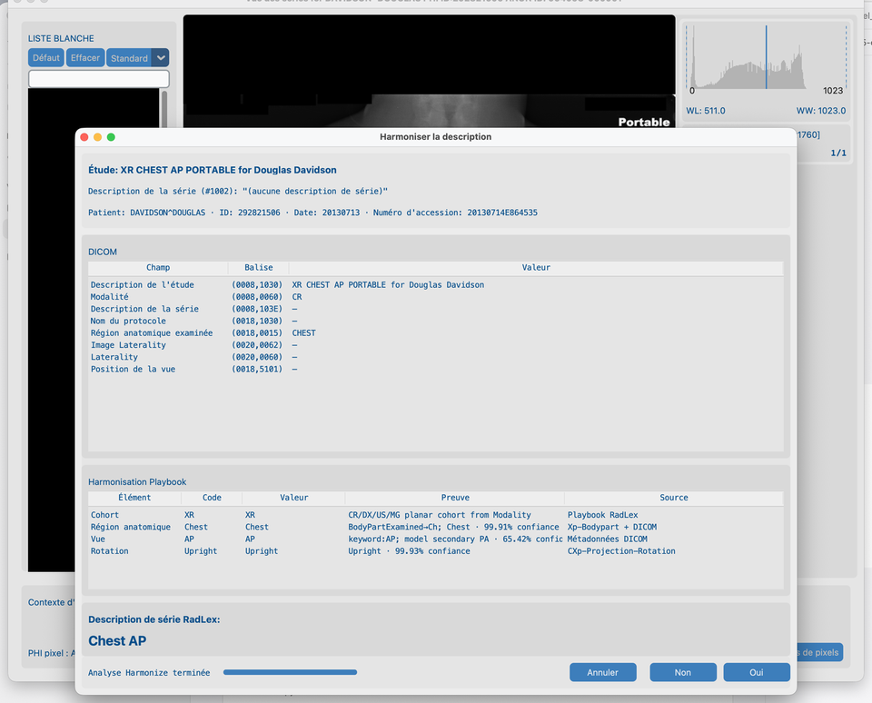
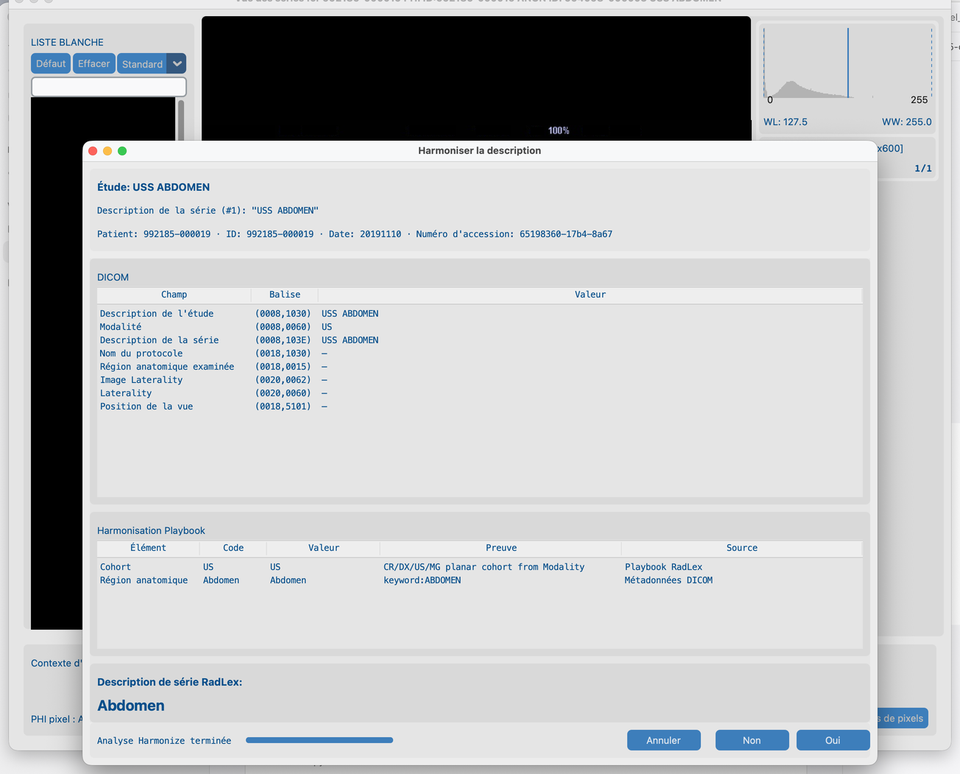

# 8.2 Harmoniser les noms

Les jeux de données de recherche utilisent souvent un texte **Series Description** incohérent. **Harmoniser** propose un nom standard à partir de l’anatomie et (pour CT/MR) du contraste — style RSNA Radiology Playbook / RadLex. Cela ne **modifie pas** les pixels.

## Séries de démo

| Fixture | Chemin sous `tests/controller/assets/test_dcm_files/` | Ce que cela montre |
| --- | --- | --- |
| **`CT_Head_With_Contrast`** | `CT_Head_With_Contrast` | Chemin CT : anatomie / contraste TotalSegmentator, invite structures cérébrales, superpositions |
| **`davidson_cxr`** | `davidson_cxr` | Chemin planaire XR : **Xp-Bodypart** + **CXp-Projection-Rotation** optionnels |
| **`us_rgb_single_frame`** | `us_rgb_single_frame` | Chemin planaire US : métadonnées DICOM uniquement (pas de TotalSegmentator) |

Importez une série, ouvrez-la dans **Vue des séries**, puis lancez Harmoniser. Réutilisez **`CT_Head_With_Contrast`** dans [8.3 Flouter les visages](../04-blur-faces/).

## Objectif

1. Sur **`CT_Head_With_Contrast`** : lancez **Harmoniser la description**, répondez à l’invite structures cérébrales lorsqu’elle est proposée, Appliquer, puis revoyez les superpositions de segmentation sur la coupe du milieu.
2. Sur **`davidson_cxr`** et **`us_rgb_single_frame`** : lancez Harmoniser et lisez le tableau Playbook — **Source** nomme le modèle ou DICOM (même idée que « anatomie TotalSegmentator » pour le CT).

## Avant de commencer

1. Terminez [Configuration des Fonctions IA](../../03-ai-features-setup/) — pack Harmonize CT, résolution, et Structures cérébrales pour la démo CT.
2. Optionnellement téléchargez **région anatomique XR** et **vue thorax XR** pour que la démo CXR montre la fusion pixel (sans eux, XR Harmonize encore depuis les tags DICOM).
3. Importez les séries de démo ([Rechercher](../../06-search/)) et ouvrez chacune dans **Vue des séries** ([Vue](../../07-view/) — clic droit sur la ligne série).

## Flux de travail sur `CT_Head_With_Contrast`

### 1. Harmoniser la description (depuis Vue des séries)

1. Avec `CT_Head_With_Contrast` ouverte dans **Vue des séries**, cliquez sur **Harmoniser la description**.
2. Attendez la fin de l’analyse — le tableau **Harmonisation Playbook** se remplit avec les preuves d’anatomie / contraste (pas un tableau vide en cours de progression).
3. Revoyez la Series Description suggérée, puis **Oui** pour appliquer, ou **Non** / **Annuler**.

La Vue des séries reste derrière la boîte de dialogue pour conserver le contexte de la série ouverte.

### 2. Invite structures cérébrales

Sur une série CT tête, Harmoniser demande s’il faut lancer la **segmentation détaillée des structures cérébrales** avant que le travail continue :

1. Lisez le message Oui/Non **Structures cérébrales** (licence académique / modèles requis — voir [Fonctions IA](../../03-ai-features-setup/)).
2. Choisissez **Oui** pour inclure les structures cérébrales dans cette exécution, ou **Non** pour l’anatomie standard uniquement.

### 3. Vue des séries segmentée

Après avoir Accepté une exécution Harmonize qui incluait les structures cérébrales (**Oui** sur l’invite) :

1. Vue des séries montre des boutons latch pour le **cerveau** entier plus les structures détaillées (tronc cérébral, lobes, ventricules, …) lorsque le pack sous licence a tourné.
2. Sélectionnez **toutes** les structures que vous voulez revoir (y compris **cerveau**).
3. Allez à la **coupe du milieu** pour voir les superpositions sur une frame représentative.

## Harmonize planaire (XR et US)

CR/DX, échographie et mammographie utilisent un chemin Harmonize **séparé** de CT/MR : pas de TotalSegmentator, pas de buckets d’épaisseur/contraste. Le tableau Playbook utilise toujours **Preuve** (ce qui a été mesuré) et **Source** (d’où cela vient).

### Radiographie thoracique (`davidson_cxr`)

1. Ouvrez **`davidson_cxr`** dans Vue des séries → **Harmoniser la description**.
2. Lorsque les modèles XR sont installés, la Source **Région anatomique** est **Xp-Bodypart** (ou fusionnée avec DICOM) ; **Vue** / **Rotation** utilisent **CXp-Projection-Rotation** lorsque l’anatomie est Chest.
3. La preuve ressemble aux lignes de classifieur CT — p. ex. `Chest · 99.00% confidence` — pas de jetons opaques `pixel:…`.
4. La rotation est analyse uniquement ; SeriesDescription reste p. ex. `Chest AP` / `Chest Lat`.

### Échographie (`us_rgb_single_frame`)

1. Ouvrez **`us_rgb_single_frame`** dans Vue des séries → **Harmoniser la description**.
2. Cohorte / région anatomique / mode viennent des tags DICOM et mots-clés ; Source est **DICOM metadata** ou **RadLex Playbook**.
3. Aucun pack pixel XR et aucun TotalSegmentator ne s’exécutent sur US.

## Notes (comme en production)

- Les scouts, MIP/VR, rapports de dose et séries similaires sont en général ignorés.
- **CT :** segmentation anatomique + phase de contraste lorsque les modèles le permettent (TotalSegmentator).
- **MR :** anatomie depuis les packs MR ; contraste IV depuis les en-têtes DICOM (TotalSegmentator).
- **XR (CR/DX) :** Harmonize planaire ; Xp-Bodypart optionnel + vue/rotation CXp thorax uniquement (téléchargements soft).
- **US / MG :** Harmonize planaire depuis DICOM uniquement — **pas** de TotalSegmentator et **pas** de packs pixel XR.
- **SC / OT / DOC :** Harmonize n’est pas proposé.
- Après que toutes les séries d’une étude sont harmonisées, la meilleure **description d’étude LOINC** est appliquée automatiquement (même chemin que le Traitement par lots IA). Modifiez-la plus tard depuis [Jeu de données](../../07-view/#modifier-les-descriptions-detude-et-de-serie). Les études XR/US/MG pures utilisent le préfixe LOINC correspondant.
- Dans [Jeu de données](../../07-view/#modifier-les-descriptions-detude-et-de-serie), double-cliquez une description d’étude ou de série (ou multi-sélectionnez et clic droit pour **Définir la description**) pour choisir des noms LOINC (étude) ou RadLex (série) — y compris pour les lignes pas encore vertes. Un clic simple sélectionne seulement la ligne.
- Les résultats sont mis en cache sous le dossier de la série — **Vider le cache d'analyse** pour une exécution CT/MR fraîche.
- Lots : [8.4 Exécuter sur plusieurs études](../05-run-on-many-studies/) (la résolution vient des Fonctions IA, pas par lot).

## Ce qui indique que tout va bien

- CT : SeriesDescription paraît cohérente pour ce CT tête ; **Harmonisé** du Jeu de données se met à jour ; après Oui cerveau, les superpositions latch se dessinent sur la coupe du milieu.
- CXR : **Source** Playbook nomme **Xp-Bodypart** / **CXp-Projection-Rotation** (ou DICOM) avec une preuve de confiance lisible.
- US : les lignes Playbook citent **DICOM metadata** / **RadLex Playbook** ; le nom suggéré correspond à l’anatomie/mode échographique.

## En cas d’échec

- Série non adaptée → ignore attendu.
- Déjà harmonisé → Vider le cache d'analyse pour relancer.
- Modèles pas prêts → [Fonctions IA](../../03-ai-features-setup/).

## Prochaines étapes

Continuez avec [8.3 Flouter les visages](../04-blur-faces/) sur la **même** série `CT_Head_With_Contrast` (Gaussien).
