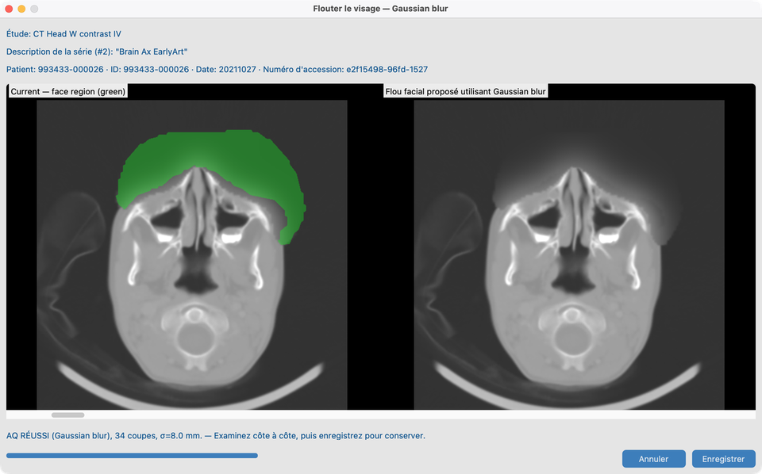

# 8.3 Flouter les visages

Sur certains examens **CT ou MR tête**, les traits du visage pourraient permettre une reconnaissance même après nettoyage des tags. **Dé-identification faciale** floute la région du visage et vous laisse revoir la qualité avant de conserver le résultat.

## Série de démo

**`CT_Head_With_Contrast`** — même série que [8.2 Harmoniser les noms](../03-harmonize-names/)  
(`tests/controller/assets/test_dcm_files/CT_Head_With_Contrast`).

Préférez Harmoniser d’abord pour que les indices d’anatomie améliorent l’éligibilité, puis ouvrez le flou facial sur cette série.

## Objectif

Sur `CT_Head_With_Contrast`, lancer le flou facial en mode **Gaussien**, revoir l’AQ, et enregistrer si approprié.

## Avant de commencer

1. Terminez [Configuration des Fonctions IA](../../03-ai-features-setup/) — modèles visage et licence académique.
2. Importez **`CT_Head_With_Contrast`** (et idéalement terminez Harmoniser en 8.2).
3. Ouvrez la série dans Vue des séries.

## Flux de travail sur `CT_Head_With_Contrast` (Gaussien)

1. Ouvrez `CT_Head_With_Contrast` dans Vue des séries.
2. Lancez **Flou facial** / aperçu.
3. Réglez le mode de flou sur **Gaussien** (défaut courant pour cette démo).
4. Revoyez côte à côte : image actuelle vs flou proposé ; le contour vert montre la région du visage.
5. Vérifiez **AQ RÉUSSI** vs **AQ ÉCHEC** (pixels changés hors du masque).
6. **Enregistrer** pour conserver, ou rejeter.

### Autres modes de flou

Le traitement par lots et Vue des séries peuvent aussi proposer médiane, pixellisation ou bruit de remplissage. La démo documentée utilise **Gaussien** uniquement.

## Lots

Voir [8.4 Exécuter sur plusieurs études](../05-run-on-many-studies/). Les séries non-tête sont ignorées.

## Ce qui indique que tout va bien

- Visage couvert sur `CT_Head_With_Contrast` ; anatomie hors du masque inchangée.
- Le statut **Flou facial** du Jeu de données se met à jour.

## En cas d’échec

- Pas une série tête / masque facial insuffisant → ignorer ou lancer Harmoniser d’abord (8.2).
- Déjà appliqué → ne re-floutera pas sauf chemin de relance volontaire.
- AQ ÉCHEC → n’enregistrez pas ; ajustez le mode ou inspectez le masque.
- Outils grisés → [Fonctions IA](../../03-ai-features-setup/).

## Prochaines étapes

Continuez avec [8.4 Exécuter sur plusieurs études](../05-run-on-many-studies/) pour lancer ces outils en lot sur une cohorte.
