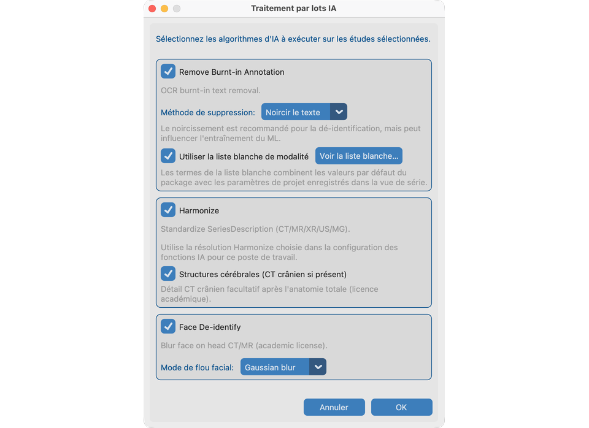

# 8.4 Exécuter sur plusieurs études

**Traitement par lots IA** lance les mêmes outils des chapitres 8.1–8.3 sur des études sélectionnées depuis le Jeu de données — sans ouvrir chaque série à la main.

## Études de démo

Utilisez les mêmes fixtures que vous avez pratiquées une par une :

| Outil dans le lot | Fixture à inclure |
| --- | --- |
| Supprimer le PHI pixel | **`davidson_cxr`** |
| Harmoniser + Flou facial | **`CT_Head_With_Contrast`** |

Importez les deux (ou l’arbre `test_dcm_files` complet), ouvrez **Jeu de données**, sélectionnez ces études, puis démarrez Traitement par lots IA.

## Objectif

Traiter une cohorte pour texte incrusté, Harmoniser et/ou flou facial avec progression et un résumé.

## Avant de commencer

1. Importez les séries de démo ci-dessus (et toute autre étude nécessaire).
2. Terminez [Configuration des Fonctions IA](../../03-ai-features-setup/) pour chaque outil que vous lancerez.
3. Optionnellement parcourez 8.1–8.3 une fois pour connaître les résultats attendus.

## Démarrer un lot

1. Ouvrez **Jeu de données** et sélectionnez des études (incluez `davidson_cxr` et `CT_Head_With_Contrast` pour une démo complète).
2. Démarrez **Traitement par lots IA**.
3. Dans les options, choisissez les algorithmes :
   - Supprimer le PHI pixel (noircir vs fusionner ; liste blanche de modalité on/off) — exerce `davidson_cxr`
   - Harmoniser (résolution CT/MR du poste depuis Fonctions IA) — exerce `CT_Head_With_Contrast`
   - Flou facial (**Gaussien** pour correspondre au chapitre 8.3) — exerce `CT_Head_With_Contrast`
4. Prévisualisez les listes blanches de modalité si proposées.
5. Confirmez l’avertissement mémoire s’il apparaît, puis démarrez.

## Ordre de travail

Pour chaque série, les outils sélectionnés s’exécutent dans un ordre stable (PHI pixel → Harmoniser → flou facial) pour que l’usage mémoire reste prévisible.

## Pendant l’exécution

- La progression montre étude / série / phase.
- Annuler s’arrête après l’étape en cours lorsque possible.
- Une mémoire insuffisante peut interrompre avec un avertissement clair.
- Les séries déjà traitées sont ignorées par défaut.

## Ensuite

- Lisez le résumé (terminé / ignoré / échoué).
- Contrôlez Vue des séries sur `davidson_cxr` et `CT_Head_With_Contrast` avant l’export.
- Même travail sur un **serveur sans fenêtre** → [Exécution sans interface](../../10-headless/).

## Ce qui indique que tout va bien

- Le résumé correspond aux attentes ; les colonnes IA du Jeu de données sont mises à jour pour les études de démo.
- Le fichier journal détaille les ignores éventuels.

## En cas d’échec

- Fonctions pas prêtes → [Fonctions IA](../../03-ai-features-setup/).
- Aucune série pour la sélection → vérifiez la sélection Jeu de données.
- Mémoire insuffisante → fermez d’autres applications ou traitez moins d’études.

## Prochaines étapes

Continuez avec [Envoyer](../../09-send/) pour exporter les études anonymisées (ou [exécuter sans interface](../../10-headless/) pour un lot serveur).
